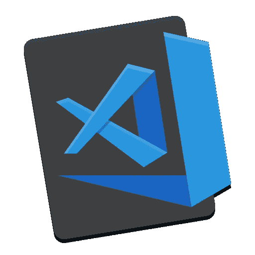
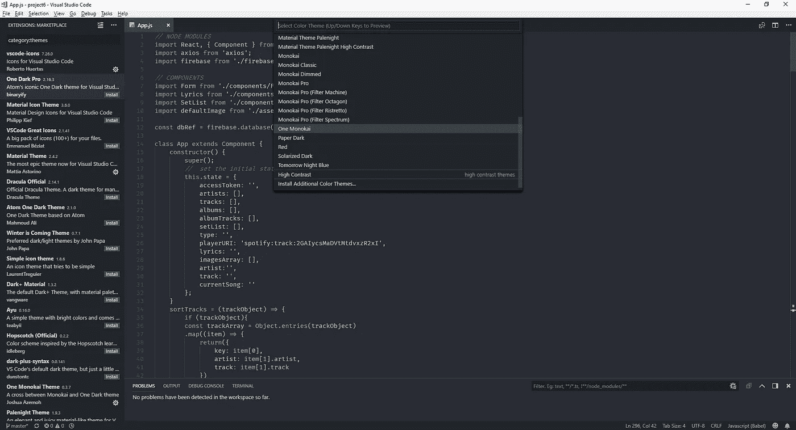
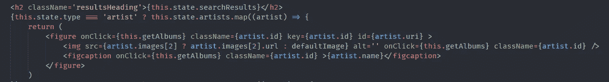
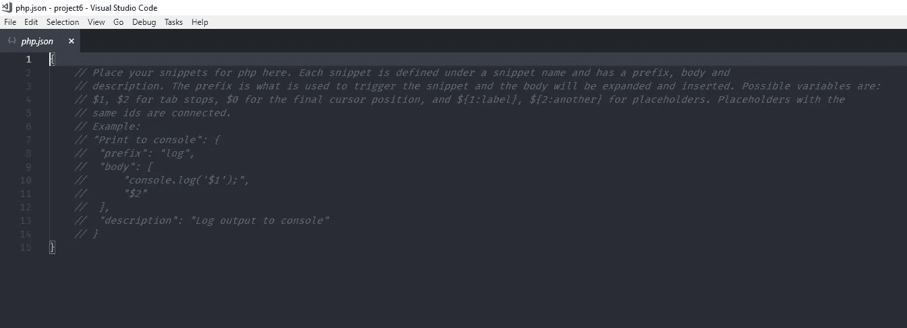

# 让您的代码编辑器有家的感觉——定制 VS 代码

> 原文：<https://medium.datadriveninvestor.com/making-your-code-editor-feel-like-home-customizing-vs-code-b858d4938cb?source=collection_archive---------0----------------------->



Visual Studio Code

作为开发人员/编码人员，我们在我们选择的编辑器中花了很多时间，见鬼，我们实际上生活在那里。为什么不把它弄得更舒适些，随心所欲地打扮它，把它弄成一个你喜欢一直呆在那里的地方。在这篇文章中，我只是想讨论一些让你的代码编辑器有家的感觉的方法(特别是，我将谈论 Windows 上的 VS 代码，但大多数流行的编辑器应该有类似的功能)。

# **色彩主题**

我们可以装扮我们的编辑器的一个最明显的方法是改变它的颜色主题。我们会盯着它看几个小时，最好让它看起来不错。主题有无数种变化，从深色到浅色，从彩色到柔和，从高到低对比度，你应该能够找到一种适合你的需求。

挑选你的颜色主题也很简单。你可以进入文件->首选项->颜色主题(或者按 Ctrl+K 然后 Ctrl+T ),它会显示当前安装的主题列表。你可以上下浏览列表，它会给你一个主题的预览。然后，您可以通过按回车键或点击来应用主题。

如果您想添加一些额外的颜色主题，您可以向下滚动列表以安装额外的颜色主题…这将显示可用主题的列表，或者您可以在框中搜索特定的主题。点击主题名称来显示更多关于它的信息，然后点击靠近顶部的安装按钮来安装到 VS 代码中。

以下是我最喜欢的一些颜色主题:

一个 Monokai(当前主题)

余辉重新制作

钴 2



Theme Selector and Theme Marketplace — Currently selected theme in use: One Monokai

# 字体

下一个对编辑器视觉效果影响最大的元素是字体，包括字体系列和字体大小。对你来说，合适的字体应该是长时间看起来很舒服，并且能帮助你区分相似的字符(例如小写的 L 和数字 1)。此外，一些人喜欢使用利用连字(其中两个或多个字母/符号连接在一起形成字形)的字体来创建一些常用的符号表示。

要在 VS 代码中改变你的字体设置，进入文件->首选项->设置(或者按 Ctrl+逗号)调出用户设置。您需要转到右侧的窗格“用户设置”(不是左侧的默认用户设置),并查找以下行来更改您的默认字体系列:

> `“editor.fontFamily”: “Consolas”,`

只需将“”中的内容替换为您想要使用的字体名称(如 DejaVu Sans Mono、Hack 等)，然后保存设置。要更改字体大小，请查找以下行:

> `“editor.fontSize”: 15,`

只需改变你希望字体显示的大小，以磅为单位。这完全取决于你的屏幕尺寸/偏好。就我个人而言，我喜欢使用 15 作为我的字体大小，因为它给了我相当大的可读性，与我使用的标签大小保持间距，并且当我进入分屏视图时也很好。

如果您使用的字体包含连字，则需要在用户设置中添加以下行:

> `“editor.fontLigatures”: true,`

我目前选择的字体是 Fira 代码。它在 L / 1 和 O o 0 之间有很好的区别，使用了连字，整体上有很好的可读性。关于其他顶级免费编程字体的列表，请查看 Charlee Li 的这篇文章——([11 种最佳编程字体——https://itnext.io/11-best-programming-fonts-724283a9ed57](https://itnext.io/11-best-programming-fonts-724283a9ed57))



An example of Fira Code in action, showing the ligatures for === and =>

# **片段**

代码片断是一种很好的方式，它可以把你经常使用的代码片断作为一种快捷方式，从而节省你的时间和打字。如果您已经在 HTML 中使用了 Emmet，那么您可能已经熟悉了代码片段的用处。要添加或更改您的代码片段，请转到“文件”->“首选项”->“用户代码片段”，打开一个菜单，列出您可以为其制作代码片段的所有不同语言。对于任何已经有代码片段文件的语言，它们将列在列表的顶部，需要创建代码片段文件的语言将列在后面。当您创建一个新的代码片段文件时，您将会看到下面的屏幕，向您展示一个如何创建代码片段的示例。如果您愿意，您可以简单地删除注释掉的文本，或者继续后面的操作:



Blank snippet ready to be populated

您创建的每个代码片段都有四个部分:

Title —这是您自己的目的，您为您的代码片段制作的标题/您想称之为
前缀—这是您将用来访问您的代码片段
主体的快捷方式—这是您希望您的代码片段生成的实际代码。
描述——这是对代码片段用途的描述

片段本身的主体包含在[ ]中。除了正文的最后一行外，每一行都在一组" "内，并以逗号结束。您可以使用\t 来指示制表符或\n 来指示新行(或者您也可以使用一组空的" "来指示空行)。您还可以使用$1、$2 等来指示代码片段运行后的制表位。$1 表示将代码片段放到页面上后光标所在的位置。$2、$3 等等，用于指示如果在此之后使用 tab，光标将移动到的位置。

以下是一些我经常使用的片段:

## **HTML**

```
“jQuery CDN”: {
“prefix”: “jq”,
“body”: “<script src=’https://code.jquery.com/jquery-3.2.1.min.js' integrity=’sha256-hwg4gsxgFZhOsEEamdOYGBf13FyQuiTwlAQgxVSNgt4=’crossorigin=’anonymous’></script>”,
“description”: “jquery 3.x”
}
```

jQuery 的 CDN 中的一个简单代码片段。

## **CSS / SCSS**

```
“snippet-.setup”: {
  “prefix”: “.setup”,
    “body”: [
      “html{line-height:1.15;-ms-text-size-adjust:100%;-webkit-text-      size-adjust:100%}body{margin:0}article,aside,footer,header,nav,section{display:block}h1{font-size:2em;margin:.67em 0}figcaption,figure,main{display:block}figure{margin:1em 40px}hr{box-sizing:content-box;height:0;overflow:visible}pre{font-family:monospace,monospace;font-size:1em}a{background-color:transparent;-webkit-text-decoration-skip:objects}abbr[title]{border-bottom:none;text-decoration:underline;text-decoration:underline dotted}b,strong{font-weight:inherit}b,strong{font-weight:bolder}code,kbd,samp{font-family:monospace,monospace;font-size:1em}dfn{font-style:italic}mark{background-color:#ff0;color:#000}small{font-size:80%}sub,sup{font-size:75%;line-height:0;position:relative;vertical-align:baseline}sub{bottom:-.25em}sup{top:-.5em}audio,video{display:inline-block}audio:not([controls]){display:none;height:0}img{border-style:none}svg:not(:root){overflow:hidden}button,input,optgroup,select,textarea{font-family:sans-serif;font-size:100%;line-height:1.15;margin:0}button,input{overflow:visible}button,select{text-transform:none}button,html [type=button],[type=reset],[type=submit]{-webkit-appearance:button}button::-moz-focus-inner,[type=button]::-moz-focus-inner,[type=reset]::-moz-focus-inner,[type=submit]::-moz-focus-inner{border-style:none;padding:0}button:-moz-focusring,[type=button]:-moz-focusring,[type=reset]:-moz-focusring,[type=submit]:-moz-focusring{outline:1px dotted ButtonText}fieldset{padding:.35em .75em .625em}legend{box-sizing:border-box;color:inherit;display:table;max-width:100%;padding:0;white-space:normal}progress{display:inline-block;vertical-align:baseline}textarea{overflow:auto}[type=checkbox],[type=radio]{box-sizing:border-box;padding:0}[type=number]::-webkit-inner-spin-button,[type=number]::-webkit-outer-spin-button{height:auto}[type=search]{-webkit-appearance:textfield;outline-offset:-2px}[type=search]::-webkit-search-cancel-button,[type=search]::-webkit-search-decoration{-webkit-appearance:none}::-webkit-file-upload-button{-webkit-appearance:button;font:inherit}details,menu{display:block}summary{display:list-item}canvas{display:inline-block}template{display:none}[hidden]{display:none}”,
      “”,
      “.clearfix:after {visibility: hidden; display: block; font-      size: 0; content: \” \”; clear: both; height: 0; }”,
      “”,
      “* { t-moz-box-sizing: border-box; -webkit-box-sizing: border-box; box-sizing: border-box; margin: 0; padding: 0;}”,
      “”,
      “.visuallyhidden:not(:focus):not(:active) {position: absolute; width: 1px; height: 1px; margin: -1px; border: 0; padding: 0; white-space: nowrap; clip-path: inset(100%); clip: rect(0 0 0 0); overflow: hidden;}”,
      “”,
      “html { font-size: 62.5%; }”,
      “”,
      “ul { list-style: none; }”,
      “”,
      “a { text-decoration: none; }”,
      “”,
      “body { font-size: 1.6rem;}”,
    ],
    “description”: “”
}
```

## **Javascript / React**

```
{
  “Console Log”: {
  “prefix”: “cl”,
  “body”: [
    “console.log($1);”,
      “$2”
  ],
  “description”: “Log output to console”
},“Document Ready”: {
  “prefix”: “dr”,
  “body”: [
    “$(function() {“,
      “\t$1”,
    “});”
  ],
},“Complex Component Creation”: {
  “prefix”: “complex”,
  “body”: [
    “import React, { Component } from ‘react’;”,
    “”,
    “class $1 extends Component {“,
      “\tconstructor() {“,
        “\t\tsuper();”,
        “\t\tthis.state = {“,
        “”,
        “\t\t}”,
      “\t}”,
      “\trender() {“,
        “\t\treturn (“,
          “\t\t\t$3”,
        “\t\t);”,
      “\t}”,
    “};”,
    “”,
  “export default $2;”
  ],
},“Component Creation”: {
  “prefix”: “simple”,
    “body”: [
      “import React from ‘react’;”,
      “”,
      “const $1 = () => {“,
        “\treturn (“,
          “\t\t$3”,
        “\t);”,
      “};”,
    “”,
    “export default $2;”
  ], 
}
}
```

前两个是一些简单的 Javascript/jquery。一个是抛出 console.log，首先带你进入括号，然后下一个 tab 带你进入下一行。第二个是一个简单的 document.ready。接下来，我们有两个片段来构建组件的框架，一个用于有状态组件，一个用于无状态组件。它们都将从命名组件的空间开始，下一个选项卡带您填写要导出的名称，第三个选项卡带您进入 return 语句。

这只是一个例子，展示了定制代码编辑器的神奇之处。还有很多东西，来自不同的扩展、快捷方式和其他各种各样的东西，可以帮助您的编码体验更加舒适和个性化。