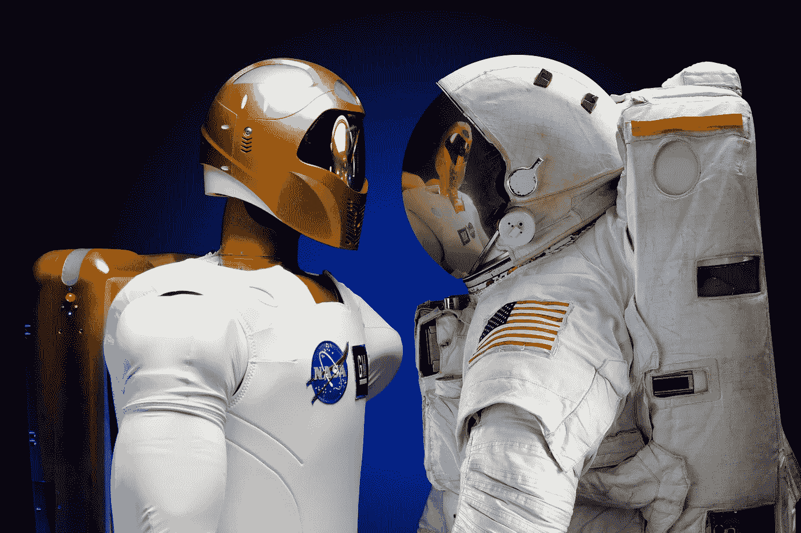

# 一万小时，人工智能，和专业知识的民主化

> 原文：<https://medium.datadriveninvestor.com/malcolm-gladwells-10-000-hours-artificial-intelligence-and-the-democratization-of-expertise-405dd3a3fa39?source=collection_archive---------3----------------------->

## 在一个学习日益自动化的世界里，重要的不仅仅是练习的时间。

# 10，000 小时的训练

比尔·盖茨和披头士有什么共同点？除了在他们各自的领域非常成功之外，根据马尔科姆·格拉德威尔的说法，他们都有 10，000 小时甚至更多的练习时间来感谢他们的成功。在他的书《局外人:成功的故事》中，格拉德威尔将甲壳虫乐队的音乐成功归功于在汉堡的一千多场通宵演出。与此同时，在格拉德威尔对比尔·盖茨的采访中，这位微软创始人说，在高中电脑还不常见的时候，能接触到电脑帮助他取得了成功。格拉德威尔声称，早期接触计算机意味着当计算机普及时，盖茨已经超过了成功所需的 10，000 小时的练习。

# 机器思维

除了在过去几十年的大部分时间里使比尔·盖茨成为世界上最富有的人之外，计算机自问世以来还带来了许多变化。虽然比尔·盖茨和许多其他程序员长期以来必须向计算机发出非常具体的指令来自动执行任务，但软件开发已经发展到计算机可以被编程来学习如何执行任务，而不是被显式编程。这是老生常谈，但机器学习确实为软件开发带来了一个全新的范式，它将彻底改变我们与知识和实践的关系。

 [## 人工智能预测能力的神话——数据驱动的投资者

### AI(人工智能)最有前途的优势之一似乎是它预测未来的能力…

www.datadriveninvestor.com](https://www.datadriveninvestor.com/2019/03/01/the-myth-of-ais-predictive-power/) 

计算机在游戏中击败人类的历史由来已久，从大约 20 年前深蓝击败加里·卡斯帕罗夫，到 AlphaGo 击败 Lee Sedol，以及 AlphaGo Master 在最近几年击败柯洁。本文附带的插图不是由人类绘制的，而是使用一种称为神经风格转移的技术创建的，其中计算机根据参考图像的风格“绘制”图像。这甚至发生在人工智能在自然语言处理和图像识别等更“平凡”的领域中无处不在的使用之前。

这一现象并没有否定长期训练(或者用马尔科姆·格拉德威尔的话来说，数字，1 万小时)会带来成功所需的技能的观点，而是验证了这一观点，因为人工智能是由机器学习推动的，机器学习字面上解释为机器花费数小时训练使用数据来解决问题。这只能表明，机器更适合于传统上与成功联系在一起的严格而耗时的训练。

# 人类在机器时代的成功

那么，当实践是机器总能做得更好的事情时，我们人类必须做些什么才能成功呢？当人才遇到机会时，成功就会发生，幸运的是，仍然有人类可以增加价值并有机会成功的领域。

埃隆·马斯克(Elon Musk)曾试图将其生产线的大部分自动化，他曾表示，“人类被低估了。”这种说法听起来正确有复杂多样的原因，但如果说这是因为机器需要数据来学习，那就太简单了。举一个具体的例子，一台经过编程或训练以区分特斯拉 Model 3 和 Model X 的机器可以根据红色 Model 3 和白色 Model X 的照片进行训练，因此可能会将任何白色物体误认为 Model X。这可能看起来是一个微不足道的例子，但在没有人工干预的情况下，全自动工厂中几台训练不当的机器将导致灾难。

这可以被解释为人类获得超过机器的优势，不是因为我们在特定领域的知识深度，而是因为我们在几个领域的知识广度。当然，有人可能会说，随着人工智能超越可以在特定任务上击败人类的人工狭义智能(ANI ),进入可以展示所有领域专业知识的人工通用智能(AGI ),这种说法已经失效，但时机尚未到来。

现在，机器在这里，它们已经可以比任何人练习得更好，比任何人练习得更久。对我们来说幸运的是，这些机器不一定是我们的竞争对手，但通常都由我们支配。机器一直以来都是用来自动化结构化和重复性过程的——所发生的变化是，由于机器学习的进步，学习任务现在属于可以自动化的过程领域。

因此，我们有责任最好地利用机器来提高生产率和改善生活质量。这意味着学习任务中更繁琐的部分可以外包给机器。这并不是说应该完全放弃对知识的追求，而是说可以利用机器来大大加速这一过程。

人工智能已经被广泛应用于科学领域。天文学家利用分类算法结合计算机视觉来快速处理望远镜收集的数据并识别模式。CERN 在很大程度上依赖于神经网络和梯度增强模型的结合，以便在使用粒子加速器的实验产生的大量数据中有效区分粒子信号和背景噪声。另一种方法需要科学家花费数小时、数天甚至数周的宝贵时间来手动进行分析。开发人工智能所损失的时间成本远远小于人类浪费精力的代价。很快，每个组织都需要利用人工智能来保持竞争力。

有了机器来完成繁重的工作，人类就可以专注于其他任务。在科学领域，这可能涉及头脑风暴理论，并允许机器验证基础数学。在商业环境中，这意味着性能与实践成比例的重复性任务最好交给机器，而人类则在指导公司整体方向方面做更具战略性的工作——未来的工人不是工匠，而是机器的管理者。

进一步说，有人可能会说，只要一个人表现出通常与管理角色相关的批判性思维和适应能力的必要技能，多年的工作经验将不再像过去那样重要。以前，员工在职业阶梯上的进步是基于任期，但随着机器代表人类工人获得工作经验，未来最优秀的员工将通过商业头脑和自动化的智能应用来获得职位。

在一个学习本身越来越自动化的世界里，重要的不仅仅是多少小时的努力和工作经验，还有识别努力在哪里得到回报的技能。工匠们通过多年实践学习技艺的时代即将结束，但这并不意味着人类生产力和专业技能的终结。相反，只要所需的数据和计算能力可用，机器学习就有可能使专业知识大众化。