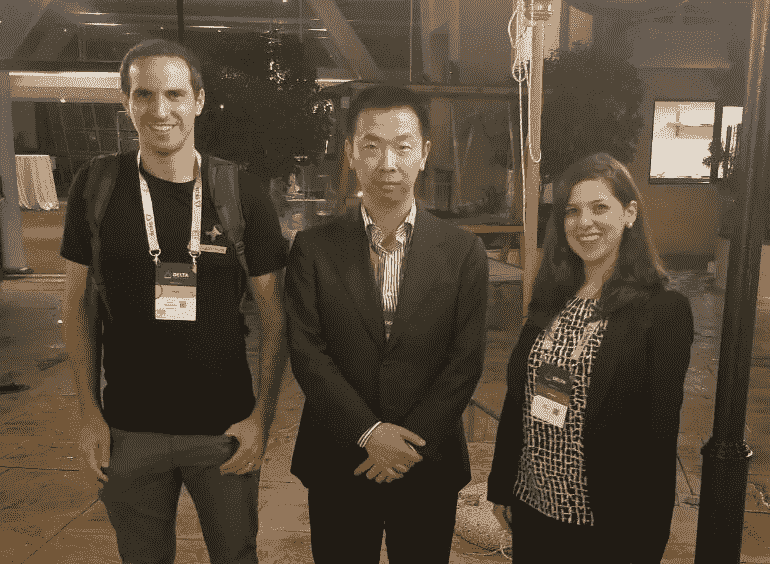

# 马耳他——监管、STO 和在线游戏的区块链孤岛

> 原文：<https://medium.datadriveninvestor.com/malta-the-blockchain-island-of-regulation-stos-and-online-gaming-7afaea08a4fa?source=collection_archive---------3----------------------->

我最近刚从“区块链岛”马耳他回来，那里是新兴的加密友好避风港。我有幸会见了许多业内同事，并进行了无数次交谈，这些交谈似乎都围绕着同样的问题和结论。

几个月来，证券监管问题似乎已经成为全球立法者的“烫手山芋”——没有一个司法管辖区为 s to 提出一个完整、一致或结论性的框架，这导致许多业内人士猜测和玩猜谜游戏，试图预测这一新兴现象从监管角度看会是什么样子。然后是马尔他——一个以在线游戏平台和电子游戏(更不用说古老的历史和最新鲜的海鲜)的创新者而闻名的国家，并向所有人表明，他们在区块链监管、实施、教育和其他“离子”动词方面处于领先地位。

首先，马耳他总理于 10 月在联合国大会上就区块链主题发表了讲话，接着在一个月内举行了两次重要峰会，最后起草了关于 s to 的明确框架和行动呼吁。马耳他政府和金融机构(实际上)欢迎区块链和 DLT 公司，并呼吁新公司与马耳他金融机构合作，在岛上开展项目(并成为法律实体)。

NEO 有幸参加了德尔塔峰会，NEO 总经理 Johnson Zhao 在会上做了主题演讲。我们有幸参加了一个晚会，在晚会上，马耳他总理用闪亮的眼睛讲述了区块链技术的潜力以及它能给世界带来什么。我们与愿意对话和相互合作的政府官员坐在一起，我们遇到了兴奋的交流和项目，他们不停地谈论搬到马耳他是他们做出的最好的选择。

NGD With Crypto Potato writer Arnon in Delta Summit Malta

Delta Summit Malta

当我们看到基础设施层和 STO 发行人试图从当前的监管格局中找出头绪时，马耳他率先发布了一份欢迎公告，并确保非常热切的空间听到他们响亮而清晰的声音。专注于证券代币的交易所、金融机构和计划以数字化形式提供证券的区块链公司都有不同的意见和建议，认为什么和如何是实现这场革命的最佳方式。

Malta’s President at the Gala dinner during Delta Summit

NGD team attending the Gala dinner during the Delta Summit

正如我提到的，马耳他的游戏行业对这种方式并不感到惊讶，马耳他是在线游戏行业的领导者，如果不是领导者的话，这一领域的主要公司与我们会面，分享了该岛如何加速并成为该行业的催化剂，许多人认为区块链公司也会以同样的方式执行。

NEO Smart Economy 专注于其中两项非常重要的活动:区块链上的游戏和安全令牌；为 NEO 创建一个标准，并与这些领域的项目、企业家和领导者合作。建立在三大支柱上的智能经济；数字身份、数字资产和智能合同毫不奇怪，我们对在我们的生态系统中实施这些概念非常感兴趣，并且正在努力工作。

一旦美国、英国和欧盟等更大的司法管辖区开始制定永久性规则和法律，会发生什么？目前，马耳他只是成为这些更“传统”的司法管辖区的试验品，直到他们下定决心吗？这些新公司，无论是交易所还是项目，是会搬回自己的祖国，还是不管不顾地从“区块链孤岛”继续运营？从这个意义上来说，未来仍然有许多不确定性，这些问题仍然存在。在线游戏模式真的可以复制粘贴到区块链产业吗？或许不会，但他们能培养出一种新的模式，来满足区块链、STO 和 DLT 项目的新需求吗？成千上万涌向该岛的人似乎是这样认为的。