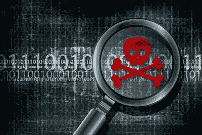
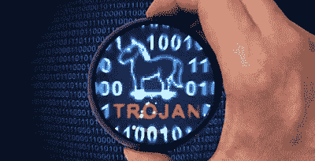
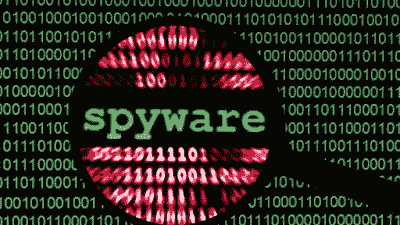

# 恶意软件—解释

> 原文：<https://medium.datadriveninvestor.com/malware-explained-545c3bd639cb?source=collection_archive---------15----------------------->

**恶意软件**是“恶意软件”的简称。恶意软件是一种计算机程序，用于在用户不知情的情况下攻击和破坏计算机。通常，恶意软件会传播病毒、木马、蠕虫、间谍软件、rootkits 等。这些是恶意软件带来的一些威胁。

# 恶意软件的类型:

## 1.病毒和蠕虫:

病毒和蠕虫被认为是计算机的传染性威胁。病毒和蠕虫的区别在于，病毒会影响软件，一旦软件被打开，病毒就会开始攻击。因此，病毒应该需要用户的帮助才能开始攻击。

同时，蠕虫不需要任何用户的帮助，它会自动开始攻击。病毒和蠕虫都将携带“有效载荷”，其中包含用于破坏计算机的恶意代码。

## 2.特洛伊木马和 Rootkits:

特洛伊木马和 rootkits 都被认为是计算机的伪装线程。他们都是相似的，因为他们偷偷攻击电脑。特洛伊木马看起来像一个软件，用户最终会把它当成一个软件来下载。这将感染计算机，并使其成为恶意软件感染的计算机。

其他人手中的 Rootkits 将充当恶意软件的掩蔽技术。它是由病毒程序员编写的。这将偷偷通过防病毒程序。但是现在反病毒软件正在使用有效的 rootkits 清除程序。

## 3.间谍软件和键盘记录器:

间谍软件和键盘记录器被认为是财务威胁。它们被用于网络钓鱼、社会工程等攻击，目的是从未知的计算机、银行等处窃取资金。

# 防止恶意软件攻击的步骤:

*   始终保持您的操作系统和软件最新。
*   删除你不用的软件。
*   不要打开垃圾邮件，并总是仔细检查邮件。
*   不要接假的技术电话。
*   始终使用强密码。
*   始终保持安全连接。

# 重要事项:

本文包含一个易于理解的恶意软件的定义及其类型，以及防止恶意软件攻击的步骤。请随意评论你的观点。**订阅**我们的博客，关注我们的脸书。

[点击这里加入我们的脸书小组](https://www.facebook.com/groups/bugtech/?ref=bookmarks)

[点击此处联系我们的脸书小组](https://www.facebook.com/Bug-Tech-380548266042438/?modal=admin_todo_tour)