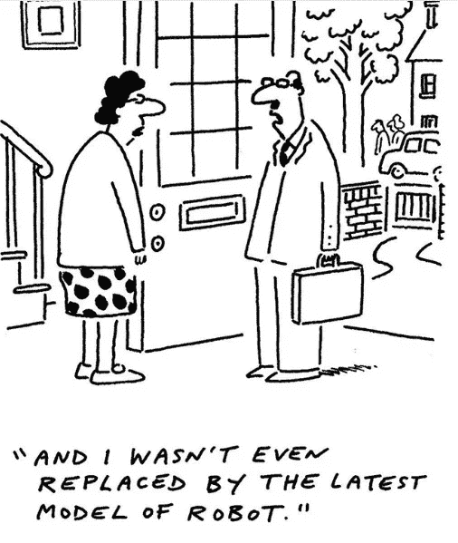

# 人工智能时代的人、机器和工作

> 原文：<https://medium.datadriveninvestor.com/man-machine-and-work-in-the-age-of-ai-bca03f503052?source=collection_archive---------5----------------------->

“white robot near brown wall” by [Alex Knight](https://unsplash.com/@agkdesign?utm_source=medium&utm_medium=referral) on [Unsplash](https://unsplash.com?utm_source=medium&utm_medium=referral)

我第一次接触人工智能(AI)可能是在小时候看卖座电影*终结者 2:审判日*。这部电影的情节围绕着防止未来由天网引发的核浩劫，天网是一个具有自我意识并试图摧毁人类的人工智能防御程序。这个关于人工智能将如此先进，以至于变得有自我意识或比人更聪明，并可能导致人类毁灭或控制世界的概念被称为“*奇点*”的概念在技术专家和研究人员之间存在分歧，并已成为几部好莱坞电影的主题，我认为这至少在一定程度上导致了这个概念在公众中的突出，并助长了一些人对机器人接管世界的偏执。

然而，我更相信专家们的观点，他们认为这种东西无论如何都不是迫在眉睫的威胁，机器试图接管世界的概念目前可能仍停留在科幻小说的领域。华盛顿大学计算机科学教授 Pedro Domingos 在他的[书](https://www.amazon.com/Master-Algorithm-Ultimate-Learning-Machine/dp/0465094279)中断言，一个强大的人工智能接管世界的可能性为零*因为计算机缺乏自己的意志，因此，即使是一台无限强大的计算机也仍然是人类意志的延伸，因此，以所描述的方式没有什么可怕的。同样，另一位顶级人工智能研究员、斯坦福大学兼职教授吴恩达[表示](https://www.vox.com/conversations/2017/3/8/14712286/artificial-intelligence-science-technology-robots-singularity-automation):*

> 今天担心邪恶杀手 AI 就像担心火星上的人口过剩一样。也许有一天它会成为一个问题，但是我们甚至还没有登陆这个星球。这种炒作不必要地分散了所有人对人工智能造成的更大问题的注意力，这就是工作置换。

我完全同意这种观点，即更相关的问题是人工智能将对就业产生的影响。

机器人是你的工作吗？

© [Banx cartoons](http://banxcartoons.co.uk/) for the [Financial Times](https://www.instagram.com/p/Bmt8-ajASOS/).

工作是我们生活的一个重要部分，我们在工作上花费了生命的很大一部分。毫无疑问，人工智能越来越多的应用将对就业产生影响，问题是会产生什么样的影响。人们一直担心技术或自动化对工作和就业的影响，一篇优秀的文章详细列出了过去强调这种担心的新闻标题和故事的时间表，其中包括以下内容:“*机器的三月使闲人*”(1928)、*每年将有 20 万人因自动化而失业，美国助手说*(1940)， 英国的自动化激起了劳工的不安:工人们看到‘机器人革命’剥夺了他们的工作(1950)，*一个机器人正在追逐你的工作*(1980)。 这些标题中的任何一个都可以在今天重复使用，并且仍然与最近关于通过人工智能实现自动化的喧嚣相关。

同样，过去的技术进步同样总是引发一场辩论，一方称我们对未来没有什么可担心的，引用了技术破坏通常如何促进就业和长期生产力的历史证据，而另一方则反驳说“这次不同了”，菲利普·奥尔斯瓦尔德将这一论点称为“ [*伟大的人机辩论*](https://www.kauffman.org/neg/section-4#) ”。历史在重演，今天在讨论人工智能的时候也出现了这样的争论。后一组人声称，这一次不同了，因为人工智能现在正在自动化认知任务，并宣称这是工作结束的开始。

然而，我更倾向于前一种观点，认为我们确实会通过人工智能创造新的工作岗位来取代那些因自动化而流失的工作岗位。在我们的历史中，人类总是通过自发的秩序将我们的资源重新导向新的领域来适应他的环境。我们从狩猎采集开始，然后转向农业、制造业和现在的服务经济。也许，即使“工作终结”的反面乌托邦式的未来成为现实，人们也会有更多的空闲时间从事休闲活动，如旅游、娱乐、电子游戏等。这将导致对这些活动的需求增加和这些经济部门的扩张，导致它们雇用比目前更多的人，并抵消经济中其他部门的一些失业。人工智能确实可能导致一些技术失业，但“工作终结”的情景似乎有点遥远，因为企业家通过提供新产品和服务，不断创造新的工作类型，以应对环境需求。我最近看到的最有趣、最不落俗套的*工作*是一个[专业抱抱服务](https://web.facebook.com/ExtremeLoveShow/videos/315958482495403/)和一个[专业行走服务](https://web.facebook.com/trtworld/videos/2121691234767688/)；人类渴望人际交往，尽管技术可能提供任何替代方案，因此我认为这些类型的服务在未来可能会增加。

同样，自动化程度的提高会直接导致失业的说法并不总是正确的；詹姆斯·贝森在他的[书](https://yalebooks.yale.edu/book/9780300195668/learning-doing)中引用了自动柜员机(ATM)和银行出纳员的例子。自动取款机引入后，银行出纳员的角色预计会很快变得多余。然而，与自动取款机首次出现时相比，今天美国有更多的银行出纳员。这是因为，尽管自动取款机用低成本的机器取代了初级出纳员，但这导致开设银行分行的相对成本下降，并导致开设更多的银行分行，相应地增加了对出纳员的总体需求。

然而，自动化将改变工作的性质，工人将不得不适应不断变化的环境。不同的[案例研究](https://yalebooks.yale.edu/book/9780300195668/learning-doing)表明，当技术允许机器执行以前由人类执行的任务时，它改变了这些工作的性质，取代了工人，但并没有立即取代他们。对由机器执行的常规任务的需求减少，导致对执行非常规任务的工人的需求增加。有时，在同一职业中，银行柜员现在执行相对更多的非例行任务，如“关系银行”。在其他情况下，工作从一种职业转移到另一种职业，就像秘书如何取代打字员，秘书工作从日常任务(打字、速记和接电话)转移到更复杂的任务(互联网研究、旅行预订、安排会议)。

根据 Bessen 的说法，过去那些关于机器大规模取代劳动力和总体就业减少的预测没有成为现实，因为它们没有反映技术对就业影响的更动态和更复杂的性质。单个工作任务与整个工作并不完全相同，因此尽管技术从人类手中接管了一些任务，但剩余的任务变得更有价值，尤其是那些涉及人类互动的任务。因此，尽管技术最终可能会消除其中一些工作，但经济活力确保了自动化不会立即导致失业，而是将工作的替代推迟到很久以后，因为重要的任务仍然需要人类劳动来完成，而技术变革增加了对产品或服务的需求，这抵消了潜在的失业。

一些[人工智能研究人员](http://ide.mit.edu/sites/default/files/publications/pandp.20181019.pdf)也呼吁对当前关于人工智能的辩论采取类似的态度，他们说:

> 我们的研究结果表明，关于人工智能对工作的影响的辩论需要转变:从对许多工作的完全自动化和普遍的职业替代的共同关注转向工作的重新设计和业务流程的重新设计……研究人员以及经理和企业家的重点不应该(仅仅)是自动化，而是工作的重新设计。

我还认为，关于人工智能的辩论更适合于如何利用人工智能，从中获取价值，增强和补充人类能力并提高生产力，同时关注如何改善可能的负面影响。

**通过工作重新设计提高知识工作者的生产力。**

随着人和机器各自完成的任务发生变化，通过人工智能实现自动化带来的效率提高将通过重新设计单个工作来实现。在知识工作中，任务通常不是自动定义的，决定花时间做什么是知识工作者的工作。因此，如果机器接管了他们的任何正常传统任务，知识工作者必须站在管理这一过程的前沿，根据他们在自己领域的知识、经验和专长改变他们的工作，以重新专注于替代任务。

根据 Peter Drucker 的说法，确定要专注的工作任务是提高知识工作者生产率的关键:

> 因此，提高知识工作者生产率的工作首先要问知识工作者自己:你的任务是什么？应该是什么？你应该做出什么贡献？什么妨碍了你完成任务，应该被清除？

人工智能为知识工作者提供了一个机会，让他们找出自己工作中的哪些任务可以自动化，并用这些任务来补充自己，以便专注于他们相对于机器具有比较优势的更多人类任务，并充分利用自己作为人的优势。根据 T2 的一项研究，大多数经理将 85%或更多的工作时间花在邮件、会议和电话上。这些任务中的哪一项真正提高了他们的生产力并增加了价值？任何不直接增加价值的任务可以用人工智能自动化吗？如果可以，那就应该。

正如[佩德罗·多明戈斯](https://www.amazon.com/Master-Algorithm-Ultimate-Learning-Machine/dp/0465094279)所说:

> 不丢掉工作的最好方法是自己实现自动化。然后你将有时间做所有你以前没有做的事情，也是电脑在短时间内做不到的事情。(如果没有，那就保持领先，现在就找份新工作。)如果一台计算机已经学会做你的工作，就不要试图与之竞争；驾驭它。

> 不要试图和它竞争，因为你不太可能赢！

因此，举例来说，如果人工智能在不久的将来从医生的工作中大量接管像[诊断](https://www.weforum.org/agenda/2018/04/a-chinese-hospital-is-betting-big-on-artificial-intelligence-to-treat-patients)这样的任务，他们可以重组他们的工作，将更多的时间投入到他们工作的其他增值和人性化方面，如病人护理。随着[法律人工智能应用](https://techcrunch.com/2018/09/10/atrium-legal/)接管自动化和耗时的法律繁忙工作，律师可以重新分配他们的时间，专注于解决复杂的问题和为客户提供法律建议等。

# **管理过渡期。**

随着社会转型并适应新的范式转换技术，可能会有一个暂时的适应不良阶段，其主要特征是失业的短期影响。约翰·梅纳德·凯恩斯(John Maynard Keynes)创造了“技术失业”一词，他在他的文章[中将其定义为“*失业，这是因为我们发现节约劳动力的手段的速度超过了我们发现劳动力新用途的速度*。这种暂时的负面影响必须得到很好的控制。](http://www.econ.yale.edu/smith/econ116a/keynes1.pdf)

**基本收入保障。**

普遍基本收入是定期向每个公民支付一定金额的社会保障款项，不论其收入如何，不问任何问题，以防止贫困和增进平等。它被认为是应对人工智能和快速技术变革可能导致的技术失业的一种手段。

UBI 的批评者强调的一个主要问题是如何为如此庞大的支付计划提供资金。在我看来，这是一个合理的批评，我认为这可能不是一个可供不够富裕的国家实施的选择。以我的国家尼日利亚为例，根据最新的统计数据，失业率为 18.8%，相当于将近 1600 万人，这个数字超过了比利时的总人口。对这一庞大的失业大军实施哪怕是常规的合理数额的失业救济金也是相当昂贵的，并且可能不是利用发展中国家有限的国家资源的最佳方式。然而，关于基本收入的辩论是复杂的，很可能会受到不同地方的普遍情况的影响。

**教育的核心作用。**

教育是转型期间适应可能的就业错位过程的核心。主要的社会问题实际上可能不是失业，而是需要在很短的时间内让大量人口掌握新技能。

随着工作因人工智能而改变，工人们将不得不接受持续的学习，以便获得他们重新设计的工作所需的新技能。在此期间，他们还可能被要求频繁地更换工作，甚至职业，因此，仅仅让在校年轻人为其第一份工作做好准备是远远不够的。因此，需要对教育进行批判性的重新评估，不再强调死记硬背，让学生掌握基本技能，如教会他们如何自学、批判性思维、适应性、沟通、创造力和创业精神以及人际交往技能。

管理层同样要在工人再培训方面发挥作用；在快速发展的情况下，随着员工工作的变化而不断更换员工对组织来说是无益的。因此，他们将比以往任何时候都更需要成为学习机构，并提供一种手段，对其员工进行快速再培训，使其掌握随着工作的发展可以立即部署的新技能，因为学校系统可能无法快速适应，以培养出具备组织所需技能的毕业生。

个人和组织也可以利用技术带来的资源，如大规模开放在线课程(MOOCs)、教育播客、YouTube 等。，它基本上提供几乎每一个可能主题的点播教育，收费很少或根本不收费。这些可能无法在所有情况下完全取代课堂教学，但仍然在这方面发挥了有益的作用。

**结论**

过去对技术进步导致的大规模失业和长期失业的预测大多不准确，但这一次是否真的不同还有待观察。但是总的来说，在历史上，[已经证明](https://yalebooks.yale.edu/book/9780300195668/learning-doing)当机器接管一项任务时，它们会使其他尚未自动化的任务变得更有价值，降低成本并增加需求，这抵消了一些工作岗位的损失，因此，预计这一次会再次发生也不是不合理的。

那么，在这样一个社会中，一个人如何保持相关性呢？我认为，正是通过不断提高人类技能，我们才能继续拥有相对于机器的优势，并接受终身学习。不能保证任何特定类型的工作，无论是蓝领还是白领，都会从人工智能自动化中保留下来，但随着人类技能和重新学习新技能的能力的提高，在人工智能算法完全接管你的工作的情况下，你将很有可能找到另一份工作。

人工智能有潜力创造大量价值，并大幅提高生产率。这很可能会增加我们的经济繁荣，改变我们的工作，并创造新的就业机会。然而，如果没有足够的计划和过程管理，我们不应该期望这些生产力的提高会以一种自动化和无痛的方式发生。政府、组织和个人都可以在这方面发挥作用，以确保成功过渡。我们的行动将决定会发生什么以及如何发生，就像前面提到的*终结者*电影中的一句话:

*“未来不可预知，命运掌握在我们自己手中”*