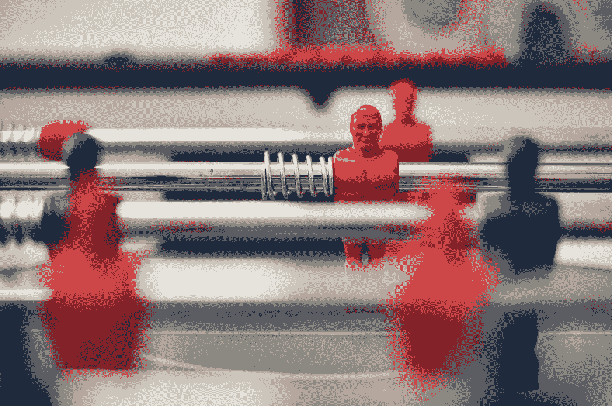

# 管理个人接触的数据

> 原文：<https://medium.datadriveninvestor.com/managing-the-data-of-personal-encounters-eb4a9ef3aebb?source=collection_archive---------11----------------------->

我喜欢和那些不仅了解自己，也了解我的人在一起。

他们可能会让我洞察到我是谁，而我却不知道。

 [## 面向 Noobs |数据驱动型投资者的数字身份

### 聪明人如何在增强现实中创造身份价值？我最近刚满 40 岁。作为一个生物…

www.datadriveninvestor.com](https://www.datadriveninvestor.com/2019/02/28/digital-identity-for-noobs/) 

最近有人说，“哇，刚刚回到正题，是吧？我了解你，你现在完全是在做生意，就好像你的整个情绪都变了。”

我坐在那里思考了几天，心想，哇，那个人太对了。

我真的这么做了。

这就是为什么我生活中的某些关系没有成功，我总是做研究，努力了解越来越多的不仅仅是我自己，还有其他人和我参与的一切。

我在佛罗里达州博卡拉顿的一家公司开始了我的新工作，工作时间是 8:45-5:45。

嗯，我周一和周二 6:00 有 MBA 课，所以我 4:45 出发去上课。

我通常在 8:30-9:00 之间到那里，这取决于天气和交通状况。

然而，在一天结束时，我尽量呆得晚一些。

我通常在 6 点钟离开。

但这背后是有原因的。

我知道公司里的高层是怎么做的——他们是高层是有原因的。

我们的首席执行官一直在那里。即使他不在那里，他仍然在那里。

但是当我工作到 6 点的时候，他通常会过来说一些类似的话，“我们要关门了，走吧，你可以明天再完成。”

今晚他很早就离开了，所以我实际上可以晚一点离开，一直呆到 6:15。那很好。

周五人们只工作到 5 点，但我真的想工作到 6:30 甚至 7:00。

我有工作要做，我想进步，成为最好的自己。

我通常非常非常清楚我是谁，我将成为谁，我知道。

但是有时候，身边的人会告诉我一些我不知道的事情。

大概是 45-50 个人中的 1 个。

**所以 2%。**

我遇到的人中有 2%的人能够透露我自己还不知道的事情，这很少。

但是，当我认识并能够识别这些人时，你最好相信我是认真对待他们的，并优先让他们以大多数人无法接触到的方式接触我。

我想在这些人面前变得脆弱，我想分享真实的自己，这样我就能更深入地了解自己，更多地了解上帝创造我是为了成为什么样的人。

# 而对于另外 98%的人呢？

他们并不都是坏人。也许 50%的人在这个层次上是中立的，他们会简单地支持你是谁，或者强化你现在是谁(太多这样的人会导致持续的停滞)。

剩下的 48%呢？通常，他们是消极的一方。他们会尽量让你呆在原地，这样他们就可以呆在原地而不会感到不舒服！不要屈服！

找到占 2%的人，紧紧抓住他们。给他们你的能量，你的注意力和你的时间。乘以它们。

> “世界上总会有人试图点燃你生命中戏剧的火焰。如果你只是简单地将自己与这些人和这些情况分开，他们的火焰就没有什么可燃烧的了，只会熄灭。”—布莱恩·赫斯