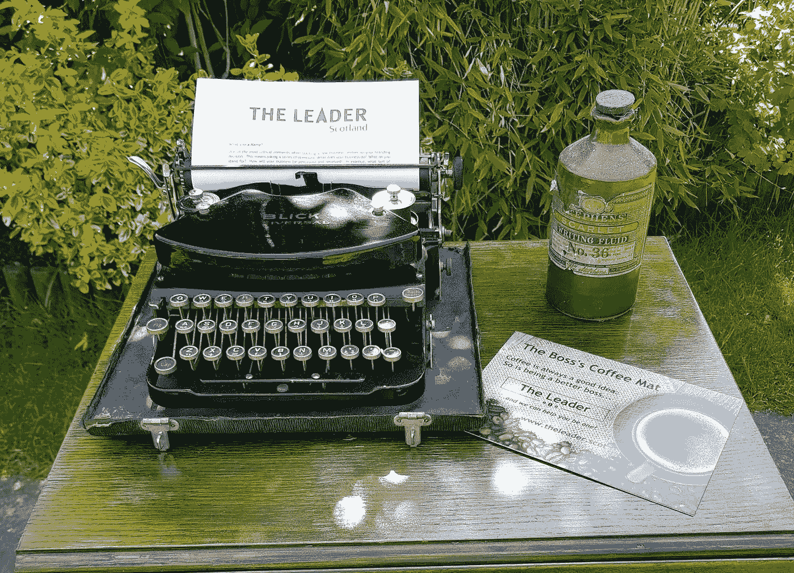

# 40 岁之前不要开始全职工作！你在开玩笑吗？对吗？

> 原文：<https://medium.datadriveninvestor.com/marathon-careers-3a7681d3865a?source=collection_archive---------32----------------------->

最近，女性重返工作岗位引起了一些关注。然而，在这篇来自斯坦福的[文章](https://qz.com/work/1314988/stanford-psychologist-laura-carstensen-says-careers-should-be-mapped-for-longer-lifespans/)中，心理学家劳拉·卡斯滕森，斯坦福长寿中心的创始主任更进一步，建议我们不到 40 岁不应该开始全职工作。

她说的不仅仅是女人。她主张围绕职业节奏建立一种新模式。在这里“*我们应该为马拉松式的职业生涯做打算，而不是 40 年的职业冲刺在 65 岁突然结束，这种职业生涯会持续更长时间，但途中会有更多的休息时间，用于学习、家庭需求和工作场所之外的义务*

从理论上讲，这听起来很明智，也很实际，但卡斯滕森承认，启动这个项目很难。她目前的工作包括重新设计机构，以适应人们实际拥有的生活。

对我们中的许多人来说，成年和我们的职业道路可以感觉到以一种非常结构化并且经常非常狭窄的方式被规划出来。那么，我们会想要一个从 20 多岁到 70 多岁甚至 80 多岁的“马拉松式职业生涯”吗？个人环境在这里显然会起到关键作用。在你职业生涯的开始阶段，财务压力通常更大，这往往与许多“第一次”相吻合……第一辆车、第一栋房子和第一个孩子。

我的个人旅程遵循传统路线，18 岁直接上大学，一年后辍学，开始了不同的课程。在两家私营企业做了 7 年全职工作后，我离开了公司，生下了我的第一个孩子。那是在 80 年代初，大多数女性选择呆在家里，我也一样，但在我的小女儿 3 岁时，我开始在家做一些兼职工作。这十年也正好是我承担照顾父母责任的时候，所以实际上我已经离开正式工作场所 11 年了。

在我职业生涯的间歇期，技术已经爆炸，到了 90 年代初，当我准备回来的时候，我面临着一个巨大的技能缺口。我利用当地成人教育部门开办的一些课程，开始破解计算机的奥秘和奇迹。

好吧，我没有使用这些过时的工具，但是我总是对技术进步的速度感到惊讶。因为我能记得在谷歌、社交媒体、文字处理、手机等出现之前的生活，我总是渴望了解下一个浪潮的到来。我也以健康的态度对待技术，从不认为这是理所当然的。我想我是一个真正的数字移民。

# 40 岁开始全职工作吧！

回到卡斯滕森的建议，全职工作应该从 40 岁开始，奇怪的是，那正是我职业生涯开始的时候。在没有计划和战略的情况下，我在第三部门组织找到了一份临时兼职，当时该组织正处于危机关头，即将转型为一家社会企业和慈善企业。

我最初的临时职位变成了永久职位，然后变成了全职，然后就不仅仅是一份工作了。它成了一种职业，一种激情，释放了几乎无限的个人和职业成长和发展的机会。

现在，如果我在 20 多岁时接受这份工作，我将无法投入它所需要的时间和精力，我的故事将会非常不同。但它来得正是时候，我在 50 岁时攻读了高管 MBA。

我不会假装有时我感觉几乎超出了我的极限——在智力上，身体上和情感上。全职工作，晚上学习，周末上课是很难的。但这与 30 年后参加考试相比根本不算什么！我的学习伙伴是我的小女儿，她正在进行遗传学的期末考试，所以这是一个惊人的结合过程。

但是，如果我发现这很容易，就不会有这么大的收获。课程内容非常有意义。没有一个是抽象的，所以案例研究、模块和互动讨论对我的日常实践产生了倍增效应，学术方面巩固和加强了同样的实践。

# 那么，我故事的下一章是什么？

我在 [The Leader (Scotland)](https://www.theleader.scot/) 担任创始董事的新角色再次涉及到一个学习曲线，但我很幸运能够以较慢的速度完成这一任务。

我怀疑自己是否有足够的体力继续全职工作更长时间，但回到卡斯滕森的理论，如果灵活性是任何新模式的关键，那么我相信自己足够幸运，能够在正确的时间做出正确的选择。

那么今天的女性回归者呢？我很高兴有更多的正式支持和鼓励，像[平等就业机会的回归](https://equatescotland.org.uk/projects/women-returners/)和[女性回归](http://wrpn.womenreturners.com/scotland/)这样的倡议。休息一段时间后重返职场是很难的，我知道有些女性在组建家庭后感到特别不适应和缺乏信心，并且从未完全恢复。同样，态度和方法也在转变，今天，女性不被认为是主要的照顾者，但我们仍然认为这是一种规范。

所以，我想知道我的两个三十出头的女儿的未来会怎样。在他们的职业生涯中，他们会看到很大的变化吗？还是说，重大的变化需要再过一代人才能渗透进来？有一点是肯定的。几个世纪以来，人们一直认为我们都需要以某种形式工作。

> "工作是自然的医生，对人类的幸福至关重要"

公元 580 年盖伦