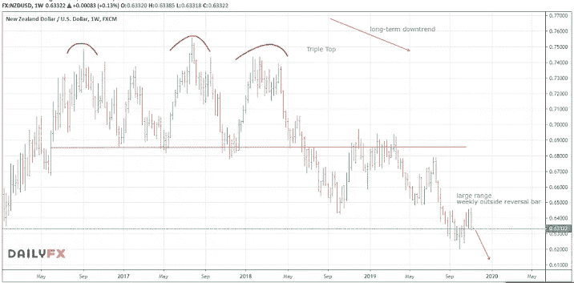

# 市场造假

> 原文：<https://medium.datadriveninvestor.com/market-fake-out-109527a4063b?source=collection_archive---------14----------------------->

**本周一周交易:*卖出纽元***

上周，我谈到了美元如何显示出大幅走低的强烈迹象。然而，有时市场喜欢假装某个方向，在反转方向之前套住许多投资者和交易者。上周，美元在整个一周内都被买入(价值上升)，看看本周的收盘价，现在看来，最近的价格走势是这些虚假时刻之一，美元现在有可能在长期牛市的延续中重新测试其旧高点。

 [## 机器学习的外汇交易挑战|数据驱动的投资者

### 机器学习是人工智能的一个分支，之前占据了很多头条。人们是…

www.datadriveninvestor.com](https://www.datadriveninvestor.com/2019/02/18/the-challenge-of-forex-trading-for-machine-learning/) 

幸运的是，我没有被这种伪装伤害到，因为我使用了“止损单”。这些并不等同于止损。它们是一种挂单，确保只有当市场继续朝着我分析的方向发展时，我的交易才会进入市场。它们起到了最后确认的作用，以避免像这样被套牢。

**最容易受到美元走强影响的似乎是新西兰元和贵金属。**

我将在下周卖出贵金属的任何反弹，并增加我对多种货币的[新西兰元空头](https://mangrovetrading.krtra.com/c/wO24vXCmqdYf/kOJV)头寸。

我试着在本周交易中关注长期交易，这样即使你在我的学生之后收到它们，也许没有立即看到分析，你仍然有机会从我分享的观点中获利。

你想学习如何从市场中获得持续的利润吗？ [*点击此处*](https://go.mangrovetrading.com/freetraining) *，我们将通过一系列免费培训视频带您一步步了解我们的整个交易策略。*