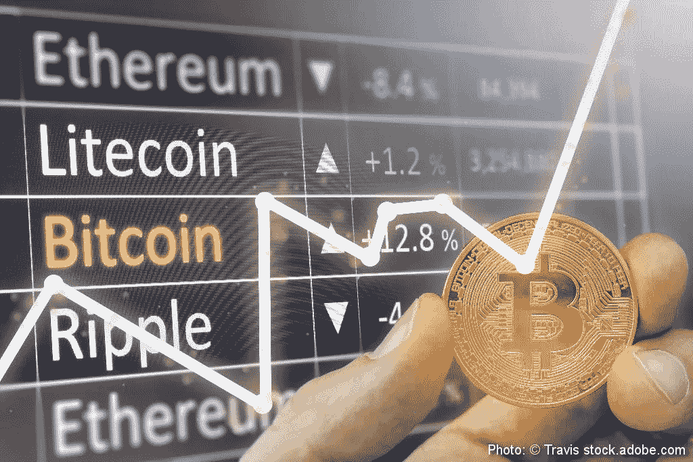

# 市场领导者和预测:未来 5 年的密码

> 原文：<https://medium.datadriveninvestor.com/market-leaders-and-predictions-crypto-in-the-next-5-years-35fc5c064d64?source=collection_archive---------8----------------------->

Photo: © Travis stock.adobe.com

*> >本文仅供参考，并非理财建议。该信息不构成投资建议或投资要约。*

最近的加密货币[波动](https://www.independent.co.uk/life-style/gadgets-and-tech/news/bitcoin-price-live-updates-latest-cryptocurrency-value-ethereum-ripple-usd-exchange-trading-invest-a8301651.html)清楚地表明，“波动性”仍然是与市场密切相关的词。这与正在进行的[熊市](https://news.caviar.io/crypto-weekly-outlook-week-of-july-1-1cf18599fa46)相结合，使得许多加密用户很难考虑五个月后的市场会是什么样子，更不用说未来五年了。然而，也有一些备受尊敬的密码领导者在推测未来会发生什么。以下是 5 位知名人士对加密货币的预测:

维塔利克·布特林

作为加密货币领域最受认可的人物之一， [Buterin](https://www.linkedin.com/in/vitalik-buterin-267a7450) 是[以太坊](https://ethereum.org/)和[比特币杂志](https://bitcoinmagazine.com/) 直言不讳的联合创始人，这使他在 [*福布斯 30 岁以下*榜单中占据一席之地。他还在出版加密货币和区块链技术学术研究期刊的](https://www.forbes.com/pictures/5a00e16ca7ea436b47b4f295/vitalik-buterin-23/#a01cb982cf26) [*分类帐*](https://ledgerjournal.org/) 董事会任职。布特林的与众不同之处在于他在慈善事业中扮演的角色。仅在今年，他就向 SENS 研究基金会和 OmiseGo 基金会捐款，这两个基金会支持“直接给予”组织，帮助非洲贫困的难民。

他看到以太坊通过一种叫做[分片](https://cointelegraph.com/news/vitalik-buterin-sharding-scaling-improvement-is-coming-to-ethereum-network)的方法进行扩展，这将增加每个[区块链](https://cointelegraph.com/tags/blockchain)的交易数量。*对于未来，布特林多次* [*警告*](https://www.cnbc.com/2018/02/19/ethereum-creator-vitalik-buterin-warns-about-cryptocurrency-investment.html) *密码投资者保持谨慎处置，以防市场出现泡沫。*

**赵昌鹏**

[赵昌鹏](https://www.linkedin.com/in/cpzhao)在不到一年的时间里成为[币安](https://www.binance.com/login.html)的首席执行官和创始人，这是目前世界上交易量最大的[加密货币交易所。众所周知，赵也是开发](https://cointelegraph.com/news/world-s-largest-crypto-exchange-binance-expects-2018-profits-up-to-1-billion) [Blockchain.info](https://www.blockchain.com/) 团队的一员，也是 [OKCoin](https://www.okcoin.com/) 的前 CTO。由于从 ICO 到顶级交易所的快速增长以及他对加密货币日常应用的倡导，赵被福布斯列为加密领域最具影响力的人物之一。

在最近的一次采访中，赵展望了通过实验室(T30)向非集中化发展的前景，该实验室是的一个部门，是科技的孵化器。至于其他加密技术的未来如何，赵[预测](https://www.newsbtc.com/2018/05/07/binance-ceo-envisions-bright-future-ico-crypto-market/)虽然监管问题仍在继续，但像 ICO 这样的数字资产将继续增加，并推动市场向前发展。

布莱恩·阿姆斯特朗

[Brian Armstrong](https://www.linkedin.com/in/barmstrong/) 是[全球数字资产交易所(GDAX)](https://www.gdax.com/) 的联合创始人兼首席执行官，其前身为[比特币基地](https://www.coinbase.com/)。阿姆斯特朗在 2017 年 8 月以 16 亿美元的估值将比特币基地推上“独角兽”地位后，登上了福布斯 40 岁以下 40 人榜单。同年，在接受彭博科技采访时，他表达了以太坊是首选的观点。

面对[价格波动](http://www.businessinsider.com/bitcoin-price-change-coinbase-pep-talk-2018-6?IR=T)阿姆斯特朗坚定不移，他的[预测](https://www.youtube.com/watch?v=INMU7fZfVDc)是更多的传统金融机构将进入加密市场，为像他自己的交易所这样的现有交易所提供竞争。

布拉德·加林豪斯

[布拉德·加林豪斯](https://www.linkedin.com/in/bradgarlinghouse)有过担任美国在线总裁和 Hightail 首席执行官的经历，但他进入加密货币领域的标志是他担任 [Ripple](https://ripple.com/) 首席执行官的工作。Ripple 已经从弱势群体发展成为 2017 年表现最佳的加密资产，在 Garlinghouse 的领导下，XRP 已经成为银行机构走向整合的首选。

就像维塔利克·布特林一样，加林豪斯试图描绘一幅现实的未来图景。他的[预测](https://cryptocurrencynews.com/daily-news/ripple-news/ripple-brad-garlinghouse/)描述了价格的急剧下跌会引起许多数字资产无法承受的冲击波。加林豪斯看到了向传统金融机构出售软件和其他区块链产品的希望，这将为市场提供稳定。

**其他知名人物**

如果没有提到[安德里亚斯·安东诺普洛斯](https://www.linkedin.com/in/amantonopoulos),[*让我们谈论比特币*](https://letstalkbitcoin.com/) 播客的主持人和[辛戈·拉文](https://www.linkedin.com/in/shingo-lavine),[风气](http://www.ethos.co.za/)的创始人，这篇文章将是不完整的。Antonopoulos 在多家加密初创公司担任顾问，并在“区块链一切”节目中作为公开演讲者而广受欢迎。[今年早些时候，Antonopoulos 在华沙发表演讲时表示，他认为比特币将是未来的佼佼者，并在讨论银行机构采用以太坊时表现出谨慎的态度。](https://bitcoinist.com/blockchain-bullshit-andreas-antonopoulos/)

Shingo Lavine 在 20 岁时创立了 Ethos，被誉为加密货币的马克·扎克伯格。Lavine 是一位经验丰富的加密投资者，此前他曾表示对加密货币市场和[去中心化](https://medium.com/ethos-io/the-future-of-cryptocurrency-why-weve-never-felt-more-confident-d757797af463)的未来充满信心。

从当今最著名的加密人物的预测中可以得出什么结论？

布特林和加林豪斯预见了类似互联网的泡沫，阿姆斯特朗支持中央集权，拉文反对。整合，去中心化，这些预测还仅限于猜测。

*> >市场在波动，只有时间会证明一切。你的秘密预测是什么？*

***关于作者:*** *基里尔·本索诺夫(Kirill Bensonoff)是一位成功的企业家，拥有多次退出，区块链投资人和顾问。他还是波士顿加密会议的主持人，波士顿区块链&的创始人，AI 天使和领导* [*区块链+ AI 崛起 Angel.co 辛迪加*](https://angel.co/l/29VgTG) *。通过访问*[*www.kirillbensonoff.com*](http://www.kirillbensonoff.com/)*了解更多信息，并在 Twitter 上关注他*[*@ prankstr 25*](https://twitter.com/prankstr25)*。*

*免责声明:虚拟货币不是法定货币，不受政府支持，账户和值余额不受消费者保护。本文仅供参考，并非财务建议。该信息不构成投资建议或投资要约。*

*原载于 2018 年 7 月 24 日*[*news . caviar . io*](https://news.caviar.io/market-leaders-and-predictions-crypto-in-the-next-5-years-9be0dca40626)*。*