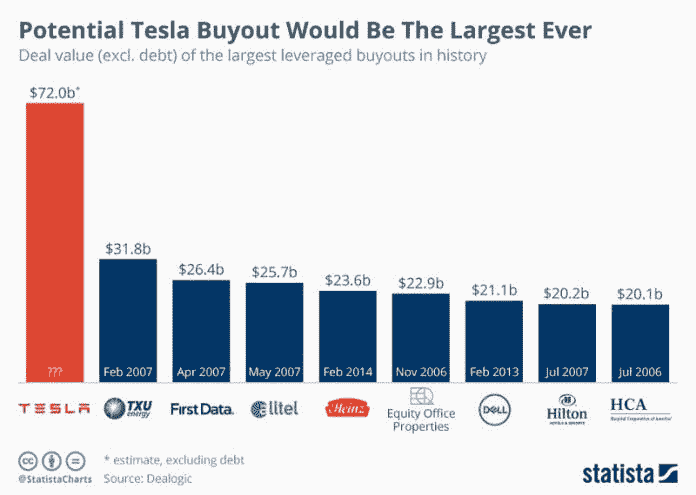
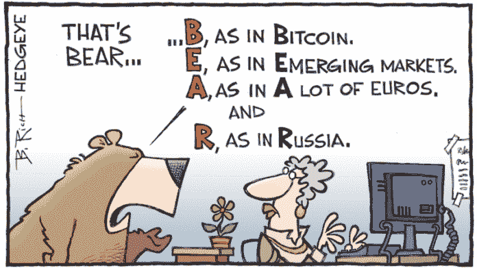

# 市场推动者和动摇者

> 原文：<https://medium.datadriveninvestor.com/market-movers-shakers-9bccb9569f60?source=collection_archive---------5----------------------->

让我们从股票开始，在又一个强劲的收益季节的背景下，美国市场继续跑赢几乎所有全球指数。这一轮超级牛市背后的驱动力是持续走高的科技板块。亚马逊再创新高，纳斯达克再次上涨。然而，脸书一直在努力从其收益和指导后经历的大幅下跌中反弹。标准普尔 500 继续朝着 1 月份以来的前一高点缓慢前进。我会在这个水平附近保持谨慎，除非我确认市场正在向另一个高点移动，特别是与中国的贸易战没有显示出停止的迹象。

但最大的新闻是埃隆·马斯克关于以每股 420 美元的价格将特斯拉私有化的推文，这使得收购费用约为 700 亿美元。这是一笔巨款&当埃隆在推特上说“资金有保障”时，他最好确定这样做，否则他将面临股东的大规模诉讼。至少可以说，特斯拉经历了艰难的一年，生产延期、供应问题、不满的员工和焦虑的首席执行官。如果人们相信马斯克，他希望摆脱股东对短期收益的持续压力。我的意思是，仔细想想，这确实给创新精神泼了一盆冷水！唯一的问题是…他能成功吗？不过要小心，因为 SEC 已经开始对马斯克的推文进行调查。让我们将特斯拉的收购与其他一些收购进行比较，以了解我们正在谈论的观点。

而外汇市场深陷地缘政治风险。谈到美元主要交易，最大的波动发生在 GBPUSD，过去两周下跌了约 400 点，人们越来越担心英国与欧盟在明年的最后期限前不会达成英国退出欧盟协议。随着企业从伦敦的地区总部转移到欧洲其他地区，英国已经感受到了压力。就我而言，该货币对在盘整后已经恢复了长期下跌趋势。然而，美元正在全面走强，所以不要指望短期内会出现大幅反弹。

谈到新兴市场，土耳其里拉今年遭受重创，对美元贬值 30%，随着传统盟友之间的紧张局势加剧，土耳其里拉继续贬值。再次下跌更多的是与新兴市场的疲软有关，而不是基本面因素，但话说回来，他们如何成为头条新闻。里拉不是唯一受强势美元影响的货币……在美国新制裁的背景下，俄罗斯卢布跌至 2016 年以来的最低水平。我现在的建议是，继续看好美元。

最后，让我们来谈谈我最喜欢的 Cryptos！对于数字硬币来说，这真是糟糕的一周，市值从早先超过 3000 亿美元的高点蒸发了近 800 亿美元&在撰写本文时，比特币触及约 6200 美元的低点，试图反弹。看着如此黑暗的画面，现在真的很难成为一个秘密的乐观主义者，但我仍然相信他们有一个光明的未来…不是所有人，但总的来说是的。这可能只是另一轮抛售，为大玩家创造另一个机会，在最后一手弱牌被甩掉之前入场。根据最近的一项研究，ICO 评级报告，ICO 市场在一年内增长了一倍多(117 亿美元)，尽管所有 FUD 关于法规和打击等。顺便说一句，SEC 已经表示将在 9 月 30 日之前对 9 个比特币 ETF 申请做出决定，所以我想那时你可以叫醒我了！

在此之前，小心你的资本，明智地投资——进行适当的风险管理，尽职调查，保持专注。交易愉快！

感觉肯定是这样的……除非你只交易美国股票。

保持联系:[Twitter](https://twitter.com/fklivestolearn)|[StockTwits](https://stocktwits.com/trade_nut)|[LinkedIn](https://www.linkedin.com/in/faisal-khan-2a3009b/)|[Telegram](https://t.me/joinchat/IWzyHBGWCFwPQTe8Tm5H_Q)|[trade alike](http://www.tradealike.com/)

相关文章: [**交易美元专业外汇**](https://medium.com/datadriveninvestor/trading-usd-majors-in-forex-b616c7841bc7) ， [**交易心理&经验教训**](http://www.datadriveninvestor.com/2018/07/12/trading-psychology-lessons-learnt/) ， [**万金油……一个高手！**](http://www.datadriveninvestor.com/2018/07/03/jack-of-all-trades-master-of-one/) 、 [**一刀切的交易策略？**](http://www.datadriveninvestor.com/2018/06/20/one-size-fits-all-trading-strategy/)

*原载于 2018 年 8 月 9 日*[*www.datadriveninvestor.com*](http://www.datadriveninvestor.com/2018/08/09/market-movers-shakers/)*。*