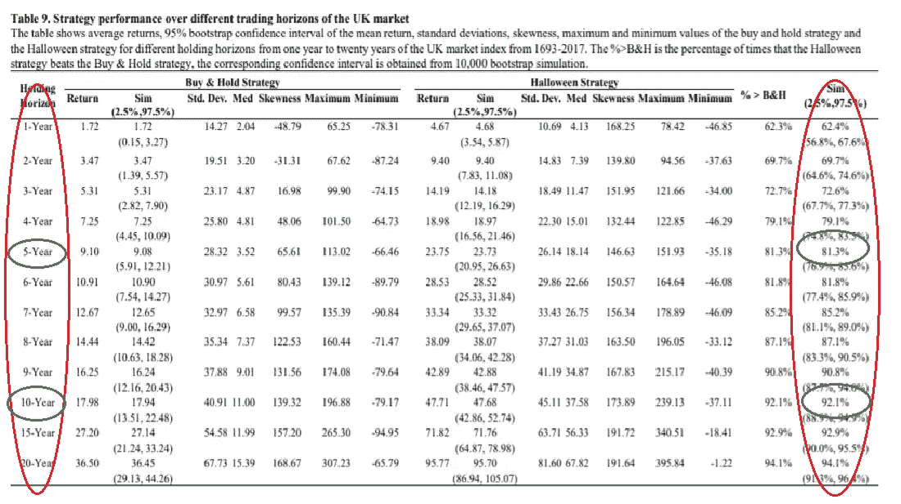
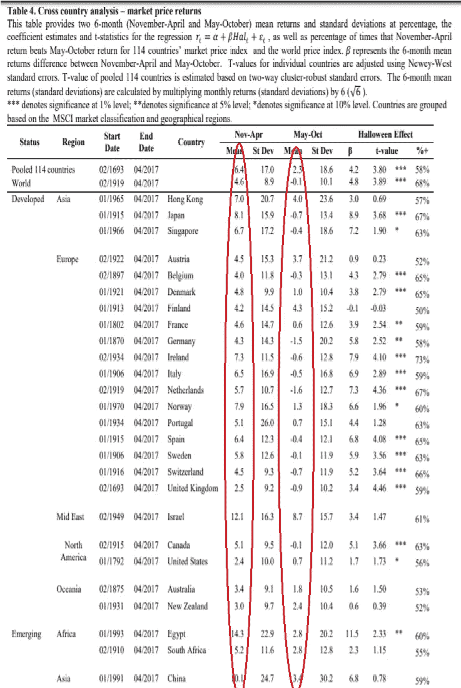
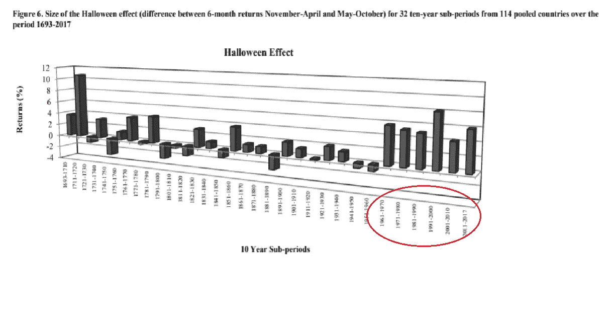

# 市场季节性:击败“买入并持有”策略

> 原文：<https://medium.datadriveninvestor.com/market-seasonality-beating-the-buy-and-hold-strategy-3a6d0e8927f6?source=collection_archive---------5----------------------->

*(下面写的任何东西都不应该被认为是财务建议。写作是为了教育目的。)*

对大多数人来说，战胜市场平均水平是一个很难持续执行的任务，因为未入门者没有这种心态，而入门者花了很多钱来获得成功交易者的心态和知识——比大多数人愿意花的还要多。根据 Bernard D. Beitman 博士的说法，作为人类，我们渴望在生活的各个方面找到模式和保证。从我们的睡眠模式到我们什么时候吃什么，到我们的夜间仪式；我们喜欢提前知道我们将要做什么，我们将从中获得什么。然而，市场中的担保是幻觉——模式通常很难找到，而且，不同的人对它们有不同的解释。一直陷在一项投资中，往往会让你没有资金投资于目前其他更好的机会。不幸的是，这就是市场的残酷现实；既有风险，也有不可预测的结果。机器人、算法、先进的计算机和受限的光纤网络是更有特权的交易者拥有的工具，以获得比普通经纪人更大的优势。由于所有这些因素在市场上对我们不利，当要战胜市场时，即使是最坚强的意志也会感到徒劳。

尤金·法玛(Eugene Fama)提出了一种“市场效率”理论，这种理论认为资产的价格反映了所有可获得的公共信息，从而增加了这一切的无用性。同样，任何新的价格变动都是新信息公开化的反映；因此，通过资产选择战胜市场不是技巧的体现，而是机会。这意味着不存在可以持续战胜市场的预定策略。虽然我对这一理论没有真假之分，但这种说法给持续跑赢市场制造了一种徒劳的氛围。这就是为什么有效市场理论的支持者建议购买跟踪市场整体表现的指数基金，并且在投资组合管理方面是被动的。这类似于一种买入并持有的策略，在这种策略中，你预期自己的表现不会比市场平均水平更好或更差。

提出一个简单有效的策略，通过在一年中的某些时段投资，在其他时段获利，来战胜市场平均水平，这似乎很可笑。然而，对 300 多年市场历史的数据挖掘有力地表明了“市场季节性”的存在。现在你一定在想，“什么是市场季节性？”从本质上讲，这可以用一句古老的格言“在 5 月份卖出，然后离场”来解释。这句格言是投资者提出的，他们注意到市场在夏季的几个月里表现普遍较差。坦率地说，策略是在一年中表现较好的时候持有资产，在下跌月份避开传统市场。虽然投资者都知道“五月卖出，然后离场”的说法，但还有一个不太为人知的指标与之互补:万圣节效应。这个指标主张在万圣节后重新进入市场——11 月到 4 月——因为在这几个月投资历史上更有利可图。对这些市场智慧的支持来自于这样一种假设，即夏季月份(5 月至 10 月)的平均股市回报通常低于从无风险资产中获得的利息，或者换句话说，具有“负风险溢价”。相反，万圣节效应得到了 11 月至 4 月显著“正风险溢价”的支持。

布曼和雅各布森在《美国经济评论》的研究中提出了一个基于市场季节性的简单交易策略。它规定:11 月至 4 月投资股市投资组合；然后，拿收益，购买 5 月到 10 月的无风险短期国库券。这种策略降低了在更有可能出现熊市的月份出现负回报的风险，并增加了在更有可能扭亏为盈的月份出现回报的可能性。我不会责怪任何一个读者对此持怀疑态度；然而，我提出的数据应该消除任何怀疑这种特殊现象的存在。

当听到市场季节性的概念时，我首先想到的一个想法是利润一定是无关紧要的。我认为，如果没有人使用，就不可能存在一个简单易行、持续且显著优于市场的策略(当然，大众心理的这种转变很可能会改变市场现状)。然而，事实并非如此。我在上一段提到的由布曼和雅各布森开发的策略，我在下文中称之为 B&J 季节性策略，显示了 81%或 92%的概率击败买入并持有策略 300%的回报。这是基于持有时间分别为 5 年和 10 年，并随着

*(Statistical chance of beating the market based on your holding period.)*

甚至更长的保持时间。历史数据支持这一点，因为在 323 年的时间里，从 114 个国家的股票交易数据中观察，11 月至 4 月的回报率平均比 5 月至 10 月的回报率高 4.2%。此外，这种相关性并没有随着时间的推移而减弱，市场最近表现出了更强的市场季节性效应，因为夏季和冬季回报率的差异从之前的 4.2%跃升至至少 5%，并在过去 50 年中上升至 8.3%。此外，对于那些在发达国家交易的人来说，市场季节性效应在你的股票市场中最强，万圣节效应在 70%的发达市场中具有统计学意义。这表明，市场季节性不仅没有倒退，而且在过去 50 年中实际上变得越来越强，并对经济发达的国家产生了重大影响。

*(Each developed countries’ historical stock exchange data. Observes Nov-Apr returns and May-Oct average returns separately.)*

*(Most recent 60 years shows a significant increase in strength of the Halloween Effect compared to historical numbers)*

本文中提供的数据是有目的地客观呈现的。数据量相当大，从 300 多年的记录中有 62，962 次观察。数据大小避免了选择抽样的可能性。该分析是通过比较平均总回报与无风险资产利率这一客观方法获得的。

对于市场季节性的原因，出现了许多理论，几乎所有的理论都被证明是错误的。唯一有确凿证据支持的是休假理论，该理论认为市场行为受人们休假习惯的影响。我可以给出一个个人轶事来证明这一论点，因为从 2018 年 7 月到 10 月，我去东南亚度假，发现这段经历极大地影响了我管理投资组合的方式。首先，我不得不清算一部分投资组合来资助这次旅行。第二，在我的冒险中，我缺乏时间和动力去主动交易当前的市场事件。旅行的其他复杂方面使得将流动性放在不干涉的无风险资产中是比积极投资更有效的选择。这些问题出现在大多数对旅游着迷的投资者身上，因此会对市场产生重大影响。哥伦比亚广播公司的数据证实，在美国和许多其他发达国家和新兴国家，夏季周末是一年中最常去的地方。这一数据证实了假期理论，也符合为什么万圣节效应在发达国家如此强烈的原因。

虽然探索像市场季节性这样的现象的原因可能很有趣，但它对一个人管理投资组合的方式应该没有什么影响。相反，我们唯一关心的应该是如何根据数据来管理我们的投资组合。我们应该记住的是:这些数据显示了这种策略有效性的异常值。如果一个人要利用市场季节性进行投资，要看到持续的成功，尽早识别外围季节，并采取后续行动以避免不必要的损失。风险缓解策略应始终与任何交易策略一起实施，以获得最佳的投资组合表现。

对我们大多数人来说，有效市场理论是正确的。大多数普通投资者，甚至大多数对冲基金都发现很难持续跑赢市场。所以，我要说的是:遵循 B&J 季节性策略可能会做许多专业人士认为困难的事情，回报比市场表现更好。历史数据证明，夏季回报往往包含负风险溢价，冬季回报则相反。同样，在 21 点游戏中，一个久经考验的长期获胜方法是算牌:计算出的低牌和高牌的数量，以了解何时某人有赢一手牌的优势。计数越高，他们击败庄家的概率就越高。因此，专业的算牌者发现，当他们拥有统计优势时，比平时下更多的注在金钱上是有利的。同样，作为投资者，你希望在胜算较大的时候投资股市，在胜算较小的时候对冲其他地方的利润。因此，作为一名投资者，理解你何时有更大的机会战胜市场对于在市场中获得持续的成功至关重要。即使不知道它的原因，知道市场季节性的影响以及它如何改变你的胜算是解决战胜市场难题的关键。

引用:

本·雅各布森和切莉·张懿。"万圣节效应:无处不在，无时不刻." *SSRN 电子报，【2018 年 10 月，doi:10.2139/ssrn.2154873*

大脑在巧合中寻找模式。【2009 年 5 月。