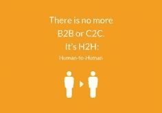
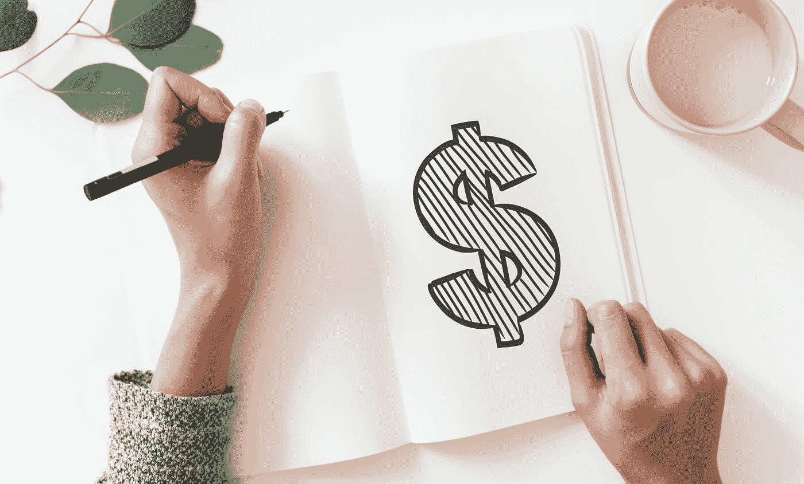

# 营销自动化

> 原文：<https://medium.datadriveninvestor.com/marketing-automation-2878d2f58ad8?source=collection_archive---------7----------------------->

## 即使你在向你的整个客户群进行“营销”,你在任何时候都只是在和一个人说话。

营销自动化的**整体*点*** 是什么？

将更多潜在客户转化为付费客户。

好吧…但是怎么做？

通过使用机器对应物来自动化营销和通信的乏味和重复的任务！

每次你听到“[营销自动化”](https://www.hubspot.com/marketing-automation-information)这个术语，你都会被激起兴趣，但又担心有人声称这是一个让你的企业变得更富有的明智决定。

营销自动化管理和处理几乎所有事情，从社交媒体营销、电子邮件营销、集客营销线索评分和培育，到“分析和报告”。它可以推动多项活动，确定销售线索，并影响买家的决策和销售周期。这让你以你一直想要的方式经营你的企业。

What you can’t measure, can’t be improved.

*预计到 2022 年，全球营销自动化软件市场的 CAGR 将增长到 9.26%。该市场在 2016 年创造了 38.6 亿美元的收入，预计到 2025 年将达到 76.3 亿美元。*

> -www.martechadvisor.com

在召唤[营销自动化工具](https://neilpatel.com/blog/marketing-automation-tools/)为你工作之前，先了解*它如何*提升你的业务:

***第一本能就是把营销自动化应用到你做的每一件事上。如果你想充分利用它，DONT。***

是的，只是不要…因为，它不应该这样使用。如果你想充分利用它，重新审视你的目标。

# 这不仅仅是为了转化而引导你的客户通过销售漏斗。

将重心从“活动”方法转移到“以客户为中心”方法，以实现“平稳持续”的客户体验承诺。*将* [集客营销](https://www.hubspot.com/inbound-marketing)策略(即提供与客户需求和愿望同步的有价值内容)与营销自动化相结合，从而使情境驱动的个性化内容到达您的潜在客户。

> 当你在“营销”时，你仍然只是在任何给定的时间点上和一个人说话。

# 让数字对话更真实，更像人与人之间的对话。

这就是人工智能(AI)和预测分析的作用所在。

[人工智能工具](https://www.toprankblog.com/2018/03/artificial-intelligence-marketing-tools/)从您的客户那里提取最有价值的信息，供您衡量和考虑最可行的见解；由人工智能支持的营销自动化提供了惊人的高级功能——通过及时的信息锁定客户，在客户旅程的各个阶段为他们提供支持。

“white robot toy holding black tablet” by [Owen Beard](https://unsplash.com/@owenbeard?utm_source=medium&utm_medium=referral) on [Unsplash](https://unsplash.com?utm_source=medium&utm_medium=referral)

让我们假设，一个名为 Monica 的潜在客户访问了您的网站，并在她的购物车中添加了一份食品。她输入自己的详细信息进行结账，但从未完成交易。现在，您的自动化策略可能看起来像这样:

一小时后，一封自动邮件被触发，鼓励莫妮卡完成订单。

如果她分心了，失去了信息，你的营销自动化平台与脸书同步，重新定位莫尼卡。她看到一则广告说“莫妮卡，你的厨房没有杂货了吗？”链接到购物车或带有追加销售的类似登录页面。如果 Monica 一两天后还没有买食品杂货，就会发短信询问你的支持团队是否能回答或帮助她。如果过了相当长的一段时间，比如说 6-7 天，她还没有购买任何商品，那么就会触发一个定制的电子邮件和脸书广告活动，目标是 Monica 购买与她最初的搜索标准相关的商品。

# **通过准确传达你的潜在客户和现有客户想要了解的兴趣，对他们产生更大的影响。**

当营销自动化与[客户数据管理平台](https://digiday.com/marketing/what-is-a-customer-data-platform/)集成时，您可以了解客户过去的购买行为、社交媒体互动、搜索查询、现场行为、内容消费**。**为了让营销自动化最适合你，定制你的营销活动——为你的每个整体买家角色定制充足的相关内容(无论是电子邮件、博客还是营销宣传材料)。你可以让客户不断查看关于你的产品的最新信息，而不必让营销团队去筛选大量数据。

> *45%的在线客户倾向于从提供个性化产品推荐的网站购买更多产品，56%的客户更有可能通过个性化的在线体验进行购买。*

阅读[:超个性化以及如何利用数据建立忠诚的客户关系。](https://martechtoday.com/hyper-personalization-leveraging-data-build-loyal-customer-relationships-140530)

# **实现“轻松的数据可视化”以获得直观的见解。**

您有多个活动正在运行=您的自动化工作流程很复杂。当您处理一个互联自动化网络时，一个简单的、所有工作流程的大框架视图非常重要，它可以让您了解客户旅程的全貌。智能统计模型有助于分析和确定客户的下一步行动。这些见解有助于你制定“下一步最佳行动”。您的营销团队可以根据客户购买路径做出实时决策，推断行为模式并优化支出。

**测试的力量&不断优化您的活动**

Photo by [José Alejandro Cuffia](https://unsplash.com/@alecuffia?utm_source=medium&utm_medium=referral) on [Unsplash](https://unsplash.com?utm_source=medium&utm_medium=referral)

作为一名营销人员，你可以立即理解什么样的信息最能引起你的目标群体的共鸣，如何以及何时发送它们以获得你想要的结果。你可以尝试将不同的信息融合在创意中，同时相应地优化你的内容**。**营销自动化为您提供优势，确保您的活动对您的潜在客户/客户产生所需的影响。此外，您可以智能地追加销售或交叉销售，同时不断提升客户体验。

它可以帮助整合营销和销售渠道。

对于那些努力弥合营销和销售之间差距的企业来说，这听起来似乎很轻松。管理销售和营销任务非常耗时。该软件显示营销活动以及您的销售活动，让您的销售和营销团队成员即时了解他们正在完成的任务以及他们试图在哪些方面取得平衡。它允许您管理和实施营销渠道，并通过销售渠道培养销售线索。如果你碰巧经营着一个电子商务网站，你也可以在同一个平台上追踪你所有的购买。

Photo by [rawpixel](https://unsplash.com/@rawpixel?utm_source=medium&utm_medium=referral) on [Unsplash](https://unsplash.com?utm_source=medium&utm_medium=referral)

All-in-all 营销自动化可帮助您制定最接近拥有无限时间和智慧的真正销售人员所能做到的解决方案。

营销自动化变得越来越智能，越来越容易实现。这种趋势将会持续，而且不会很快放缓。

实现自动化，否则您的市场份额可能会被竞争对手抢走！