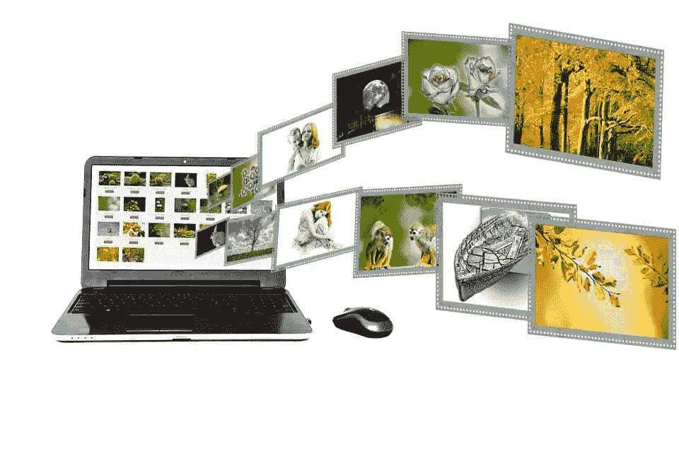

# 2019 年营销突破。新的重要趋势

> 原文：<https://medium.datadriveninvestor.com/marketing-breakthroughs-in-2019-new-crucial-trends-8fbf9ecf4762?source=collection_archive---------10----------------------->

我们所有人都希望 rocketsky 营销传播这就是为什么我们敢于预测 2019 年你必须知道和使用的最有前途的创新。那么，我们开始吧。

1.  **人工智能与人类创造力的结合。**

机器学习技术与公司中最优秀专家的经验和知识的结合。机器可以出色地完成常规分析任务，这些任务需要耗费大量时间并完美地寻找模式。与此同时，人们可以专注于创造性的任务和想法，制定战略，测试它们并改善公司。

示例:上下文广告自动导航:该系统考虑了广告活动历史上积累的数据，并显著提高了它们的效率。
智能链接:促销页面——猫粮目录。这项服务将在宠物网站上找到许多关于猫的页面，并在那里放置一个链接。

**2。个性化广告的新形式。**

数据管理平台和其他使用 wi-fi、视频分析收集客户数据的技术(例如，嵌入在商店数字屏幕或媒体播放器中的在线数据收集服务)。目前，这种类型的平台仅在 CIS 中进行测试，但在 2019 年，我们预计它们将得到更广泛的应用。这将使得基于个人客户偏好的个性化报价和折扣更加准确和相关。
当用户进入广告商的数据库时，用户的个人资料开始获取信息:它保存了所有的运动，关于领域的数据，年龄，收入水平，兴趣(基于通过 Wi-Fi 访问的网站)。

**3。人工智能驱动的客服。**

2018 年，人工智能驱动的通信的增长是不可否认的，Hootsuite 预测，到 2020 年，超过 85%的客户服务交互将由人工智能机器人驱动。

2019 年将显示 WhatsApp 作为主要社交客户服务渠道的崛起。2018 年 8 月 WhatsApp 商业应用编程接口的发布可能会成为该行业真正的游戏规则改变者。

除了更快的响应时间，WhatsApp 将权力交给了消费者，因为企业仍然只能给最先联系他们的人发消息。

随着智能手机到处都与脸书、Instagram、Twitter 和 YouTube 等频道配对，只需几秒钟就可以上线并开始直播来自世界任何地方的视频。这是 2019 年将不可避免的数字趋势之一。

直播视频允许品牌进行现场采访，演示，并展示他们的产品回答问题和答案，从而提高客户参与度。

**4。语音助手的成长。**
语音技术普及。本月使用语音搜索或智能助手的互联网用户比例正在上升。我是声音使用的狂热爱好者，你呢？

**5。聊天机器人的使用将会增加**

数据显示聊天机器人也将占据主导地位。根据 LivePerson 的一项研究，在接受调查的 5000 人中，只有 19%的人对聊天机器人持负面看法。此外，33%的人持肯定态度，48%的人认为只要他们的问题得到解决，他们就无所谓。

机器人允许用户获得个性化的、集中的交互，而不需要从有限的人力资源中消耗太多。它们在 2018 年的有效性已经显示出使用量的显著增加，这种使用在 2019 年的数字营销中可能会继续增长——在消费者眼中，它们可能会变得更加“正常”。换句话说:新鲜感将会消失，但我们将会看到它们变得更加广泛和有用。

聊天机器人可以让你的用户做一些事情，比如订披萨，选择手机套餐等等。没有下载原生应用的麻烦。

**6。互联网将赶上电视**

这不是一个大新闻，但研究表明，就观看时间而言，互联网将在 2019 年赶上电视。根据这项研究，2019 年，人们每天将花费 2.6 小时在线，2.7 小时看电视。一个人平均 45 分钟的上网时间会花在看手机视频上。

**7。**‘直播’的兴起

直播视频已经存在了一段时间，特别是在 YouTube 上，但它在脸书和现在的 Instagram 上的流行使它成为营销人员在 2019 年寻找的一个重要机会。直播视频的交互性使其成为营销人员与观众互动并加强品牌与其追随者之间关系的有力工具

**8。区块链**

现在，营销人员开始使用区块链来激励消费者耐着性子看完广告，并参与其中——无论是留下反馈、评论还是给朋友加标签。一种用来激励观众的加密货币是基本注意力令牌(BAT)。勇敢的浏览器匿名监控用户的注意力，然后相应地奖励出版商蝙蝠。

**9。通过讲故事建立品牌忠诚度**

讲故事对于初创企业和新兴公司尤其重要，因为它会让消费者觉得，在你的品牌越来越受欢迎的同时，他们也是公司增长和发展的一部分。此外还有冗长的阅读。例如，脸书允许用户制作即时文章，用户可以查看来自不同网络资源的文章，而无需进入第三方网站的页面。

**10。B2B 社区建设**

根据新的市场调查，23%的 B2B 营销人员致力于建立行业内的社区关系。尽管关注行业内的竞争品牌总是很重要，但你的公司也将通过相互合作获得更大的追随者

**11。互动内容**

小测验、调查和测试越来越受欢迎。用户积极参与游戏对公司有利。首先，人们把它与从游戏和胜利中获得的快乐联系起来。其次，一个好的测验或一个有趣的谜题会产生病毒效应。《黑镜:Bandersnatch》在网飞上映。这是一部互动电影，观众可以选择做什么。主角是一个紧张的年轻人斯蒂芬，他发明了一个叫做“Bandersnatch”的任务。

***作者瓦莱里娅·明戈娃&亚历山德拉·里亚布采娃***

*酸味儿:habr.com；medium.com/@CurtisTredway;·ad2brand.com；smmadvertisingvc.ru 社会报告；数字市场研究所；smartinsights*