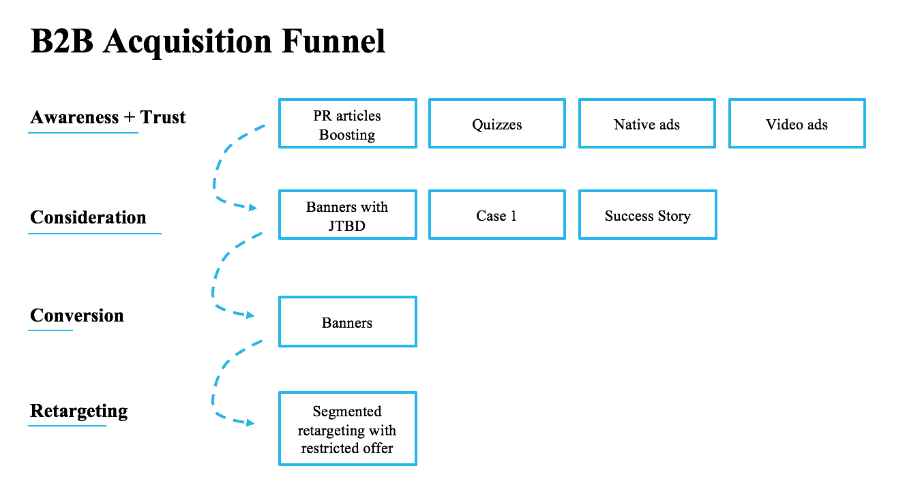

# B2B 项目的营销

> 原文：<https://medium.datadriveninvestor.com/marketing-for-b2b-projects-4772662873fd?source=collection_archive---------3----------------------->

在任何类型的营销中，决策者都是最终的收件人。B2C 和 B2B 营销的区别仅在于决策周期。尽管 B2B 营销通常较少受情感因素影响，但它们有一套相似的功能渠道和逻辑。

因此，如果您想成功推广 SAAS 或企业解决方案，应该从哪里开始呢？

 [## 计划者让社交媒体保持正轨——数据驱动的投资者

### 如果想达到并保持最高效率，忙碌的人会坚持使用系统。这是 Tweepsmap 和…背后的前提

www.datadriveninvestor.com](https://www.datadriveninvestor.com/2019/03/11/schedulers-keep-social-media-on-track/) 

我们的经验表明，最好的平台是(按有效性排序)

*   脸谱网
*   商务化人际关系网
*   推特
*   照片墙

在这篇文章中，我将告诉你如何使用脸书来显著提高你的 B2B 销售。

脸书有很多兴趣定位工具，但最好的是长相相似的观众。当您将最新的客户数据库(电子邮件/电话号码)上传到广告管理器时，脸书通过其内部算法向相似(“长相相似”)的受众或定制受众显示广告。

想想谁是决策者，你可能从哪里得到他/她的电话号码。例如，如果你正在创建一个服务来提高客户关系管理，你将目标客户关系管理经理，忠诚度计划经理或 CMO。然后在求职网站上注册一个公司账户，在你需要的地理位置上下载你感兴趣的所有雇主的电子邮件和电话号码，并在脸书和推特上针对他们进行广告宣传。

这是一个相当简单的框架，以成为成功的 B2B 营销使用脸书

在认知阶段，公关文章、相关媒体的原生广告和视频广告将是你的主要创作。不同的测试和测验也善于吸引受众，例如，“了解你的 CRM 营销有多成功”，“忠诚度清单:了解如何让你的客户开心”。这种测试允许瞄准廉价的数据库进行再销售，因为点击测试比点击广告横幅便宜 7-10 倍。此外，它们允许使用不同的工具对受众进行细分，并为每个细分市场开发独特的再营销活动。完成测试的人有 90%左右。在最后一个阶段(结果页面)，你应该展示你的限时折扣产品。此外，你可以给对方一个机会留下他/她的电子邮件或电话号码。如果你承诺给用户发送一些有用的相关指南，促进电话号码的转换是可能的。测试结果不应缺乏创造性。否则，用户不会分享它们，你会失去追随者，因为每次转发平均会产生 3 个新用户。

如今，通过脸书界面，你可以锁定与你的内容有过互动的受众，然后选择一个受众进行再营销。

因此，当处于漏斗的较高阶段的用户通过各种渠道被不同的广告消息瞄准时，用户交互流是成功的。

例如，你从任何媒体来源转贴一篇关于你的产品的文章。如果你没有被媒体提及，我强烈建议你联系一个公关专家，并立即解决这个问题。写你的媒体因为它的名字而增加了你的生意的重量，在漏斗的顶端提供了一个很好的“热身”。

所以，你转贴了一篇发表在你的脸书群媒体上的文章。你通过广告管理器将这篇文章定位于所需的目标受众。然后用脸书工具，你召集了一群和文章互动过的读者，也就是阅读文章的人。后来你用另一篇文章瞄准这些读者，然后又是另一篇，如此循环。因此，你最终会有不同的受众，包括读过你的文章的用户、读过你的两篇文章的用户和读过文章并看过视频的用户，他们都是已经热身的受众。之后，这些受众可能会成为传统广告优惠的目标，例如 SAAS 中的订阅折扣、受限优惠等。

这种做法的主要优点是，客户在从不同渠道了解你之后，会访问你的网站。根据人脑的说法，引用次数越多，产品就越可信。因此，在认知阶段，我们的目标是最大限度地提高品牌认知度，并与客户建立亲密关系。然后，我们只需要以最吸引人的方式包装产品，并提供给客户。

令人惊讶的是，这一框架非常适合那些首先需要获得信任的利基市场初创公司和 B2B，特别是企业，决策周期可能需要几周到几个月。

最令人兴奋的是，在预热销售线索的同时，你与已经忠诚的客户打交道。如你所知，转换这样的线索是一种乐趣。

牢记全渠道战略非常重要。如果你上传了一个电子邮件数据库到脸书，你可能会交叉目标在 Gmail 广告用户有 Gmail 帐户。如果你通过脸书线索收集了电子邮件，或者以任何其他方式设法让用户同意接收电子邮件，你可能会给他们发送一个触发信息链。顺便说一句，触发消息产生的影响也可能因重新定位活动而倍增。

请在你的日常工作中尝试一下，并给我写信告诉我结果。祝你好运。