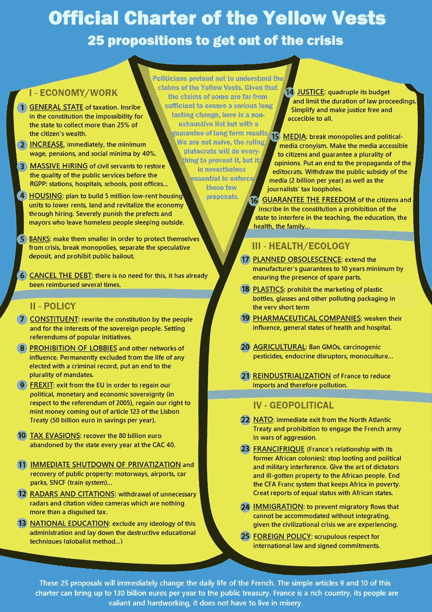
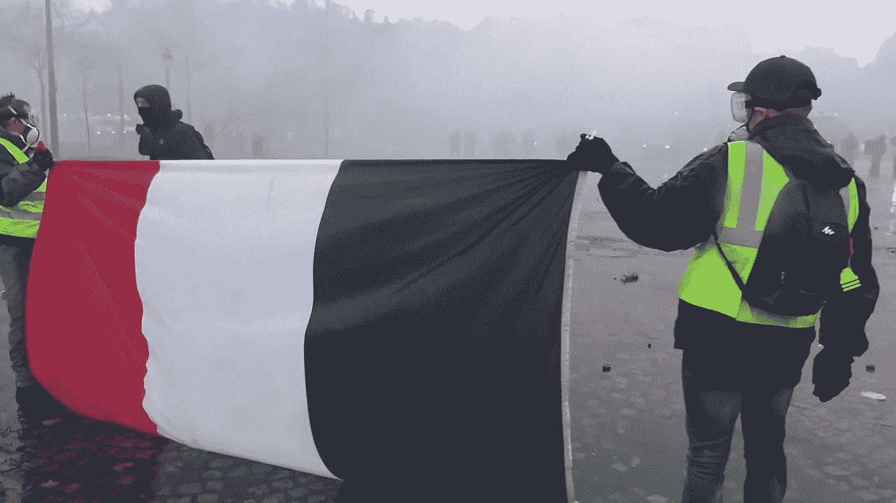
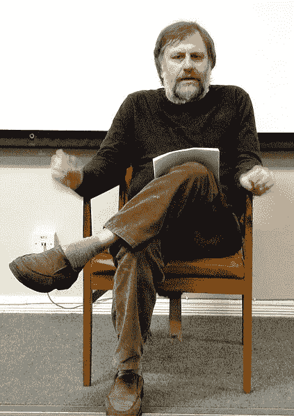

# 马克思主义:启蒙的幽灵

> 原文：<https://medium.datadriveninvestor.com/marxism-enlightenments-specter-abae85a85944?source=collection_archive---------13----------------------->

Source: [Yellow Vests of California](http://Yellow Vests of California [CA_YelllowVests].(2018, December 9). This is a fully translated "Charter of the Yellow Vests" from French to English. Do any of these points resonate with you Americans? Californians? #YellowVestProtests #YellowJackets #yellowvests #WeThePeople #QAnon #GreatAwakening #UFC231 #SeduceMeIn4Words #MinimizeASong #Grammys[Tweet].Retrieved from https://twitter.com/CA_YelllowVests/status/1071566985710907393)

## 黄背心，哲学家，系统…

> 在正在形成的政治世界中，也许在一个新的民主时代，可能会消失的是这种被称为党的组织形式的统治，即党与国家的关系，严格地说，这种关系最终只会持续两个世纪，仅仅比这长一点，这一时期也属于某些确定类型的议会和自由民主，立宪君主制，纳粹，法西斯或苏联极权主义。……现在，正如人们所预见的那样，似乎在当今世界的任何地方，党的结构不仅变得越来越令人怀疑……**而且根本不适应新的——远程技术媒体——公共空间、政治生活、民主以及他们称为**的新的代表模式(包括议会和非议会的)的条件……一场运动正在进行，我们很想将其描述为对传统国家概念的解构，从而对党和工会的解构。(德里达，《马克思的幽灵》，1994 年)

Source: [Screenshot from AdxaZz](https://www.youtube.com/watch?v=euYtLs2LthQ). (2018, December 2) Video file.

据[信息处消息](http://news.infoshop.org/europe/yellow-vests-movement-rocks-france/),[55%的人口支持的“黄背心运动震撼法兰西”](https://news.abs-cbn.com/overseas/01/06/19/frances-yellow-vest-protesters-return-to-streets)，解决主要的民众不满。乍一看，他们看起来很“革命”，通过升起三色旗，唱马赛曲，穿上新的革命制服，黄色背心，唤起了法国大革命的幽灵。黄背心提出的要求始于结束燃油税的上涨，但现在包括一个全面的计划。详情请点击 [Infoshop News](http://news.infoshop.org/europe/yellow-vests-movement-rocks-france/) ，这里有大量的链接和评论。

毫不奇怪，[**斯拉沃日·日切克**](https://en.wikipedia.org/wiki/Slavoj_%C5%BDi%C5%BEek) **，**斯洛文尼亚教授，也被称为[世界上最时髦的哲学家](https://www.telegraph.co.uk/culture/books/authorinterviews/7871302/Slavoj-Zizek-the-worlds-hippest-philosopher.html)，炫耀地参与了当前关于黄背心的辩论。事实上，当阅读德里达的“幽灵”故事时，它立即让我想起了作为马克思主义幽灵化身的日克。在以下 RT (2018 年 12 月 29 日)的视频剪辑中，有一些迹象。以下是他说的一些让我疑惑的话。举个例子，

> 他们向(黄背心)发出信号，表明我们正接近僵局。从政府开始，没有人真正知道会发生什么。解决方案不仅仅是稍微改变一下系统就能满足这些需求，这些需求是无法满足的。我们必须改变整个系统…

系统？我竖起耳朵。所以他暗指社会主义制度，当他在剪辑的最后说*“我的公式是——我不是在开玩笑——官僚社会主义”时，他欣然承认了这一点*难道我们不知道社会主义制度的失败吗？他们往往比自己承认的更加资本主义化。他们可能会成功，比如北欧国家或中国。这完全取决于经济。社会主义制度只有在拥有财政资源和良好管理的情况下才会稳定。另一方面，资本主义体系，尤其是耗尽资源或政治力量的帝国，同样容易崩溃。

在崩溃的资本主义国家，人们呼唤社会主义，在崩溃的社会主义国家，每个人都呼喊资本主义；一个永无止境的跑步机在系统之间循环运行，但最终，永远不会满足大众的需求，只会让少数人受益。正如托德可能恰当地指出的那样，*“如果二十世纪的社会主义实验教会了我们什么，那就是高层权力的变化并没有带来社会变革”*(1994 年 5 月)。

马克思主义者日克被困在“现代主义”的概念框架中，他说:

> 但是会发生什么——让我们想象一个完全疯狂的场景，不知何故，通过一些联盟，一个新的政党或什么——抗议者基本上掌权了。在现有体系中，这可能意味着危机、经济混乱等等。我认为，在这里，我们看到了需要什么。我们在不可能的需求和现有系统所能提供的之间产生了冲突。解决办法不仅仅是稍微改变一下系统，这样这些需求就能得到满足，而这些需求是无法满足的。**“我们必须逐渐改变整个系统”** —我们的整个系统，不仅是交通工具，还有生活方式。因此，这些要求中的大部分甚至不再有意义。

Jean-François Lyotard. Source: [Wikipedia](https://en.wikipedia.org/wiki/Jean-Fran%C3%A7ois_Lyotard)

在这里，他似乎在思考“系统”之外的问题。但是术语“系统”本身是加载的。在后现代语境中，“系统”散发着后现代哲学家[江泽龙·利奥塔](https://en.wikipedia.org/wiki/Jean-Fran%C3%A7ois_Lyotard)所称的传统“大故事”或元叙事(利奥塔，1993)的味道。元叙事是无所不包的抽象思想体系，如马克思主义、自由主义、弗洛伊德主义、科学主义甚至宗教信仰，它们承诺“宏大”的解决方案，如果不是从人类生存的苦难中拯救出来，也从未实现过这些方案。

这个问题把我们带回了另一位著名的后现代哲学家雅克·德里达。所以再次考虑他在这一页顶部的引用，他说，

> 现在，正如人们所预见的那样，似乎在今天的世界各地，**政党的结构不仅变得越来越可疑……而且根本不适应新的——远程技术媒体——公共空间、政治生活、民主的条件，以及他们所呼吁的新的代表模式(议会和非议会)。**

Jacques Derrida. Source: [Wikipedia](https://en.wikipedia.org/wiki/File:Derrida_main.jpg)

人们可以看到，他的方法与日克的截然不同。他期待一个超越党派政治甚至超越民族国家的政治未来。1994 年，当他的书《T4 的幽灵》(德里达，2006/1994)出版时，他已经看到了新技术迫在眉睫的作用，他称之为远程技术媒体，设想了一个将改变地球的技术连接的世界。这个世界提出了从未遇到过的独特问题，但也提供了新的解决方案。

当今社会的复杂结构的特点是向大城市的高度流动，通过社交媒体的广泛交流，同时我们发现“富人”和“穷人”之间的经济差距越来越大。这种差异导致愤怒和沮丧，正如我们在黄背心运动中看到的那样，就像我们在“黑人的命也是命”或“占领华尔街运动”中看到的那样。人们愤怒了，他们知道为什么，他们知道如何反抗！或者，正如前情境主义者 Raoul Vaneigem (2018)所说，

> 这不是一个国家的问题；它是一个国际的。我不知道法国的面孔是什么，也不知道法国是否有面孔，但这个虚构的再现的现实是男人和女人被随意剥削，数百万人完全被束缚在极权主义民主制度之下，像对待商品一样对待他们。

怎么办？像这样的事件既包含机遇，也包含危险。经常发生的是，在这个复杂的系统中会出现一个“吸引子”。叙述是不相关的；吸引子可以来自右边或左边，或者可以机会主义地假装是右边或左边。吸引子可以是一个人或一个团体，从某个特定的事件中出现。想想 1923 年慕尼黑希特勒啤酒馆政变。通过建立强大的支持，这个人或团体最终将强大到足以接管政权，这是基于在寻找“元首”的人群中感知到的生存威胁。

[今天，像法国这样的结构性动态的结果完全不可预测](http://news.infoshop.org/europe/between-the-reaction-and-the-referendum/) ( [信息处工作人员，2019](http://news.infoshop.org/europe/between-the-reaction-and-the-referendum/) )就像 1923 年一样，因为历史情况永远不会相同。没有“元叙事”能以“系统”的形式来拯救我们。因此，很难预测像黄背心这样的运动将走向何方。群众的行为和现政府的反应都是不可预测的。我们只能希望它将导致新的和创造性的解决方案，至少他们的一些合法要求将得到无论谁掌权的满足。

**文字记录:黄色背心上的斯拉沃日·日切克:**

它们表明我们正接近僵局。从政府开始，没有人真正知道会发生什么。
解决方案不仅仅是稍微改变一下系统，以满足这些需求——
这些需求无法满足。我们必须改变整个系统，
**“如何用斯拉沃日切克看新闻”** 首先要注意的是抗议者要求的矛盾性。他们希望更好地保护生态环境，但通常，他们的第一个要求是降低汽油和汽车燃料税。一个税太多了，以至于激怒了人们。他们想要更低的所得税，但是防止国家拿走超过 25%的收入。他们想要更好的医疗保健等等。
提高最低工资、养老金和社会福利
所以这是典型的民粹主义要求。
大概是真怒，怒。但是实际上，他们不知道自己想要什么，他们的要求实际上是不可能满足的。
至少在现有体制内不可能。这就是我认为这些抗议如此重要的原因。
因为我们在他们中间遇到了民众的不安和不满，我们可以说——许多人这样认为——现存制度处于最佳状态。
马克龙可能是当今机构所能提供的最佳人选:
一位优秀的银行家，一位优秀的技术专家，
马克龙迷失了自己
同时又有着某些社会民主敏感性，等等。
马克龙，辞职。黄背心将赢得
重新安装财富税
很明显，马克龙遇到了他的局限性。
马克龙迷路了
但是会发生什么——让我们想象一个完全疯狂的场景
不知何故，通过一些联盟，一个新的政党或什么——
抗议者基本上上台了。
在现有体系内，这可能意味着危机、
经济混乱等等，等等。我认为，在这里，我们看到了需要什么。我们在不可能的需求和现有系统所能提供的之间产生了冲突。
解决方案不仅仅是稍微改变一下系统就能满足这些需求
这些需求无法满足。我们必须逐渐改变整个系统，不仅是交通，还有生活方式。以至于这些需求中的大部分甚至不再有意义。
你知道我在想什么。我在某处读到过，亨利·福特，我们发明了汽车的大规模生产，当他们问他，你怎么能提供人们想要的东西。
他说了一些有智慧的话。他说:“听着，当我开始的时候，人们不想要汽车。如果你问普通人他们想要什么，他们会说，“我们想要一匹吃得少的更强壮的马，或者其他什么”。不，你必须给他们提供一些他们甚至不知道可能对他们有用的东西。这就是为什么这些抗议，这些“黄背心”是重要的。因为它们表明我们正接近僵局。系统即将达到极限。我们需要的既不是民粹主义，也不是更好的技术统治，前者只能在短期内发挥作用，后者只能在现有体系内发挥作用。我们需要有创造力的政治家，世卫组织将提出一个新的愿景来彻底改变现状。”说起来很可怕，但我认为我们需要一个开明的领导。我不相信立即民主。我会说…我会更进一步去激怒人们。我不相信在许多左翼分子中流行的东西，他们称之为“非代表直接民主”我的公式是——我不是在开玩笑——官僚社会主义。我想生活的社会是一个国家官僚机构或某种公共官僚机构的社会，它们以某种我无法理解的方式组织基本事物。不知何故，水来了，电来了，还有医疗保健等等。
我不用知道这一切是怎么运作的，我可以活在自己的小众里。我认为这就是未来，我们不应该害怕把这作为我们的座右铭。
再一次，高效的官僚主义和某种程度的异化。

**参考文献**

AdxaZz。(2018 年 12 月 2 日)。DANS 在香榭丽舍大街的战斗[视频文件]。从 https://www.youtube.com/watch?v=euYtLs2LthQ[取回](https://www.youtube.com/watch?v=euYtLs2LthQ)

德里达，J. (2006/1994)。马克思的幽灵:债务状况、哀悼工作和新国际。纽约州纽约市:劳特利奇经典公司

信息处工作人员。(2018 年 12 月 9 日)。黄背心运动震撼法国。
检索自[http://news . infoshop . org/Europe/yellow-vests-movement-rocks-France/](http://news.infoshop.org/europe/yellow-vests-movement-rocks-france/)

信息处工作人员。(2019 年 1 月 10 日)。在反动和公投之间。检索自[http://news . infoshop . org/Europe/between-the-reaction-and-the-公投/](http://news.infoshop.org/europe/between-the-reaction-and-the-referendum/)

新杂志 littéraire。(2018 年 12 月 11 日)。关于“黄背心”:一切皆有可能，甚至是在十字路口、村庄和社区中间的自我管理集会。劳尔·范内格姆访谈。从 http://www.notbored.org/yellow-vests.pdf[检索](http://www.notbored.org/yellow-vests.pdf)

利奥塔(1993 年)。后现代状况:关于知识的报告(9。印刷。由…编辑).明尼阿波利斯:明尼苏达大学出版社。

t .梅(1994 年)。后结构主义无政府主义的政治哲学。宾夕法尼亚大学公园:宾夕法尼亚州立大学出版社

RT.(2018 年 12 月 29 日)。穿着黄色背心的斯拉沃热·齐泽克。如何看新闻，第一集【视频文件】。从[https://www.youtube.com/watch?v=TrdPchnAR60&t = 69s](https://www.youtube.com/watch?v=TrdPchnAR60&t=69s)取回

加州黄背心。(2018 年 12 月 9 日)。这是一个完整的翻译“黄背心宪章”从法语到英语。这些观点有没有引起你们美国人的共鸣？加州人？
# yellow vest 抗议# yellow jackets # yellow vests # WeThePeople # QA non # great awakening # ufc 231 # seduce mein 4 words # minimize asong # Grammys[Tweet]。检索自
[https://Twitter . com/CA _ yellow vests/status/1071566985710907393](https://twitter.com/CA_YelllowVests/status/1071566985710907393)