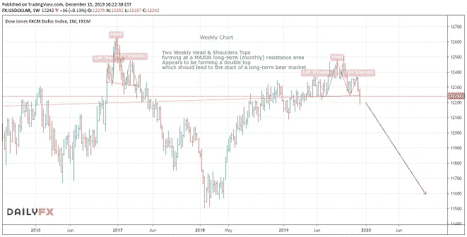

# 巨大的贸易机会正在到来

> 原文：<https://medium.datadriveninvestor.com/massive-trading-opportunity-on-the-way-728528054c72?source=collection_archive---------32----------------------->

**本周一周贸易:*美元短期(长期)***

在过去一个月左右的时间里，我一直在谈论在即将到来的大选之前买入英镑的机会。在那之前，我在电子邮件和博客上多次写了购买英镑的事情。在两周前的这篇文章中，我甚至解释了图表是如何清楚地指向强大的保守派多数派[。](https://mangrovetrading.krtra.com/c/EopCk3rXt79c/kOJV)

上周，英国保守党确实获得了绝对多数席位，这导致英镑汇率飙升。事实是，虽然这一天的波动很大，但英镑在过去几个月里一直在升值。我希望你能够从过去两个月英镑的走势中获得一些收益，我在这里分享的信息也是有用的。请务必让我知道。

 [## 总部位于瑞士的 ETP 进入加密交易市场|数据驱动的投资者

### 虽然金融市场几乎没有沉闷的时刻，特别是在引入…

www.datadriveninvestor.com](https://www.datadriveninvestor.com/2019/03/10/swiss-based-etp-enters-the-crypto-trading-market/) 

随着大选的结束，人们的注意力将从英镑上转移，但我相信英镑将继续保持强势。

就现在的机会而言，我将把注意力转回到美元上。

几周前，我写了一篇关于世界储备货币主要顶部形成的文章。这是一个长期的顶部，因此需要一些时间来形成和完成。在我第一次让你们注意到这一点之后，出现了一些捏造和不确定性，但是情况变得越来越清楚了。

我想重申的是，这是一个长期的机会，在这个过程中会有很多波动。但是，如果你能从大局出发，耐心持仓，这将是一个巨大的获利机会。

我将寻求建立美元兑英镑、加元和日元等货币以及可能的贵金属的长期空头头寸。后两者需要更多的时间，但我已经有一个(长期)GBPUSD 头寸，现在将增加一个美元兑加元的空头。

我还将寻找短期机会，买入高风险/高回报的美元空头。一旦我们确定了一个大的动作，就有很多机会投入并尽可能长时间地运行，所以要有耐心，等待完美的设置。

我试图在一周交易中关注长期交易，这样即使你在我的学生之后收到它们，也许没有立即看到分析，你仍然有机会从我分享的观点中获利。

你想学习如何从市场中持续获利吗？ [*点击这里*](https://go.mangrovetrading.com/freetraining) *，我们将通过一系列免费的培训视频带你一步步了解我们的整个交易策略。*