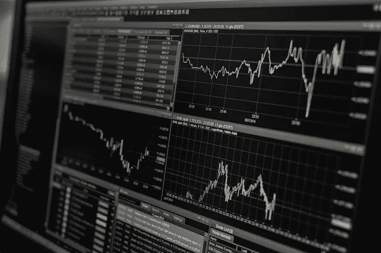
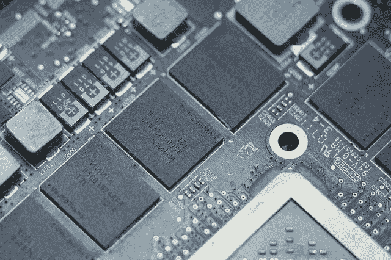

# 大规模并行蒙特卡罗模拟

> 原文：<https://medium.datadriveninvestor.com/massively-parallel-monte-carlo-simulation-7e295d0c7aac?source=collection_archive---------5----------------------->

**简介**

Simulation

蒙特卡罗模拟模拟了不同可能性的概率和涉及随机变量的情况。他们习惯于了解风险和不确定性的影响。可以在这些模拟中添加预测和预报模型。这些用于处理与金融、工程、供应链和科学相关的真实场景。

蒙特卡洛模拟器用于分析 10，000 种不同的可能的未来情景。蒙特卡洛模拟不准确，因为它不包括真实世界的事件。蒙特卡洛模拟器无法模拟市场崩溃、公司特定事件、政治意外和意外加息。它们可用于评估下行风险和上行潜力的计划。

Gaming Club

蒙特卡洛方法是以摩纳哥赌博俱乐部的名字命名的。这个名字与赌博游戏有关，如轮盘赌、骰子和吃角子老虎机。这种方法是斯坦尼斯瓦夫·乌拉姆发明的。他是一名从事曼哈顿计划的数学家。他介绍了他的纸牌游戏的结果，分布和约翰·冯·诺依曼获胜的概率。他们想出了蒙特卡洛模拟法。

**蒙特卡洛模拟**

在诸如美式期权、欧式期权、亚式期权、回望期权和百慕大式期权等期权的金融建模中，使用蒙特卡罗模拟。随机变量是资产价格、执行价格、内在价值、波动性、利率、支付的股息、时间价值、货币波动和到期时间。影响商品价格、通货膨胀和多种基础资产之间模拟相关性的参数。

使用正态分布，该模拟可在数学上总结为:

***【价格(t+1) =价格(t) *Pow( e，(漂移+随机))***

其中 ***漂移=平均资产价格—(方差/2)*** 和

随机值是 ***(标准差*正态逆)和***
正态逆，是正态分布的逆。

为了概括这种分布，我们可以用 P(x)作为频率分布或密度函数 q(x)来建模。
假设有一个概率频率分布为 P(x)的实值函数 h(X)(如果 X 是离散的)，或概率密度函数 q(x)(如果 X 是连续的)。h(X)的期望值为:

***E(h(X))=σh(X)P(X)其中 P(X) > 0 且σP(X)= 1***

h(x)的平均值为:

***(1/N)σh(Xi)***其中 I 从 1 和 N 开始

在模拟中，1 至 25 年的投资期限、下跌的最低资产价格和上涨的资产价格是典型用户的输入。蒙特卡洛模拟模拟股票指数投资组合的风险中性样本路径和一揽子看跌期权的价格。不同的定价模型会对基于看跌期权的资产价格产生影响。

这些模拟通过对相应的参数进行少量修改，并使用名为“碰撞”的方法重复模拟，来计算参数变化时交易组合的敏感度。牛津大学的 Mike Giles 和哥伦比亚大学的 Paul Glasserman 分别提出了碰撞路径导数法。这种方法依赖于计算量很大的数学微分函数，例如导数。

早在 1966 年，伯恩斯坦就提出了管理退休投资组合的蒙特卡罗方法，通过分析大盘股、小盘股和 5 年期美国国债的不同组合。他的方法中加入了财务失败可能性的固定百分比增长和每年资产的百分比预测，以使退休投资组合策略更加现实。

信用违约和信用评级的风险管理模拟使用蒙特卡罗方法。使用的参数是违约概率、风险、损失、因子、特质权重和因子相关性。这些模拟呈现了投资组合和交易方级别的损失分布。它们可用于模拟各方信用评级的变化。

用于模拟的参数是迁移值、评级、转移概率、违约损失、因子、特殊权重。

**大规模并行模拟**

GPU

蒙特卡洛模拟中使用并行随机数发生器。L'Ecuyer 和 Sobol 的随机发生器用于大规模并行模拟。在数学导数函数中用精度换取速度需要并行执行环境。基于 GPU 的计算机提供单指令和多数据架构来执行大规模并行蒙特卡罗模拟。

为了模拟债券投资组合并使用 52 个时间步骤计算 90%的风险价值，可以在基于 GPU 的环境中使用蒙特卡罗方法来获得大量试验的结果。模拟使用投资组合资产的随机微分方程。并行化机制有助于计算数据容器的路径来保存信息。CUDA 之类的低级内核非常有效，提供了灵活性。在这个内核中，变量从 CPU 内存复制到 GPU 内存。内核中的每个线程块执行一组模拟。在线程块中，单个线程用于模拟一个资产。GPU 的每个线程块的全局内存都被复制到共享内存中。所有块的线程都模拟一条路径。每个线程都将其资产加载到内存中。这些优化有助于减少内核中模拟所需的时间。

彭博和摩根大通采用了 GPU，基于 GPU 的环境提供了高性能、经济高效且节能的解决方案。金、蔡、陆、吴、施和常为投资者和交易者发明了实时定价系统。该系统用于通过交易策略进行套利和套期保值。根据 Murex 的模拟，速度要快 60-250 倍。SciComp 在实验室中执行蒙特卡罗模拟的速度提高了 7-300 倍。Quantifi Solutions 宣布模拟可以快 100 倍。

Quantum Physics

可用于模拟的经典蒙特卡罗方法有随机波动率、跳跃扩散、赫尔-怀特、希斯-贾罗-默顿、多维(布莱克-斯科尔斯)对数正态、局部波动率、跳跃扩散、结构性、相关违约和伦敦银行同业拆借利率市场模型。量子蒙特卡罗方法有变分量子蒙特卡罗、扩散量子蒙特卡罗、路径积分 QMC 和典型 QMC 计算。路径积分蒙特卡罗量子方法将概率分布建模为:

***п(S)= Cexp {—∑(St-St-1)2/4λτ-τV(St)}***

其中 St 是路径，它在时间变量 0≤t≤β=1/(kBT)中是循环的，因此 R0=Rβ

利用大规模并行性的量子蒙特卡罗算法可以消耗较少的计算能力输出高精度的结果。将量子行走与已知的经典蒙特卡罗技术一起使用也提供了执行的加速。这些算法并不是所有高维积分的完整解决方案。量子蒙特卡罗方法仍然是一个卓有成效的研究领域。交易领域的大规模并行蒙特卡罗模拟将继续使用基于 GPU 的环境与不断发展的量子蒙特卡罗方法相结合。

**参考文献**

1.  [NIST 邮政量子密码项目](https://csrc.nist.gov/Projects/Post-Quantum-Cryptography)
2.  [蒙特卡罗方法的量子加速](https://royalsocietypublishing.org/doi/abs/10.1098/rspa.2015.0301)
3.  [欧洲电信标准协会量子安全密码术](https://www.etsi.org/technologies-clusters/technologies/quantum-safe-cryptography)
4.  [MonteCarlo Quant 开源项目](https://github.com/bhagvank/Montecarlo_Quant)