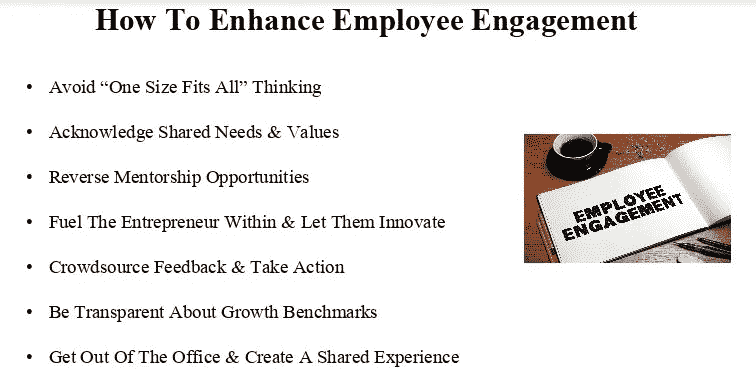

# 掌握领导的技巧和诀窍

> 原文：<https://medium.datadriveninvestor.com/master-the-tips-and-tricks-of-leadership-7d74754832a3?source=collection_archive---------1----------------------->

## 科技的作用越来越大，创造了一个工人社区

在今天这个科技发达的工作场所，你可能很难亲自见到你的团队成员。队友可能在不同的城镇、州或国家。

[艾丽莎·卡彭特](https://twitter.com/NotOkThatsOk/)已经看到了变化。她是千禧一代的劳动力专家、顾问和演讲者。作为《T4》杂志的撰稿人，卡彭特被认为是千禧一代的教练和团队建设专家。

她与千禧一代的领军人物、LinkedIn 排名前 20 的千禧一代营销和品牌策略师切尔西·克罗斯特(Chelsea Krost)讨论了领导技巧和诀窍。

“工作不再是一个物理位置，”卡彭特说。“人们都在为同一个项目努力。我们需要使用技术来创建社区，并引出团队合作和协作的文化。

“这些空间需要 facetime 功能，”她说。“他们为你的主管和团队提供了开放办公时间的机会。利用这些空间举行会议和作为分组讨论室。在这里，你可以享受非正式的‘快乐时光’，或者跟踪一个项目或想法的进展。”

所有这些解决方案都依赖于正确的技术。

“有这么多远程团队，”卡彭特说。“通过正确使用技术，我们可以将人们聚集在一起。我非常支持视频聊天，希望能有更多的面对面交流时间。”

Krost 列举了技术优势和工具:

*   得益于 [Skype](https://twitter.com/Skype/) 和 [Zoom](https://twitter.com/Zoom/) ，远程连接。
*   借助 [Google Drive](https://www.google.com/drive/) 等系统，同时协作处理文档。再见，不必要的来回邮件。
*   借助社交媒体，快速提问和接收问题及反馈。

这些通信工具加强了合作。

“协作和团队合作始于信任，”卡彭特说。“信任你的员工、团队、经理和技术。无论你在组织中处于什么位置，你都有能力与团队合作并信任团队。

她说:“事情可以很简单，比如向另一个团队的人寻求反馈，从另一个部门给你的团队带来一个新成员，或者创建基于项目的团队。”"创造一种人们重视跨职能领域工作的文化，并树立榜样."

# 询问偏好

不要假设你知道哪种沟通方式最有效。和你的工人一起检查。

“问问人们喜欢如何交流，这样你们就能达成共识，”卡彭特说。“有了技术，我们可以进行虚拟的面对面交流。

“从小处着手，经常练习，”她说。“与你的上司开诚布公地交流。安排一对一的时间。”

Krost 解释了团队合作如何解决问题。

“有问题需要解决吗？将员工聚集在一起，分享如何应对挑战的想法，”她说。“使用协作作为解决方案。”

工作场所存在潜在的代沟，员工的年龄跨度很大。然而，他们都是有传统满足需求的人。从想要善待每一个人开始。

“我们在工作场所有五代人，”卡彭特说。“这可能很难，但重要的是要提问并了解人们的个性。询问他们喜欢如何沟通，他们喜欢如何寻求表扬，以及作为经理他们需要从你这里得到什么。

“归根结底，人就是人，”她说。“花点时间去了解你在职能部门内外的同事。我非常喜欢找出优势来创建团队，并找出可能缺少的领域。”

# 提及导师

这就是导师进入画面的地方。

克罗斯特说:“通过实施反向导师制来弥合差距。”“老一代人可以教给年轻员工新的策略。年轻一代——比如千禧一代——可以向年长员工展示如何以更高效的技术手段完成任务。”

卡彭特和克罗斯特有他们最喜欢的团队建设练习。

“我喜欢棉花糖挑战和分组讨论室，”卡彭特说。“这两种方式都能让人们开始谈论，让你稍稍走出自己的舒适区。

“使用 [CliftonStrengths 评估](https://www.gallupstrengthscenter.com/)来识别人们的才能和优势，”她说。"然后就团队中潜在的差距和他们擅长的地方进行真正的对话."

# 计划你的逃跑

克罗斯特更喜欢实际突破。

“最近很流行的一种*有趣的*团队建设练习正在逃离房间，”她说。“我喜欢这种协作。”

通过与员工保持联系，向他们展示他们是团队的重要组成部分，让他们参与到工作中来。他们将知道自己的角色以及如何为每个人的成功做出贡献。

卡彭特说:“就他们对主管、职业发展和工作环境的要求展开公开对话。”。“当我们停止假设，提出尖锐的问题时，我们就能了解员工想要什么，并做出真正的改变。”

克罗斯特列举了她让员工在工作场所保持敬业的最佳方法:

如果你的老板或经理不愿意合作或改变，更新你的简历。你没有一辈子痛苦的承诺。

“对许多人来说，改变可能很难，”卡彭特说。“有时，如果你要求他们分享信息，他们会觉得自己的工作受到了威胁。

“许多公司正在转向一种薪酬文化，在这种文化中，你会因为与他人合作而获得回报，”她说。“这可以帮助解决其中的一些问题。”

不要试图同时做所有的事情。

“从小处着手，”卡彭特说。“不要指望人们会在一夜之间改变他们一直以来的工作方式。询问您和您的团队成功完成项目所需的信息。然后向他们展示积极的成果，感谢他们的合作。

“如果你的老板或经理能够看到他们的行动和团队成功的量化收益，他们将更有可能合作和分享信息，”她说。“人真的是公司最大的资产。这是我经常告诉我的客户的。”

# Tap 大使

伟大的领导者可以授权员工成为品牌大使和影响者。

一个好的工作场所会激发员工谈论你的品牌和服务。善待他们，他们也会善待你。

“这一切都始于积极的体验，”卡彭特说。“当员工热爱自己的工作、工作地点和同事时，他们就是你最大的拥护者。

“你的敬业员工将帮助你招聘、销售你的产品或服务，并将你的公司带上一个新台阶，”她说。"他们是这个组织的核心和灵魂。"

利用员工的社交倾向。

“从要求你的员工在他们的个人社交账户上发帖开始，并与他们的网络分享他们的积极经验，”卡彭特说。

克罗斯特说，成为品牌大使应该是有回报的。

“允许员工参与内容创作，”她说。“让他们发挥创造力，分享他们的声音。

“让它成为一次有趣的经历，”克罗斯特说。"实施一项带有大奖的活动或内容挑战，创造刺激并鼓励参与."

对于领导力和团队合作的灵感，卡彭特有她最喜欢的名言:

“如果每个人都在一起前进，那么成功就会自然而然地到来。”— [亨利·福特](https://www.brainyquote.com/quotes/henry_ford_384400)

“当你需要创新时，你需要协作。”— [玛丽莎·梅耶尔](https://www.brainyquote.com/quotes/marissa_mayer_746990)

**关于作者**

吉姆·卡扎曼是拉戈金融服务公司的经理，曾在空军和联邦政府的公共事务部门工作。你可以在[推特](https://twitter.com/JKatzaman)、[脸书](https://www.facebook.com/jim.katzaman)和[领英](https://www.linkedin.com/in/jim-katzaman-33641b21/)上和他联系。