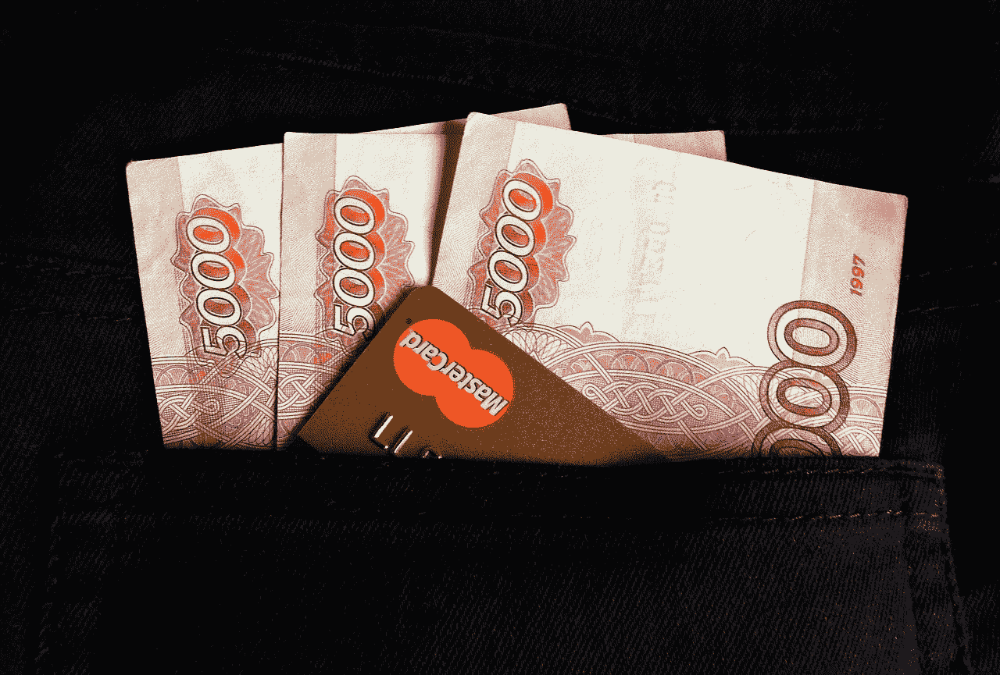
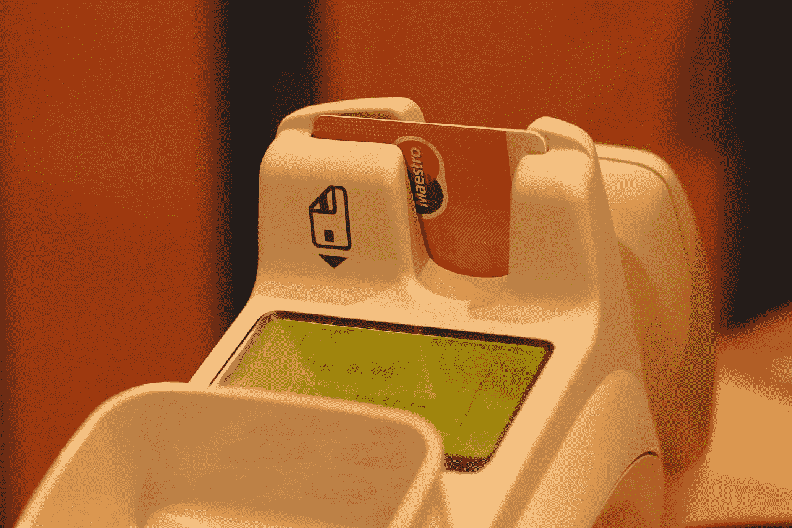

# 万事达卡(MA)杀签名，是好的投资吗？

> 原文：<https://medium.datadriveninvestor.com/mastercard-ma-kills-signatures-is-it-a-good-investment-82caf5cc69b5?source=collection_archive---------55----------------------->

明年，签署万事达信用卡(MA)将成为过去。**万事达卡(纽约证券交易所代码:MA)** 将使其网络上的所有购物都可以选择签名。

万事达卡计划在 2019 年 4 月取消签名。值得注意的是，在那个日期之后制造的万事达卡将不再有签名板，一份新闻稿[指出](https://newsroom.mastercard.com/press-releases/signing-off-mastercard-moves-beyond-signatures-worldwide/)。相反，签名面板将是可选的。

取消签名并不是一个很大的改变，因为 40%的美国人承认他们从未在卡片背面签名。在这种情况下，商家和金融机构将决定是否需要签名。

**为什么万事达不喜欢签名**

新闻稿称，EMV 芯片、先进的欺诈管理技术和万事达卡(MasterCard)的零责任保险相结合，使签名变得不必要。此外，越来越多的手机钱包使用个人识别号码(pin)，指纹扫描和面部识别技术，使签名变得多余。

此外，像 [Fingopay](https://fingopay.com/) 这样更先进的技术正在进入市场。例如，FingoPay 使用日立 VeinID 技术来允许支付。

为了解释，VeinID 用红外线扫描你手指内的静脉。如果静脉与存储在基于云的匹配系统中的模式相匹配，Fingopay 就会付款。Fingopay 正在欧洲的几所大学和伦敦的骄傲酒吧进行测试。

**万事达卡(MA)拥有技术先进的支付平台**

万事达卡的行动毁灭了签名，因为 2018 年第二季度全球共有 6.18 亿张万事达卡(MA)信用卡。此外，Statista [估计](https://www.statista.com/statistics/618137/number-of-mastercard-credit-cards-worldwide-by-region/)美国有 218 张万事达信用卡。

缺少签名表明**万事达卡**拥有世界上最大和最先进的支付平台之一。例如，万事达卡声称其支付网络服务于 2010 个国家。

不幸的是，我无法知道第二张万事达卡的网络处理了多少笔交易。另一方面， **Visa (NYSE: V)** 号称每秒处理 24000 笔交易。

因此，可以有把握地假设万事达卡每秒处理约 24，000 笔交易。我之所以得出这个结论，是因为万事达卡和维萨卡可能使用了功能相似的技术。

**为什么万事达卡(MA)优于加密货币**

因此，万事达卡的网络比任何已知的加密货币都要快得多。详细来说， **Ripple (XRP)** ，交易量最高的加密货币，据报道每秒处理 1500 笔交易，[声称](https://howmuch.net/articles/crypto-transaction-speeds-compared)多少。

注意:这个数字可能是指 RippleNet 或 Ripple 的[汇款通道](https://marketmadhouse.com/ripple-building-worldwide-cryptocurrency-remittance-network/)而不是 Ripple 的货币。具体来说，RippleNet 是 Ripple 背后的组织正在建设的一个全球支付网络。目前，RippleNet 的主要业务是在国家之间传送汇款。

相比之下，**比特币(BTC)** 每秒仅处理 7 笔交易，**以太坊(ETH)** 每秒仅处理 20 笔交易。显然，有多少人估计 PayPal(纳斯达克股票代码:PYPL)的网络每秒有 1500 笔交易。

每秒事务数(TPS)至关重要，因为它决定了有多少人可以使用网络。例如，比特币一次只能服务七个客户，这不是一个大众市场。在这种情况下，**比特币(BTC)** 无法处理大型杂货店的支付。

**万事达卡(马)赚钱了吗？**

万事达卡(MA) 有一个令人印象深刻的支付平台，但它赚钱吗？答案是肯定的。

例如，万事达卡报告的毛利为 36.5 亿美元，相当于 2018 年 6 月 30 日的收入 36.5 亿美元。因此，万事达卡在 2018 年第二季度实现了 100%的毛利率。此外，万事达卡报告 2018 年第二季度营业收入为 19.36 亿美元，净收入为 15.69 亿美元。

这导致 2018 年第二季度的运营现金流为 14.80 亿美元，自由现金流为 13.64 亿美元。如果这些数字是正确的，万事达卡从其交易中产生了大量现金。

重要的是，万事达卡在银行里有很多钱。例如，万事达卡在 2018 年 6 月 30 日记录了 77.45 亿美元的现金和短期投资。因此，万事达保留了所有这些交易的大量利润。

**万事达卡(MA)是一只分红很高的股票**

这对万事达卡(纽约证券交易所代码:MA)的股东来说是一个好消息，他们在 2018 年 10 月 20 日享受了 0.49%的股息收益率，年化支付 1 美元，支付率为 15.6%。万事达卡股东将于 2018 年 11 月 9 日享受 25 英镑的现金红利。

在过去的六年里，万事达卡支付了越来越多的股息。I 股息和 100%的毛利使得万事达卡在 2018 年 10 月 23 日被低估为每股 202.43 美元。

如果你正在寻找一个收入股，万事达卡就是其中之一。该公司提供利润丰厚的业务和丰厚的股息。