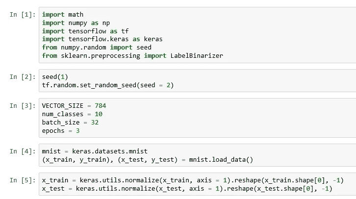
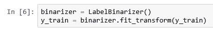
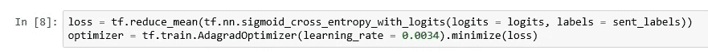
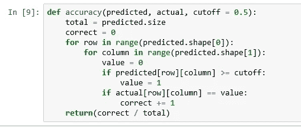
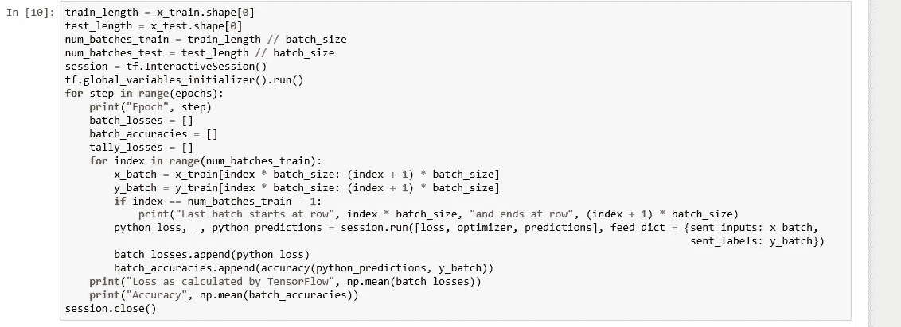
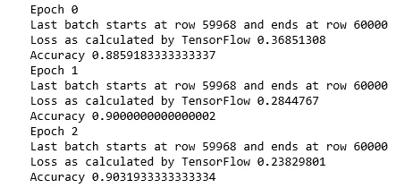
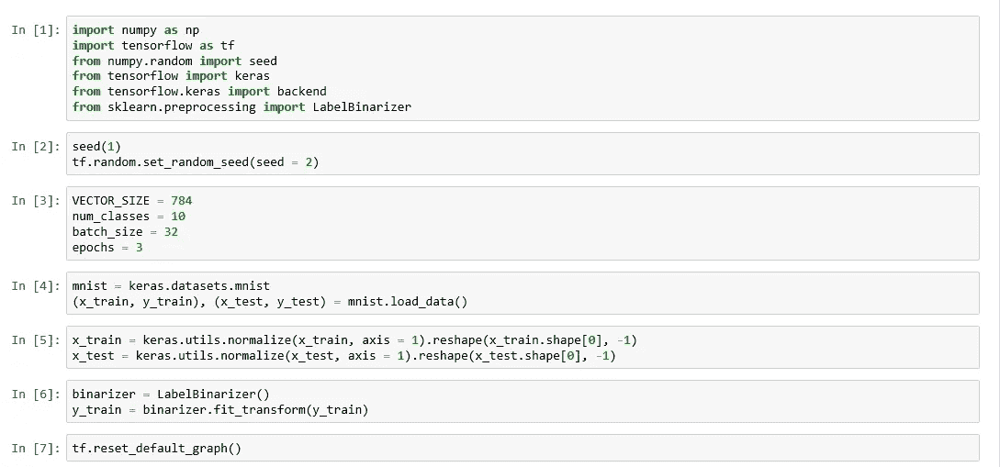
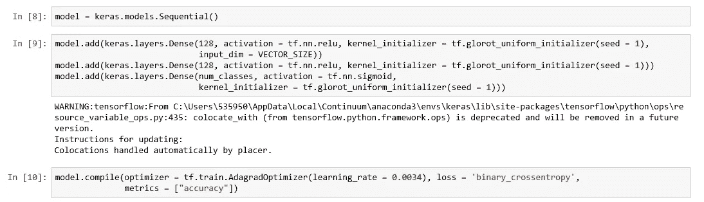
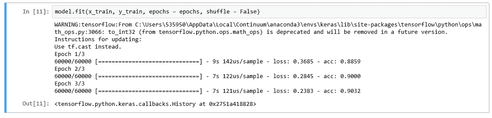

# 匹配张量流和 Keras: Sigmoid

> 原文：<https://medium.datadriveninvestor.com/match-tensorflow-and-keras-sigmoid-64732a96cdc0?source=collection_archive---------6----------------------->

Photo by [Héctor J. Rivas](https://unsplash.com/@hjrc33?utm_source=medium&utm_medium=referral) on [Unsplash](https://unsplash.com?utm_source=medium&utm_medium=referral)

对于同一个神经网络，无论是用 TensorFlow 还是用 Keras 来实现你的网络，你都应该得到相同的结果。我们在我之前的[文章](https://medium.com/@amareshp72/match-tensorflow-results-and-keras-results-ccbf80f2f68f)中看到了这一点。我们在最后一层使用 softmax 作为激活函数，并在 TensorFlow 中使用相应的稀疏 softmax 交叉熵损失函数，在 Keras 中使用稀疏分类交叉熵损失函数。这是您在使用单标签分类时通常会做的事情，即一行数据只能被分类到一个标签中。MNIST 数据集就是这种情况，一个手写数字只能是十个数字中的一个。

然而，在某些情况下，一行数据可以同时归入多个标签，我们称之为多标签情况。如果我们正在处理一个多标签用例，我们通常使用 sigmoid 作为输出层的激活函数。对应的损失函数是张量流中的 sigmoid 交叉熵和 Keras 中的二元交叉熵。在本文中，我们将使用 sigmoid 激活函数和相应的损失函数，并比较 TensorFlow 和 Keras 之间的结果。虽然在理想情况下，我应该采用具有多标签分类的用例，但为了保持连续性，我将使用 MNIST 的例子，这些概念也适用于另一个用例。这篇文章是我上一篇文章的延续，所以请先浏览一下我上一篇文章。

 [## DDI 编辑推荐:5 本机器学习书籍，让你从新手变成数据驱动专家…

### 机器学习行业的蓬勃发展重新引起了人们对人工智能的兴趣

www.datadriveninvestor.com](https://www.datadriveninvestor.com/2019/03/03/editors-pick-5-machine-learning-books/) 

让我们先写张量流代码。笔记本中的前五个单元格是基于我以前的文章。

Initialize and get data

Binarize

由于每个数据行可能有多个标签，我们将对输入进行二进制化，以便在二进制化的数据中每行可能有多个 1。

我们现在将构建网络。注意，由于二进制化，与我的上一篇文章相比，标签的占位符现在具有不同的尺寸。另外，请注意，我们现在已经将激活函数更改为 sigmoid。

Build the network

现在计算损失并创建优化器。注意现在有一个不同的损失函数。

Loss and optimizer

Accuracy

考虑到标签现在被二进制化并被馈送到网络，精度的计算也将不同。

现在运行网络。

Run network

Output

这是输出。

现在让我们用 Keras 编写等价的代码。前七个单元格要么是我以前的文章，要么是本文的张量流代码部分。

Initialize and get data

建立模型。注意最后一层的激活函数和编译时的损失函数。

Build and compile the model

符合模型。将损失和精度值与张量流代码的输出进行比较。除了舍入之外，这些值都匹配。

