# 匹配张量流结果和 Keras 结果

> 原文：<https://medium.datadriveninvestor.com/match-tensorflow-results-and-keras-results-ccbf80f2f68f?source=collection_archive---------9----------------------->

你用 TensorFlow 和 Keras 这样的库来实现你的神经网络。理想情况下，您的结果应该取决于您的网络，而不是您用来实现网络的库。实际上，情况就是这样，尽管在许多情况下，由于实现的特殊性，您最终会从两个流行的库获得不同的结果。在本文中，我们将使用这两个库实现一个简单的网络，并处理实现细节以获得相同的结果。

相同的结果也必须是可重复的结果。因此，我们将播种各种随机化输入，以便您每次运行它们时都能得到相同的结果。当你调试你的代码时，你可以像这样使用种子，否则让随机性保持下去是好的。在我之前的[文章](https://medium.com/datadriveninvestor/getting-reproducible-results-in-tensorflow-3705536aa185)中，我解释了 TensorFlow 代码，每次运行它都会给出可重复的结果。

 [## DDI 编辑推荐:5 本机器学习书籍，让你从新手变成数据驱动专家…

### 机器学习行业的蓬勃发展重新引起了人们对人工智能的兴趣

www.datadriveninvestor.com](https://www.datadriveninvestor.com/2019/03/03/editors-pick-5-machine-learning-books/) 

在这里，我将提供相同网络的 Keras 代码和数据，它们给出的结果不仅是可重复的，而且与 TensorFlow 的结果一致。我在这里使用 Keras 的 TensorFlow 实现(你可以称之为 tf.keras)。请浏览我以前的文章，那是这篇文章的先决条件。

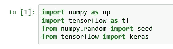

Import libraries

导入必要的库。

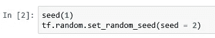

Seed libraries

种子 numpy 和 TensorFlow。

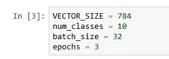

Initialize variables

正如我们在上一篇文章中所做的那样初始化变量。

加载 Keras 中提供的 MNIST 数据。

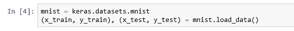

Load data

按照上一篇文章中的做法，对数据进行规范化和整形。

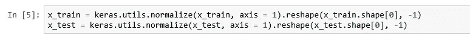

Normalize and reshape

重置默认张量流图。在喀拉斯，你通常不会这么做。但是您在这里这样做是为了使随机化与前一篇文章的基本张量流代码保持一致。

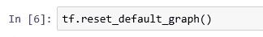

Reset graph

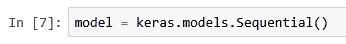

Create model

创建一个 Keras 序列模型。

向模型添加层。Keras 模型不需要初始化。但是，我们将在这里使用初始化参数，以便提供的种子与我们在上一篇文章中为基本张量流代码提供的种子相匹配。

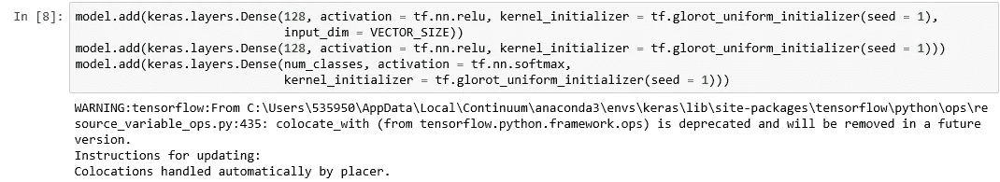

Adding layers

编译模型。请注意，我们使用的是与我上一篇文章中相同的优化器，具有相同的学习速率和等价的损失函数。

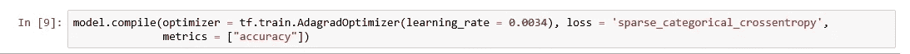

Compile the model

使用训练数据拟合模型。请注意，默认情况下，Keras 会在训练期间打乱数据。为了使我们的结果与基本张量流匹配，我们明确地不洗牌。

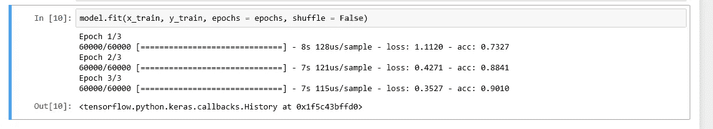

Fit the model

就是这样！我提供了前一篇文章的最后一张图片进行比较，你可以看到每个时期的损失和准确性匹配，除了四舍五入。

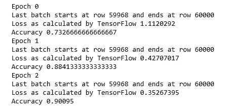

TensorFlow results