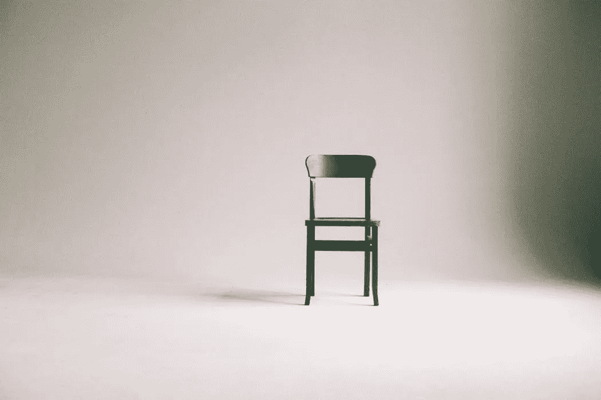

# 最大化与最小化--变得有条理的好处。

> 原文：<https://medium.datadriveninvestor.com/maximalism-vs-minimalism-benefits-of-getting-organized-7efc222dfe3?source=collection_archive---------16----------------------->

环顾四周。观察。注意你周围有哪些你不需要的东西。

我们都面临着周围有不必要的东西的问题，这分散了我们做重要工作的注意力。

我们不仅会分心，还会自掏腰包买这些东西。所以，我们付钱是为了分散注意力吗？

# 俄国多数派成员

> “最大化主义者是把不必要的事情放在首位的人。”

如果你是一个最大化主义者，你倾向于购买你不需要的东西。你把不健康的优先权放在物质上。你总是希望拥有别人拥有的东西。

一个最大化主义者不明白的是，他在花钱买会让他分心的东西。它会占用物理空间，如果他不需要它，它不会给他的生活增加任何价值。

> ***“物质的东西很可能用不了几天就会被扔掉，因为它们是贪婪而不是根据需要购买的。”***

最大化主义者把钱花在他们不需要的东西上，用获得的物理空间分散他们的注意力。

# 最低限要求者

> ***“极简主义者明白自己的需求是什么，并购买真正需要的东西。”***

极简主义者理解需求和欲望的区别，只买他真正需要的东西。他在生活中不喜欢杂乱无章，而且非常有条理。

他享受更多的物理空间，不容易分心。

极简主义者还有许多其他优势:

# 1.提高生产率

生产力可以定义为在特定时间内可以完成的工作量。极简主义者遵循“少即是多”的理念，试图限制他获得的东西的数量。这使他专注于他的重要工作，并提高生产力。

# 2.不被过去束缚

有了最少的东西，你就不会被过去束缚。你没有被强迫去不断地回忆那些与你前任送给你的几样东西有关的糟糕记忆。把它扔掉，你就不会有任何杂物了。

# 3.越少越好

你知道 80/20 法则吗？*我们只需要 20%的东西就能完成 80%的工作*。剩下的 80%用于完成我们 20%的工作。分析你根本不需要的东西然后扔掉或者送给需要的人。

# 4.你不那么心烦意乱

当你拥有的东西越少，你就越不会分心。如果你只有一部手机，你可能会因为通知而分心几次。如果你有两个，分心的次数会是两次。

用手表代替手机看时间。这会节省很多时间，你也不会分心。

# 5.你关注健康和爱好

当你不那么分心时，你会按时完成工作，最终有更多的时间关注自己。你会开始有更多的时间去关注生活中重要的事情，比如你的健康和爱好。你将能够给你的家人更多的时间。

# 6.你很有条理，也很快乐

有了更少的东西和更少的干扰，你会倾向于保持你的东西有条理，并在你需要的时候及时找到它们。如果你没有条理的话，你就不会那么讨厌花比平时更长的时间去寻找东西。

如果您对个人理财和资金管理有任何疑问，我希望收到您的来信。

**感谢阅读。如果你喜欢这篇文章，请随意点击那个按钮👏帮助其他人找到它。**

# 然后..

 [## 你破产的 10 个原因

### 当我们没钱、没有目标、没有抱负，甚至破产时，我们都会面临这种情况。

medium.com](https://medium.com/@abhilashgupta8149/10-reasons-you-are-broke-b6d442238965) 

*原载于* [*FinCalC 博客*](https://fincalc-blog.blogspot.com/2018/10/maximalism-vs-minimalism-benefits-of-getting-organized-fincalc.html)