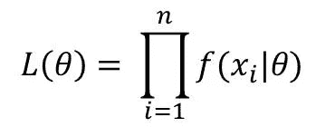
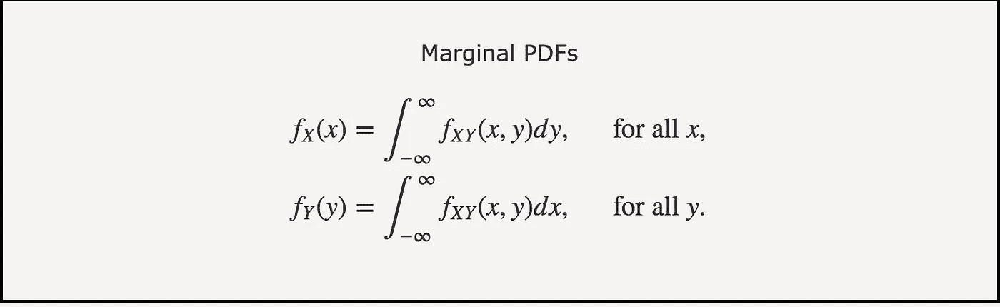
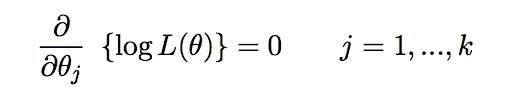
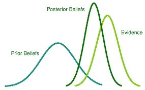
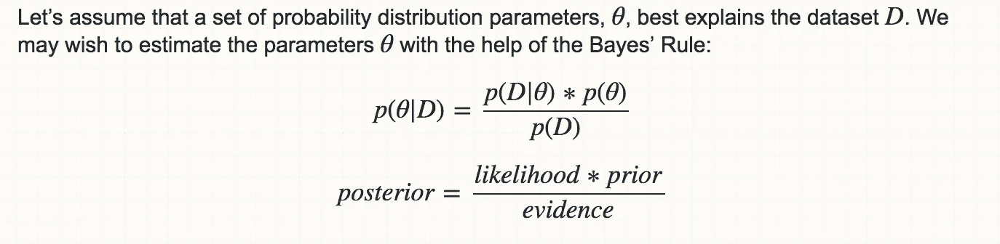

# 最大似然估计与贝叶斯估计

> 原文：<https://medium.datadriveninvestor.com/maximum-likelihood-estimation-v-s-bayesian-estimation-bfac171a8b85?source=collection_archive---------1----------------------->

# 机器学习中为什么要进行参数估计？

一个系数描述了相应自变量的贡献的**权重。具体来说，接近零的系数表示自变量对响应的影响很小。**

术语**参数估计**是指利用样本数据**估计**选定分布**的**参数**以最小化代价函数的过程。有两种典型的估计方法:贝叶斯估计和最大似然估计。**

# 最大似然估计

## 似然函数

给定观测值，MLE 试图估计使似然函数最大化的参数。似然函数的公式是:

if every predictor is i.i.d

如果某些预测因子内部存在联合概率，直接将联合分布概率密度函数代入似然函数，将所有自变量的密度函数相乘。因为对于线性自变量 X，Y: f(X，Y)=f(X)f(Y)。

此外，值得从联合分布密度函数中了解边际函数:

然后，对似然函数取对数，对相应的参数逐一取偏导数并置等于零。

**对数似然函数:**

**每个相关变量的偏导数**

## 优势

1.  提供了一种**一致的方法**，可用于各种评估情况。
2.  **无偏**:如果我们从大量随机样本中取替换后的平均值，理论上，它将等于流行平均值。
3.  **方差真的很小**:缩小置信区间。

## **劣势**

1.  对于给定的分布，必须计算出似然函数，事实上，**现实世界的问题总是非同小可的**。
2.  如果似然函数是**而不是简单的**，那么数值估计将总是**琐碎的**。还有，MLE 从数值分析的角度来看(比如丢失有效数字)，对**起始值**的选择真的**敏感**。
3.  MLE 严重偏向小样本。

# 贝叶斯估计

贝叶斯估计是一种以最小化损失函数的后验期望值为目标的估计。

[https://stats.stackexchange.com/questions/74082/what-is-the-difference-in-bayesian-estimate-and-maximum-likelihood-estimate](https://stats.stackexchange.com/questions/74082/what-is-the-difference-in-bayesian-estimate-and-maximum-likelihood-estimate)

## 优势

1.  **好的信息**会朝向**好的估计**。
2.  **在大数据领域表现出色**。
3.  **方差真的很小**:缩小置信区间。

## 不足之处

1.  **错误的先验**会走向错误的估计，然后完全**错误的预测**。
2.  估计来自于**不同的资源**(数据集)，可能**给模型添加噪声**。

***如果有人发现我的错误，并在私信或评论区为我评论出来就好了！如果你认为我的工作很好，请轻轻给我掌声***

***感谢阅读，快乐阅读！***