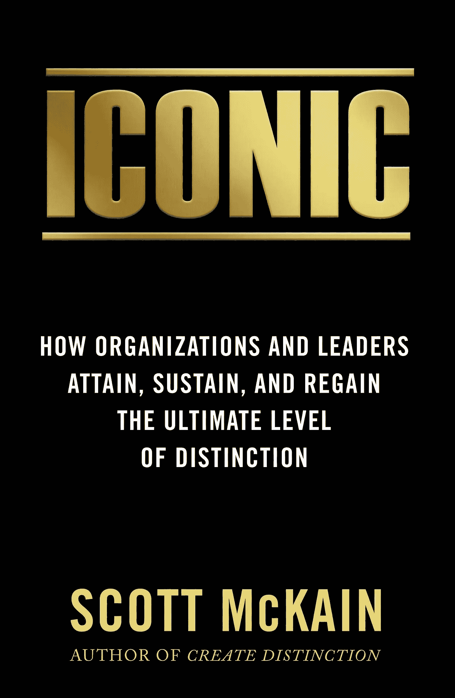

# 也许他们不想为你工作

> 原文：<https://medium.datadriveninvestor.com/maybe-they-dont-want-to-work-for-you-85acc643b0a5?source=collection_archive---------26----------------------->

今天的就业报告包含了一个很容易被忽视的惊人数据。

虽然失业率下降，但美国劳动力刚刚创下纪录:辞职的人比过去 17 年中的任何时候都多。

部分原因是现在的职位空缺比以往任何时候都多。很自然地，一些人会辞去目前的职位，去别处接受一份更有吸引力的工作。然而，还有一个更具挑战性的方面，我相信，可能更普遍。

虽然许多公司一直告诉我，很难找到“优秀的人”为他们工作——过去几年里，我交谈过的几乎每一位企业家都提到了同样的问题——但很少有人在自己的组织内积极寻求留住人才的策略，这一点非常值得注意。

在我即将出版的新书《*标志性*》中，我透露，研究清楚地表明，标志性表现的五个要素之一是*相互尊重的文化。*

***换句话说，组织及其领导层对员工表现出的忠诚度与他们希望员工表现出的忠诚度一样。***

此外，随着“跳槽”的耻辱成为过去，也许婴儿潮一代的老板并不完全适应千禧一代员工对有进步和有意义的工作的渴望。“出现，做你的工作，然后得到报酬”在以前可能是一个合适的方法，但在今天的就业市场上已经过时了。

并非巧合的是，我最近与苹果和迪士尼的领导人会面时，并没有讨论招聘或留住人才的困难。各个时代的优秀人才都被吸引到标志性的公司和与众不同的领导者那里工作。

根据彭博的数据，“每一个工作岗位有 0.91 个就业人员，相比之下，2007 年底衰退开始时只有 1.9 个就业人员。”

换句话说，2007 年你有一个职位空缺，就有两个人在这个职位之后……这让经理们很容易把注意力放在其他事情上，而不是放在与员工的相互尊重和相互忠诚上。如果有人不喜欢，他们可以退出！会有两个人准备好接替他们的位置。如今，没有一个人能胜任所有的空缺职位。

***而且，这还不包括生产力的损失和培训费用，培训费用是让一个新的团队成员达到现有专业水平所需要的。***

标志性的领导者建立标志性的组织，部分是通过他们提供“终极员工体验”的承诺——这样，他们的团队反过来将向那些购买他们产品或服务的人提供“终极客户体验”。

# 标志性的公司在设计留住现有客户的策略时，会像获得新客户一样充满激情和精准。

# **对于他们的内部客户——他们的员工，他们也是如此。**

(无耻的插在这里:更多信息，预购，[《标志性的:组织和领导者如何获得、维持和重新获得终极水平的卓越》](https://www.amazon.com/ICONIC-Organizations-Leaders-Sustain-Distinction/dp/1948677067/ref=tmm_hrd_swatch_0?_encoding=UTF8&qid=&sr=))

