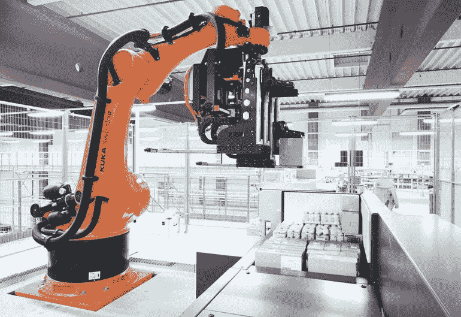
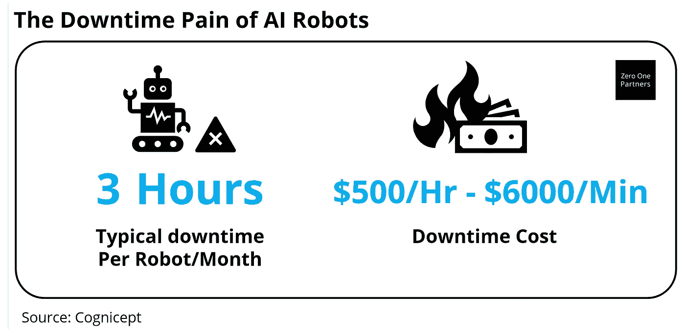
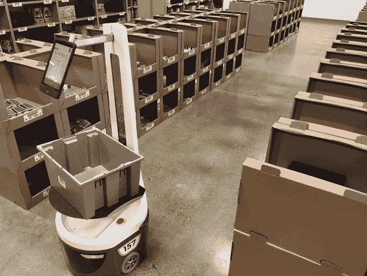
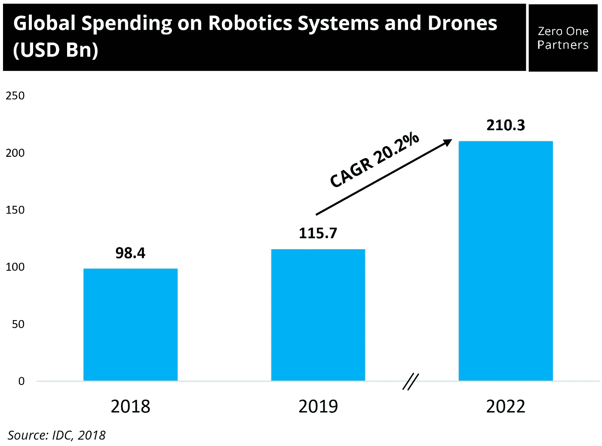

# 也许今天的人工智能创业公司应该使用人类作为他们的黑仔应用程序

> 原文：<https://medium.datadriveninvestor.com/maybe-todays-ai-startups-should-use-humans-as-their-killer-app-1127c68b9677?source=collection_archive---------8----------------------->

*Swisslog and KUKA Robotics Group’s robot called the RowPaQ for setting cartons.*

人工智能(AI)现在风靡一时，但在现实世界中使用时，它经常遇到不足。对于某些应用程序，它可能非常有效，例如在处理大量照片以从数据库中识别某人时。但是对于许多其他重要的应用程序来说，在成为基于今天的能力的可行的商业解决方案之前，它还有很长的路要走。

例如，在非结构化环境中完全自动驾驶，任何 18 岁的人都可以很容易地学会，但人工智能仍然做不到。还有更简单的任务，人工智能也在努力完成。在仓库里挑选和包装产品？即使是亚马逊也仍然需要人力来完成琐碎的库存管理任务。

 [## 模式和机器人:复杂的现实|数据驱动的投资者

### 哈耶克的名著《复杂现象理论》(哈耶克，1964)深入探讨了复杂性的话题，并断言…

www.datadriveninvestor.com](https://www.datadriveninvestor.com/2019/03/04/patterns-and-robotics-a-complex-reality/) 

根据新加坡机器人服务初创公司 Cognicept 的数据，虽然人工智能机器人在许多复杂任务中的成功率可能达到 90%至 99%，但此类系统的停机时间仍然可能是每个机器人每月平均三个小时。据该公司称，根据使用情况，这种停机时间的成本可能从每小时 500 美元到每分钟 6000 美元不等。

当然，许多人工智能应用仍然是不可能的，因为对于许多应用来说，即使是低错误率也是完全不可接受的。以自动驾驶或医疗保健应用为例。

因此，今天的软件工程师面临着让人工智能成功率尽可能接近 100%的艰巨任务。实现这些更高成功率的努力在工程中被称为“追逐 9”，其中 99%、99.9%或 100%的成功率之间的差异可能需要十倍、百倍甚至一千倍的计算智能。

但如果今天人工智能商业化的道路只是简单地将人类重新纳入等式，而不是推动指数级智能人工智能，会怎么样？

这就是我们发现 Cognicept 及其商业模式的有趣之处，即提供远程人类遥控操作者作为机器人系统的备份。Cognicept 没有开发更智能的人工智能，而是将人类劳动力带回等式中，以增强人工智能机器人。Cognicept 创始人 Mike Sayre 最近向我们解释了他是如何在从事石油和天然气、军事和仓储应用的机器人研究后提出他的商业模式的。“我试图在一个相当动态的仓库环境中部署机器人，像狭窄过道中的一块碎片这样的小事会导致机器人被卡住。大多数机器人不知道一个塑料袋和一堆砖头的区别。我认为，如果有一个系统，机器人可以在这些“边缘情况”场景中获得人类的帮助，那将是非常棒的。人工智能适用于 95 %- 99%的机器人用例，但当遇到边缘情况时，它会令人惊叹地失败，这可能意味着机器人对企业来说是可行还是不可行的区别。”

通过将人类遥控操作者与人工智能驱动的机器人相结合，该公司的服务允许今天的人工智能能力水平应用于更广泛的机器人应用，因为企业主可以放心，他们有一个人类遥控操作者作为备份，以应对出现问题的罕见情况。

Photo Credits: *Asma Khalid, WBUR*

然而，Cognicept 确实是一家科技公司。他们正在开发一种中间件，允许人类远程操作者团队远程监控每个人的大量机器人。当机器人遇到错误时，人类遥控操作者会收到警报，然后他可以控制并远程引导机器人纠正错误。通常，这种故障对于人类来说是非常简单的问题，例如机器人无法正确地拿起某个产品，被障碍物卡住，或者当地图过时时迷路。

人们不得不怀疑，如果简单地将人类作为备份添加到等式中，许多其他潜在的人工智能应用今天是否可以变得可行。例如，也许船只在公海航行时可以完全自主，然后当它们接近海岸或遇到附近的船只时，可以从港口恢复到人类控制。也许 Gmail 可以尝试撰写你对某人邮件的全部回复，然后只要求你做最后的清理。这仍然会节省你的时间，因为你本质上是把大部分的编写工作卸载给人工智能系统，而只是进来修复任务中棘手的部分。客户服务聊天机器人可能是另一个例子，本质上是人工智能试图管理大量的输入工作负载和客户问题，然后只在人工智能无法充分回答问题时将客户指引到人类。如果有人类来回答最后 5%的问题，一个 95%成功的聊天机器人今天是可行的，而从技术角度来说，一个 100%成功的聊天机器人可能还要几十年。

鉴于他们现在与 Savioke、ROS-i 和 Infinium Robotics 等公司合作，Cognicept 对人工智能问题的相当简单的人类解决方案似乎正在获得一些牵引力。据迈克说，在该公司最近一次美国之行后，投资者也对他们产生了兴趣。

如果人类劳动可以解决人工智能的许多问题，那么使用这种商业模式的创业公司可能会有许多商机。根据 IDC 的数据，到 2022 年，全球在机器人系统和无人机上的支出将达到 2103 亿美元，每年复合平均增长率为 20.2%。

那么，在未来的几年里，我们可以期待什么呢？对于 Cognicept，该公司表示，他们的目标是不断开发越来越先进的远程操作者服务版本，以实现更高的机器人性能、更广泛的行业应用和更少的人工干预。对于其他公司或初露头角的企业家来说，我们可以想象，许多与人工智能相关的商业模式可以通过放下人工智能油门，重新想象以创新方式增加人类劳动力可能是他们人工智能服务商业化的下一个重大飞跃，来找到商业牵引力。因此，如果你的人工智能业务似乎离商业化还有很多年，或许 Cognicept 的商业模式可以提供一些思考。