# 麦卡洛克-皮茨神经元——生物神经元的第一个计算模型

> 原文：<https://medium.datadriveninvestor.com/mcculloch-pitts-neuron-first-computational-model-of-a-biological-neuron-c08c85b74997?source=collection_archive---------2----------------------->

跟随我的博客[“那么，什么是机器学习？”](https://medium.com/@narmadhahandi/so-what-is-machine-learning-fbcf525c3f2c)，我们在那里了解了 6 罐机器学习，这是我的下一篇关于麦卡洛克-皮茨神经元的博客，缩写为 MP neuron。MP 神经元在人工神经网络领域做出了关键性的贡献。MP neuron 顾名思义就是受人脑神经元的启发。为了更好地理解每个步骤，这个主题将放在 6 个罐子的上下文中。

> MP 神经元是人类第一个简化的神经元数学模型。

简而言之，MP 神经元接收输入信号，将其聚合，并根据阈值提供输出信号。在我们定义输入、阈值和输出之前，让我们首先定义模型，然后逐步了解这个模型的用例。为了定义一个模型，我们必须知道以下细节。,

# 1.模型功能:

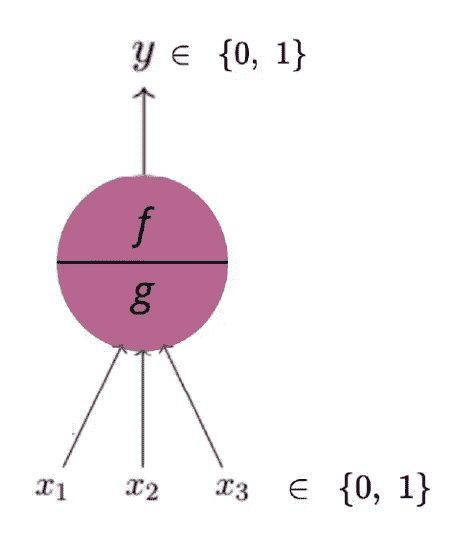

1.模型功能是什么？

2.有哪些参数(阈值)？

3.可能的输入是什么？

4.产量是多少？

***模型功能*** —由两部分组成。函数*‘g’*聚集输入，函数*‘f’*基于该聚集做出决定。输入可以是兴奋的，也可以是抑制的。神经元接收的兴奋性信号越多，总数就越接近神经元的阈值，因此神经元就越接近发送其输出信号。另一方面，抑制信号具有抑制神经元发送信号的效果。当神经元接收到抑制信号时，它会变得不那么兴奋，因此需要更多的兴奋信号才能达到神经元的阈值。

这里我只考虑兴奋性输入。，其中*‘g’*是所有输入和*‘f’*输出的总和*‘1’*或*‘0’*。

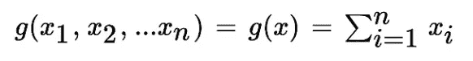

*g-function*

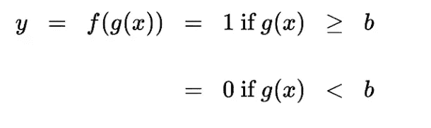

f-function

***参数*** —阈值*‘b’*是这种情况下唯一的参数，决定输出应该是*‘0’*还是*‘1’*。这就是所谓的 ***阈值逻辑。***

***输入&输出*** —仅为布尔型，即输入和输出都不是实数。

# 2.数据和任务:

既然定义了模型，让我们试着举一个例子来理解在什么情况下可以使用 MP 神经元模型。考虑一下 LBW 出局——板球比赛中的决定，我们只举三个例子来做这个决定。投球在线，影响和缺失的树桩来训练机器为我们做决定。当然，在现实中会有更多的因素需要考虑，但为了便于理解，我们将坚持这三个因素。我们的*‘y’*定义为，大于阈值的所有输入之和的计算结果。它由 1 给出-如果总和大于 b，a 0-如果总和小于 b。

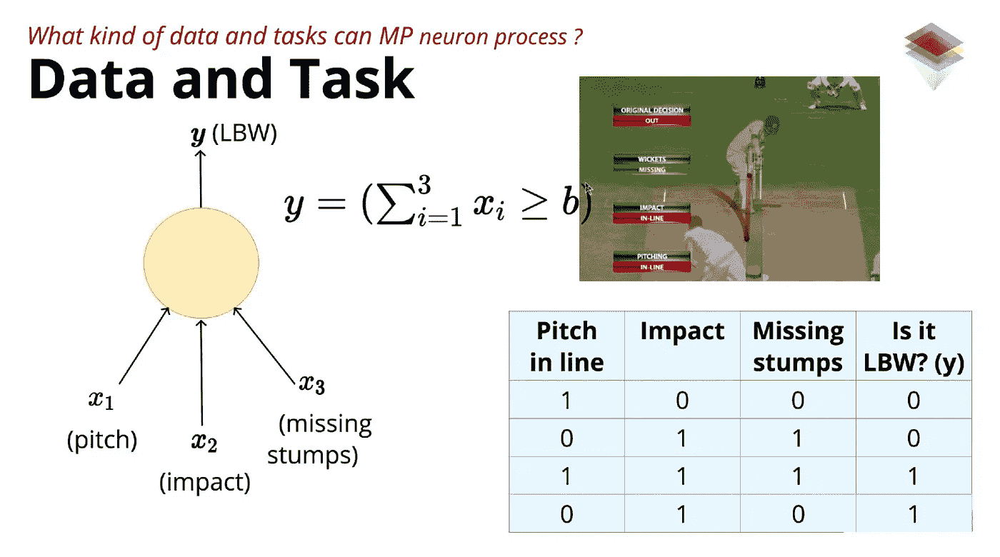

但是在实际应用中，数据并不总是布尔型的。在这种情况下，我们必须通过一个条件进行布尔映射。如下例所示。

MP Neuron always takes only boolean input and gives boolean output

# 3.损失函数:

现在让我们考虑作为输入的电话规格。这是为各种手机收集的。现在的任务是预测哪些手机可能会被喜欢，哪些不会。我们也有这种情况下的真实输出。

损失函数由下面的公式给出。

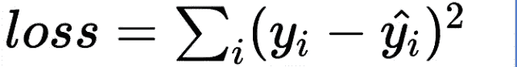

> 损失函数是真实输出和预测输出之间的平方差之和。

在下表中，我们有实际产量和预测产量，根据这些产量，我们使用上述公式计算损失。

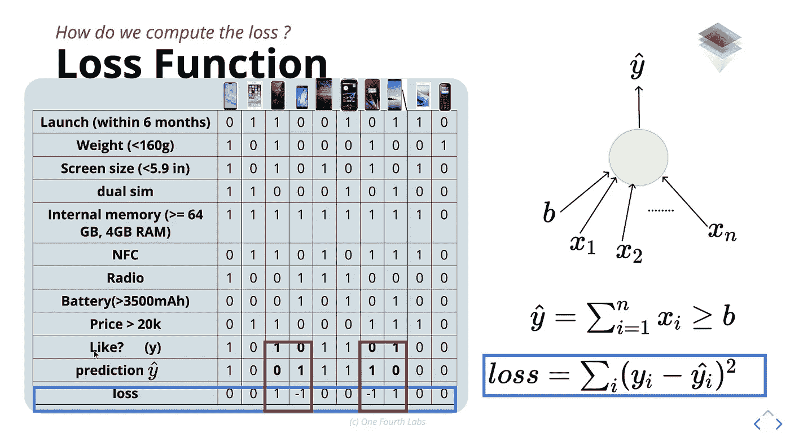

# 4.学习算法来训练我们的模型:

我们有数据，我们有任务定义，也就是二元分类，我们有模型，我们知道如何计算损失。有了所有这些，我们需要一个学习算法，它能给出损失最小的*【b】*的值，或者换句话说，预测输出与真实输出相同。在我们的例子中，参数—*‘b’*是唯一的参数，输入只能是二进制的。所以我们可以使用暴力算法。

下面是各种手机的各种规格的输入，我们必须找到*‘b’*的每一个可能值的预测输出。利用真实输入和预测输入，对于所有电话的*‘b’*的各种值，我们现在使用损耗函数来计算损耗。对于*‘b’，*的每一个值的损失值，我们现在必须找出*‘b’*的损失较小的值(可以在下图所示的曲线图中看到)。

在这种情况下，就是一个简单的 ***蛮力算法*** 。

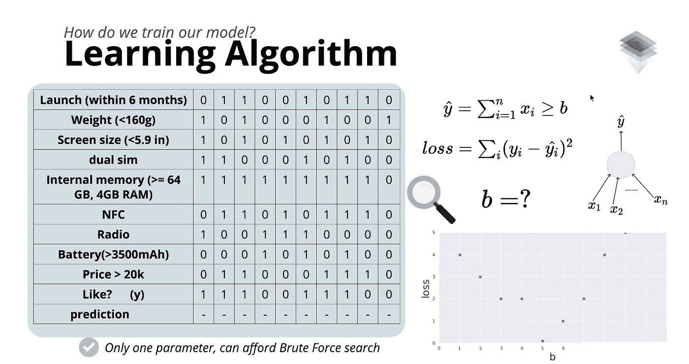

# 5.评估:

我们已经使参数*‘b’*为 5(通过前一主题中提到的强力算法)，这在训练数据集上的损失是最小的。现在是在测试数据上验证这一点的时候了。我们有 4 个不同手机的测试数据集，我们必须评估损失并计算准确性。

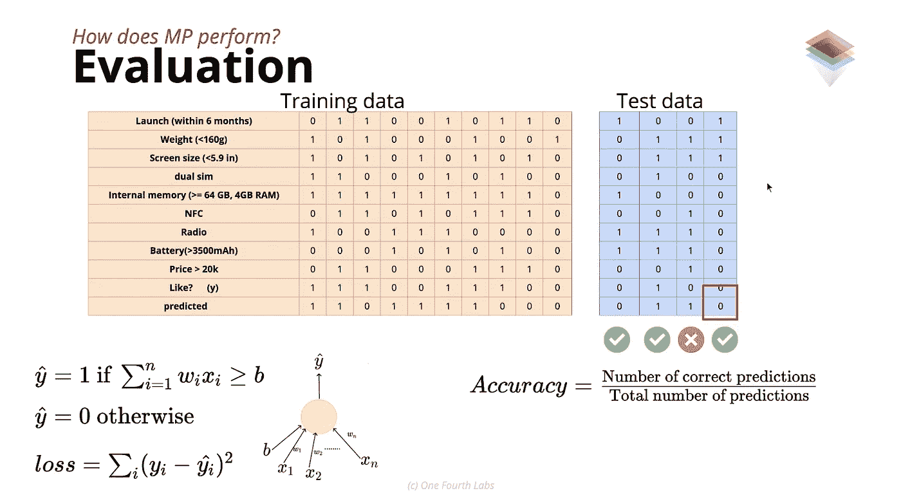

精确度由上图中的公式给出。从上面的公式，我们可以说准确率是 75%。

# MP 神经元的几何解释:

一条线的方程可以想成 ***ax1+bx2+d = 0。*** 一条线是一个有两个参数的函数，*‘m’*，和*‘c’。**‘m’*是可以画出不同斜率的线的斜率(可以是正斜率，也可以是负斜率)。*‘c’*是 *x2* 的截距，决定直线与垂直轴的截距。在 3D 的情况下，它是一个具有不同斜率的平面，也是一个与轴相交的截距。

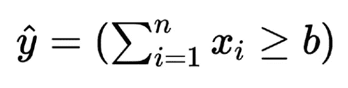

MP neuron function

上面的方程可以简化为 *x1+x2-b=0* (一条线的方程)。这是意义线。我们有正输出的所有点应位于这条线上或线上(所有点应满足 *x1+x2-b ≥ 0* )，我们有负输出的所有点应位于这条线以下(所有点应满足 *x1+x2-b < 0* )。所以这正是 MP 神经元模型所做的，用一条线 *x1+x2-b=0 将点分成两个，正和负。*

让我们尝试在二维空间中绘制这些值。当我们绘制图形时， *x1* 和 *x2* 输入只能接受布尔输入，可能的坐标是 *(0，0)，(0，1)，(1，0)，(1，1)。*关于上述移动电话规格示例，无论移动电话的数量如何，这些值仅位于上述 4 个坐标内。例如，我们将电池尺寸和屏幕尺寸视为 *x1* 和 *x2* ，并绘制可能的点，如下所示。

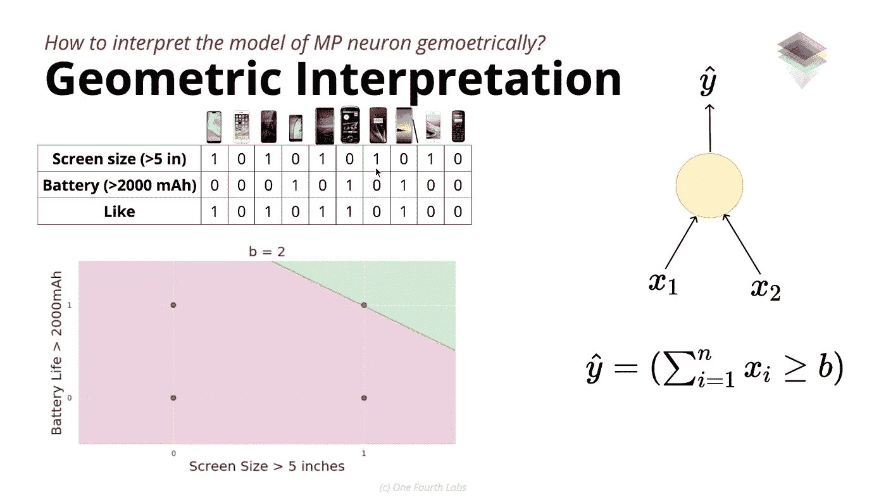

Dots in the image are the possible coordinates irrespective of the number of mobile phones.

如果坐标(0，0)和(1，1)包含正值，而其他两个坐标包含负值。在这种情况下，由 *x1+x2-b=0* 表示的直线不能将点一分为二。因此，我们找不到一条合适的线来划分正负两点。

# 局限性:

1.  就参数的自由度而言，这是一个非常严格的模型。我们拥有的唯一参数是*‘b’*，它也只能接受离散值。
2.  这是一个线性模型，寻找正负点之间的线性边界。大多数情况下，很难用直线来拟合正负点。
3.  很少有可能的拦截。

# 总结:

关于我之前博客中提到的机器学习的罐子，MP 神经元可以理解如下。

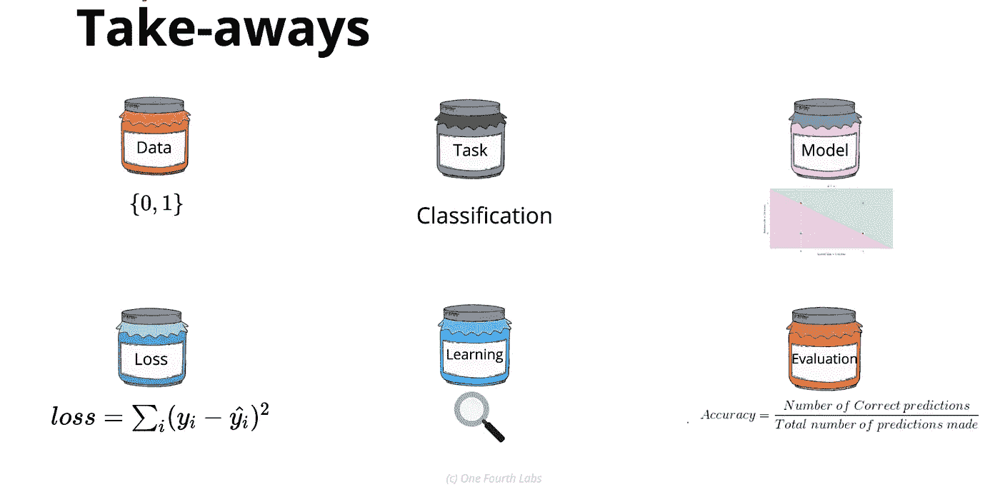