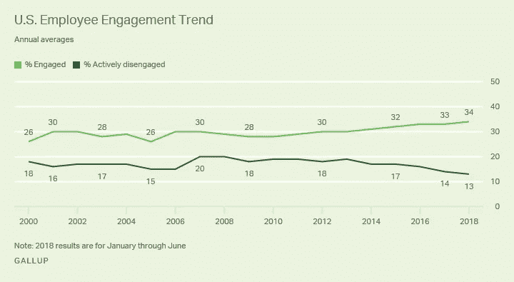

# 通过情绪分析提高远程团队的士气—认识 Benny

> 原文：<https://medium.datadriveninvestor.com/measuring-employee-satisfaction-on-remote-teams-meet-benny-7167f224e2f7?source=collection_archive---------32----------------------->

远程团队是现在和未来的事情。每天都有越来越多的工作团队分布在不同的地点，甚至不同的国家。这就是为什么我想到如何在远程工作的团队中“感受”到满足感，以及如何帮助团队领导提高团队士气。

你怎么知道是什么困扰着你分布在不同地方的开发或营销团队？

## **员工参与度(10 人中只有 3 人积极参与)**

根据[盖洛普](https://news.gallup.com/poll/241649/employee-engagement-rise.aspx)的数据，仅在美国，每 10 名员工中只有 3.4 名积极地为雇主工作。有很多事情要做，认为其他 7 人没有达到他们的生产力顶端是因为对你的公司有些不舒服。

US Employee Engagement Trend

# **改变我们获得员工反馈的方式**

旧的传统员工满意度调查是每年“调查”一次。我坚信团队的持续反馈和“感觉”对于项目/公司的成功至关重要。

## **日常争吵和消除障碍的需要**

有一个被广泛接受的软件和各种项目的框架，叫做 SCRUM。在其基本形式中，SCRUM 允许开发团队构建充满不确定性的产品/项目。

每日 Scrum 是这样一个事件，Scrum Master 询问每个开发团队关于当天做了什么，需要做什么，以及每个开发团队有什么障碍，以便消除它，或者至少寻求帮助来消除它。我将使用同样的原理来获得用户的日常反馈，并在人工智能的帮助下分析他们的反应。

# **脉搏调查**

有许多基于脉冲调查的解决方案，更频繁和更简单的调查反映了团队的士气和满意度。毕竟，这是最重要的事情，不是吗？。

# **对话界面**

我们使用 Facebook Messenger、Whatsapp 和各种聊天应用程序与朋友/家人交流，主要是与同事交流。随着时间的推移，使用这类应用的用户不断增加。

对话界面感觉更“人性化”，员工满意度是非常人性化的事情。

# **认识本尼**

所以，我一直想建立新的技术，最近读到了#PHMakersFest，并决定尝试一下，所以我正在建立一个聊天机器人(Benny ),它可以洞察远程员工的满意度，并能够在人力资源人员的帮助下制定行动计划来改善这些(见鬼，聊天机器人还不能完成所有的工作)。

## **本尼的特色**

**衡量员工满意度(NPS)**

有了 Benny，您可以使用世界著名的“您会推荐问题”每周、每两周和每月从您的员工那里收集 NPS 结果。

**你的每个员工的情绪分析**

使用情绪分析，Benny 能够通过人工智能分析看到每个员工的情绪周期。

**看看随着时间推移满意度的变化**

Benny 为您提供了一个关于团队/公司满意度演变的仪表板，这样您就可以发现对团队士气有重大影响的事件。

**检测队伍障碍物**

您将能够看到您的团队 morales 发展的仪表板，以及您为提高团队满意度而制定的所有行动计划。

**整个团队制定的行动计划**

让您的团队创建/修改行动计划，以提高他们的满意度和参与度。

## **保持更新**

所以我计划为#PHMakersFest 建造一个星期的 Benny。如果你想了解整个过程，你可以访问产品搜索网站，或者在 twitter 上关注我，地址是@yopiric