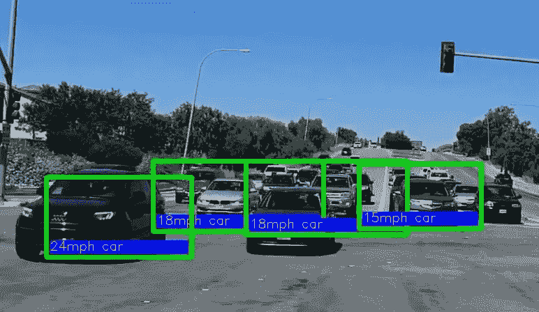
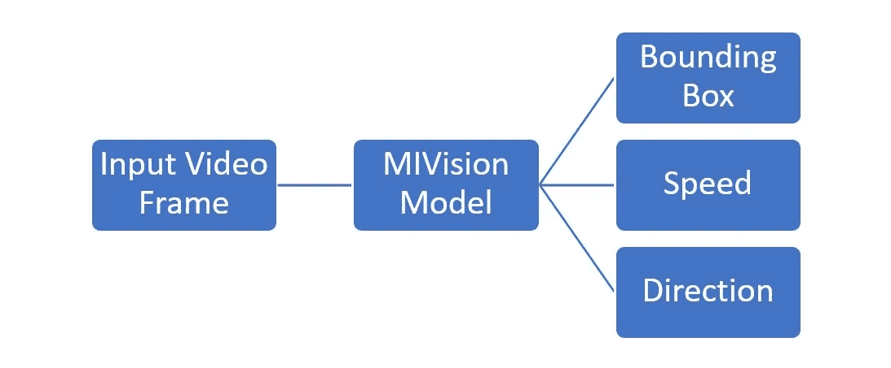
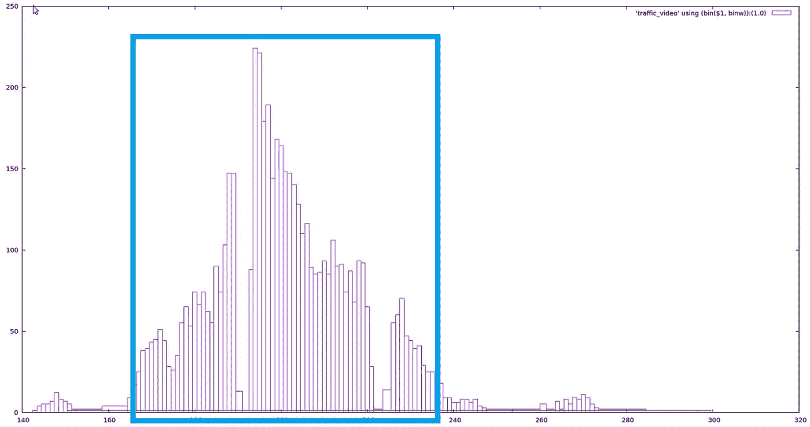
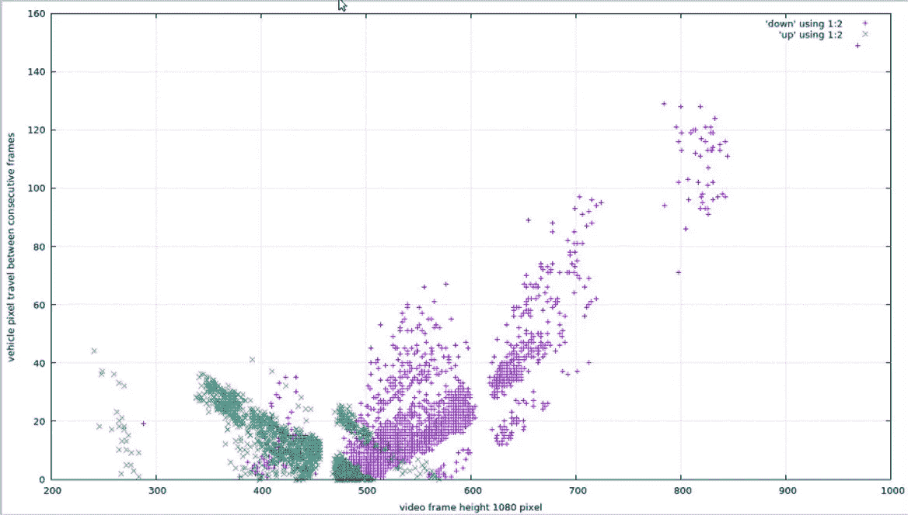

# 利用深度学习对象检测测量交通速度

> 原文：<https://medium.datadriveninvestor.com/measuring-traffic-speed-with-deep-learning-object-detection-efc0bb9a3c57?source=collection_archive---------3----------------------->

# **物体检测**

对象检测意味着在图像或视频帧中定位对象。物体检测的输入是物体的清晰图像。该图像被传递给输出位置的软件，或者输入对象周围的边界框。下图显示了城市街道上交通的边界框。

Vehicle detection on a city street

# 交通视觉

在本文中，我们使用 [Yolo-v2 神经网络](http://CVPR 2016\. OpenCV People’s Choice Award) https://arxiv.org/pdf/1506.02640v5.pdf)作为我们用于车辆检测的软件 [trafficVision](https://github.com/srohit0/trafficVision) 的基础。我们增加了 Yolo 模型(在 AMD GPUs 上转换为 MIVisionX 模型以获得更高的性能)的车速估计和车辆方向功能。下图显示了该应用程序的高级设计。

high level modules for traffic vision app

# 检测到的箱子速度校准

盒子速度校准只是一个以像素/秒为单位的盒子速度到以英里/小时(或者公里/小时，如果你碰巧遵循国际单位制)为单位的车辆速度的映射。

以下是检测上升/下降速度的算法:

> 1.获取帧中有上下行流量的样本视频。
> 2。收集盒子位置并计算每个盒子的中心 y 坐标
> 3。绘制 y 坐标的直方图(参见直方图)
> 4。找出大部分检测到的车辆正在通过的 y 范围。
> 5。记住排除车辆可能静止的区域。
> 6。找出 y 轴范围内帧间的平均速度。
> 7。将两个连续帧之间的中心像素距离/一帧持续时间校准到道路的已知速度限制。

Vehicle Center Point Histogram with Data Extracted from YoloV2 Detection on a Live Traffic

上图用方框表示被检测车辆的中心点。很容易画出覆盖大多数车辆的区域(显示为蓝色矩形)。可以使用 [σ](https://en.wiktionary.org/wiki/%CF%83) 、 [σ](https://en.wiktionary.org/wiki/%CF%83) 或 2 [σ](https://en.wiktionary.org/wiki/%CF%83) 作为度量来绘制区域。这个矩形的左边和右边是 y 范围。在我们的例子中(如图所示)，这个范围是 167，232。

# 位置比例因子

记住，你只校准了框架的一小部分。假设大多数车辆以极限速度行驶(统计推断)，该校准必须按比例调整到帧的其余部分。收集校准区域之外的区域的估计速度，并将其除以校准区域的统计估计速度，以找到基于位置的比例因子。在我们的示例中，位置因子图如下所示。

pixel travel distance between two consecutive frames

# 摘要

我们使用上面提到的技术来校准街道。该校准用于估算速度，如下图所示。

# 参考

1.  [交通视觉 app](https://github.com/srohit0/trafficVision/)
2.  [车辆检测与跟踪技术](https://arxiv.org/ftp/arxiv/papers/1410/1410.5894.pdf)
3.  [yoloV2 纸](https://arxiv.org/pdf/1612.08242.pdf)
4.  [微小的 Yolo 又名暗网参考网](https://pjreddie.com/darknet/imagenet/#reference)
5.  [MiVisionX 设置](https://github.com/kiritigowda/MIVisionX-setup)
6.  [AMD OpenVX](https://gpuopen.com/compute-product/amd-openvx/)