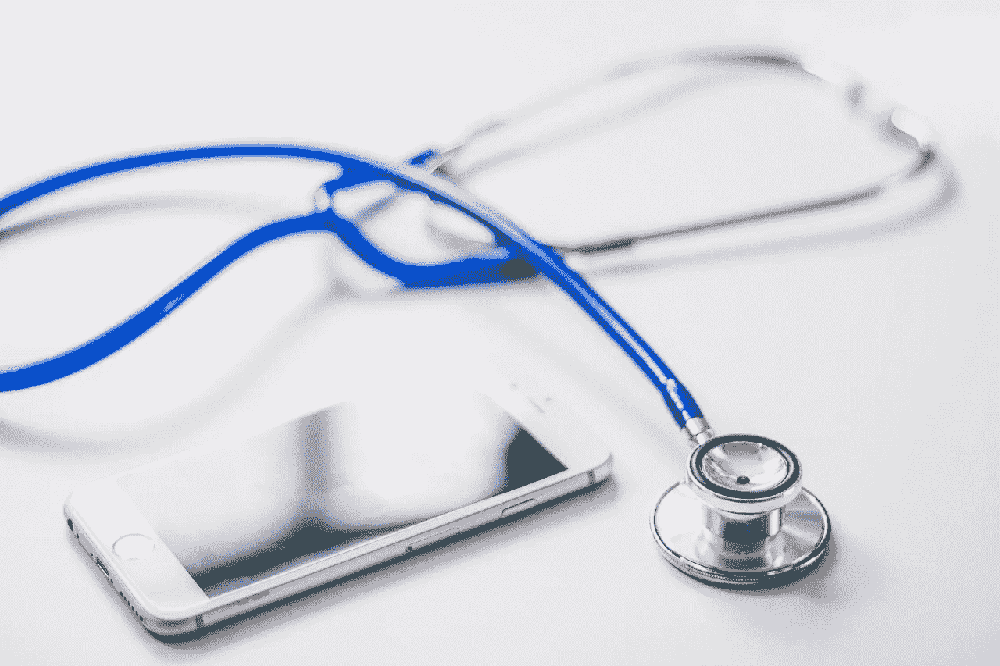
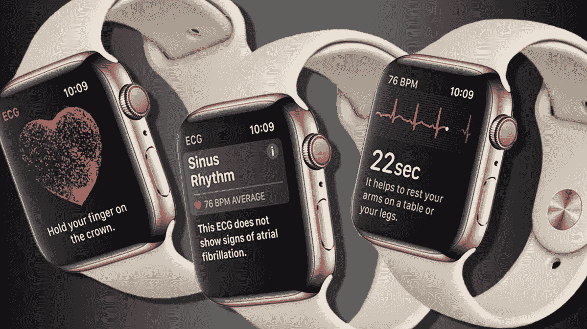
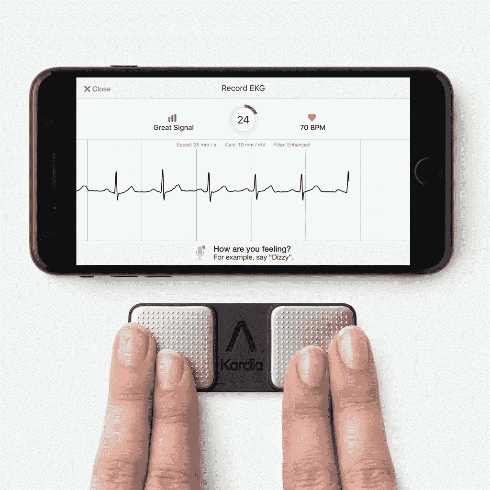
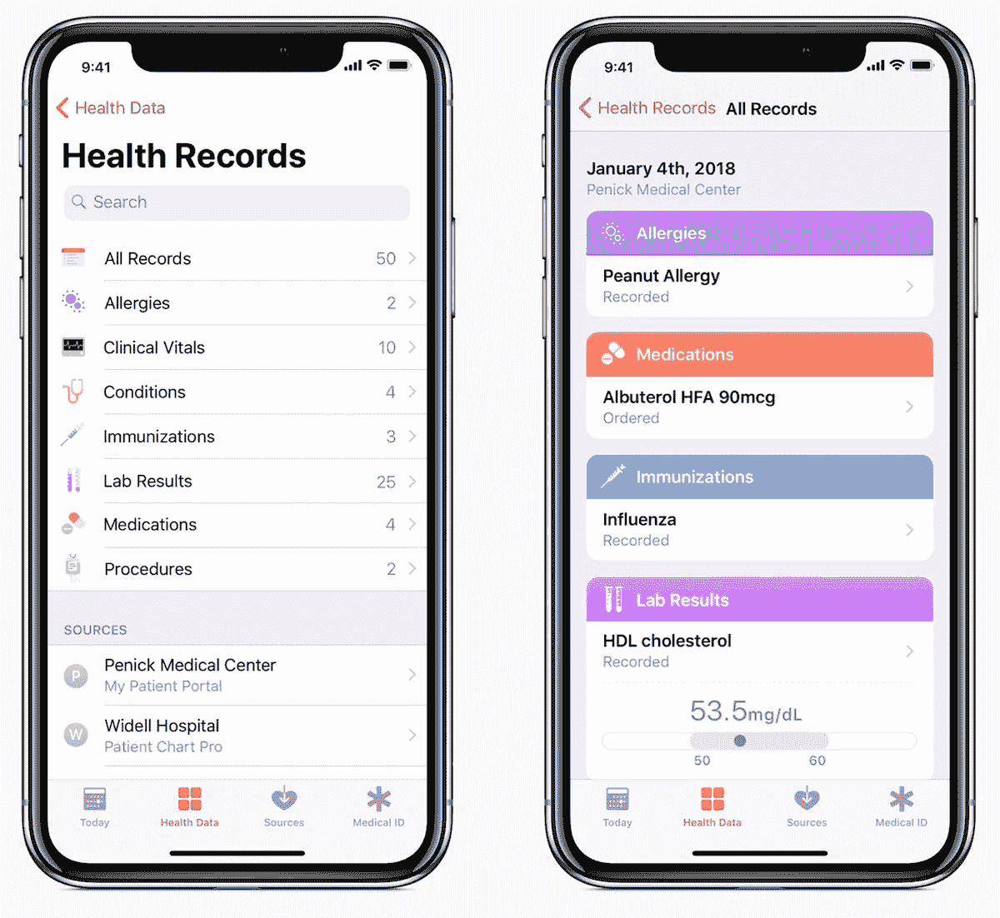

# 飞行中的医疗紧急情况:救援技术

> 原文：<https://medium.datadriveninvestor.com/medical-emergencies-in-flight-tech-to-the-rescue-81dba53aef66?source=collection_archive---------2----------------------->

Courtesy: Pixabay

随着全球范围内航空旅行的持续增长，以及每年乘客和航班数量的增加，在空中处理医疗紧急情况的需求也在增加。根据行业报告，预计 2018 年商业航空公司的定期航班将运送 43 亿多名乘客，2019 年将运送 45 亿多名乘客。由于廉价航空公司的流行，以及它们向长途航班的扩张，这种趋势更加恶化，这使得更高比例的人口能够更经济地旅行。发表在《新英格兰医学杂志》上的一项研究估计，每 604 次飞行中会发生一(1)起医疗紧急事件，这相当于每 100 万乘客中会发生大约十六(16)起医疗事件。根据这项研究，最常见的飞行中医疗紧急情况是头晕/意识丧失(37.4%)、呼吸系统症状(12.1%)、恶心或呕吐(9.5%)、心脏症状(7.7%)和癫痫发作(5.8%)。从统计数据来看，预计在 2019 年，我们将在飞行中发生约 72，000 起医疗紧急情况。

该研究还表明，尽管心脏骤停、产科和妇科问题以及中风属于最不常见的紧急情况，但这些类型的事件更经常导致飞机改道。约 7%的紧急情况下有计划外着陆，通常是由于心脏骤停。大约 26%的乘客在飞机降落时被送往医院，9%的人被收治，只有 0.3%的人死亡(很高兴看到这么低的百分比)。

 [## 医疗保健的未来正在被一场大型技术入侵所塑造|数据驱动型投资者

### 过去十年，全球经济的所有部门都经历了大规模的数字颠覆，而卫生部门现在…

www.datadriveninvestor.com](https://www.datadriveninvestor.com/2018/11/02/the-future-of-healthcare-is-being-shaped-by-a-big-tech-invasion/) 

多伦多大学在 2018 年发表的另一项研究指出，越来越多的老年乘客乘坐飞机，同时越来越多的人乘坐长途航班，这“使乘客更长时间地暴露在生理压力下，”该研究显示。前面提到的第一项研究指出，“机上援助是由医生(48.1%)、护士(20.1%)、紧急医疗服务提供者(4.4%)或其他卫生保健专业人员(3.7%)提供的”，这对需要这种援助的人来说无疑是幸运的。

**设备和供应品的问题**

空乘人员接受急救和处理各种情况的培训，客机需要有联邦航空管理局(FAA)授权的紧急医疗箱，可以根据个别航空公司的需要进行补充。飞行人员缺乏更彻底的医疗培训确实在某些情况下带来了挑战(历史脚注，在早期的旅行空姐，要求注册护士)。有许多记录在案的案例(以及由此导致的诉讼)表明，这些强制医疗箱没有从以前的使用中得到补充，或者船上的医疗用品或设备丢失或无法使用。这最后一组问题显然是承运人的流程问题，在人命关天的情况下，需要对此给予更多关注。

许多航空公司和运营商与卫生保健提供小组签订合同，该小组在需要时向机组人员提供地面资源以提供帮助。多年来，这已被证明是有价值的，并且无疑拯救了许多生命。通常，当需要时，一些类型的医疗专业人员会在被要求时志愿服务。航空公司可能会要求机组人员(和志愿者)在使用机载紧急医疗箱之前咨询他们签约的地面医生。

所有这些都是必要的，也是对飞行公众的一种极好的服务，但似乎还可以做得更多。这就是技术的用武之地。

**技术如何改善这一点**

随着个人电子设备技术的显著进步，即智能手表和更高端的健身追踪器，以及越来越多的传感器安装在飞机客舱中，问题是如何利用乘客可能佩戴的东西，或者利用飞机上支持互联网的便携式医疗设备？机上娱乐(IFE)系统具有宽带连接，并且在许多情况下仍然安装在每个座位上(目前)，或者至少可以通过具有通信能力的便携式电子设备联系机舱中的任何人。IFE 可以作为任何便携式或已安装设备的通信接口。现在有制造商提供升级的座椅，安装更多的传感器来监测乘客的健康状况。稍加调整，这种进步可能会识别出正在经历或即将经历健康问题的乘客。

但无论使用何种传感技术(乘客所有或航空公司提供)，IFE 都需要能够安全地与之交互，并能够管理数据传输。也许需要定义新的接口标准，以确定如何构建这些数据，如何保护个人隐私，以及如何将这些数据传输给地面上的医生。生命危在旦夕，这一系列事件需要尽快发生。

有一些工作正在进行中，这将在下一节中提到，还有一些关于个人医疗监护设备的辅助工作。如何利用飞机和地面上的医生使所有这些协同工作将是一个问题。

**航空健康**

根据他们的网站，图卢兹的 AeroHealth.ai 是一个在飞行期间提供远程医疗指导的平台。他们的平台(尚不清楚这是已经存在，还是仍在开发中)被集成到飞机的 IFE 系统中，可以在机上医疗紧急情况下使用。这使得机组人员可以与远程医生进行互动，以了解可以立即执行的治疗以及是否有必要紧急着陆。

长途航班上的乘客也可以使用 AeroHealth.ai 向医生咨询疾病症状或何时服药。没有提供费用和账单的细节。今年早些时候的报告表明，AeroHealth.ai 表示，它正在与松下和美国航空公司讨论将他们的系统与互联座椅集成的可能性。

该公司还希望提供使用内置传感器的“智能”座椅应用以及安全和舒适应用，如用于工作和睡眠优化的座椅设置；疲劳减少和可能的危险状况检测(心电图、血氧水平、呼吸率)；血压传感调节。

为了提供这一点，很明显，运营商将不得不安装具有所需传感器的新的升级座椅，并更新他们的 IFE 软件，因此这似乎是针对上层阶级或商务喷气机应用的，至少最初是这样。

**Detalytics**

这家公司没有解决医疗紧急情况，但有一个“人类分析平台”，为飞行员、医生、运动员和士兵提供预测智能数据。他们的软件集成了生物传感可穿戴设备，并与医生/顾问网络合作，为航空等面临高人为因素风险的行业提供人力资本情报。

他们的既定使命是提高运营准备度、绩效、降低疲劳相关事故的风险，并改善患者护理。

2018 年 9 月，松下航空电子公司(PAC)展示了与精选健康专家合作开发的各种健康应用，Detalytics 是其中之一。他们展示了集成到 PAC 座椅靠背和乘客移动屏幕上的集成健康咨询应用程序。2019 年 4 月，阿提哈德航空公司宣布，它将成为首家试用松下新健康解决方案“时差顾问”的航空公司，该解决方案是与 Detalytics 合作开发的，并集成到该航空公司的应用程序中。虽然这还不包括医疗问题，但对于使用这种技术并让地面医生与之互动的航空公司来说，这是向前迈出的一步。

**苹果手表 4**

随着其最新智能手表的发布，苹果公司为我们提供了一种真正的医疗设备。他们不断发展的智能手表产品线的最新版本正在使他们更深入地进入医疗设备和健康记录，为佩戴者(以及那些为自己建立档案的人)提供各种健康状况监测。虽然这可能不能补充飞机上的一些医疗设备，但它可以为那些提供帮助的人提供有价值的帮助。

Figure 1: Apple Watch 4 (image from Apple)

首先，Apple Watch 4 的数字表冠和背面晶体内置有电极，与它们的心电图(ECG)应用程序一起工作，主动读取你的心脏电信号。据苹果公司称，这款应用程序可以指示“你的心律是否显示出房颤(一种严重的不规则心律)或窦性心律的迹象，这意味着你的心脏以正常模式跳动”。虽然这可能无法捕捉心脏病发作，但它肯定对监测心脏状况有很大帮助，包括血凝块、中风和心力衰竭。这个设备和应用程序已经获得了 FDA 的许可。

随着人口老龄化，可能已经有医疗警报项链和手镯，更新更好的方法，如智能手表，可能是一个令人兴奋的进化发展。凭借其内置的 Wi-Fi 功能，它可以轻松地使用飞机的 IFE 系统将某人迫在眉睫的医疗状况直接发送给他们的医生或地面上的亲人。或者至少提醒佩戴者立即寻求帮助。

有趣的趋势是，多年来，健身追踪器和智能手表如何快速发展，以提供更好的健康监测，而不是仅仅计算我们的步数或为我们提供迪克·特雷西(Dick Tracy)装备(对于 40 岁以下的人，谷歌一下这个)。因此，他们正从只关注我们的健康转向积极观察我们身体的内部。谷歌、三星和其他公司不会不战而降地将这一市场拱手让给苹果，还有很多医疗设备制造商也不会忽视便携式、非医疗专业市场。

**AliveCor Kardia 产品线**

其中一家名为 AliveCor 的公司正在创新创造 FDA 批准的机器学习技术，以实现主动心脏护理。他们声称，FDA 批准的 KardiaMobile 是市场上最经临床验证的移动心电图解决方案，并在全球范围内使用。KardiaMobile 与 Kardia 应用程序配合使用时，可提供即时分析，用于检测心电图中的房颤、心动过缓、心动过速和正常心律。Kardia 是第一个人工智能平台，可以帮助临床医生管理患者，以早期检测房颤，这是最常见的心律失常，导致中风风险增加五倍。KardiaBand 是首款通过 FDA 认证的 Apple Watch 医疗设备配件。新的 KardiaPro 平台是唯一一个与患者使用的现有设备配合使用的远程患者监护平台。

Figure 2: KardiaMobile (image from AliveCor)

他们的 KardiaBand 是一款“附加”产品，适用于 Apple Watch 1 至 3，现在看来，苹果正试图通过将他们的许多功能集成到 Watch 4 中来与他们竞争。这款产品也可以在 Android 设备上运行，所以看看谷歌、三星和其他公司是否会采取与苹果类似的方法，或者与 AliveCor 的设计相结合，这将是一件有趣的事情。

我们在本文中重点介绍这家公司的原因，只是为了展示便携式医疗监护设备正在快速发展，变得经济、可靠，并有朝一日变得无处不在。

**与电子医疗记录集成**

这将是圣杯。对于飞机上(以及其他非医疗机构位置)的紧急医疗设备来说，对于遭受紧急情况的人来说具有更高的价值是能够以某种方式访问或集成该人的病史，这可以促使护理人员采取更适当的行动。

它们是一整套法律和隐私法规和政策，需要在任何事情发生之前进行定义(将某人的病史与医疗事件相结合)，但是，这正是我们前进的方向。

随着航空旅行的扩展和到达世界各地的更长时间的飞行，更好地处理医疗紧急情况和可能管理航班备降的需求只会增加。这意味着，运营商不仅需要增加更多的医疗诊断设备，还需要具备通信能力(并管理来自不同设备的数据格式)，以便尽快为现场医生提供更多信息，而不是依赖可能缺乏培训的人员在紧急情况下提供重要信息。

航空公司和运营商还需要与 IFE/通信提供商合作，或许可以与智能手表和 AliveCor 类产品等设备集成，将收集的数据发送给医生，从而有可能挽救生命。物流将是一个挑战，但是，如果松下和其他这样的供应商与苹果和谷歌合作(处理 iOS 和 Android 系统)，这是完全可以实现的。

如果航空公司和运营商能够说服他们的乘客将他们的个人病史植入他们的智能手机，这将有所帮助，因为这些信息可能会挽救他们的生命。对于任何在航空公司注册的人来说，一个好的开始是，他们确实有健康问题或怀孕了，他们可以自愿允许访问他们的在线医疗数据或他们的智能手机/平板电脑应用程序，这些应用程序可能有这种功能。

Figure 3: Apple Health app with Medical ID data (image from Apple)

举个例子，我的医生办公室小组支持将我的数据导出到微软 HealthVault(该公司将于今年关闭，微软正在向 Azure 添加新的健康记录集成功能)，苹果正在进入这一领域，并正在与越来越多的医疗机构合作，以支持其 iPhone 平台上的健康记录，从而能够直接在他们的健康应用程序中访问免疫接种、实验室结果、治疗、药物和生命体征等数据。Google Cloud 的医疗保健 API 充当互操作性的引擎，可以加速关键医疗保健数据类型的摄取、存储和集成。毫无疑问，其他数据提供者，如医院集团，健康维护组织等。要么创造这样的能力，要么与数据专家公司合作。我可以将这些数据导出到我的手机或电脑上，随心所欲地处理。我的下一步将是把它加载到我的智能手机上，以防我遇到紧急情况，以便在现场需要我的病史。

一种可能的情况是，如果一名有心脏病病史的乘客正在接受特殊的药物治疗，他在飞行中心脏病发作。如果这个人有一个 Apple Watch 4 和一个 iPhone，并将他们的病史存储在其中任何一个设备上(因为他们的医生办公室与苹果的云解决方案松散地集成在一起，并且病人已经设置了这种自动数据交换发生的所有权限)，帮助他的空乘人员可以通过 IFE 通信链路使手表同步健康记录，这些记录被传输给地面上的航空公司医生。该医生可以快速查看完整的药物列表、最近的治疗和由此产生的实验室报告，并且查看来自手表的 ECG 读数，联系患者的医生(希望他们是可联系到的)，并且具有更好的行动过程，通过该行动过程，不仅指导空乘人员需要做什么来挽救他的生命，而且还基于所有这些背景和当前信息来决定是否需要立即的航班改道。一旦创建了监管框架，并且实施了软件集成，所有这些都是可能的。

一旦政府和行业制定出如何保护个人数据的框架并定义通用数据格式，医疗设备提供商将能够更好地开发具有标准软件接口的通信产品，如飞机 IFE 系统，我们将看到结果。

所有这些确实让航空看起来离最终目标还有相当长的一段时间，但是，请记住世界发展的速度有多快。苹果和 AliveCor 只是在最近才推出针对获得 FDA 许可的消费者的产品；微软和谷歌正在开发集中式机器学习应用程序和数据库，以与医疗保健提供商合作，我们已经有了相当可靠的宽带。实现这一愿景的所有基础设施要么已经到位，要么接近到位。我们需要的是监管框架和通用数据格式和规则，软件公司可以利用它们来创建能够提取病史、当前医疗读数(无论是来自便携式手表还是机组人员使用的设备)的应用程序。

我们正在进入一个由便携式医疗设备和基于云的数据和学习驱动的精确医疗时代，飞机的机舱不应妨碍帮助有需要的人。