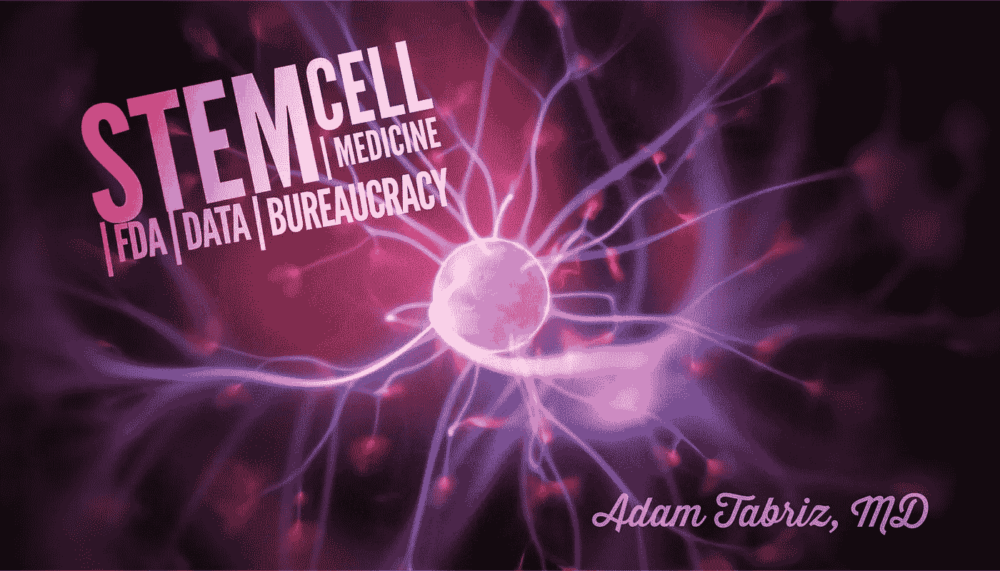

# 医学、食品和药物管理局以及支持大数据驱动的干细胞科学的争议——一个伦理和法律困境的案例

> 原文：<https://medium.datadriveninvestor.com/medicine-f-d-a-62d3121042cd?source=collection_archive---------6----------------------->

Stem Cell therapy

在过去的十年里，干细胞治疗、研究及其在医学上的应用一直是争议很大的话题，不仅在医学界，在政治活动家和媒体中也是如此。

> *“他们昂贵的、未经证实的治疗可能有风险。然而，营利性干细胞诊所正在蓬勃发展，艾琳·奥尔代在《奇迹细胞》杂志上说。*

根据发表在《再生医学杂志》上的一项研究，公共媒体在改变公众对干细胞研究等政策问题的看法方面发挥着重要作用，并让官员们更好地了解如何更有效地应用社交媒体来推进他们的干细胞行动。另一方面，[加州干细胞机构 CIRM 的官方博客在一篇博客](https://blog.cirm.ca.gov/2019/01/28/media-shine-a-spotlight-on-dodgy-stem-cell-clinics/)中写道:

 [## 大笔资金和尖端技术:人工智能/人工智能投资将如何革新医疗保健…

### 在过去几年人工智能(AI)和机器学习(ML)的显著发展中…

www.datadriveninvestor.com](https://www.datadriveninvestor.com/2018/03/22/big-money-and-cutting-edge-technology-how-investment-in-ai-ml-will-revolutionize-the-healthcare-industry/) 

> “我们为什么关注这些诊所？他们声称，他们的疗法通常涉及患者自身的脂肪或血细胞，可以治愈从关节炎到阿尔茨海默氏症的一切疾病。然而，他们没有提供科学证据，没有研究来支持他们的说法，并向病人收取数千美元，有时是数万美元”

很明显，尽管有所有内在的潜在医疗益处，干细胞疗法由于缺乏明确定义的临床试验而受到争议，因此最近[一名联邦法院法官裁定美国干细胞，佛罗里达州 Sunrise 的一家私人诊所](https://www.nytimes.com/2019/06/10/health/stem-cells-fda.html)官员有权监管用“病人自己的脂肪”进行的干细胞治疗。“在裁决中，法官乌苏拉·温加罗同意美国食品药品监督管理局(F.D.A)的说法，从脂肪中提取干细胞需要“这么多”(**T3)记住这些 II 字！** )的加工，它实质上把它们转化成了“毒品”！-并进一步阐述了“变更”将此类治疗牢牢地置于有权监管药物的食品和药物管理局的管辖之下。美国司法部代表 F.D.A .于 2018 年 5 月对 US Stem Cell [Clinic LLC 和 US Stem Cell Inc .以及 Comella 提起诉讼](https://www.fda.gov/news-events/press-announcements/federal-court-issues-decision-holding-us-stem-cell-clinics-and-owner-adulterated-and-misbranded-stem)，寻求永久禁令，以停止这些实体的非法行为，此前曾多次试图为诊所和个人被告提供与该机构合作的机会，以遵守 F.D.A .法规并保护患者免受伤害。

# 在我们深入细节之前，让我们就一些事实达成一致:

1)干细胞科学特别多样化，在两个词的视角下使用它超出了法律和政治修辞的范围

2)正如大多数其他治疗一样，干细胞科学中也有一些未解答的问题

3)权威机构如食品药品管理局和联邦政府的许多其他分支机构有足够的权力，尽管如此，既然他们是自己政策的创始者，规定他们在法庭上也有合理化这些规定的权力是公平的。

4)患者有权利对通过常规方式治疗[失败的](https://www.cirm.ca.gov/our-progress/stories-hope-sickle-cell-disease-2014)至[疾病](https://blog.cirm.ca.gov/2017/12/28/the-10-most-popular-stem-cellar-stories-of-2017/)进行[治疗。](https://www.cirm.ca.gov/our-progress/stories-hope-sickle-cell-disease-2014)

5)正如在食品和药物管理局诉美国干细胞案中所争论的那样，人们需要能够定义什么是组织操作，以及这种干预的结果是什么。因此，我们也有理由认为，临床基础治疗的安全性与法律术语之间存在更多的争议，毕竟医学必须始终考虑风险和收益比的概念，而法律和监管语言既不是有效的理解，也没有任何形式的有效性。

# 什么是干细胞？

干细胞是具有在体内发展成许多不同类型细胞潜力的组织单位。干细胞及其衍生物为新的医学治疗提供了无限的潜能。它们只是作为身体的修复方案。干细胞主要有两种:**胚胎干细胞**和**成体干细胞**。胚胎干细胞来自三到五天大的胚胎。在这个阶段，一个胚胎被称为**胚泡**，大约有 150 个细胞。这些是多能干细胞，它们能够分裂成额外的干细胞，或者成为身体中任何一种细胞。[成体干细胞](https://www.mayoclinic.org/tests-procedures/bone-marrow-transplant/in-depth/stem-cells/art-20048117)在大多数成体组织中发现有少量，如骨髓或脂肪。与胚胎干细胞相比，成人干细胞产生各种身体细胞的能力更有限。然而，直到最近，科学家们还认为成体干细胞可以创造出与宿主相似的细胞类型。例如，骨髓中固有的干细胞最多只能生成血细胞。然而，不断发展的迹象表明，成人干细胞可能善于创造无数种细胞。举例来说，骨髓干细胞可能能够产生骨细胞或心肌细胞。成人细胞，如果转化，可以具有胚胎干细胞的特性(诱导多能干细胞- **一种目前在美国独立医疗诊所内不合法实施的程序**)。科学家利用基因重编程成功地将正常的成人细胞转化为干细胞。通过修改成人细胞中的基因，研究人员可以对细胞进行重新编程，使其行为类似于胚胎干细胞。这项新技术可能允许研究人员使用重编程细胞作为胚胎干细胞的替代物，并协同防止免疫系统对新干细胞的排斥。尽管如此，专家们还不知道使用改变的成人细胞是否会对人类产生不利影响。研究人员还能够提取常规结缔组织细胞，并对其进行重新编程，使其成为有功能的心脏细胞。同时，他们发现羊水和脐带血中的围产期干细胞能够转变为特化细胞。

大多数主要的干细胞争论都集中在胚胎干细胞或多能干细胞上，因为它们更未分化，更有可能形成多种多样的细胞谱系。胚胎干细胞的使用在大多数国家和美国都是非法的，几乎没有例外。我们在社交媒体上听到或读到的，以及医学界一直务实的，是主要从患者自身的骨髓和脂肪组织中收获的成人干细胞。因此，在当今的医疗保健领域，成人干细胞的分配主要限于利用胶原酶来释放干细胞，使其与胶原框架分离，并通过离心进行浓缩。在选择的病例中，患者自身的血小板也被用作“血小板生长因子”的来源。这种过程决不需要对形态清晰的细胞进行曲折的操作。

近几十年来，脂肪组织已经成为整形外科和再生医学中非常普遍的成体干细胞来源。分离的基质血管成分(SVF)是一种异质细胞群，包括脂肪来源的基质/干细胞(ASC ),其在之前的一些临床研究和试验中显示出再生潜力。然而，因为脂肪组织中的干细胞被束缚在纤维附着环境中，所以需要在无菌环境下进行边缘处理，以从脂肪组织中分离 SVF，使用或不使用酶如胶原酶，结合使用物理力如离心机的分离系统。类似的过程经常在手术室进行，如骨和皮肤移植手术，而没有食品和药物管理局的直接干预。

# 干细胞的用途

注意:本文剩余部分中的“干细胞”一词仅指成体干细胞，除非特别提到“胚胎干细胞”不是这场争论的主要焦点。

成体干细胞通过将其自身接种到体内的退化组织中并利用环境分化成其新栖息地的常规细胞类型，具有显著的再生潜力。与它们的胚胎对应物相反，由于成体干细胞在发育链中更加分离，所以它们在新鲜环境中不太倾向于转向不太可预测的成熟谱系，如果不在实验室环境中对它们进行进一步的酶促操作，其中成体细胞改变为具有胚胎箔(也称为诱导多能干细胞)的性质，其本身是复杂的。当代干细胞研究人员能够通过对这些细胞进行受控的表型操作来提高干细胞治疗的效率，从而使它们更加有效；现有技术难以公开展示的现象。干细胞治疗的应用可能看起来多种多样，因为它用于各种健康状况，如退行性关节炎、心力衰竭、慢性阻塞性肺病(COPD)，甚至对注意力缺陷和多动症(ADHD)、自闭症和痴呆症有一些有益作用，但它们都遵循相同的原则，如“使宿主再生新的健康组织”，因此发挥作用。同样的再生原理也适用于整容手术。

# 趋势是什么？

毫无疑问，在特定情况下，消费者愿意对干细胞治疗感兴趣，如果这意味着机会很小，很少成功，他们也相应地愿意花费数千美元——尤其是治疗像痴呆症这样毁灭性的疾病或像肌萎缩性侧索硬化症(ALS)这样痛苦的疾病。批准对当前政府和媒体在干细胞商业上的批评是正确的，因为监管是必要的，但这种过度的必要性无疑是有害的。

我们生活在这样一个时代，患者可以接触到海量的信息，并且被认为更加复杂。他们以自己无与伦比的方式理解风险和收益比理论，甚至可能基于那些独特的人物做出显著的选择，但他们会进一步信任他们的医生，并能够在正确的过程中领导他们。在 21 世纪干涉这种自治，并通过维持政府的手段来结束媒体恐慌策略和政治言论，将导致有害的结果。干细胞治疗的医疗旅游就是一个这样的例子，包括美国在内的世界各地，特别是中国、印度、加勒比海、拉丁美洲和前苏联国家的诊所通过互联网网站为患有各种严重疾病的患者提供基于干细胞的治疗，其中许多人感到绝望，需要第二次机会出国旅行，花费数千美元寻求治疗。但这是否意味着患者被干细胞疗法蒙蔽了双眼？！或者公平地说，特定的程序可能不会[产生](https://sciencebasedmedicine.org/patients-blinded-by-stem-cell-therapy-fda-and-consumers-win-a-legal-victory/)效果，因为即使在传统的治疗方案下，也不是每个病例都是成功的？！

# 管理基于干细胞的产品和临床考虑的法规和指南

*“干细胞就像其他旨在治疗、治愈或预防疾病的医疗产品一样，* [*需要获得食品及药物管理局的批准*](https://www.fda.gov/consumers/consumer-updates/adult-stem-cell-research-shows-promise) *才能上市。FDA 细胞组织和基因治疗办公室细胞和组织治疗分支负责人 Steven R. Bauer 博士说:“*对于 FDA 来说，重要的是保持一个健全的监管科学研究计划，以促进在具有巨大前景的新兴领域开发安全有效的产品。

# 为什么重要？

“我认为食品和药物管理局正在调查那些有强大政治势力试图抵制监管的行业。这很难，”前食品药品管理局局长 [Scott Gottlieb 说](https://www.axios.com/fda-regulation-stem-cell-therapy-cbd-cf182502-3591-492e-9a5f-718b39924fb6.html)。尽管如此，[有争议的](https://www.axios.com/newsletters/axios-vitals-166e1448-9381-4ade-9529-f649036dddce.html?chunk=3&utm_term=emshare#story3)诊所仍在招募病人

批评家说，“干细胞诊所利用临床试验注册来推销未经证实的疗法”。一方面，食品药品监督管理局发布了一封信，声明*“亚利桑那州一名经销商销售的干细胞疗法是“未经批准的”，并引起了“安全问题”*

另一方面，美国国立卫生研究院的数据库——clinicaltrials.gov[——](https://www.statnews.com/2019/06/11/stem-cell-clinics-clinical-trials-dot-gov/)——*直接列出了同一家公司的研究，并附有该公司网站的链接，绿色的“招聘”字样引人注目。*

# 大数据、干细胞基因组学

[干细胞基因组学是分析](https://en.wikipedia.org/wiki/Stem_cell_genomics)干细胞基因组的科学。目前，由于基因组测序成本的戏剧性下降，这一学科分支正在迅速扩展。干细胞基因组学的研究在干细胞生物学和干细胞可能的治疗用途的研究中具有广泛深远的影响。基于这些功能，Stemformatics 已经将一个可视的可下载的干细胞数据库产业化。该公司已经建立了一个基因表达数据门户，包含超过 420 个公共基因表达数据集，这些数据集来自 RNA 测序微阵列和单细胞图谱技术。[大数据驱动的干细胞科学和组织工程](https://www.sciencedirect.com/science/article/pii/S1934590917300073)已经被认为是越来越多的边缘领域之一，迫切需要生成高质量、精选的表型基因组干细胞数据集供社区使用。

# 字里行间

毫无疑问，干细胞有一条走向完美的道路，而且毫无疑问，食品药品管理局的职责是通过保证药物、生物制品和医疗器械的安全性、有效性来保护公众健康；食品供应、化妆品和辐射产品。但是关于干细胞的争论，食品药品管理局的权力范围显然是广泛的，尽管如此，还是有选择性的。

从历史上看，法规通常被归类为:如果不是针对辐射设备，并且没有理由说明即将发生的危害，则被视为不受监管。例如，在健康商店的货架上，有大量的膳食补充剂和产品是经过酶促过程(如运动蛋白奶昔)显著改良的，而食品和药物管理局对此并不太关心

给该机构敲响警钟的是多方面和复杂的。几个例子是安全问题，特定产品背后的业务增长规模；我将在这篇文章的后面谈到，同样地，如果公司的成长超过了某个特定的能力，那么它一定是太有影响力了，不能放任不管。这种趋势在今天的企业中被战略性地运用到了不足的地步，比如谷歌、脸书、亚马逊、苹果和推特。给一种产品贴上食品和药物管理局的标签与其说是禁令，不如说是机遇，因此对其进行相应的管理是政治和经济激励的问题。有太多模糊不清的地方，比如是什么使得从脂肪中提取的干细胞成为一种药物，从而使其成为一种哲学而不是一门科学。即便如此，我们叫它什么有关系吗？！-说到底不就是安全吗？！-是什么让酶处理过的蛋白奶昔比酶处理过的脂肪更不像药物？相反，如果它是关于无菌和感染的，该机构不必对此进行监管，因为许多外科手术的高感染风险不属于食品和药物管理局的职责范围。

市场上有太多虚假的补充剂，但是食品和药物管理局是否关心每一个元素，这是有争议的问题。食品和药物管理局的务实立场一直反映为“你可以向公众出售蛇油，只要没有大规模的直接伤害报道和/或你支付你的行政费用。

# 关于“成人干细胞”

正如我们已经知道的，有多种干细胞来源，具有多种分化水平和完全不同的行为。然而，我们今天了解到的一件事是，食品和药物管理局倾向于将这些表型(至少是官僚的)归类和捆绑在单一的监管保护伞下，或者至少给公众留下这样的印象，即受污染的成人干细胞与其胚胎干细胞一样危险。基于与 F.D.A .是政府最有权威的部门之一这一因素相关联的这种假设，使得可以方便地假设，在医学领域中存在不同层次的管理目标，这些目标可能或可能不仅仅与干细胞治疗的实际安全性相关。更明确地说，大数据产业和数据挖掘是 21 世纪的淘金热。它是所有行业的基本原料和主要库存。传统上，如果一个政府想要控制一个市场，他们倾向于通过进口、检查、关税或许可证来实施不同层次的监管。今天，大数据行业加入了政府的名单，并接受包括政府在内的企业实体的检查和使用。有几个实体，如 23 和我，ancestry.com 等。作为基因数据库。美国干细胞可能是第一个加入干细胞产业行列的。尽管美国干细胞法庭拒绝与该机构分享干细胞数据，但法庭裁决仍然是食品和药物管理局的胜利。因此，这是关于安全，微观管理，监管，金钱还是仅仅侵犯个人隐私？——*大概都差不多了吧？！*

利用数据，特别是个人的基因构件，是其他行政部门和个人实体利用数据的途径。首先，除了可能阻碍获取个人个人信息的宪法障碍之外，使用承诺的公共基金来收集这些信息是一项昂贵的任务。在这种情况下，食品和药物管理局创建临床试验注册处的举措及其对再生医生的有条件许可专门提供“未经证实的干细胞疗法”是一种伪君子行为，只会指出政府的使命是利用私人诊所的努力和资金来实现访问有价值的患者数据的管理目标，否则这些数据将很难获得。与通过保险实体和医疗保险报销的临床服务一样，政府很容易获得数据，但对于基于现金的服务，该机构必须探索其他策略来收集相关信息，而不筹集公共资金，从而确保食品和药物管理局的另一个征服。一个类似的例子是[生物制药行业提供了食品和药物管理局 75%的药物审查预算](https://www.forbes.com/sites/johnlamattina/2018/06/28/the-biopharmaceutical-industry-provides-75-of-the-fdas-drug-review-budget-is-this-a-problem/)。

# 合作系统反对独立医生

围绕干细胞治疗的限制性政策实际上决定了独立医生的实践。由于美国干细胞等初级实体将被迫与政府合作并共享数据，因此独立医生将被迫通过干细胞实体提供临床服务。

最近，我发表了一篇关于[许可和法规](https://medium.com/be-unique/philosophy-of-licensing-and-certification-the-dark-history-of-utterly-autocratic-approach-to-430591032ac4?source=linkShare-c456119985e2-1560688862&_branch_match_id=562436435016958536)如何影响特定行业经济的文章。尽管干细胞产业仍处于早期阶段，但监管垄断同样也在不断演变。浑水摸鱼在今天的政治舞台上并不新鲜，因为它对每个政府机构来说都是高效、快速和方便的，可以适用于任何行业和组织，而无需遵循宪法路径。干细胞等科学的党派政治利用围绕每个主题的共同伦理困境，并在征服其事业时使其武器化，这通常与特定科学学科的基本原则无关。在这个过程中，公民和病人的福利和特权被没收。监管是一件好事，但太多的好事与没有监管一样有害，甚至更有害！

一种商品或服务的合法性既不能使其更加安全，也不能证明其合法性，但是不管其有效性如何，禁止一种合理安全的产品或服务肯定会使其在许多方面变得有害。

不管干细胞治疗的疗效范围如何，在每种情况下应用和维持风险与收益比的概念是极其重要的。然而，全面的过度监管和不必要的命令只会对高质量的医生实践和患者主权造成阻碍，因此会将“千篇一律”的医疗服务公司化。患者，特别是那些有医疗问题，对传统治疗方式一直没有反应的患者，有[权利尝试](https://medium.com/the-4-elements-of-change/do-patients-really-have-the-right-to-try-be8e8a8702f4)其他合理安全的选择，即使这些选择似乎有争议。

高水平的有效监管对国家的安全和自主至关重要，只要其重点突出并符合所针对的任务的实际道德和利益，即个人选择、合理安全和知情同意。

 [## 哲学的许可和认证:黑暗的历史，完全专制的方法…

### 从进化的时候到现在的现代，经过几代人的努力，人类不仅为…

www.linkedin.com](https://www.linkedin.com/pulse/philosophy-licensing-certification-dark-history-adam-tabriz-m-d-/)