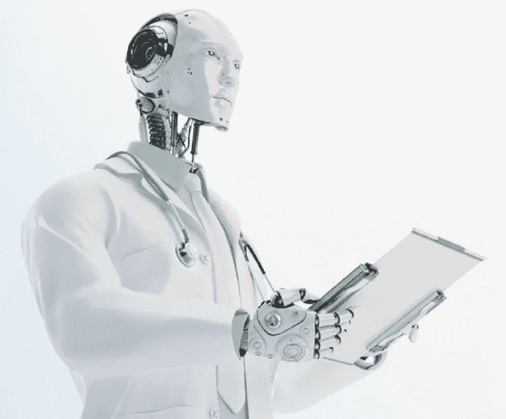
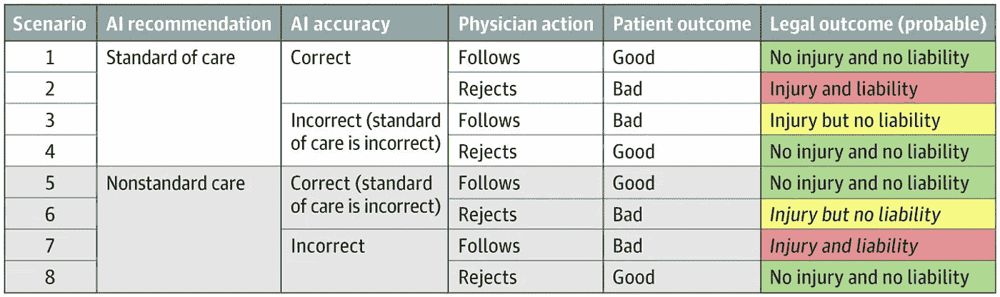

# 人工智能和深度学习的医学法律风险

> 原文：<https://medium.datadriveninvestor.com/medico-legal-perils-of-artificial-intelligence-and-deep-learning-fadecf86f278?source=collection_archive---------13----------------------->

#healthcarewithoutborder #AI #artificialintelligence #machinelearning

科技发展迅速，我们都可以愉快地注意到它在医疗保健领域的足迹。因此，医生群体对技术的强烈矛盾心理是不言自明的。与日益增长的千禧一代对技术应用的过度依赖相比，婴儿潮一代对健康信息工具的蔑视是众所周知的。在所有这些当中，有一件作品还没有跟上不断发展的高科技革命，因为我们正在跟随它的脚步展开。这似乎是所有威胁无限制医疗保健的法医风险中尚未回答的问题。由于其特殊的性质，医学被认为是最容易受到诉讼的职业之一。

 [## 挑战你对人工智能和社会看法的 4 本书|数据驱动的投资者

### 深度学习、像人类一样思考的机器人、人工智能、神经网络——这些技术引发了…

www.datadriveninvestor.com。](https://www.datadriveninvestor.com/2019/02/28/4-books-on-ai/) 

尽管胜诉的数量总是忽高忽低，但趋势似乎有所上升。病人考虑提起诉讼的原因和医生如何打破护理标准各不相同。然而，总的来说，如果你深究一下，除了偏离护理的中心，你常常能够发现医生和病人之间的纽带链中的一个断裂的环节。

信任、知识、关心和忠诚是医生和病人之间健康关系的基本要素。这种协议是一种双方同意的束缚，涉及双方之间的脆弱性和信任。这是人类最感人、最有意义的经历之一。然而，这种关系的最终融洽并不总是完美的。

传统学者将病人和医生之间圆滑的关系分为三类:指导-合作、主动-被动和相互参与。尽管上述类别在历史上已被认可，但最后三个类别主导了今天的医疗保健市场。它描绘了越来越多的公民获得无限的信息，超越知识，以及消费主义的进步。干扰他们联系的因素包括约束、语言障碍、透明度、文化规范和个人态度。为了简单起见，介入病人和医生之间的任何手段都必须理想地与双方之间的独特联系相一致。因此，如果不同步，可能会破坏关系中的一个或多个元素。元素的干扰因素会发生变化并重新出现。我们这个时代的一个潜在煽动者正在将人工智能算法应用于医疗应用和健康。根据最近发表在 JAMA network 上的一篇文章，通过使用不受监管和部分有效的[人工智能](https://www.datadriveninvestor.com/glossary/artificial-intelligence/) ( [AI](https://www.datadriveninvestor.com/glossary/artificial-intelligence/) )技术，医生面临迫在眉睫的威胁。

技术是为了减轻医生的一些负担，使他们的工作更加高效和精确。尽管如此，算法需要定期更新，并与不断变化的行业业务需求保持同步。毫无疑问，这适用于医疗保健行业，尤其是在编辑和同步特定时间、地点和医疗实践的医疗保健标准方面。

医学实践在不断变化，流行的临床护理、技术和社会规范也在不断变化。医疗胜利固有的多面性是医生和病人冲突中的承诺。

# 为了进一步辨别，让我们复习一些定义…

医疗实践是一种专业职能，由一个被其同行认可的个人来担任医学专家。希波克拉底誓言的主要使命是经常治疗，有时治愈，永远舒适。该承诺适用于通过建立联盟来护理同意作为患者参与的人。因此，通过双方在知识、技能和伦理方面的完全一致，建立在信任基础上的临床处置是最终目标。

与其他能力相反，临床决策仍然是最容易的，从医患互动到独特的个人需求和社会因素。因此，证明注意标准的正当性并不属于其他行业中的一个象征性的主要思想。医疗保健理想会随着时间、地点、个人、资源、公认的社会规范和经济决定因素的变化而变化。医疗护理的标准是，在相同的医疗社区中，通过类似的培训水平的医生将提供；因此，在类似的情况下，违反标准将导致所谓的渎职。

Photo by Andrea De Santis from unsplash

# 人工智能、机器学习(ML)或深度学习(DL)

在计算机科学中，人工智能(AI)，也称为机器智能，是对机器所表现出的理解的描述。这与我们所熟悉的普通人类智力形成了对比。领先的人工智能教科书将后一个学科定义为“智能代理”的研究。

要让人工智能发挥作用，它必须首先学习。学习过程是通过“[机器学习](https://www.datadriveninvestor.com/glossary/machine-learning/)”进行的，这为后者提供了独立的能力，可以影子学习其人类对应物。它通过积极的[数据挖掘](https://medium.com/datadriveninvestor/artificial-intelligence-machine-learning-big-data-and-health-information-what-you-need-to-know-cb13a5c059c1)，利用各种传感器和元数据输入模式、算法协议和跟踪人类进行自我学习。通过机器学习，AI 可以自我改进功能，而不需要显式编程。

[深度学习](https://www.datadriveninvestor.com/glossary/deep-learning/)(DL)——也是人工智能(AI)的一个子集，提供了一种能够学习“非结构化或无标签的”无监督数据的技术或网络。也被称为深度神经学习或深度[神经网络](https://www.datadriveninvestor.com/glossary/neural-network/)，[深度学习](https://www.datadriveninvestor.com/glossary/deep-learning/)作为[人工智能](https://www.datadriveninvestor.com/glossary/artificial-intelligence/)在医学和医疗保健领域的自主能力，具有无限性和解放性，从而使智能人类对人工智能发展的贡献更加重要，以确保道德和法律合规优先。

最近，技术官僚们普遍相信人工智能的能力是自由主义的；它将最终比人类更完美地诊断疾病并提供合适的治疗方案。并且坚定不移地相信，在没有医生参与的情况下，机器将能够学习，进行不同的诊断检查，并为特定患者做出最佳治疗决定。采取这样的前提是完全不成熟和激进的。尽管如此，在怀疑的帮助下，让我们推测这样的场景是可能的；医患关系是机器-患者关系或公司-患者关系的概要。然而，设想实现这样一个场景需要一个过渡期，医生必须定期干预，这似乎是非常放肆的。随着医疗保健朝着机器人医疗的快速发展，人类干预必须被视为对医疗界的影响和安全时期有害。未能这样做；将产生真空，潜在地引入容易动摇医疗护理标准的因素，对临床判断产生不利影响，从而使医生面临法律后果。

那么，如果人工智能提供了传播性的建议，却没有能力传达所选治疗选择的潜在鉴别诊断，会怎么样呢？！或者，机器学习是在不相关的临床场景中训练的，使用不可靠的方法或模糊的数据集。

一般来说，根据戒律，如果医生不遵守护理标准，他们将承担责任。这种特殊偏离的直接结果是伤害的发生。在人工智能的应用中，可以预见许多潜在的法律补救途径。(图 1)

*Fig.1 Adapted from JAMA; Published online October 4, 2019\. doi:10.1001/jama.2019.15064*

由于其多面性，对适用于人工智能的护理标准的偏离并没有就此停止。围绕医疗实践的社会期望、科学、技术和社会政治景观的持续而频繁的转变，以及不断变化的社会经济医疗全景，归结为更新和确认与这些差异平行的算法。尽管如此，当前医学界的怀疑态度和与其技术领域的脱离使得这项任务几乎不可能完成。反响包括医生在科技行业和非医生算法支配下的责任。直到我们到达一个点，公众准备好把他们的信念放在自动化上，在没有人类同理心的情况下保持健康，或者完全信任[同理心转移](https://medium.com/datadriveninvestor/the-paradox-of-empathetic-transference-in-medicine-empathic-technology-vs-algorithmic-sympathy-222f76a694db)，潜在的法律影响将仍然很高，不可预测。

从逻辑上讲，我们都可以同意将人工智能作为一种独特的医学工具来使用。但是在整个成熟期，必须有一个让步点来相应地保证安全协议。因此，出于这个原因，人工智能超出其功能需求的效用必须得到认真验证。

事实上，如果没有明确的操作需求，我们可能会打开一个“蠕虫罐头”。机器学习和人工智能帮助医生完善病史和体检，开发精细的鉴别诊断检查，安排适当的测试并加强患者合作。医生的建议和机器之间的矛盾必须被描述出来，并对病人透明。

建立正确的预期是必要的，尤其是对可能的并发症和治疗失败。它应该对每个病人和医生都一样。因此，它必须是可移植的，就像与样板文件的偏差与技术故障或纯粹的医生疏忽有关一样。

医生如何计划推翻人工智能的建议带来了独特的法律和道德挑战，特别是如果算法没有提前向医生披露的话。在经历并发症后，患者、同行或法律系统如何看待临床决策的特定过程是一个需要解决的微妙问题。

# 法律责任及如何防范

事实上，技术创新者必须回答铺天盖地的开放式问题，然后医疗保健社区才能相信像“[医生 Alexa](https://medium.com/datadriveninvestor/trusting-technology-is-not-the-same-as-trusting-its-architects-has-alexa-earned-that-reliance-91129fa44303) 这样的[机器学习](https://www.datadriveninvestor.com/glossary/machine-learning/)能力机制

超越人工智能力量的决定是一把双刃剑，因为我们可能对机器人的信任超过了我们愿意考虑的相关后果。

> **但是法律信任什么呢？！—医生还是科技行业？！-缓慢但肯定；正确的方向是关键！**

医学界的态度必须改变。必须遵循适用的修正案，声称[领域医生的所有权在过去十年中已经流失到替代行业。所以，让我们从使用 DL 和 AI 简化临床判断过程开始，同时弄清楚如何利用机器学习的力量独立地跟踪每个医生，从而塑造适用于每个医生的习惯和执业风格的技术。分别释放其使用共享患者数据的能力，通过反馈和建设性的批评来改善结果，首先概述可能的利弊。尽管如此，这并不是今天的现实。在当前的应用科学和医学系统中存在着重大的模糊的启示和差异。我们必须假定，在医学界对所有可用的解决方案表现出合理的信心之前，还有很长的路要走。医生对医疗保健领域的所有权是不可或缺的。](https://becominghuman.ai/the-adoption-of-ai-and-machine-learning-in-healthcare-what-is-the-right-way-to-proceed-16700574119a)

Photo by Michael Dziedzic from unsplash

创建功能需求和验证算法的科学必须是医学计划书的一部分。当务之急是[算法](https://medium.com/datadriveninvestor/data-science-medicine-tactics-vs-strategy-the-commencement-of-unclaimed-domain-abdbe8f60195)应该为战术医疗服务提供预期效果，而不是任何将企业利益转向财务收益的战略承诺。

> 通过保证深度学习算法对个人情况的适应性来增强医生的能力，同时将他们设计为像医生一样温顺，而不是作为独立的提供者参与。

人工智能必须识别特定场景、时间、地点和人员的护理标准的参考点。在患者的帮助下，医生应该重新定义每一个病例，并通过相互制定个性化的方法，拥有法律、道德和技术上的权力来推翻决定。它总是更明智；然而，更安全的做法是将人工智能的应用范围限制在集中的和更小的范围内，直到支持数字逻辑的科学成熟到可以完全适应每一种情况。我们必须使算法摆脱专家的访问；将深度学习理论局限于个别医生或医疗团体，而不是让它对所有人普遍可用。避免官僚程序来讨价还价技术配方的质量和功能。使人工智能能够比较基准并提出建议，因为基于预先确定的协议是通向有害医疗保健的道路。

*原载于 2019 年 10 月 24 日*[*【https://www.datadriveninvestor.com】*](https://www.datadriveninvestor.com/2019/10/24/medico-legal-perils-of-artificial-intelligence-and-deep-learning/)*。*

 [## 医学协会及其百年探索的失败|数据驱动的投资者

### 我们生活在一个矛盾的概念中，这个概念意味着创造社团、授权机构和协会。的形式

www.datadriveninvestor.com](https://www.datadriveninvestor.com/2019/10/19/medical-societies-and-their-flop-of-a-century-old-quest/)