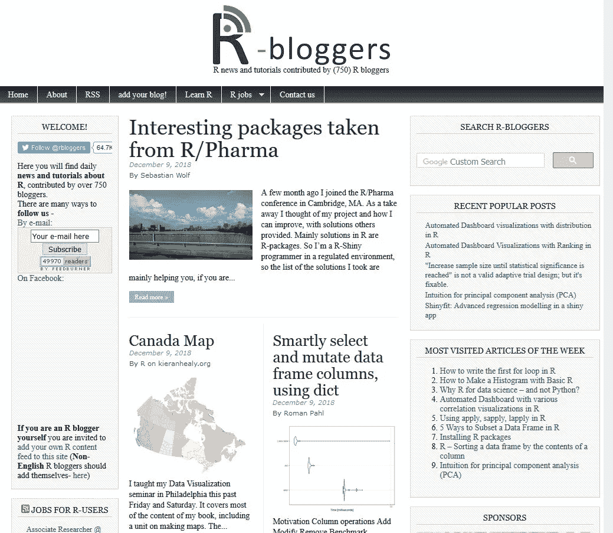

# medium+r-bloggers——如何整合？

> 原文：<https://medium.datadriveninvestor.com/medium-r-bloggers-how-to-integrate-fb176e13981d?source=collection_archive---------14----------------------->

[](http://www.track.datadriveninvestor.com/1B9E)

## 构建一个 PHP 脚本，允许你在 r-bloggers.com 上发布中型文章。该脚本通过条目标签过滤 RSS 提要。


Photo by [Ato Aikins](https://unsplash.com/@al_atoaikins?utm_source=medium&utm_medium=referral) on [Unsplash](https://unsplash.com?utm_source=medium&utm_medium=referral)

# 动机

我在媒体上开始了关于 R 的博客。Medium 是一个很棒的平台，有很棒的用户界面。使用它的想法来自于阅读郑中的一篇博客文章。在我写了两三篇关于 R 的文章后，我想在 r-bloggers.com 上发表它们。r-bloggers.com 需要你博客的 RSS 源。如果你使用 Wordpress 或 Bloggers，这是一个简单的功能。在 Medium 中，我注意到我的 feed 包含了我正在写的所有内容。还包括我的短评([https://medium.com/feed/@zappingseb](https://medium.com/feed/@zappingseb)):

r-bloggers.com 的维护者不希望这样的评论出现在他们的网站上。所以我开始阅读通过某些标签过滤我的文章。我发现实现这一点的唯一方法是在 PHP 脚本中。

# 将 RSS 读取到 PHP

为了将我的 RSS 提要读入 PHP 变量，我使用了内置的 XML 阅读器:

```
header('Content-Type: text/xml');$xml = new DOMDocument;
$url = "https://medium.com/feed/@zappingseb";
$xml->load($url);
```

# 遍历 RSS 文件

下一步是从 XML 中获取每一项(博客条目)。为了开始一次迭代，我首先需要将项目放入一个数组中。因此，我把 XML 写成了一本书。`documentElement`函数将创建这样一本书。从这本书里，我提取了所有在`channel`标签里的`items`。

```
$book = $xml->documentElement;// we retrieve the chapter and remove it from the book
$channel= $book->getElementsByTagName('channel')->item(0);
$items = $channel->getElementsByTagName('item');
```

为了存储所有过滤的项目，我创建了一个空数组。

```
$domArray = array(); //set up an array to catch all our node
```

我发现了一个很棒的关于如何从 RSS 中过滤关键词的 stackoverflow 条目。它为我提供了查找关键字的功能。所以我浏览了我的中型 RSS 源的所有条目。对于每一项，我都在标签`category`中获取了类别。遍历类别时，我检查了类别“r”是否在里面。如果是这样，我将变量`$found`设置为`true`，并停止对类别的迭代。如果`$found`变量从未设置为真，我将文章添加到`domArray`。必须筛选出域数组中的所有项目。

```
//For each article you can derive whether it contains a keyword in 
//it’s tags or not
foreach ($items as $i){

    $categories = $i->getElementsByTagName('category');
    $found = false; foreach($categories as $category){
        if($category->nodeValue == "r"){
           $found = true;
           break;
        }
    }
    if(!$found){
       $domArray[] = $i;

    }
}
```

# 过滤掉文章

我花了一段时间才理解 PHP 如何在内部处理 XML 文件。过了一段时间，我发现我可以在一个循环中删除所有项目。在我的`items`循环中不可能做到。所以我在文件末尾插入了这个循环:

```
foreach($domArray as $i){ 
    $channel->removeChild($i);
}
```

它采用存储所有`items`的`$channel`变量。然后，它删除那些不包含关键字`r`的。

# 打印出提要

PHP 和 R 的区别在于`$channel`是来自`$xml`的引用副本。这意味着代码不仅改变了`$channel`变量，还改变了`$xml`变量。这就是我可以立即写出`$xml`变量的原因。这个命令产生过滤的 RSS 提要。

```
echo $xml->saveXML();
```

# 最终学习



对我来说，去 r-bloggers.com 是一项艰巨的任务。我只是不得不拿出我所有的 PHP 老技能，并谷歌了很多。最后，我成功了。看到我的[帖](https://medium.com/p/e89639788180?source=your_stories_page---------------------------)真的很开心。我希望更多的人能从这篇博客中受益。很高兴能在 r-bloggers.com 看到更多的媒体内容。

*亲爱的读者:很高兴能写下我在* [*R 编程*](http://medium.com/@zappingseb) *方面的工作。感谢你一直读到这篇文章的结尾。如果你喜欢这篇文章，你可以在*[](https://medium.com/p/fb176e13981d)**或*[***github***](https://gist.github.com/zappingseb/e02bed95a46839756df14ac167c8b469)*上为它鼓掌。如有评论，请在此处***或在我的****LinkedIn****个人资料*[*http://linkedin.com/in/zappingseb.*](http://linkedin.com/in/zappingseb.)上留言**

## **最终文件:**

**我在我的 PHP 服务器上托管本教程的脚本。你可以在下面的要点中找到它。主办地点:[http://mail-wolf.de/documents/medium/](http://mail-wolf.de/documents/medium/)**