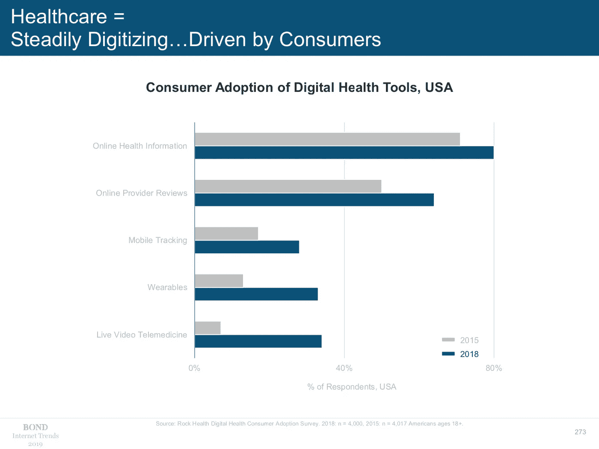
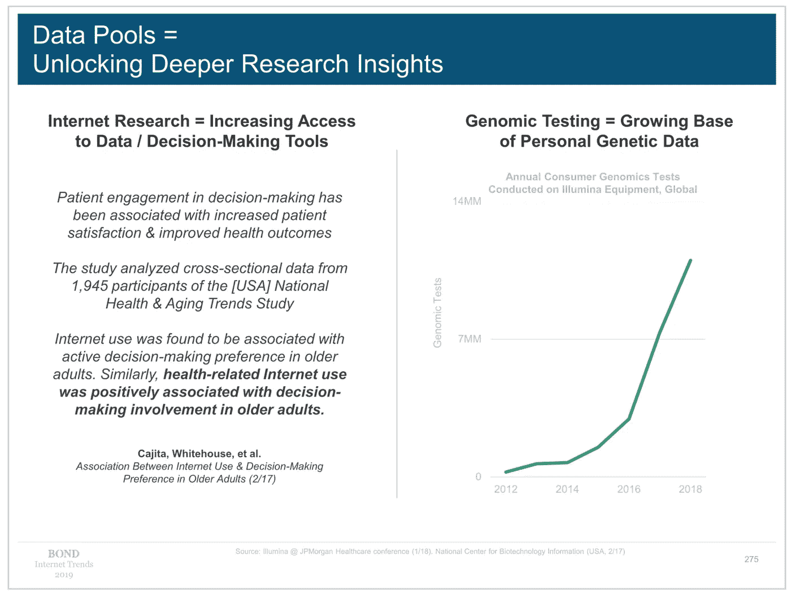
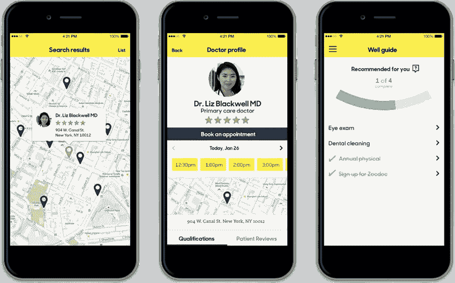
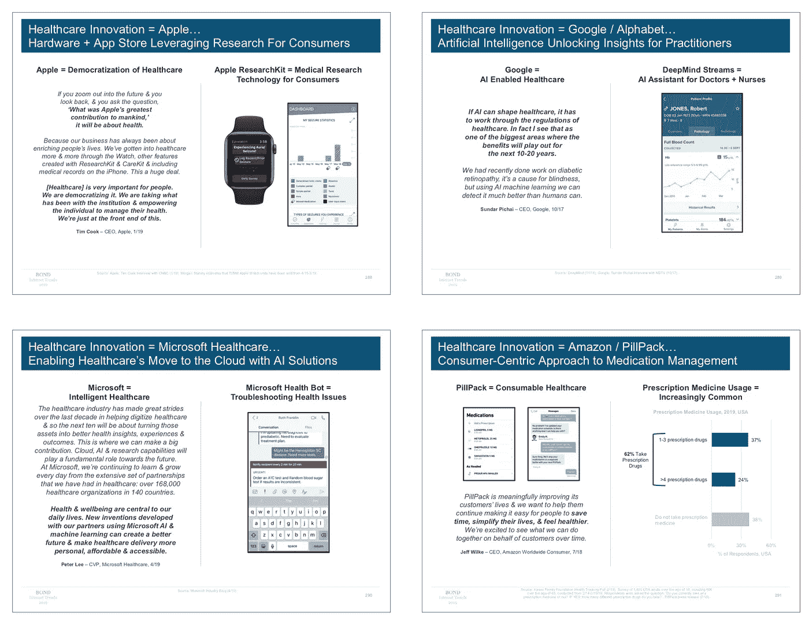
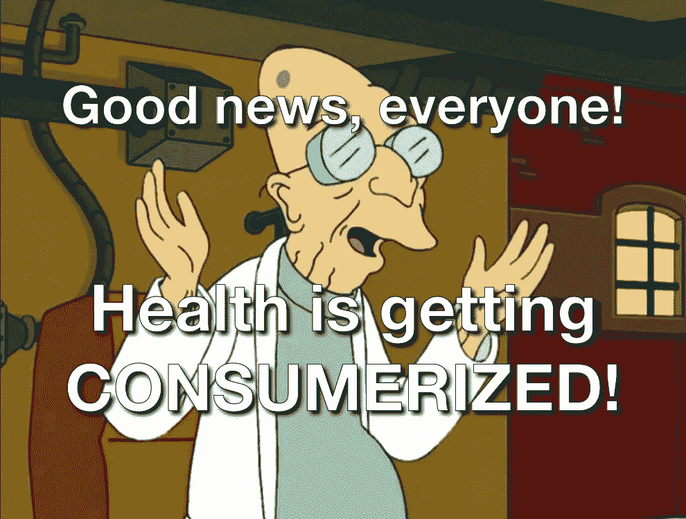

# 米克互联网趋势 2019: 3 个关键健康要点

> 原文：<https://medium.datadriveninvestor.com/meeker-internet-trends-2019-3-key-health-takeaways-6954dde27133?source=collection_archive---------8----------------------->

又到了一年中的这个时候:风投和科技分析师[玛丽·米克尔](https://en.wikipedia.org/wiki/Mary_Meeker)[刚刚发布了](https://techcrunch.com/2019/06/11/internet-trends-report-2019/)她备受关注的年度互联网趋势幻灯片([存档](https://www.bondcap.com/#archive))。没有时间查看所有 300 多个与健康相关的部分？让我概括一下她今年对健康和医疗保健的看法。

在去年的(左)中，米克指出，消费者支付的医疗保健费用比例正在增加，同时消费者对医疗保健体验的期望也在上升，这是由他们生活中其他各方面的 UX(便利性、个性化、更低成本)的改善所驱动的。这是否意味着消费者将最终开始更加关注医疗成本，并施加价格下调的压力？

 [## 医疗保健的未来正在被一场大型技术入侵所塑造|数据驱动型投资者

### 过去十年，全球经济的所有部门都经历了大规模的数字颠覆，而卫生部门现在…

www.datadriveninvestor.com](https://www.datadriveninvestor.com/2018/11/02/the-future-of-healthcare-is-being-shaped-by-a-big-tech-invasion/) 

嗯，我们不知道:在今年的[中](https://techcrunch.com/2019/06/11/internet-trends-report-2019/)，米克没有提供任何数据来表明消费者健康支出的整体减少。在指出美国在成本、效率和健康结果方面的不利结果后，她重点关注了三大要点:

# 1 —更多可用的健康数据

# 2 —改善医疗保健体验

# 3 —大型技术公司正在进入

Consumer adoption of digital health tools is soaring

但不要错过“消费者体验”这一至关重要的主题——这是健康和医疗保健消费化的长期转变的一部分。人们希望他们的处方、预约和健康记录都达到 Gmail、优步和 Hulu 的 UX 标准——尽管在许多情况下，这些东西都停留在 2005 年。激烈的竞争改变了这一点。

详情如下。你可以在这里观看与健康相关的幻灯片。

# 1 —更多可用的健康数据

Meeker 简要地谈到了由于 EHRs 的出现，大量数据正在数字化，渗透率接近 100%(注意到这一技术仍处于“早期阶段”)。

她还用幻灯片展示了基因组学；特别是消费者测试的日益普及，以及随之而来的基因组数据的巨大增长:

不过，她在这里的主要观点是，医疗保健的数字化是“由消费者驱动的”(见上面的幻灯片 273)。这一趋势包括数字远程医疗活动从 2015 年的约 10%渗透率增加到 2018 年的 30%以上，可穿戴设备的使用在同一时期增加了一倍以上。

来自所有这些采用的数据的增加是健康研究、管理和人工智能的增加使用的关键。

# 2 —改善医疗保健体验

米克谈论的大部分内容都与人工智能、机器人取代医生或占据医疗科技新闻报道的任何话题无关。她真正深入研究的是那些利用技术解决医疗保健系统效率低下的公司，这些公司让健康体验像优步或脸书的体验一样简单。

重要的是，与大多数电子健康记录系统非常不同的是，这些系统的引入非常不顺利(看看你的 Epic 和 Cerner！)，所有这些公司都独立运行自己的软件，而不是安装在卫生系统内。这是让他们瞄准消费级用户体验的关键。

Zocdoc mobile app

一个很好的例子就是[**Zocdoc**](http://www.zocdoc.com/)**(**[**@ Zocdoc**](https://twitter.com/Zocdoc)**)**，它利用一个现代化的网站和手机 app 为健康提供者提供排班服务。我自己也曾使用 Zocdoc 寻找和预约医生，我可以告诉你，这比打电话和等着与接待员交谈要好得多。

其他便利包括在线填写健康问卷(通常在等候室用剪贴板提供的 300 个问题长的调查)的能力，然后简单地编辑你的答案以供后续访问(而不是每年填写纸质表格)。

今年互联网趋势中健康相关公司的完整名单即将出炉。

另一个引人注目的条目，特别是在“保险技术”领域，是 [**奥斯卡健康**](https://www.hioscar.com/)**(**[**@ Oscar Health**](https://twitter.com/OscarHealth)**)**，它提供简化的健康保险计划、索赔和覆盖范围——以及调度和其他工具，旨在利用技术改善保险体验。[奥斯卡最新消息](https://www.forbes.com/sites/brucejapsen/2019/05/15/oscar-health-readies-2020-medicare-expansion-with-bigger-profits/#4539666f405e)。

The Oscar Health homepage

# 3 —大型技术公司正在进入

当然，不仅仅是初创公司和小公司进入健康领域，Meeker 通过观察苹果、微软、谷歌、亚马逊以及他们对健康日益增长的兴趣来总结幻灯片的健康部分。

The big dogs of tech move into health

1.  **苹果**——“苹果=医疗保健民主化”——引用蒂姆·库克的话，米克谈到了苹果的[健康应用](https://www.apple.com/ios/health/)，访问 EHR 记录，以及将 [ResearchKit](http://researchkit.org/) 和 [CareKit](http://carekit.org/) 等消费者工具分别整合到医学研究和消费者-供应商互动中。与此同时，苹果手表(米克没有特别提到)的销量继续飙升。
2.  **谷歌**——“人工智能为从业者开启洞见”——这里米克提到了[由](https://deepmind.com/applied/deepmind-health/) [Deepmind](http://www.deepmind.com/) 创建的 Streams 应用，它以前是独立的，但[很快将成为谷歌](https://deepmind.com/blog/scaling-streams-google/)的完整组成部分。Streams 是英国 NHS 目前在美国使用的一种工具，旨在通过更好地管理患者数据(包括测试结果)来提高治疗效率。Streams 获得了很高的分数，同时也引发了围绕数据隐私保护的争议，但很明显，谷歌希望改善 Streams，包括现在通过加入人工智能。
3.  **微软**——“通过人工智能解决方案实现医疗保健向云的转移”——这里的重点是向“超过 168，000 个医疗保健组织”推出云服务，这些服务包括微软的[人工智能医疗保健机器人](https://azuremarketplace.microsoft.com/en-us/marketplace/apps/microsoft-hcb.microsofthealthcarebot)，这是一套工具，使医疗保健组织能够发挥人工智能聊天机器人和“虚拟健康助手”的作用
4.  **亚马逊/pill pack**——“以消费者为中心的药物管理方法——亚马逊的药物配送服务，[于去年收购](https://www.cnbc.com/2019/05/10/why-amazon-bought-pillpack-for-753-million-and-what-happens-next.html)，旨在将以消费者为中心的 UX 引入处方药使用。Pillpack 因其对客户友好的包装而受到称赞(尽管[就在本周，它因涉嫌侵犯用户隐私而被起诉](https://www.beckershospitalreview.com/pharmacy/amazon-s-pillpack-pharmacy-accused-of-violating-customer-privacy.html)，它可以成为亚马逊对抗 CVS 和 Walgreens 争夺 5000 亿美元处方药市场的有力武器。

# 今年的互联网趋势中提到的健康相关创业公司的完整列表即将发布。

*这个故事最初发表于* [*未来健康*](https://futurehealth.live) *。*