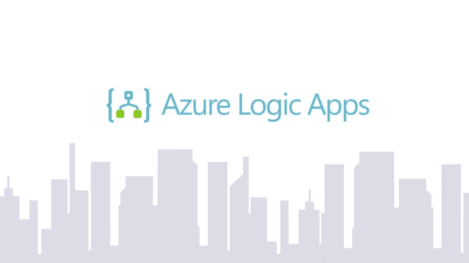
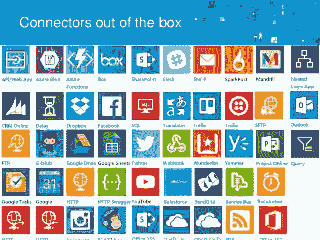
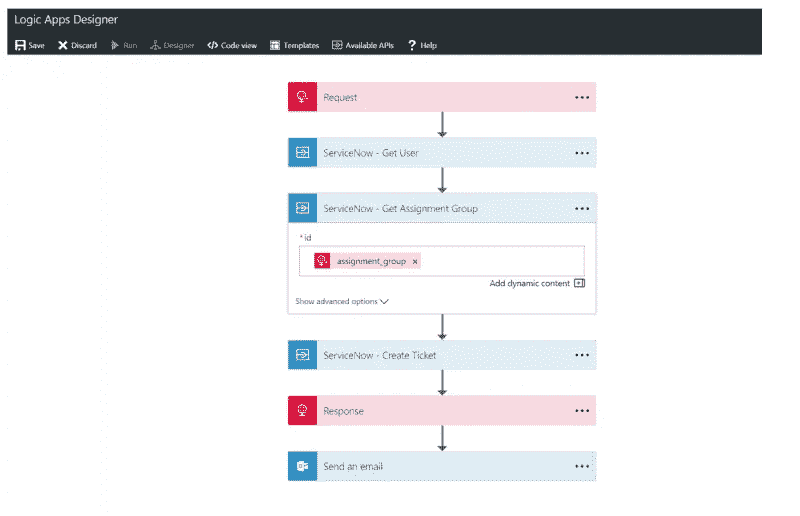

# 了解 Azure Logic 应用程序，了解它们的惊人优势

> 原文：<https://medium.datadriveninvestor.com/meet-azure-logic-apps-to-know-its-amazing-benefits-e2a622b06907?source=collection_archive---------1----------------------->

想知道什么是 Azure Logic 应用吗？别担心，我会掩护你的！

Azure Logic Apps

A zure Logic Apps 是一种云服务，当您需要跨企业或组织集成应用、系统、数据和服务时，它可以帮助您自动化和协调任务、业务流程和工作流。Logic Apps 简化了您为应用集成、数据/系统集成、企业应用集成和企业对企业(B2B)通信设计和构建可扩展解决方案的方式，无论是在云中、内部还是两者兼有。

***这里有一些你可以使用 Azure logics apps*** 的例子

1.  当您的系统、应用或服务出现问题时，发送电子邮件通知
2.  将文件从 SFTP 或 FTP 服务器移动到 Azure 存储
3.  监控 Twitter 上的推文，对其进行情感分析，为需要审查的推文创建警报
4.  只需切换几下开关，就可以改变应用程序的逻辑，不需要部署整个代码库

> 这些也是一些好处，当你继续阅读下面的内容时，你会对它有更多的了解。

看看下面的一个短片

借助于现成的 ***连接器*** ，可以使用 Azure logic 应用构建企业集成解决方案。当您使用 Azure Logic 应用程序创建自动化工作流时，连接器是不可或缺的一部分。通过在您的逻辑应用程序中使用连接器，您可以扩展内部部署和云应用程序的功能，以使用您创建的和已经拥有的数据执行任务。

Out of the box integration with Connectors

# 连接器的组件

每个连接器提供了一组被分类为“动作”和“触发器”的操作。一旦连接到底层服务，就可以在应用程序和工作流中轻松利用这些操作。

## 行动

动作是由用户指示的改变。例如，您可以使用一个操作来查找、写入、更新或删除 SQL 数据库中的数据。所有动作都直接映射到 Swagger 中定义的操作。

## 扳机

一些连接器提供了触发器，可以在特定事件发生时通知您的应用程序。例如，FTP 连接器具有 OnUpdatedFile 触发器。您可以构建一个逻辑应用程序或流来监听这个触发器，并在触发器触发时执行一个操作

有两种类型的触发器。

**轮询触发器:**这些触发器以指定的频率调用您的服务来检查新数据。当新数据可用时，它会以该数据作为输入，重新运行您的工作流实例。

**推送触发器:**这些触发器监听端点上的数据，也就是说，它们等待事件发生。此事件的发生会导致您的工作流实例重新运行。

当然，它确实有很多好处，或者说为什么你应该考虑使用 Azure Logic 应用。

1.  **可视化地创建自己的业务流程和流程** 许多面向业务的流程和系统集成都是由逻辑应用程序提供的现成产品。它们从触发器开始按逻辑顺序执行。连接器变得很方便，使你所有的任务都很容易，如发送电子邮件通知等。上线的时间真的很快。
2.  **web、移动应用程序、API 应用程序和更多应用程序的广泛集成**
    Azure logic 应用程序作为单一集成服务提供，与网站、移动应用程序、API 和业务流程兼容。Rest APIs 和 JSON 有助于通过 HTTP 轻松连接。
3.  **没有可扩展性问题**
    由于一切都由 azure 处理，您可以满足客户和顾客不断增长的需求。大规模交付应用程序只是你的一杯茶。
4.  **无设置成本**
    由于所有事情都由微软 Azure logic apps 管理，因此不涉及任何设置成本。只有在执行逻辑时，您才需要支付费用。就这么简单。
5.  **额外收获——性能提升**
    创建逻辑非常简单，因为有内置模块来拯救。它间接导致项目更快地交付给最终用户。
6.  **通过监控获得更多见解**
    在 Azure Logic Apps 的帮助下，组织可以深入了解其应用程序的状态。在 Azure OMS(运营管理套件)的帮助下，Logic Apps 提供了强大的诊断和审计功能。可以很容易地监视和跟踪对数据的定制查询的创建。这里还支持定制的 PowerBI 报告生成。
7.  **简化的工作流程定义**

> 参数、触发器、动作、输出是任何逻辑应用程序的主要部分。

**参数**是您希望在工作流程中重用的东西。在整个定义中重用值甚至复杂的对象会使理解变得更容易。将配置从定义本身中分离出来使得共享变得容易，也使得跨不同环境的共享变得容易。

**触发器**启动逻辑应用程序。触发器可以定期评估，或者在执行过程中保持其状态。

**动作**是发生在逻辑 App 中的事情。动作可以依赖于其他动作。依赖关系将决定动作执行的顺序。在执行过程中也会保持这种状态。

**输出**是从调用中发送到工作流中的内容。

Sample workflow created using Azure Logic Apps

我希望 azure 逻辑的基础已经很清楚了，并且您现在已经准备好开始实际的实现了。😄

要更详细地了解 azure logic 应用，请点击这里的链接

 [## Azure Logic 应用程序文档-教程、API 参考

### Azure Logic Apps 简化了您构建跨云集成应用和数据的自动化可扩展工作流的方式…

docs.microsoft.com](https://docs.microsoft.com/en-us/azure/logic-apps/) 

快乐学习！💻