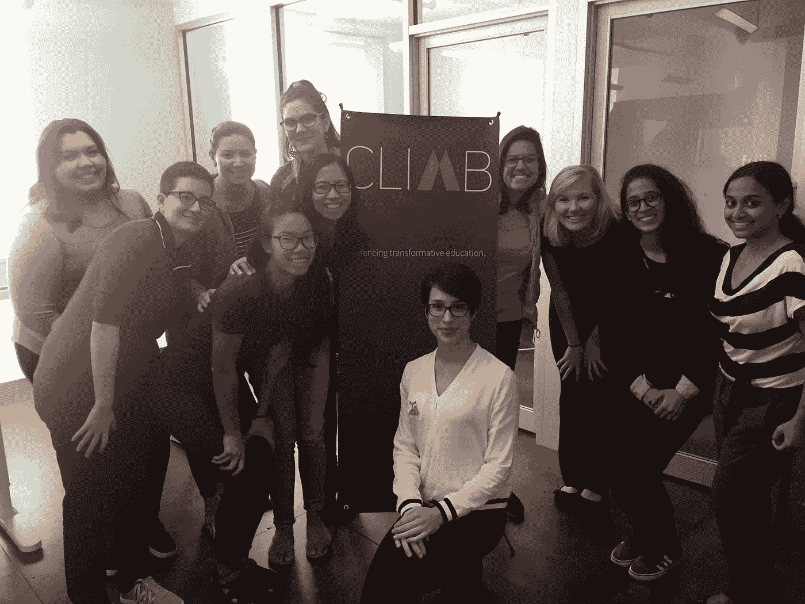
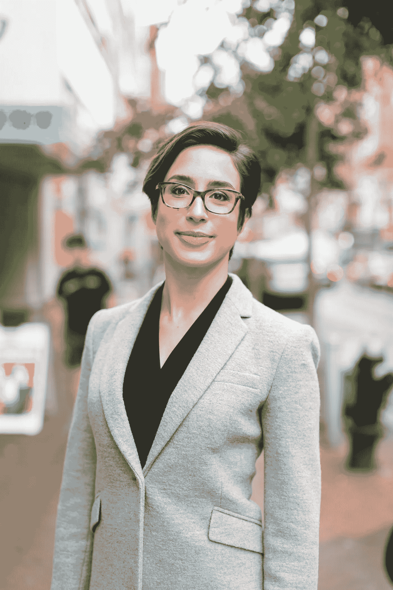

# 在 Climb Credit 认识一些女性技术人员！

> 原文：<https://medium.datadriveninvestor.com/meet-some-of-the-women-in-tech-at-climb-credit-8001f0cd46b9?source=collection_archive---------21----------------------->

*Clockwise from upper left: Rose, Lily, Rachel, Angela, Laura, Aarthi, Aashritha, Thea, Susan, Victoria, and Sara (not pictured: Karuna, Katie, Anna, Brianna, Alexis, Rae, Tracey, Jazmyn, Luisa, and Casey)*

国际妇女节快乐！为了庆祝，我们重新发布了来自 [**攀登博客**](https://climbcredit.com/resources/) 的一篇我们最喜欢的文章的一部分，充满了来自我们公司几位女性的灵感和动力。

我们与担任不同技术职务的五名员工进行了交谈，以了解他们的更多经历。阅读下面的内容，听听阿尔泰、安吉拉、萨拉、苏珊和西娅的意见:

# Aarthi，数据科学家和工程师

## **是什么先让你进入** [**数据科学**](https://climbcredit.com/resources/bootcamps/industry-spotlight-data-science/) **？**

我一直从事 STEM，但直到我开始攀登，才真正进入科技或工程领域。之前，我非常热衷于学术科学和研究。事实上，在攀登之前，我正在攻读神经科学博士学位，大约三年半后，我转行了。也就是说，我一直对数据感兴趣，并从数字中获得洞察力，我觉得这是一个非常强大的工具——非常容易获得，现在比以往任何时候都更容易。

## **尽管你最初从事的是神经科学，但你是否总是被科技角色所吸引？**

我想是的，尤其是我一直对研究和数据感兴趣。它太容易接近了；这是一种通用语言。你可以搬到国外，仍然致力于令人难以置信的有趣的问题，做出有意义的改变，并与许多令人兴奋的人和行业建立联系。数据真的很强大。

## **你希望在进入科技行业之前有人告诉你什么？**

你永远不会知道一切。这不是关于记忆概念，这是我以前经常接触到的。事物总是会变化的，从语言到技术到设计模型的方法。因此，能够适应不断变化的行业和技术是有用和关键的。你永远不会知道所有的事情——对变化和你如何应对变化充满信心。

## **你为什么以身为科技界女性为荣？**

我喜欢拥有自己的背景，把它带到这里，并为那些想这样做的人辩护——那些想改变职业的人，或者那些想进入一个与他们没有必然联系的领域的人。我喜欢处在这样一个位置，我可以帮助别人，倡导改变，倡导努力实现目标。

# 安吉拉，首席执行官

## 是什么让你第一次进入科技领域？

在我学校生活的大部分时间里，计算机肯定是存在的，但我可能只认识一两个给计算机编程的人。这是一件非常陌生的事情，我真的不明白。但是我非常擅长数学，我有一个朋友正在攻读工程学位。当她发现我第一学期微积分学得很好时(我甚至不认为我有专业，但我想可能是心理学)，她说，“哦，你应该成为一名工程师”…所以我觉得我在技术方面有两种不同的经历。事实上，我有一个工程学位，我职业生涯的前半部分是在编程，但在不被认为是技术的大公司，然后过渡到技术公司，但不做编码。

## 你在哪里学的编码？

我在大学(密歇根大学)学过如何编程，但在我的整个职业生涯中，我从未真正使用过我在大学里学过的程序。我认为学习如何编码很酷的一点是，它就像学习其他语言一样……一旦你学会了一种，学习下一种就容易多了。所以，如果你学习 C++，学习 JavaScript 会变得容易得多，因为你已经理解了一些基本概念。

## **谁是你的科技灵感？**

从更技术性的角度来看，《T4》中的女性隐藏人物(T5)——我和我女儿一起看了那部电影，我想，“这些女人太棒了……”我记得当我在 2000 年报名参加工程学课程时……绝对有一种“等等，你为什么在这里？”的耻辱感有人发现，甚至现在，我知道如何编码，并说“哦，太可爱了……”今天，另一个灵感来自雪莉·桑德伯格。我喜欢她有自己的观点，并且坚持自己的观点，她似乎真的很擅长自己的工作。

## 对想进入科技行业的女性有什么建议吗？

不要因为你可能是房间里唯一的女性而害羞或紧张。因为你有一个独特的视角，如果人们给你一个艰难的时刻，或者告诉你你很“可爱”，因为你可以编码，或者这个或那个，那是关于他们的，不是关于你的。

# Susan，分析主管

## **你在哪里学的数据分析？**

当我在大学的时候，我学习东亚文学和政治经济学。一毕业，我就去了一家经济咨询公司，在那里我学到了更好地分析数据的大部分技能。我的许多同龄人从大学毕业时已经接受了某种程度的技术培训，而我却完全没有。然而，接受基础广泛的教育是有好处和价值的。我认为最重要的是对世界的不同方面保持好奇，并寻求答案！如果你想进入这个领域，不要太担心没有合适的技能。互联网是一个很好的资源，现在你可以去所有这些编码训练营学习这些技能。参与度和兴趣更重要！

## 你认为作为一名从事科技行业的女性会遇到什么特殊的挑战吗？

我很幸运能在一家公司工作，在这里，作为一名女性，我绝对不会感到排斥或耻辱。但我认为这是一个有点不寻常的现象。你应该对自己带来的东西有信心，不要让任何人不必要地诋毁你。但是请记住——你需要在以下两者之间取得平衡:既要足够开放地接受建设性的反馈，又要意识到你得到的反馈是否对你的工作质量没有帮助或无关。

## **对想从事数据分析的女性有什么建议吗？**

现在这是一个男性主导的领域……在我以前的工作中，我所在的团队都是男性居多。我的建议是记住这一点，尽管这是目前的现状，但这取决于你来改变这些事情。

## **作为一名科技界的女性，你为什么感到自豪？**

科技是一股非常强大、卓越的力量，它将推动未来的发展。事实上，无论是通过劳动力自动化、加工效率还是新发明，它已经在美国经济的不同部门中重塑行业标准。因此，我认为重要的是，妇女将自己融入这些力量，并将其引导到我们认为最紧迫的问题上，这样我们的声音才能继续被听到，我们的政治和经济影响力才能增长。

# 西娅，软件工程师

## 是什么让你第一次涉足软件工程？

生来就喜欢数学…我很早就对数学和科学感兴趣，在整个大学期间我都远离了它，然后在中间的几年里我意识到我想回到它。但正是在这里工作，我才能做到这一点。

## **你在哪里学的编码？**

[**总装**](https://climbcredit.com/resources/updates/employee-profile-thea-enos/) 。这真是不可思议——我一直感谢有这样的准备。当我现在在工作中遇到事情时，我能记得老师或助教给我们的提示，或者告诉我们要注意的事情，或者只是如何解决问题的一般指导原则。现在看到这是如何进行的，以及它如何仍然是我们正在进行的事情的一部分，这很酷。

## **你认为作为一名女性从事科技行业会有什么特殊的挑战吗？**

我很幸运没有直接碰到他们中的许多人。但总的来说，女性一般不会和男性做同样多的工作得到同样多的报酬……一般来说，女性往往不被信任她们知道自己在做什么，尤其是在科技领域。可能会有这种不断需要证明自己的感觉，过一段时间后会很累…但幸运的是，这不是我在攀岩或在这里工作时感受到的。如果我遇到这种情况，那是在社交场合与人见面时，说到经典的“哦，你是做什么的？”对话。

## 你希望在进入科技行业之前有人告诉你什么？

不能马上得到一切也没关系，纠结事情也没关系。这并不意味着你不应该这样做。从很多方面来说，你的力量和解决问题的能力的来源是能够解决这些问题，并对你不知道的事情感到舒服。因为尤其是编程，几乎所有的事情你都不会知道，关键是你要能够理解它，并且相信你会理解它，即使你现在一点也不理解。

# 萨拉，前首席产品官

## 你在哪里学的产品管理？

这是我在工作中学到的东西之一，我仍在学习。我上大学时，甚至不知道它的存在。但是我喜欢逻辑地思考问题，最后我去了法学院，学了专利法。通过这项工作，我了解到有一些人被称为产品经理，他们了解一些代码，并参与产品开发和产品战略，这也是非常符合逻辑的，但也可以与业务方面的人交谈。这是一个奇怪的领域，因为如果你问 100 个人，他们会给你 100 个不同的定义，所以我只是通过阅读和实践来学习，而不是任何正式的培训。

## 谁是你的技术灵感？

我认为真正令人钦佩的一个人是 Deb Liu。她是脸书公司的产品副总裁，虽然我在那里的时候没怎么和她共事，但她说话的方式总是让我印象深刻。我最近在脸书发现了这个“产品中的女性”小组，并加入了这个小组，结果发现黛比是联合创始人。因此，尽管她是脸书的副总裁，可以做任何她想做的事情，但我看到她在网站上——人们在问关于脸书针对新人的轮岗产品经理计划的问题，我看到她在网站上说，“哦，我可以看看你的简历。”我觉得她愿意这么做真的很酷。

## 你认为作为一名女性从事科技行业会有什么特殊的挑战吗？如果有，是什么？

我不知道这是否与技术有关，但我肯定人们对我的反应不同，因为我是女性。人们认为像脸书这样的公司一定是完美的，因为他们有雪莉·桑德伯格，但如果你仔细想想，她是在脸书工作五年后写的。所以这也是科技行业女性的生存指南。

还有鲍康如，她是一个非常坚强的人，敢于说出自己受到的待遇。我希望这可能是一个转折点，因为现在你看到更多的女性在优步这样的公司谈论科技领域的性别歧视，人们终于开始倾听了。不过，我不认为问题得到了解决——硅谷是一个真正同质的地方，随之而来的是女性不得不面对的许多无意识的偏见。

所以，如果你是一名从事科技行业的女性，我觉得你必须比她优秀四倍。这很难，但也是可行的。

## 对想进入科技行业的女性有什么建议吗？

不要气馁。找到导师，找到类似“产品中的女性”小组的东西，因为女性需要互相帮助。我们在技术上是少数派，所以我们必须团结一致，互相帮助。谈谈你的经历。

*编者按:2018 年 5 月 24 日，Angela 在这篇文章中的职称从她以前的首席运营官更新为她现在的首席执行官。*

*最初发表于***。**