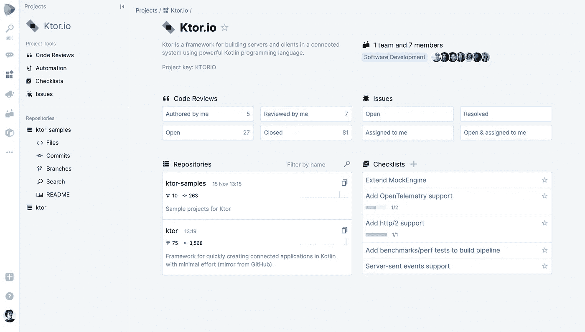

# 遇见空间 JetBrains 的新产品

> 原文：<https://medium.datadriveninvestor.com/meet-space-new-product-from-jetbrains-fb6646c6cadd?source=collection_archive---------9----------------------->

在 KotlinConf，JetBrains(一家开发开发工具的国际公司)推出了新的太空产品，并启动了早期访问计划。

在这篇文章中，我们将告诉你空间能做什么，以及它能解决的任务和问题。您可以在下面的视频中观看演示录音。

太空是一个综合的团队合作环境。Space 的主要功能包括托管 Git 存储库、代码审查、基于 Kotlin 脚本的自动化(CI / CD)、包存储库、规划工具、任务跟踪器。对于富有成效的交流，Space 提供团队和员工的简介、聊天、博客、日历、安排会议的能力等等。

像许多 JetBrains 产品一样，太空已经成为太空创造者自身挑战的解决方案。他们已经从一个三名开发人员的团队发展成为一个拥有 1200 多名员工的公司，其中 60%是技术专家。在某个时候，他们意识到他们正在使用不同的、不相关的工具，这通常会导致误解，降低沟通效率，有时还会导致重要信息的丢失。因此，JetBrains 团队决定创建一个产品，成为所有团队工作的单一环境。

 [## 敏捷管理:好的、坏的、丑陋的|数据驱动的投资者

### 公司不断重塑自己，以获得或保持竞争优势和市场份额。这是…

www.datadriveninvestor.com](https://www.datadriveninvestor.com/2019/03/26/agile-management-the-good-the-bad-and-the-downright-ugly/) 

团队是太空中的主要概念之一。一个新的团队成员自动获得所有与她相关的资源:会议、博客文章、存储库、日历、聊天频道、假期安排等等。这消除了创建组和手动添加新同事的需要。

空间功能可以通过几种方式扩展:使用 HTTP API、webhooks 或客户端 SDK 来与外部系统集成。空间数据模型可以通过自定义字段进行扩展，在未来，JetBrains 开发人员计划使用 Kotlin 上的脚本添加自动化流程的能力，并为自托管版本开发成熟的插件。
产品发布和计划

**空间已经有:**

*   博客
*   聊天
*   小组管理
*   Git 存储库托管
*   代码审查
*   包存储库
*   规划工具
*   任务跟踪器
*   IDE 集成

**在不久的将来，他们计划向早期接入参与者开放:**

*   知识库
*   空间内的过程自动化
*   CI / CD
*   个人任务列表和通知管理

你可以在[网站](https://www.jetbrains.com/space/)上了解更多关于太空的信息。

早期访问计划已经对云版本的空间开放。要参加该计划，请提交申请。它将按照收到的顺序进行处理。

我们相信这项服务可以成为现有服务的有力竞争者。关注我们的新闻并订阅时事通讯。

*原载于【https://geniusee.com】**。***