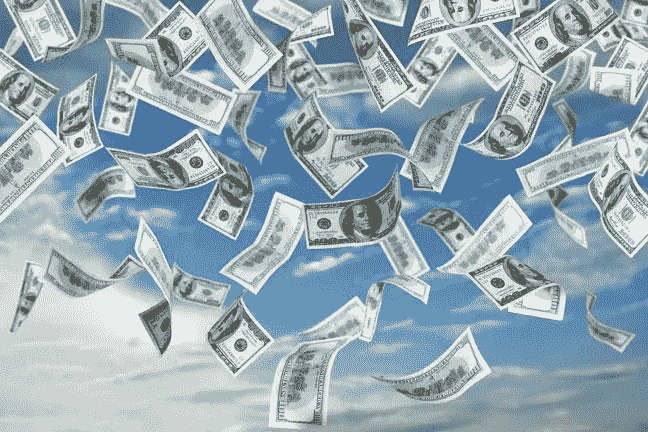

# 百万富翁&我的文化

> 原文：<https://medium.datadriveninvestor.com/mega-millions-the-culture-of-me-ea47eafc6581?source=collection_archive---------10----------------------->

Me me me!!!

昨晚是我有生以来第一次记得彩票头奖达到 10 亿美元的夜晚。今天早上我醒来发现没有人中奖，头奖现在达到了惊人的 16 亿美元。这很可能以前发生过，因为我不太关注彩票，但我肯定不记得了。在我的一生中，我只在有人大肆宣传的时候买过彩票，还不算有几次口袋里的彩票的魅力比意识到这句谚语是真的更强大:彩票只是数学不好的人的赌博。

不管怎样，昨晚我回到家，刚刚感到舒适，我打开了新闻，他们正在谈论几个小时后的超级百万彩票抽奖。我原以为只有周一晚上我们才会买票，但结果是周一和周五，因为昨天是周五。但是似乎下一次是在星期二，所以——谁知道呢！无论如何，我开车到了街上的加油站，在那里我看到了橱窗里的 999，999 美元，是的，还有一条线。我走得太匆忙了，以至于没想到带眼镜，但因为我决心至少手工填写一些彩票并选择我自己的号码，我不得不向某个家伙借了笔和眼镜，当他看到我眯着眼看着粉红色的小纸片时，他好心地给了我。他完成了他的选择，只是在附近徘徊，品味空气中弥漫的嗡嗡声，像我这样的人来购买我们最后一分钟的门票。我上次做*那个是什么时候？！？*我买了价值 20 美元的彩票——10 美元是亲自挑选的，10 美元是快速挑选的。

“祝你好运！”当我手里拿着彩票走出去时，我数学不好的新朋友叫了我一声。

“你也一样！”我回答道。

当我回到舒适的沙发上时，我开始思考这个问题，我突然意识到这是多么有趣，比方说，一百万美元和十亿美元之间的差别就是我出去买一张票所需要的。我都不记得上次买彩票是什么时候了。但在这里，我们显然越界了。十亿美元。我怎么能错过呢？界限在哪里？我猜不到 10 亿，因为我想周日当我第一次听到大奖的消息并买了几张快速照片时，它只是 5 亿。事实是，即使是百万美元的零头也会对我的生活和大多数人的生活产生巨大的影响。唯一不会受到巨大影响的人是那些已经很富有的人。所以有趣的是，只有当头奖从荒谬的高到荒谬的高时，我才会去彩票柜台。

我想所有关于大奖的闲聊和它所创造的实实在在的轰动效应是一个激励因素。但现实是，没有人需要十亿美元。整整一百万美元可以让一个人的生活发生巨大的变化。提醒一下，数学奇才，十亿就是十亿。所以，想想一百万美元会给你的生活或你认识的人的生活带来的变化，然后乘以一千。

我们表现得好像我们的金融体系是上帝注定的，但事实并非如此。这是一个人为的系统，它是有缺陷的。让我们讲道理，在某个地方有个天花板。让我们降低贪婪和自私的门槛。我不是在谈论降低头奖奖金，我是在谈论摆脱这样一种观念，即你永远不会有太多的钱，任何数量都不会太多，不管你赢了多少，赚了多少，或继承了多少，你需要多少都有一个上限，甚至超越你最疯狂的梦想。在这个计算中，我们需要唤起同理心，制定一个像国王一样生活的计划，同时照顾你的家人和朋友，但然后将这种照顾扩展到陌生人，他们的生活将受到你不会错过的多余现金的深刻影响。

我读了这个月的统计数据，杰夫·贝索斯 10 秒钟挣的钱比大多数人一年挣的还多。随着亚马逊的价值与日俱增，这个数字现在可能还在增加，据我所知，贝佐斯持有亚马逊四分之一的股票。好极了，杰夫·贝索斯，但这是错误的，因为没有人的生命比其他人的生命更有价值。对冲基金大佬们也是如此，他们一周的收入足以让任何一个 12 口之家从此过上幸福的生活。

同样，我们此刻都在关注穆罕默德·本·萨勒曼和他包着头巾的亲信们，他们正在努力寻找一个可信的故事来解释谋杀和锯成碎片的快乐记者 Khashoggi 的细节。穆罕默德·本·萨尔曼(Mohammed bin Salman)通常被称为 m . b . s——在我心中，这将永远代表骨锯先生——他不喜欢讨厌的报纸上出现关于他自己和他的恶心政权的令人不快的真相。但除了这种明显令人厌恶的策略之外，还有一个事实，那就是 M.B.S .和他尖叫的酋长们是财富错位的典型代表。他们和其他像他们一样从黑金中成长起来的人是活生生的证据，证明我们的货币体系存在严重缺陷，与大脑、文化、体面或任何与价值相关的东西完全脱节。

石油的价值只是一个例子，说明财富并不总是基于价值，而是可以基于机会和各种各样的东西。我们需要工资帽。没人需要赚 10 亿美元。杰夫·贝索斯现在身价超过 2000 亿美元。人们饥肠辘辘，苦苦挣扎，只要有一点点额外的现金，生活就会有显著的改善。免费大学教育——我指的是税收支持的教育——是显而易见的。伯尼说得对。关于社会主义和共产主义，所有的狗哨和警钟都会在蠢人的头脑中响起；让那些无知的钟声静音，不要从那些热门词汇让你思考的下意识反应来思考这个问题，而是从 21 世纪有意义的角度来思考。一旦我们接受了一个人应该挣多少、继承多少或赢得多少是有限度的这一事实，那么这对我们的整个金融体系又意味着什么呢？我们能做得更好吗？我们如何创新我们的金融体系，让竞争环境变得更加公平？这不会侵犯任何人的可用财富和你在银行里的亿万美元。不要惊慌。我不知道答案，但我们肯定可以集体想出更好的办法，而不是像我们习惯的那样，在一个功能失调的系统上滑行？

昨天早上在火车上谈论这个话题时，一位朋友向我建议，解决这个问题的办法不是通过工资帽，而是通过一种遗产税，在富人去世后，一定比例(取决于他们的财富归入哪个阶层)归政府所有。这不仅会回报更大的社区，让它向前支付并缓解贫困者的压力(与叙述相反，他们也不都是懒惰的)，而且还会恢复那些亿万富翁的子女的激励，让他们自己创业和创新，而不是在继承遗产的基础上无所事事。

这非常有趣，因为我们认为我们的金融体系是完美无缺的。我们知道事实并非如此。甚至在我们第一家国家银行的时代，亚历山大·汉密尔顿就明白信心是游戏的重要组成部分。这是一个容易出错的人造系统，而且是有缺陷的。我们需要找回我们曾经失去的爱国主义精神，这种精神曾激励我们去改善那些破碎的东西，包括我们的金融体系，事实上，还有我们政府体系的许多方面。我们需要重新点燃国父们的爱国心，这样我们才能扪心自问:我们如何才能做得更好？我知道贪婪无处不在，退一步说，我们的机会渺茫——但我有一美元和一个梦想！