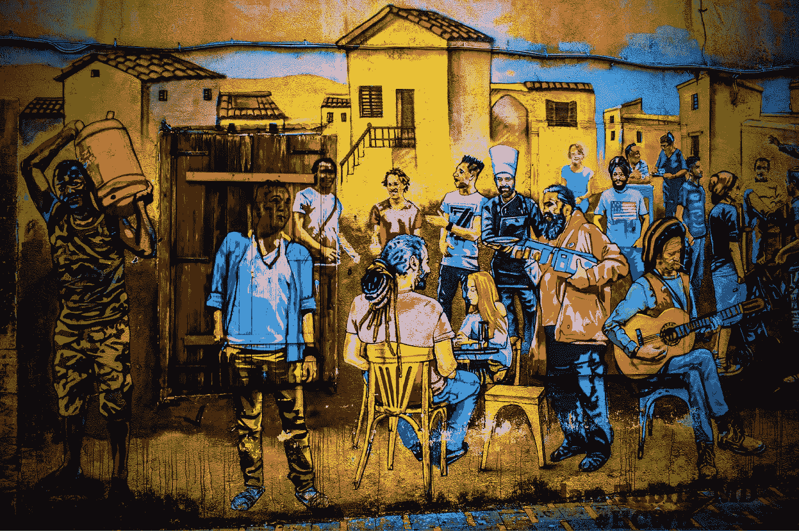

# 移民的大熔炉

> 原文：<https://medium.datadriveninvestor.com/melting-pot-state-of-immigration-and-its-miss-applied-metaphoric-description-of-endowing-societal-97232dd54d48?source=collection_archive---------4----------------------->

## 赋予社会同质性的扭曲隐喻解释

Immigration

从亚当和夏娃的出现或者智人的进化开始，几个世纪以来，现代人一直在急切地寻找与同类和谐相处的方式，同时保持自己的优势和安全。为了达到这样的姿势，几个世纪以来，他不得不重新学习一种基本技能。这不是人类独有的社交技能，但肯定在直立哺乳动物身上要复杂得多。因为人类带有一种独特的血统特征，因此被称为“贪婪”，或者对那些有宗教信仰的人来说是“邪恶的”当然，考虑到这一点，人类必须找到一个集体的共同领域来忍受和珍惜固有的自欺欺人的需求，或者只是在个人自我中与之斗争。经过几代人的努力，在种族、肤色、地理位置、语言和宗教等共同特征下整合、捆绑思想和剖析的新发明对现代人类变得更有吸引力和时尚。

# 历史、政治和修辞蔑视支持大熔炉漫威

正如历史向我们展示的那样，从塑造自己的机会进一步发展到为组织团结提供共同基础的类别，这是一个以放弃个人身份或个性为代价的选择。通过进一步加强他们的合并，这个人通过形成某些政治团体，把他的新雄心带到了下一个层次，从而发展到更大的规模，并超越了发展中社会、国家和大陆的直接和有限的边界。

人类学会了将基本的个人协作，如群体狩猎和耕作，纳入更复杂的[整合，](https://medium.com/datadriveninvestor/the-concept-of-collaboration-and-consolidation-exploiting-our-differences-to-unify-on-a-common-45922b9ecc46)包括政党和工会。如前所述，首先，这种统一与某些意识形态和修辞动机相关联，因此受制于定义明确的人为可变性。

 [## 保护主义、政治和经济动荡|数据驱动的投资者

### 美国股市昨日出现 400 多点的大幅反转，为未来的事情发出了警告信号。市场…

www.datadriveninvestor.com](https://www.datadriveninvestor.com/2018/06/28/protectionism-politics-economic-turmoil/) 

合并主要是建立在天真的、理想主义的概念上，比如运动队，到更具侵略性的政治战争游戏，都有潜在的间谍动机。例如，我们大多数人所熟悉的马克思主义理论，仅仅鼓吹“**阶级战争**”的宏大。

作为一类共产主义学说，马克思主义通过创造一个所有财产都是国有的社会来消除。在这个空间里，每个人都根据自己特定的能力和需求工作和赚钱，而不一定是基于他们个人的创造力和需求。

马克思主义理论与另一端的资本主义形成对比。后者的概念基于一种经济和政治制度，在这种制度下，一个国家的金融事务和产业由私人所有者为了利润而控制，而不是由国家为了社会福利而控制。历史上许多国家都实行过不同程度的社会主义，每个国家都处在资本主义和共产主义之间。在政治彩虹中，人们可以很容易地找到这样的人，他们在不同程度上相信建立一个社会组织，支持生产、分配和交换应该由社区拥有或管理的观点。

尽管纯粹的共产主义和资本主义在 21 世纪的政治舞台上已经不复存在，但具有不同结构和极端倾向的混合模式仍然存在，它们拥有某种程度的统一宣传和意识形态。因此，这只是说，资本主义政策的成熟教科书式的方案从美国政治舞台上消失了，尽管宪法指出支持这样的方案。事实上，这一现实是这个国家意识形态冲突和立法失灵的主要原因。

一个拥有独立主权公民的社会和极端社会主义治理之间的主要分界线，不同于合作与整合中的变量。现实资本主义促进合作努力，共产主义依靠整合。

melting pot

要让整固发挥作用，就需要其各个组成部分采取强有力的民粹主义立场。民粹主义是一种政治运动，它努力团结具有共同利益的普通民众，这些人发现他们的关切被其他既定的精英集团忽视。意思是，一个团结的激进分子正在反抗另一个派别。人们可以根据自己受欢迎的特征进行重组，这种方式有无数种。它是法西斯主义和种族主义在群体和括号内的个人选民中的温床。

支持个人行动自由而不是集体承认的原则、巩固或国家地位的理论是独立或自力更生的习惯或理论基础。它作为个人主义的概念深入到人性的根本。对于一个人来说，资本主义的场景通常是首选的系统。它尊重自由企业和较小的社区，在尊重个人主权最大化的同时，设定某种程度的社会规范。

让我们想象一个社会或国家的主流群体，比喻成一个大熔炉。统一的主流集体态度、期望、权利将最终决定土地的统治，新来者必须适应社会作为一个整体已经确定的价值观。然而，这种情况只有在主权宪法授予政府充分权力的情况下才是切实可行的，不管人们的意见如何。

在资本主义制度下，政府的主要职能是由人民来行使，并为人民服务。因此，考虑到高度的人口多样性,“熔炉”的比喻只是另一种修辞。事实上，它容易产生反冲。

# 多样性招致对大熔炉类比的挑战

从社会意义上来说，美国是一个过度多元化的国家。因此，如果我们令人信服而又坚持不懈地试图使社会同质化，这是一个错误，因为它容易失败。有人可能会争辩说，作为榜样的欧洲国家已经把自己置身于其社会体系中的大熔炉现象。尽管由于第二次世界大战后的大规模移民，欧洲国家已经变得多样化，但与美国相比，我们仍然在谈论一些截然不同的事情！

欧洲国家通常更小，习俗更持久，他们拥有严格的文化一致性，强烈的民粹主义态度，最重要的是有强大的社会化政治基石。一个错误的规则体系与不兼容的组成意识形态产生的不正确的期望最终会导致任何国家的社会政治恒定性。

政治家们大量地断章取义地使用熔炉倾斜。几十年来，它服务于政治左派的目的，支持他们反种族主义的夸夸其谈的使命。极右宪法理论从个人权利的角度将移民合理化，而不考虑他们可能象征的形象。尽管政客们可能试图将多样性作为种族主义色彩的政治辞令，但实际上，个人就像他们自己独特的品质一样具有多样性。

一些政客鼓励移民，希望通过指定流行但少数人的价值观作为选择的态度来创造一个同质的熔炉。他们只是打算通过大规模移民来建立它，假设大多数移民是从相对左翼意识形态的国家移民过来的，并且很容易动摇以适应给予他们的新家园！其他极限竞赛不想改变大熔炉，希望避免在更大程度上失去多元化社会的多数地位。

Photo by [Ryoji Iwata](https://unsplash.com/@ryoji__iwata?utm_source=medium&utm_medium=referral) on [Unsplash](https://unsplash.com?utm_source=medium&utm_medium=referral)

> 都有问题！

在大多数情况下，移民可以适应收容国的统一性。但是话说回来，如果那个国家一开始就是多元化的呢！—没有一个明确的选择可以适应？！

在一个极其广阔和多样化的社会中，在普通少数群体共享的一套既定价值观的基础上团结公民是一项无声的事业。

大熔炉现象的先决条件是国家本身的统一性，首先是目的地国家的多数激进分子的统一性这一道德品质。多样性或一致性——这两个极端的概念都不是理想主义的。它使一个比另一个更好的选择是他们在特定环境下的效用。

移民到澳大利亚、新西兰和加拿大等国家的移民拥有相对统一的广泛公民身份，同时拥有明确界定的社会民粹主义结构以保持一致。小社区社交大熔炉的实现要容易得多。在美国这样一个多元化的国家，这种情况很可能无法实际应用。因此，理解建设和尊重小社区作为这个国家隐喻性的社会熔炉的重要性是至关重要的。

在美国，试图实施民粹主义将导致更多像油水混合现象那样的极性，从而引发偏见。共同的理想主义特征是政治家的政治辞令。

在一个有相当多不同种族人口的社会中，尽可能将人口分成小的群体，在那里他们能够独立地设定他们的工作价值观，这可能会增强社会和谐和适应性态度。随后，将社区和团体作为单一的独特性而不是集体的共同性联系起来，将进一步加强他们为建设更美好的社会而努力的动力。

公民的多样性取决于他们个人的独特性，占有欲取决于他们的共同特征。因此，为了让世界变得更美好，我们必须在人的本质框架内拥抱多样性。肤色、种族、宗教或文化等个人资料的多样性，或任何个人认同的特征，以及两个人之间的多样化特征。不接受个体差异是法西斯主义和种族主义的先决条件。我强烈呼吁赋予个人权力，而不是普通人共有的特征。

 [## 医疗保健中负责任的透明度:为什么它很重要

### 问责是必要的，而“透明”是美德！

medium.com](https://medium.com/illumination/responsible-transparency-in-healthcare-why-it-is-important-88b823e1eb93)