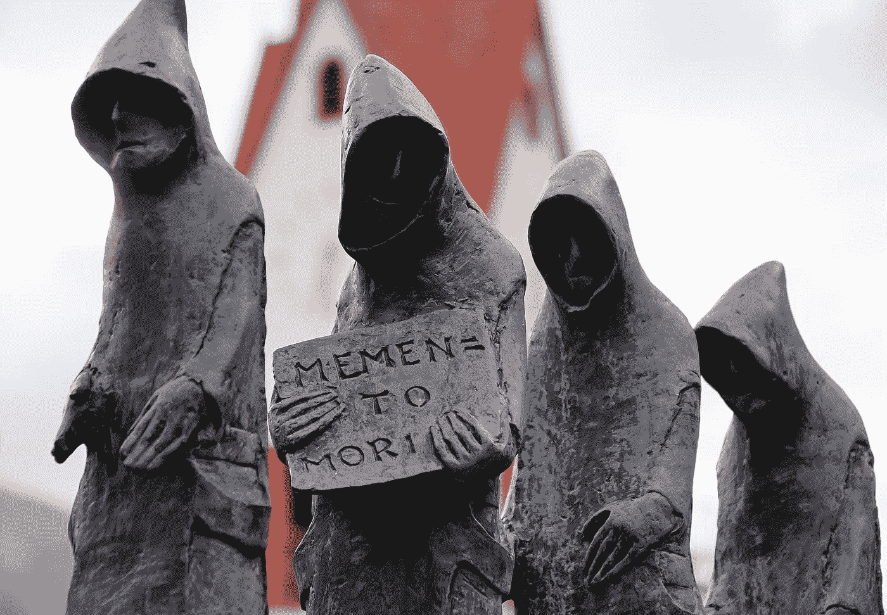

# 死亡纪念品:快速提醒你即将死去

> 原文：<https://medium.datadriveninvestor.com/memento-mori-a-quick-reminder-that-you-are-going-to-die-b0c45028705e?source=collection_archive---------4----------------------->

[source](https://pixabay.com/en/friar-statue-bronze-prior-1638468/)

在我写这篇文章的时候，我认识的一个人已经去世 5 天了，她只有 29 岁，和我一样大。

她年纪轻轻就死于癌症。

知道一个如此年轻的人会死去让我很伤心，听起来很讽刺，她在生日后三天就去世了。

当我在她葬礼上时，一个短语突然出现在我的脑海中“Mori Memento”(拉丁文“记住你[必须]死去”)，这个短语被许多斯多葛派使用过，我也读过很多遍。

但直到那一刻，我才明白，事实是这个世界上没有人的未来是有保证的。

另一个事实是，我们大多数人把时间浪费在无关紧要的事情上，而把重要的事情留给明天，因为我们认为我们还有更多时间。

我希望你记住以下几点:

**没有明天。**

正如我之前提到的，明天是没有人承诺的；所以不管你有什么计划，今天就开始吧。

有你想写的书吗？从今天开始。

有电话要打吗？今天就给他们打电话。

想要见一个特别的人？今天去拜访他们。

有一个你想开始的项目或生意吗？从今天开始。

需要原谅一个人？今天原谅他们。

如果你需要原谅自己过去的错误，今天就做吧。

人生短暂，没有时间留给明天。**现在就行动！**

今天你可以轻松地上床睡觉，不再醒来，所以无论你在回避什么，都不要等待。

> 混账拖延症。

**今天拿出你最好的一面。**

把你最好的给你爱的人，给你的客户，给你的同事，或者你身边的任何人。

去市场的时候要微笑。

一个简单的微笑可以让某人的一天更加明亮，不要把它留给自己。

对于你的客户、商业伙伴或同事，尽你所能为他们提供尽可能多的价值。

**付出爱。**

告诉你生命中那个特别的人，你爱他们，告诉你的父母、兄弟或姐妹，你有多爱他们。

不要等到特殊的时刻才去做；今天就做。

明天无法保证，现在就行动吧！

> 死亡纪念品。

页（page 的缩写）出于这个原因，我决定让我的头发生长，并最终捐赠给癌症患者。