# 记忆、记忆巩固和“祖母细胞”

> 原文：<https://medium.datadriveninvestor.com/memory-memory-consolidation-and-the-grandmother-cell-928b4e4b2d20?source=collection_archive---------1----------------------->

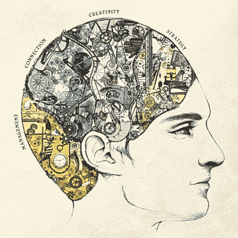

摆在神经系统和认知现象研究者面前的第一个问题是——什么是记忆？生物方面的记忆是什么？记忆在单个神经元的层面上是如何出现的？而信息是以什么形式储存在神经系统中的？现在我们来回答这些问题。

## 从生物学的角度和单个神经元的水平来看，记忆是什么？

长期以来，神经科学中有一种观点认为，记忆与突触的状态和强度的变化以及神经元本身的敏感性有关。我在以前的文章中描述了这些条件是如何变化的，我以海兔为例描述了习惯化和敏感化，以及条件反射的形成机制。这种对记忆的描述产生了连接体的概念，它是对神经系统中所有连接的完整描述，考虑到了这些连接的质量和属性。你可以说你，你的人格就是你的连接体。如果一旦你有机会完全复制你的连接体，你将得到一个和你一模一样的人，拥有相同的记忆和技能。

## 信息以什么形式储存在神经系统中？

如果我们谈论软体动物的神经系统，那么一切都受到已经存在的反射的神经元链中突触的设置的限制。但是如果你求助于哺乳动物的神经系统，那么它有一个工具，可以让你创造出动物出生时没有的反射。神经系统中的反射由反射弧或神经元链的形式表示，神经兴奋通过它们顺序传递。可以想象，神经元链形成了兴奋传播路径的整体方案，一些路径非常大，另一些路径较小，所有这些都受到一些重组和变化的影响。

当我们谈到反射弧时，我们想象一个连续的单个神经元链，但事实上对于中枢神经系统来说，许多神经元参与反射弧是很奇怪的，这些传输链由一系列细胞组成。虽然，事实上，这个阵列中的每个细胞实际上包含相同的信息，并且去除的不是一个，而是整个细胞区域，但保留它们所属的反射是可能的。从节省空间和资源的角度来看，这似乎是不合理的，但是从保存信息的可靠性的角度来看，这是合理的。由于各种不利条件、缺氧、缺乏营养或毒性中毒，神经细胞可能容易死亡，并且一个细胞的死亡导致生物体重要信息的可能丢失是不可取的。事实证明，根据神经元的数量和它们之间的联系来可靠地估计大脑所处理的信息量是不可能的。

## 不同程度的记忆深度的本质是什么？

生理学家长期以来被分配了两种类型的记忆:短期记忆和长期记忆。也就是说，在某些情况下，我们存储信息的时间很短，如果我们不返回，我们就会忘记它。在其他情况下，我们会无限期地记住这些信息，如果这些信息对我们来说很重要，那么我们甚至可以立即记住它们。从进化的角度来看，这两种类型的记忆是合理的，因为身体不需要存储发生在它身上的所有事情，特别是如果这些信息对生存和成功并不重要，并且如果这些信息不再重复，因为信息的存储需要消耗资源。

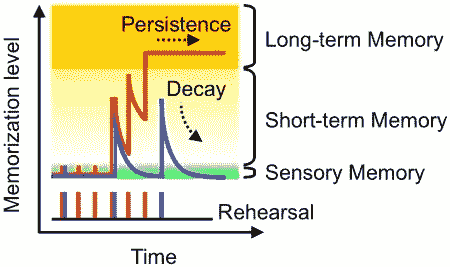

信息从短期记忆向长期记忆的转移称为记忆巩固。在这个问题上，有很多研究，在研究这个模型时，我试图证明记忆的存在并模仿记忆的深度。通过研究这些研究的材料，我得出结论，也许我们正在处理的不是一种记忆的巩固，而是至少两种巩固。

第一种是在生理水平上的巩固，在这些实验中，例如，小鸡教授一些反射，如果没有发生什么，那么反射将保留在记忆中，但如果在 20 分钟内将有电击或毒素的动作，反射将不会存储在记忆中。这意味着在这 20 分钟内，存在与在存储器中存储信息相关联的过程，这些过程可能被破坏，从而阻止信息的保存。

细胞结构的变化不会在训练中立即发生，它需要一些时间，与各种化学反应和转化、必要蛋白质的生产和新过程的生长有关。但是培训的效果有时几乎是立即就能观察到的，对我们来说，听到一些信息就足够了，我们已经有了这些信息，并可以对其进行操作。据推测，这是由于神经细胞对变化有一些储备，例如，在突触中，可以储存额外的带有介体的囊泡，这些囊泡只会在训练的条件下分配。但在经过保存信息的训练后，考虑到可能进行的训练的储备，将有必要增加突触和其中介质的总体内容。在这种情况下，突触被标记了特殊的蛋白质，触发了某种复杂的化学反应级联，从而导致突触的增加。在必要的时间内，违反这个复杂的化学反应级联的过程，导致违反记忆。

但在计算机模型中，不需要反映记忆的生理巩固，因为所有与虚拟突触的变化都可以瞬间进行。

下一种形式的记忆巩固是这样一个例子:重复几次的信息是长期获得的，没有感情色彩的、已经呈现过一次或少量呈现过的信息，过一段时间就会忘记。我把这种整合称为层级整合。以利用计算机模型掌握传统条件反射为例，考虑这种类型的巩固。

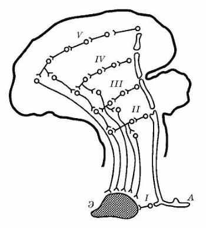

Illustration from the works of Academician Ivan Pavlov

在上一篇文章中，我们展示了一个条件反射是如何在模型神经元的基础上形成的例子。现在我们来看看条件反射是如何在中枢系统层面形成的。通常，非条件反射在神经系统的几个区域同时有表现，首先是脊髓区域的表现，如果我们沿着层次进一步移动，然后是一些神经节的表现，然后是古脑，例如海马，最后是皮层的表现。

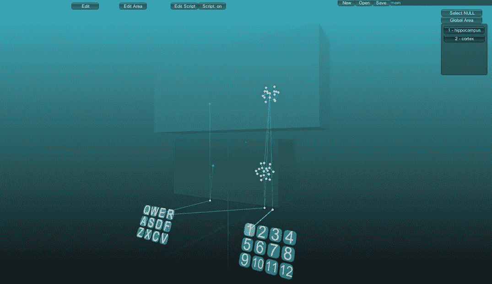

Screenshot of the window of the simulation of the nervous system

在模型上，你看到两个选定的区域，它们是孤立的，也就是说，属于这些区域的神经元并不相互作用，当然除非通过突触直接连接。我有条件地将这两个区域指定为“海马体”(下面的区域)和“皮层”(上面的区域)。还有一种以“R”为标题的反射导致反射反应“1”。这种反射在海马体和皮层中有两种表现，这是两组白色神经元。并且在每个区域还有两个与“E”受体相关的受体神经元，这些神经元是无动于衷的，它们的激活不会导致任何答案，但会产生很少的活性。最重要的是，这两个区域的神经可塑性是不同的，在被称为海马体的区域，可塑性高于皮质区域。

如果我们用标题“R”和非条件刺激“E”激活反射，大约在一个时间间隔内，那么将出现一个新的反射弧，但最有可能的是这将出现在具有高神经可塑性的区域。

仅在具有高神经可塑性的区域中形成的反射将是完全功能性的，但是可能会丧失，因为在其他刺激的影响下，神经元可以重新训练。海马体比大脑皮层小得多，但它包含了大脑皮层中几乎所有的表现形式。总是需要形成新的联系，这就需要利用已经参与形成反射的细胞。

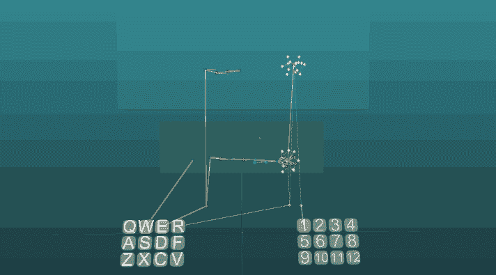

Loss of reflex in the area of high neuroplasticity

如果我们通过组合刺激“E”和“R”来继续训练，那么在一定次数的重复之后，在具有低神经可塑性的区域中将形成反射弧。

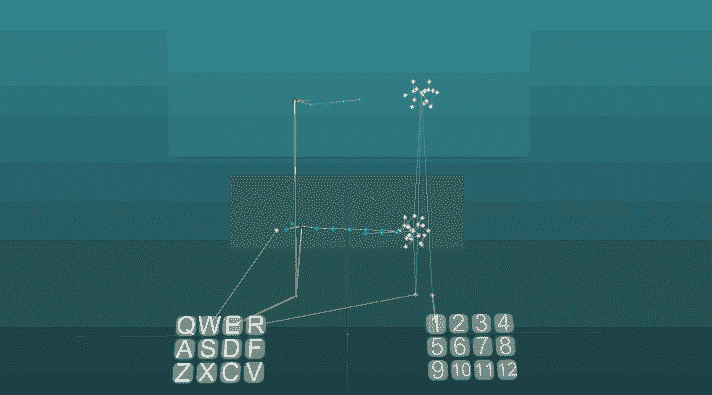

现在反射得到了更安全的保护，即使它从神经可塑性高的区域消失，它仍然会被执行。

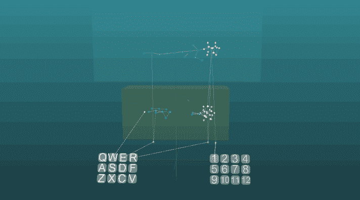

当然，在神经可塑性低的区域重新训练神经元是可能的，但这将需要更多的时间和努力。

因此，记忆有两个阶段:在皮层反射形成之前和之后。不仅在海马体中，而且在大脑皮层中保存反射的副本是记忆的分级巩固。但是，那些马上就能记住并能记住很长时间的信息又如何呢？通常这些信息都伴随着一些情感经历。

我们的痛觉感受器与大脑中的杏仁核有关。杏仁核控制神经系统的蓝斑区域，该区域由去甲肾上腺素神经元组成。这些神经元的轴突在大脑的所有区域都有末梢，它们的任务是根据需要向尽可能多的细胞输送去甲肾上腺素。

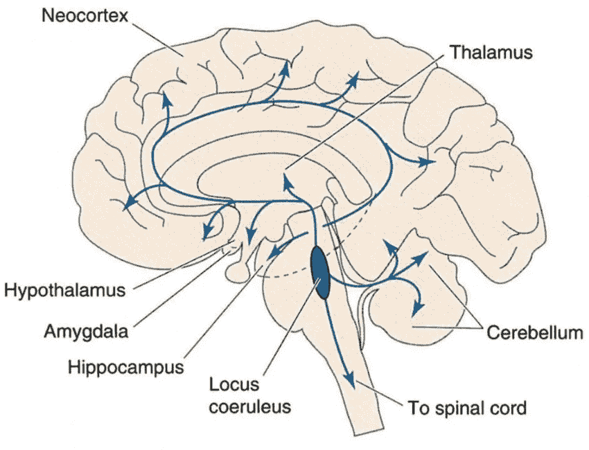

在我们的情况下，去甲肾上腺素是增加神经可塑性的信号。这是一种“现印”小组，在去甲肾上腺素的影响下，神经细胞试图尽快做出改变。因此，当去甲肾上腺素的作用停止时，细胞返回到它们的工作状态，保留发生在它们身上的所有变化。

让我们在模型中看看这个。

程序中的区域不仅在逻辑上分离和隔离了神经元，而且还可以为这些区域配置一些交互脚本。

更高层次网络的对象是大脑的不同区域。它们在系统中相互作用的性质是特殊的，一个区域的活动可以导致所有神经元的抑制，或者具有调节特性，或者影响另一个区域的神经可塑性。恐惧的感觉(扁桃体活动)导致运动皮层中神经元的敏感性增加，发生调制以降低神经元的激活阈值。因此，当恐惧拥抱我们时，我们可以更快地逃离危险，我们的肌肉不会变得更强壮，我们只是需要更少的内在动力来采取行动。

在这种情况下，有一个场景，当“皮层”区域中称为“杏仁核”的区域发生活动时，神经可塑性增加两秒钟。

没有杏仁核的激活:

随着杏仁核的激活:

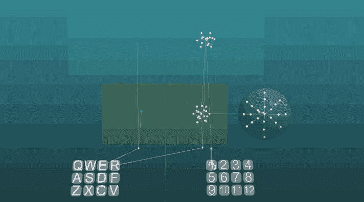

因此，事实证明，在压力状态下，大脑皮层的学习速度与高可塑性区域一样快。例如，它也可以通过研究老鼠的实验工作来验证。

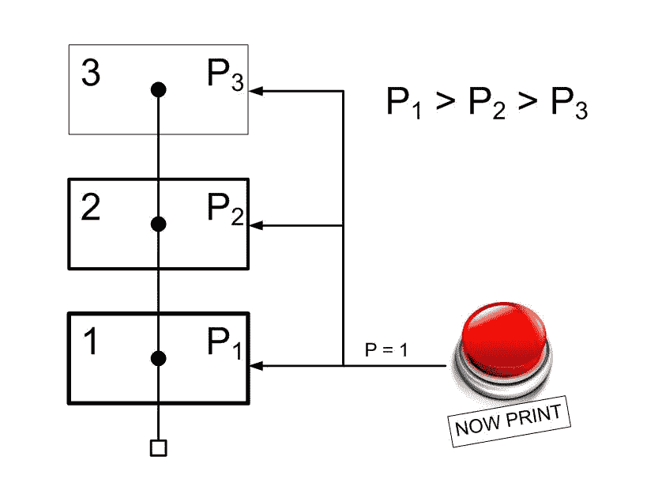

P — neuroplasticity (0 ≥ P ≥ 1)

分级存储系统可以表示如下。有几个孤立的区域，在每一个随后的神经可塑性会更小，因此，每一个下一个区域受变化的影响会更小。在每个这样的区域中，将有一个刺激的表示。也有可能通过导致神经可塑性短期变化的信号来控制记忆速度。

一方面，我们有一定的信息过滤器，允许你保存更经常重复的信息，另一方面，有能力即时记住对生物体来说重要的信息。

## 形象

仅仅在最简单的条件反射的基础上研究人类记忆是不正确的，对于许多人来说，就一个人可以操作的信息而言，这似乎是非常原始的。所以我们会讨论像图像这样的概念，以及图像是如何在神经细胞水平上形成的。

大脑中的图像形成系统与生物学中观察到的神经元特化现象有关。在研究大脑时，人们发现一些神经元会选择性地对某种类型的刺激做出反应，也就是说，当你看到或想到一种动物时，你大脑中的某一组神经元会被激活，也有一些神经元只会做出反应，例如，在你祖母的脸上。这种神经元特化的现象甚至还有一个名字“[祖母细胞](https://en.wikipedia.org/wiki/Grandmother_cell)”。

让我们在模型上考虑神经元获得特化的机制。

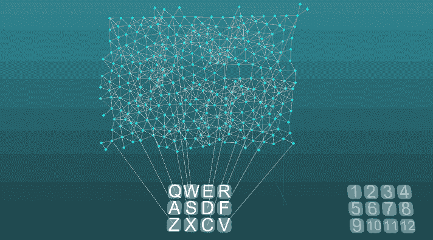

我们有一个由 12 个受体(Q，W，E，R … V)组成的受体场，所有的受体都是一样的，处于同等的条件下。每个受体在位于一个平面上的一组相互连接的细胞中有一个代表(受体神经元)，类似于它在处理感官信号的皮层片段中的组织方式。这将是初级加工的区域，因此该区域中的神经元具有非常高的神经可塑性(P = 1)。

例如，如果三个受体(Z，X，R)从受体场被激活，那么作为条件反射形成基础的相同的兴奋吸引原理导致兴奋将会聚在一个地方的事实。此外，因为激活信号几乎同时来自不同侧，所以在该部位对神经元的激活效果的水平将更高。因此，神经元的专业化是自动形成的，在这种情况下，对复杂刺激“Z + X + R”做出反应的神经元是确定的。

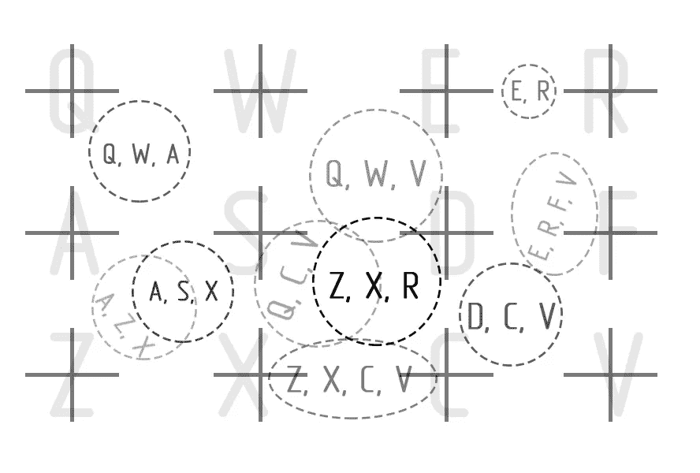

当然，你可以看到这个形成图像区域的系统是非常不准确的。图像的区域可以相交，并且也有可能完全不同的刺激组可以被附着到相同的区域。大脑工作的这种不准确性可以有一个相当积极的特征。毕竟，在图像的识别中，准确性只会干扰，而且它还揭示了创造力的潜力，因为组合以前不相容的图像或在图像中看到不同的东西是可能的，只是因为这些图像不是那么明确，没有明确的边界。这也解释了为什么人类的感知会具有欺骗性。

但是，为了确定这些激活作用水平增加的区域，有必要增加一组神经元，这些神经元只有在获得这种增加的效果的情况下才会被激活。关于皮层的结构和皮层的组织，我们将在以后的文章中更详细地讨论，以及如何定性地改善图像形成机制。

现在让我们把记忆的层次系统和心理图像的形成系统联系起来。在到达下一级处理之前，来自一个刺激的兴奋可以以不同的方式进行。所以选择神经兴奋的路径是由其他刺激的影响决定的。这条路径决定了哪一个更高层次的代表将被激发，从而在层级中处于更高的位置。考虑到不同级别的可塑性差异，更高级别的图像将更加稳定，即，如果复杂刺激没有被完全或嘈杂地激活，那么对于给定的复杂刺激来说更典型的区域将仍然活跃。

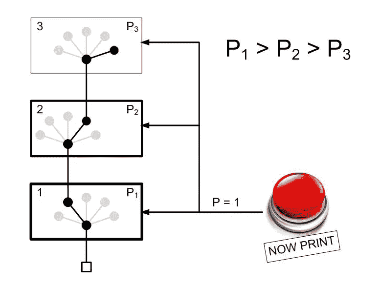

这种记忆结构类似于一棵树，例如，在第一层，我们可以分离出对所有人的面孔做出反应的神经元，在更高的层次上，我们发现神经元对熟悉的人或我们反复看到的那些人的面孔做出反应，最后一层将显示亲属的面孔，这些面孔对我们来说非常熟悉。我们祖母的脸，即使在非常扭曲、不完整或嘈杂的形式下，我们也可以识别，因为在高水平下，神经可塑性非常低，模糊选择的“分支”仍将导致其完全激活。

这种记忆结构解释了信息提取速度高的原因，来自受体的兴奋只是通过所有层的处理，相互影响，这些信号决定了兴奋到达正确神经元群的路径。这里没有信息搜索，也没有与任何参考信息等的比较操作。进化是沿着速度而不是准确性的道路进行的，尽管感知的准确性是通过增加受体场和组织大脑的特殊方式来实现的。

## 长时程增强。见 POTENTIATION

除非我们触及长期效能的话题，否则关于记忆的论述是不完整的。这种效应是由于当神经细胞受到强激活作用时，其敏感性在一段时间内增加，并且细胞中这种变化的时间可以持续几分钟到几周。有利的是，这种效应在海马的大锥体细胞中表现出来，尽管在其他区域也可以观察到，但浓度较低。

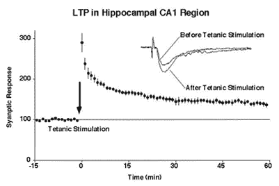

在细胞中增加冲击的影响下，触发了特定的化学反应级联，这导致了额外受体的突触后膜的形成，这增加了细胞的敏感性。让我们想象一下这将如何在模型中实现。

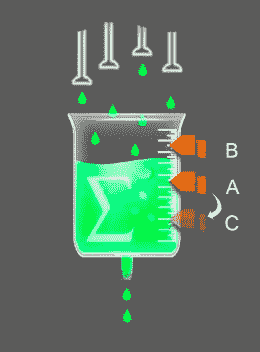

考虑神经元中的求和方案，该方案代表一个充满介质的容器，由此发生该介质的连续浪费。如果血管中介质的水平达到值“A”，则发生神经元的激活。如果激活效应的水平达到“B”值，不仅会发生神经元的激活，而且，主激活阈值“A”会降低到水平“C”，这些变化将是暂时的。

海马体某些细胞工作的这一特征违背了神经系统的习惯化原则。多亏了她，生物体才能记起几分钟前发生在他身上的事。如果你闭上眼睛，并在一段时间内保持沉默，你甚至不需要睁开眼睛来回忆你在哪里以及之前发生了什么事情。这里令人惊讶的是，没有刺激会激活反射弧，导致负责这一信息的神经元。

在海马体的活动过程中，通过长时程增强对区域和神经元进行标记，这些负责活动图像的区域被标记。这使得很容易返回到最近被激活的图像，即使是通过较弱的冲击。

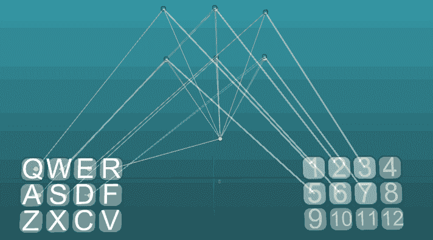

想象有几组神经元负责地点的图像，例如:“工作”、“房子”、“街道”等图像。然后，在工作场所，我们可以接收到大量的视觉、听觉、触觉图像和指示我们在哪里的信号。这就导致了一个事实，与地点的图像相关的神经元会被长时程增强所标记。现在，在某个时间间隔，长时程增强在起作用的同时，一个来自地方的根图像的小刺激，就足以使相应图像的神经元被激活。

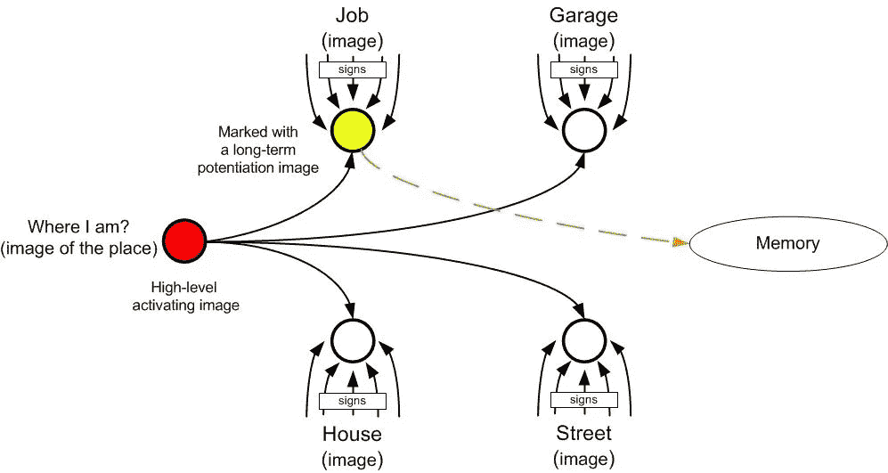

在我看来，公认的记忆理论非常简单明了，它是建立在神经元工作的基础之上的。

在下一篇文章中，我们将谈论情绪，我希望说服你，一个人的理解中最复杂的情绪将可供电子大脑使用。

在第一篇文章中可以找到神经系统模拟器的链接。