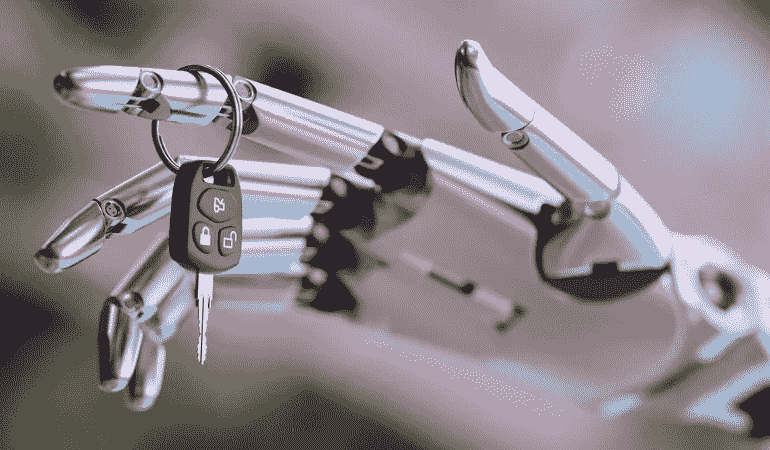
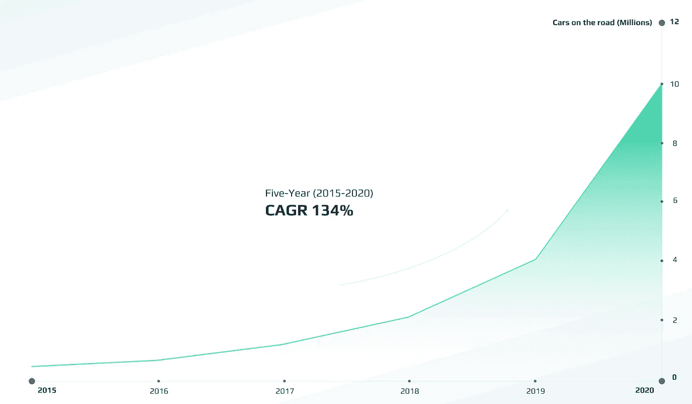
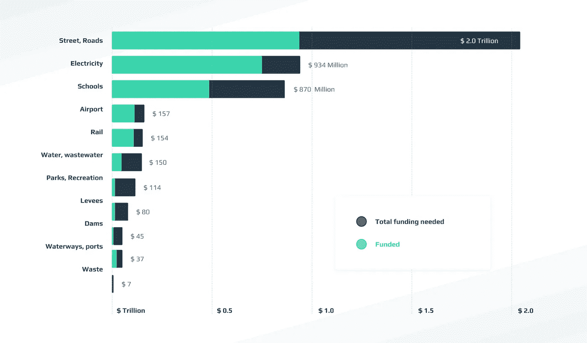

# 融合人工智能和区块链并不是炒作过量——这是自动驾驶的未来

> 原文：<https://medium.datadriveninvestor.com/merging-ai-and-blockchain-isnt-a-hype-overdose-it-s-the-future-of-autonomous-driving-fc106149619c?source=collection_archive---------5----------------------->

*什么类型的人工智能更适合自动驾驶？迷人的还是最弱的？把区块链加入进来怎么样？*

目前来看，*强 AI* 与其说是现实不如说是神话。如果你认为天网或者终结者的时代已经到来，那你就错了。强人工智能需要解决意识、自我认同、价值观和上下文记忆等哲学问题。这仍然是一个相当超前的概念。即使是由像[波士顿动力](https://www.bostondynamics.com/)这样的公司开发的最先进的机器人也很难打开一扇门。但是别担心，还没有完全失去。

开发弱人工智能的公司已经找到了通往客户的道路。你的家里很可能已经有了弱人工智能:Siri 和 Alexa 这样的个人助理，带图像处理功能的相机等等。弱 AI 更容易管理，可以解决简单的任务。

我们将关注的第三种人工智能是*超弱人工智能*。它非常原始，用途极其有限，只能在“团队”中正常工作。它的目标是在尽可能短的时间内执行非常少量的高度专业化的分析。然后，它与附近的其他超级弱人工智能系统共享结果。这样的系统不是研究人员简单发明的。我们观察大自然:蚂蚁和蜜蜂以同样的方式运作。但是超级弱的 AI 如何帮助我们驾驶自动驾驶汽车呢？

# 人失败的地方，超弱的 AI 可以成功。这怎么可能呢？

目前，弱人工智能解决方案用于自动驾驶汽车。他们必须独立工作，在很短的时间内处理来自传感器和摄像机的大量数据。这种[高级驾驶辅助系统(ADAS)](https://www.intellias.com/how-to-build-adas-software-for-autonomous-driving/?utm_source=medium.com&utm_medium=referral&utm_campaign=IS&utm_content=AI%20and%20blockchain) 非常小心地驾驶，假设最坏的情况。他们受到计算能力和能源供应的限制，在紧急情况下除了司机没有人可以求助。

当然，如果附近有几辆使用 AI 的汽车，它可能会依赖其他人的汽车数据，但如何确保这些数据是可靠的，并且邻近的车辆没有被黑客入侵。因此，你必须全神贯注于道路，最终接受枯燥的人工智能功能。在自动驾驶中使用这种类型的人工智能，司机只能在方向盘后做梦阅读或看电影，更不用说工作了。

所以，如果弱 AI 表现不好，你觉得超弱 AI 能帮上忙吗？事实证明，正是这种人工智能和自动驾驶汽车的结合效果最好。使用超弱人工智能的汽车可以依赖其他汽车和基础设施的数据，而不是自己执行所有计算。超弱人工智能功能仅限于关键情况的评估，而其其余功能则集中于来自网络的数据验证。确保此类信息的安全性和可靠性是关键。解决信任问题的方法是分散的共识，这可以在区块链找到。

事实证明，自动驾驶汽车和区块链的人工智能进步可以合并，以实现一个共同的目标——数据的安全性和可靠性。[通过区块链](https://www.intellias.com/let-s-make-self-driving-cars-safe/?utm_source=medium.com&utm_medium=referral&utm_campaign=IS&utm_content=AI%20and%20blockchain)，您可以基于多个数据点和网络内事件的不断验证来建立本地共识。

超弱人工智能网络可以达到多个目标:发现路径上的关键对象，传输交通信息和验证邻居的数据。因此，组合的计算能力系统放弃了个人优先级，并建立了一个可信的通信环境，以确保每个人的安全。

事实上，通过使用超级弱的人工智能网络，汽车失去了作为独立单元快速移动的能力，但当路上有一队人工智能车辆时，它可以移动得更快。自动驾驶汽车的数量是目前的问题。但是正如你在下面的图表中所看到的，在接下来的几年里，我们将会有数十亿个这样的人。

*AI 特色车预计增长*

*来源:* [*商业内幕*](http://www.businessinsider.com/report-10-million-self-driving-cars-will-be-on-the-road-by-2020-2015-5-6)

# 未来自动驾驶会是什么样子？

让我们想象我们在 2030 年。道路上的大多数汽车都是自动驾驶的。他们使用联网的超弱人工智能，这些人工智能相互之间积极交换数据。如果路上的一辆车开始咄咄逼人地行驶或向邻居发送错误信息，网络会迅速确定这辆车，避开它，并降低它在系统中的信任级别:表现出类似于鱼饵球生存的行为。

道路基础设施(交通灯、保险杠、标志)也将具备基本的智能。这种类型的基础设施收集数据，并将路况通知汽车中的人工智能。因此，整个流量可以同步移动。通过根据收集的数据计算最安全的距离和轨迹，这种汽车将能够比现在开得更快。通过引入对数据生成和验证的经济激励，如区块链，他们可以为全新的参与者创造空间:自动驾驶安全交通提供商。

目前，在每小时 60 英里的速度下，汽车之间的安全驾驶距离是前后 500 英尺，两侧 10 英尺。凭借每秒 10 次的人工智能决策频率，汽车之间的安全距离从前到后减少到只有 20 英尺，两侧只有 4 英寸。这种密集的交通模式使现有道路基础设施的容量翻了两番，没有人在红绿灯前或交通堵塞时等待。

全面自主基础设施的经济效应难以想象。根据最近的数据，美国将需要在未来 10 年花费 2 万亿美元来修复和建设新的道路。把新的道路排除在外可以节省数十亿美元，让政府把更多的钱花在其他项目上，比如新的学校和医院。

*美国未来 10 年的基础设施支出*

*来源:* [*财富*](http://fortune.com/2017/03/30/infrastructure-spending-funding/)

总而言之，人工智能在自动驾驶中的作用正在显著增长。随着超弱人工智能系统的引入，你的日常通勤将变得更快、无压力和安全。随着自动驾驶汽车技术的进步，人工智能成为创造全方位驾驶体验的催化剂。

事实上，它的潜在影响力远远超出了汽车行业。随着人们开始在日常生活中信任人工智能，我们会发现它更有价值的用途。这将刺激各种基于人工智能的技术的发展，其中自动驾驶技术处于领先地位。

## 来自 DDI 的相关故事:

 [## 用 7 个步骤解释深度学习——数据驱动投资者

### 在深度学习的帮助下，自动驾驶汽车、Alexa、医学成像-小工具正在我们周围变得超级智能…

www.datadriveninvestor.com](https://www.datadriveninvestor.com/2019/01/23/deep-learning-explained-in-7-steps/)  [## 成为数据科学家所需的 8 项技能——数据驱动型投资者

### 数字吓不倒你？没有什么比一张漂亮的 excel 表更令人满意的了？你会说几种语言…

www.datadriveninvestor.com](https://www.datadriveninvestor.com/2019/02/07/8-skills-you-need-to-become-a-data-scientist/)