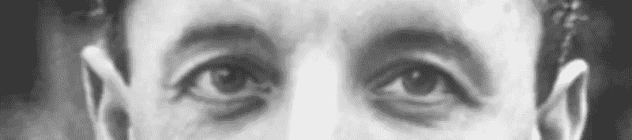
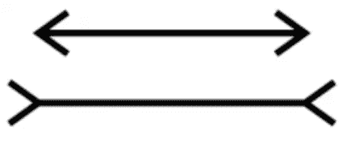
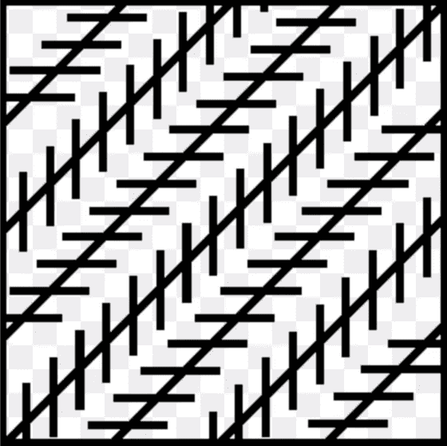

# 梅洛-庞蒂和人工智能。

> 原文：<https://medium.datadriveninvestor.com/merleau-ponty-and-the-a-i-d8f1ffcfe1ba?source=collection_archive---------7----------------------->

Merleau-Ponty: “A conventional algorithm will never express anything but nature without man”.

一段时间以来，我认为几乎所有的人工智能研究人员和认知科学家，作为笛卡尔二元论者，从根本上误解了人类大脑的工作方式。2017 年我写了一篇广受好评的媒体文章，名为 [*AI，世纪骗局*](https://medium.com/@Romanor/ai-hoax-of-the-century-8f2cb7b853a3) 。我目前正在写一本名为*《生命的动力》的书，这本书受到梅洛-庞蒂的*感知现象学*的很大影响。事实证明，他 75 年的工作有很多关于现代人工智能的野心和局限性的内容。警告，以下内容并不容易理解:*

马丁·海德格尔的追随者梅洛-庞蒂利用德国神经学家戈尔茨坦和盖尔布汇编的一战期间病人脑损伤综合征的临床数据，研究了社会经验的生物学基础。这些数据为他提供了一个窗口，让他了解人类技能的健康统一性，以及这种统一性是如何在大脑受伤的患者中被破坏的。数据反复显示，各种大脑区域的局部脑损伤导致患者表现出各种行为的普遍损伤。一个例子是患者失去了指向一个物体的能力，这是一种社会行为，旨在告知他人，同时保留抓住它的能力，这是身体对世界某个部分的功利主义同化。

根据这一证据，梅洛-庞蒂假设*感知是习得行为结构中的一个焦点，当有机体通过对世界采取行动来应用其技能时*，习得行为成为一种有组织的多感官感知。他得出结论，人类的精神活动通过在日常任务中使身体运动适应生物目标来塑造自己。当有一次被要求总结他的观点时，他说:“感知就是通过身体把自己呈现给某物。”他区分了外部世界的视界和内部感知的视界。这符合阿奎那和马图拉纳的方法。他强调包括语言在内的认知的所有方面的运动基础，这使他非常接近 A.M .利伯曼的语言运动理论。

在他的巨著《感知现象学》中，梅洛-庞蒂以这样的宣言开始:*我们不能怀疑我们是否真的感知了世界，我们必须说:世界就是我们所感知的。寻求感知的本质就是宣布感知不是假定的真实，而是被定义为接近真理。*

我对这个世界的所有知识，甚至我的科学知识，都是从我自己特定的角度获得的。科学的整个宇宙是建立在直接经验的世界之上的。不幸的是，现代科学，尤其是数学，想要忘记这一点。*认为我的存在是世界的一个瞬间的科学观点，总是既天真又不诚实，因为他们想当然地认为另一个观点，即意识的观点，没有明确地提及，通过意识，世界从一开始就在我周围形成自己，并开始为我存在。回到事物本身就是回到知识之前的那个世界，知识总是谈论这个世界，关于这个世界，每一种科学图式化都是一种抽象的、派生的符号语言，就像地理与乡村的关系一样，在乡村中，我们必须事先了解森林、草原或河流是什么。*

*这一举动不同于唯心主义者回归意识，对纯粹描述的需求一方面同样排除了分析反思的程序，另一方面也排除了科学解释的程序。笛卡尔，尤其是康德，通过表明我不可能理解任何存在的东西，除非我首先在理解它的行为中体验到我自己是存在的，从而将主体或意识分离开来。他们把意识，我对自己存在的绝对确定性，作为任何事物存在的条件。*

感知不是基于表象。感知不是一门世界科学。真理不存在于人的内心，或者更准确地说，没有人的内心，人存在于世界中，只有在世界中他才能认识自己。当我从对科学的教条常识的漫游中回到我自己身上时，我发现，不是内在真理的来源，而是一个注定属于这个世界的主题。

分析性反思对其他心灵的问题或世界的问题一无所知，因为它坚持认为，随着意识的第一缕曙光，理论上在我身上出现了达到某种普遍真理的力量。这接近于埃丝特·泽伦的主张，即信息处理和联结主义在关注成熟有机体的最终状态时都犯了错误，因为它们似乎都知道发展不可避免地要去哪里。他们预先假定他们试图解释的是什么。

对二元论者来说，感觉的概念是直接而明显的；这是对世界的印象。梅洛-庞蒂对此提出质疑，声称传统的分析忽略了感知现象。基本的感知已经被赋予了意义，甚至是对黑暗背景上一块纯白的感知。感性的“某物”总是在别的东西中间；它总是构成“场”的一部分一个不提供任何东西的同质区域不能给予知觉，一个孤立的知觉数据是不可想象的。

梅洛-庞蒂放弃了任何将感觉定义为纯粹印象的尝试。只有当颜色占据了一定的面积时，才可以说它是存在的，而分析会发现存在于其中的每一种质量的意义。如果感知是对世界的一种印象，我们将会感知到世界的一部分，被黑暗地带所包围。我们没有这种经历。以世界为出发点，我们永远不会理解什么是视野。

马勒-莱尔视错觉中的两条直线，既不是等长的，也不是不等长的；只有在客观世界中才会产生这个问题。

视野是一个奇怪的区域，矛盾的概念在其中相互碰撞，因为物体——穆勒-莱尔的直线——不在这个区域，不属于存在的领域，在那里比较是可能的，但是每一个都被放在它的私人背景中，就好像它不属于与另一个相同的宇宙。

感觉器官不适合扮演“传递者”的角色触觉器官的非皮质损伤无疑会减少对冷热或压力敏感的点的集中，但是，如果对受伤的系统施加足够大的刺激，特定的感觉就会再现。阈值的提高由手的更有力的运动来补偿。即使在感性的初始阶段，在部分刺激和感官与运动系统的合作方面一起工作，保持感觉恒定，并排除任何将神经过程定义为简单传递给定信息的定义。

感知必须被理解为一个整合的过程，在这个过程中，外部世界的文本与其说是复制的，不如说是合成的。因此，如果我们试图在为“感觉”铺平道路的身体现象的视角内抓住“感觉”，我们会发现不是一个精神个体，而是一个已经与一个更大的整体捆绑在一起、已经被赋予了意义的结构。A.M .利伯曼的语音手势就是一个最好的例子。

当我说我面前有一块红色的补丁时，补丁这个词的含义是由以前的经验提供的，这些经验教会了我如何使用这个词。“好的形式”并不是因为在某个形而上学的天堂里它本身就是好的而产生的；它是好的形式，因为它在我们的经历中形成。

笛卡尔二元论者把客观世界作为他们分析的对象。他们与感知保持距离。这从“恒常性”假说或者说客观世界的优先性就可以看出来。恒常性假说迫使我们承认“正常感觉”已经存在。揭示它们的功能，就像探照灯显示黑暗中预先存在的物体一样，叫做注意力。注意力不会创造任何东西；它像火花一样闪现出那些能够为我提出的问题提供答案的感知或想法。但是在构成一切的意识中，注意力仍然是抽象的，因为它没有工作可做。

在梅洛-庞蒂的观点中，在引言的第 3 节中表达为“*注意力”和“判断*”，注意力首先预设了精神领域的转变，一种意识呈现给其对象的新方式。一个例子是定位我身体上被触摸的点。某些起源于中枢神经系统的疾病使这种识别变得不可能，并揭示了意识的深层运作。这种疾病的主要症状是感觉领域的瓦解，当受试者感知时，感觉领域不再保持稳定，而是随着探索运动而运动，并在被探索时收缩。一个模糊定位的点揭示了一个前客观空间，那里没有明确的位置，因为从一个感知到另一个感知没有空间框架。那么，注意力的第一个操作就是为自己创造一个可以被审视的领域，在这个领域中探索器官的运动或思想的阐述是可能的。

人们很早就知道，一个九个月大的婴儿只能从整体上区分“有色”和“无色”视觉区域。此后，“彩色”区域被区分为“暖”和“冷”阴影，最后得到特定的颜色。然而，心理学家确信，9 个月大的孩子一定能够“看到”绿色，只是他没有注意和理解自己的现象。另一方面，梅洛-庞蒂和克勒一样，认为对颜色的第一次感知是意识结构的变化，是一种新的经验维度的建立。

那么，注意不仅仅是进一步阐明先前存在的“隐藏”数据，而是通过把它当作*的人物，就像考夫卡所做的那样，带来一种新的阐释。*表现为*视界*，它们实际上构成了整个世界的新区域。注意力不是图像的联想，而是一个新对象的主动构成。从不确定性到确定性的过渡，这种在新的意义的统一中，在它自己的历史时刻的重铸，就是思想本身。精神的工作只存在于行动中。

如果我通过望远镜或纸板管观察地平线上的月亮时，它看起来不比在天顶时更大，那么不能得出结论，在自由视觉中，它的外观同样是不变的，因为二元论会有它。二元论者相信这一点，因为他们不关心我们看到什么，而是根据视网膜图像我们应该看到什么。然而，当我们自然地看时，磁场的各个部分相互作用，并*激发*地平线上的这个大月亮。

*判断*(理性)经常被介绍为*感觉缺少什么使感知成为可能*。二元论者认为理性是通过联结感觉的点来描绘感知的结构。他们可以消除一个物体的所有可感知的属性，仍然保持物体的物理“物质”，而对于感知来说，什么都没有留下。一旦二元论者将视觉定义为对刺激在身体上留下的印象，他们就得出结论，感知就是判断。它变成了简单的得出结论的逻辑活动。“看”、“听”、“感觉”这些词失去了所有的意义。原因无处不在。

梅洛-庞蒂认为，感知不是推理(判断)，而是在推理开始之前理解一种内在的感觉。因此，真正的感知提供了符号中固有的意义。二元论只是把现象简化为一个错误。

当我看到左尔纳幻觉中的对角线不平行时，二元论者会说我弄错了给定的任务，并比较了两个整体，而不是比较主要元素。但是为什么长主线不肯和短辅助线分开呢？

答案是，通过获得辅助线，主线不再平行，它们失去了意义，获得了另一种意义。辅助线给这个图形带来了一种新的含义，从此以后它就和这个图形紧紧联系在一起，不能改变。在物理关系之前，这里有一个根据自己的规则构建的感知句法。

心灵内省不能“碾过孤立的印象”，逐渐发现整体的意义。感知是一种一举创造的行为，不仅创造了一组数据，还创造了将这些数据联系在一起的意义。它不“发现”它所具有的意义，它“确保”它具有意义。感觉不是被体验的，意识总是对一个对象的意识。纯粹的感觉是一种幻觉，但却是一种必要的幻觉，而且必然会误导心灵看待自身历史的方式。

感知不可能是一个推理的过程，因为没有感觉为它提供前提或解释，因为在它之前没有任何东西可以解释。沿着感觉的概念，我们抛弃了纯粹逻辑活动的概念。因此，感知被认为是关于感知的。分析性反思变成了一种纯粹的倒退学说，根据这种学说，每一种感知都是思维的混乱形式。任何对知觉的分析都不能不将知觉视为一种完全起源的现象。二元论始于一个世界本身，它作用于我们的眼睛，使我们看到它，它仍然是由它的各部分的绝对相互外在性来定义的。它接受真理的观念是完全有效的，并保证理解超越表象的“真实”，超越幻觉的“真实”。

二元论将自己树立为科学而非感知的学说，声称其分析基于数学真理的检验，而不是基于对世界自明性的天真接受。然而，在现实中，如果我的记忆不能使我把现在明显的东西和刚才明显的东西联系起来，并通过文字的媒介把我的证据和别人的联系起来，我就不会知道我拥有一个真实的想法。我的思想总是使用我自己或他人已经形成的思想，并依赖于我的记忆或思考者群体的记忆。想当然地认为我们有一个真实的想法就是相信不加批判的感知。二元论保留了一种绝对的信仰，认为世界是时空事件的总和，并将意识视为这个世界的一个部分。反思提供了意识的本质。

梅洛-庞蒂抛弃二元论。在他看来，当格式塔心理学开始批评“恒常性假说”时，它拒绝将理性和判断作为知觉理论中的解释因素。它的结论是，感知不是理解的行为。二元论的真正罪过在于，它把科学的确定宇宙视为已知，并把感性意识置于现成世界的中间。

格式塔理论已经清楚地表明，所谓的距离迹象——物体的表观尺寸、介于物体和我们之间的物体的数量、视网膜图像的差异、会聚度，只有在感知之后的分析中才能知道，但我们在知道距离时不会经历这些阶段。不幸的是，格式塔心理学保留了二元论，并声称这些迹象可能是这种感知的*原因*。梅洛-庞蒂在格式塔理论之外迈出了决定性的一步。

一个动眼神经肌肉瘫痪的受试者，每当他认为他的眼睛转向左边时，就会看到物体向他的左边移动。这种经典心理学认为，因为感知原因:眼睛应该转向左边，尽管如此，由于视网膜图像没有移动，视图必须向左滑动，以保持它们在眼睛中的位置。格式塔理论告诉我们，对物体位置的感知并不经过一个明确的身体意识的迂回，在任何时候我都不知道图像在视网膜上保持静止，我看到风景直接向左移动。为了产生错觉，受试者必须有意向左看，并且必须认为他移动了他的眼睛。他身体的动作自然被赋予了某种感性的意义。感知“考虑”了感知器官的运动，在其中发现的不是“明确的解释”，而是变化的*动机*。

对于一个健康的人来说，将眼睛移向左边的意图造成了视野的振荡。物体在短暂的波动后保持不动。这就是“视线转移”的内在含义。对于受折磨的人来说，凝视和风景就像粘在一起一样，没有颤动将它们分开，凝视带着风景。因此，视网膜上图像的静止和动眼神经肌肉的麻痹并不是错觉的真正原因；它们是动机，就像介于我和我所注视的事物之间的物体一样。没有理由，但它们是动机。

这导致梅洛-庞蒂质疑古典逻辑的客观思维，搁置世界的范畴，怀疑所谓的实在论的自明性，并进行真正的现象学还原。动机的现象学概念是一个流动的概念，其中一个现象释放另一个现象，不是通过一些客观的、有效的原因，而是通过它支持和引导现象流动的*意义*。因此，向左看的意图和风景顽固地固定在一个人的凝视中的事实带来了物体运动的幻觉。不是一个仅仅继承另一个，被激发的现象使激发的现象变得清晰和可理解，因此似乎*先于它自己的动机*。同样，远处的物体及其在视网膜上的物理投影解释了图像的差异，通过回顾性的错觉，我们谈到了感知的自然几何。

我们预先在感知中放置了一门建立在它之上的科学，而我们忽略了动机的原始关系，在这种关系中，距离先于任何科学而存在，这不是来自对“两个图像”的判断，因为它们在数字上并不明显，而是来自存在于这个粗略轮廓中的力的“转移”现象，这些力试图静止下来，并导致它成为可能的最确定的形式。按照笛卡尔的学说，这些描述将被视为对非反思性精神状态的暗示，这种精神状态本质上永远无法清晰表达，并且像任何形式的心理学一样，在理解的眼中没有真理。为了承认它们，有必要表明，在任何情况下，意识都不能完全不再是它在感知中的样子，它不能完全占有它的运作。对于现象的认识，则隐含着一种反映论和一种新的 *cogito* 。

二元论认为感知是一个或多或少真实客观的过程。推而广之，科学概念变成了一种将现象客观化的手段。这有助于科学发现世界的内在原因、与其内容无关的几何空间以及不影响物体属性的纯粹运动。因此，二元论为现象提供了一个惰性存在的环境，其中每一个事件都与导致变化发生的物理条件相关，因此促成了这种似乎是物理学任务的存在冻结。最终，它将活体转化为一个没有内部的东西。生物的推动意图被转化为身体运动，其执行完全由神经机制控制。感官体验因此脱离了有效和运动功能。所以活体变成了另一个物体，一台机器。

梅洛-庞蒂不再认为感知是早期的科学，但二元论科学是一种感知形式，它失去了对其起源的关注，并认为自己是完整的。他想让哲学回到先于客观世界的实际经验世界，他想让事物恢复它们的具体面貌，让有机体恢复它们处理世界的个别方式，让主体性恢复它们在历史上的固有地位。

他明确指出，现象场不是“内心世界”，“现象”不是“意识状态”或“心理事实”，对现象的体验不是内省行为。对现象的回归避免了二元论的所有问题，一旦感觉的偏见被消除，一张脸就不再仅仅是“视觉资料”,其他人的精神生活成为直接的对象。格式塔心理学家导致与二元论的决裂，感知的意义、联系和“真理”不再来自我们的感觉的偶然相遇，因为它们是由我们的心理本性给予我们的，而是决定这些感觉的空间和质量价值，并且是它们不可约的配置。

我们必须将感知视为一种创造性的操作，它本身也参与了体验的真实性。这就是为什么现象学，所有哲学中唯一的一个，谈论一个先验领域。这是一个关于意识存在的研究，而不是预先假定它的可能性。其他的哲学根据应该是什么，根据知识的概念需要什么来判断是什么。但是反射永远不能让我停止在雾天看两百码外的太阳，或者看它“升起”和“落下”哲学的核心不再是无处不在的自主的先验主体性:它存在于反思的永恒开端，在这一点上，个体生命开始反思自己。哲学应该认识到它的基本问题是理性对绝对意识的假设。

梅洛-庞蒂得出结论，对意识的过分强调被高估了。意识认为自己对一切负责，把一切都揽在自己身上，但它没有自己的东西，它在世界上生活。

**来源:**
[http://alfa-omnia . com/resources/phenomenon+of+perception . pdf](http://alfa-omnia.com/resources/Phenomenology+of+Perception.pdf)

[https://epdf.tips/phenomenology-of-perception.html](https://epdf.tips/phenomenology-of-perception.html)

[https://drive.google.com/viewerng/viewer?URL = http://timothyquigley . net/cont/merle au-ponty-PP _ 前言. pdf](https://drive.google.com/viewerng/viewer?url=http://timothyquigley.net/cont/merleau-ponty-pp_preface.pdf)