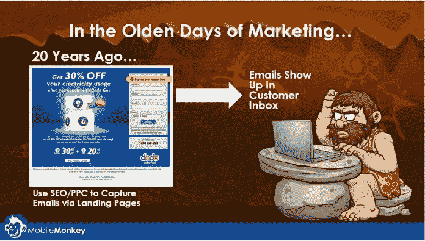

# 信息是未来——脸书也是

> 原文：<https://medium.datadriveninvestor.com/messaging-is-the-future-and-so-is-facebook-ea8c2415b850?source=collection_archive---------10----------------------->

## 该平台的交流是为了脸书的利益

当话题是 WhatsApp、Instagram 和 Facebook Messenger 的整合时——不管是你的朋友还是敌人——要问的人是这三者的主人。

Facebook Messenger 营销平台 [MobileMonkey](https://twitter.com/MobileMonkey) 、 [Larry Kim](https://twitter.com/larrykim) 的首席执行官创办了广告管理和软件及服务公司 [WordStream](https://twitter.com/WordStream) 并且是 [Inc .杂志](https://twitter.com/Inc)的专栏作家。他与营销专家 Madalyn Sklar 讨论了信息传递及其回报。

 [## 我能为您做些什么？我们聊聊吧

### 聊天机器人通过技术背后的人情味来提高生产力

arvrjourney.com](https://arvrjourney.com/how-may-i-be-of-service-lets-chat-e0762e452722) 

Kim 喜欢 Instagram 加上 WhatsApp 和 Messenger 的全包#InstaWhatEnger。他认为脸书整合他们有几个原因:

*   聊天机器人。这使得企业[可以与 30 亿用户](https://mobilemonkey.com/blog/2019/01/facebook-integrating-messenger-whatsapp-instagram)保持联系，而不管他们使用的是什么消息应用。
*   规模。整合这三者相当于超过 30 亿日活跃用户。这是营销人员的梦想，比电子邮件更好。
*   微信。中国人使用信息就像我们在西方使用“浏览器”一样。一个统一的信息平台将允许企业通过信息构建电子商务体验，这对脸书来说意味着金钱。

“Instagram 上从来没有人想在 WhatsApp 上给别人发消息，”金说。“InstaWhatEnger 完全是为了寻求向庞大的用户群体营销的企业的利益，也是为了脸书的利润。”

信息整合使企业家营销更容易，他们不必学习许多不同的方法来接触客户，一种简单的方法就可以了——节省时间和资源来专注于他们的业务

“公司需要认真对待短信作为一种新的营销渠道，”金说。“他们需要通过建立聊天机器人之类的通讯基础设施来适应这种变化——本质上就像基于聊天的网页。

 [## 我们屏蔽了社交媒体，这引起了公愤。数据驱动的投资者

### 上瘾，我们看不出来。在最近的一项研究中，基于以前的研究成果，我们想…

www.datadriveninvestor.com](https://www.datadriveninvestor.com/2018/12/01/we-blocked-access-to-social-media-it-caused-an-outrage/) 

“他们还需要投资于基于聊天的潜在客户生成策略，如点击即时消息广告和其他生成选择加入的方式，”他说。

金在他的文章中提出了一些策略，“ [*用你的脸书机器人*](https://mobilemonkey.com/blog/2019/02/facebook-bot-lead-magnets) 创造销售线索的 12 种磁性方法。”

“根据‘转换标准’来定向广告和信息，而不仅仅是根据浏览或其他情况推断出的兴趣，”Kim 说。"与电子邮件不同，在信息传递中，人们期望得到更及时的回应."

# 变化的漏斗

Facebook Messenger、Instagram 和 WhatsApp 的整合将影响[聊天机器人](https://www.datadriveninvestor.com/glossary/chatbot/)的营销渠道。不同的漏斗流入一个来源，为一个聊天机器人做所有事情开辟了道路——同样，节省了时间和资源。

“这个渠道的价值将会增加 10 倍，因为你只需付出三分之一的努力，就能接触到三倍多的人，”Kim 说。“为所有脸书用户构建一个聊天机器人，而不是三个——每个消息平台一个。”

 [## 脸书营销是一个迷宫

### 这个社交媒体巨头已经为社区建设做好了准备

blog.markgrowth.com](https://blog.markgrowth.com/facebook-marketing-is-a-maze-ing-abfe0961a107) 

如果 Facebook Messenger、Instagram 和 WhatsApp 的整合成功，其结果可能堪比电子邮件营销。

“是的，短信比电子邮件好，”金说。“电子邮件是我们的敌人，太可怕了。比较电子邮件和聊天基本上就像比较驴子和独角兽。在接下来的五年里，30%到 40%的公司将会像现在使用电子邮件一样使用信息。目前，大约有 1%的公司使用信息服务。

"如果发信息这么烦人，为什么点击率那么高？"他说。“当然，你也许可以通过推送通知欺骗某人阅读消息，但他们为什么要点击消息中的链接呢？人们喜欢发信息。

Facebook Messenger、Instagram 和 WhatsApp 的整合可能使脸书能够提供类似于中国微信的服务。

“由于在中国每个人都使用微信——100%的市场份额——他们可以建立各种商业服务，比如直接通过聊天订购午餐——或叫优步，”金说。“没有‘新闻提要’

“由于 messenger 的碎片化，我们在西方没有微信——WhatsApp、Instagram、Messenger、iMessage、谷歌——但脸书正在通过创建# InstaWhatEnger 来解决这个问题。”

脸书作为一个企业将受益于这种整合。

 [## 超越脸书:是的，有未来

### 社交媒体平台无可匹敌

medium.com](https://medium.com/datadriveninvestor/beyond-facebook-yes-there-is-a-future-1e6cbac26773) 

“信息是脸书的未来，”金说。“越来越少的脸书用户对在墙上张贴垃圾给所有人看感兴趣。故事和私人信息是未来。

“我不是股票分析师，但我相信脸书的未来是美好的，”他说。"你可以免费使用 MobileMonkey 创建聊天机器人、Facebook Messenger 广告、滴滴出行活动等等."

Kim 表示，现在是营销人员准备整合 Facebook Messenger、Instagram 和 WhatsApp 的时候了。他编写了一份聊天营销的[指南](https://mobilemonkey.com/blog/2018/10/crowdspring-facebook-messenger-marketing-guide)。

他和 Sklar 在脸书直播继续他们的对话[。](https://www.facebook.com/manageflitter/videos/570161423461995/?notif_id=1551223327591840&notif_t=live_video_explicit)

**关于作者**

吉姆·卡扎曼是拉戈金融服务公司的经理，曾在空军和联邦政府的公共事务部门工作。你可以在[推特](https://twitter.com/JKatzaman)、[脸书](https://www.facebook.com/jim.katzaman)和 [LinkedIn](https://www.linkedin.com/in/jim-katzaman-33641b21/) 上和他联系。

*原载于 2019 年 6 月 12 日*[*https://www.datadriveninvestor.com*](https://www.datadriveninvestor.com/2019/06/12/messaging-is-the-future-and-so-is-facebook/)*。*