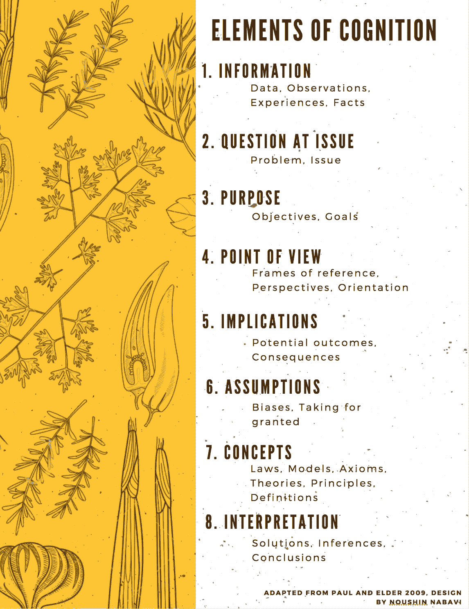

# 数据时代的元认知

> 原文：<https://medium.datadriveninvestor.com/metacognition-in-the-data-age-89ffdcd92feb?source=collection_archive---------3----------------------->

**Elements of Cognition**

约翰·弗拉维尔(John Flavell)在 20 世纪 70 年代创造了元认知(etacognition)或关于思考的思考(thinking about thinking)，早在人类 3 岁时就被灌输了这一概念。即使幼儿在任务执行过程中很难监控他们的思维，或者缺乏整合认知的框架，他们也能够进行非正式的操作。到 10 岁时，他们可以开始选择适当的策略，并分配资源进行规划。这种发展可以从 14 岁时使用诸如“想”、“知道”、“记得”和“忘记”这样的词得到证明。一般认知和元认知似乎不会随着年龄的增长而增加，但它的类型会发生变化，随着一个人获得更专业的内容知识，它会变得更具体。随着年龄的增长，我们似乎从一般领域进化到特定领域。

成功的元认知思维需要整合三种类型的知识:一、条件知识；二、元认知知识。程序知识。陈述性知识。广义地说，这些组成部分是关于自我或过程的知识，以及关于知识的影响的知识。这些包括战略或规划活动，承认法规和任务绩效，并能够评价和评估过程的有效性。

人工智能在许多方面的核心都包含了元认知的成分。在人工元素的情况下，元认知元素可以被同化为模拟智力任务的机器学习算法。这些算法可以大致分为 I .自然语言处理(视听语言认知)，ii .感知，三。物体的运动和操纵。搜索和规划，v .学习，以及 vi .推理和知识表示(如 IBM 的 WATSON)。机器学习算法的核心是元认知，即条件(推断/预测)智能、程序(错误/损失)智能和声明(训练/学习)智能。

如果元认知使在特定问题情境中学习了特定策略的人能够在其他类似但新的情境中检索和部署该策略，那么机器学习就包含了这些相同的原则。机器学习现在可能处于婴儿期，但就像人类从非正式学习开始一样，机器可以慢慢变得有能力和成熟到足以纳入元认知。Kuhn (2000)将元认知的发展描述为一个渐进的，而不总是单向的运动，以获得更好的认知策略来取代低效的认知策略。这就产生了教学的作用和在整个教学活动中提供认知知识和知识表现的明确指导的重要性。例如，教学如何对学生的学习、意识和理解产生巨大影响，这对机器学习算法是有益的(例如，以标签的形式)。元认知教学的另一个关键因素是激活已有知识和激发自我调节。这也许可以通过在指令中执行清单而变得更简单和更系统，这样它们包括规划、监测、评估和管理的条目，在每个条目下包括子问题，在指令过程中解决。

从强调认知发展中的社会话语和社会互动的皮亚杰和维果茨基，到提出元认知指导重要性的 Kramarski 和 Mevarech，这种元认知教学和技术必然会受益于神经科学和心理学领域现有的心理理论。这些可以包括通过概念图使概念可见，创造澄清的机会，促进元认知话语，鼓励概念冲突以促进不同背景下的实践。以排除其他策略为代价，单独强调这些策略中的任何一个当然是困难的。毕竟，元认知就像其成分的内在差异和细微差别一样复杂。

不管使用哪种教学策略来实现最高水平的元认知，对元认知的评估以及元认知是否发生或如何发生仍然是非常具有挑战性的。这是因为元认知不仅是一个复杂和多方面的结构，而且也不能从语言和工作记忆能力中清楚地观察和辨别出来。一些可能评估元认知的测试与自我监控能力有关，如学习-判断和判断-学习，而其他测试与记忆和精确回忆有关。前者仍在机器学习算法的背景下开发，但我们在后者方面取得了很大进展。算法还没有以自我持续的方式整合复杂的概念和推理。因此，在人工智能和机器学习不可避免的时代，我们作为人类的责任是创造性地和善意地改善结果。

因此，不仅程序员有责任进行更系统的自我认知练习，不仅检查产生概念和推理的过程，而且社会其他人也有责任认识到如何评估和衡量认知，以实现社会公益和最佳可持续绩效。更进一步说，在知识在短时间内翻倍的社会中，元认知教育变得越来越重要。为了对一个日益数据驱动的世界做出贡献，今天的学生不仅要学习元认知技能，还要每天通过自我反思和社会接触来实践和观察它们。

**参考文献:**

1.  *弗拉维尔，J. H. (1979)。美国心理学家，34(10)，906–911。元认知和认知监控:认知发展研究的新领域。*

*2。Kramarski，B. & Mevarech，Z. R. (2003)。美国教育研究期刊，40(1)，281–310 页。加强课堂中的数学推理:合作学习和元认知训练的效果。*

*3。库恩博士(2000 年)。心理科学的当前方向，9(5)，178–181。元认知发展。*

*4。Simpson，M. L .，& Nist，S. L. (2000 年)。青少年和成人文学杂志，43，528–541。策略学习的更新:它不仅仅是课本阅读策略。*