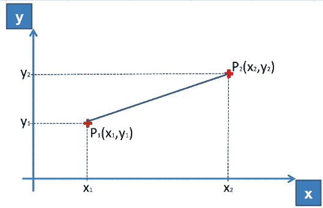
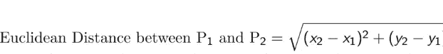
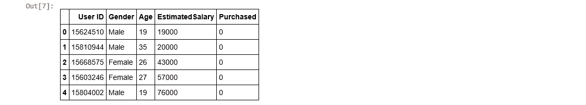
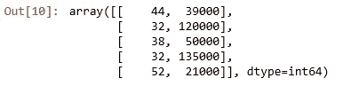
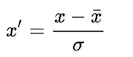
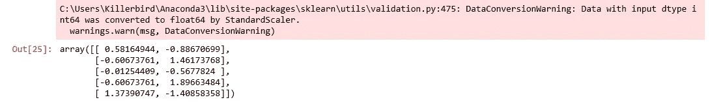
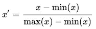
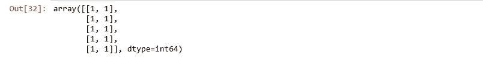
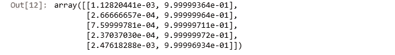

# 特征缩放的方法和用途

> 原文：<https://medium.datadriveninvestor.com/methods-and-uses-of-feature-scaling-94a44b43181a?source=collection_archive---------2----------------------->

[](http://www.track.datadriveninvestor.com/1B9E)

我们知道很多机器学习模型都是基于两点之间的**欧氏距离**，排除了决策树等一些情况。
T5【欧氏距离】是两个数据点之间的距离。它是坐标平方和的平方根，也就是**横坐标和纵坐标平方和的平方室。**



A graphical representation of Euclidean Distance



# 什么是特征缩放？

It 指的是把数值放在同一个范围或同一个尺度内，这样就没有一个变量受另一个变量支配。

它主要用在**分类数据**中，其中类别被赋予简单的整数，如 0，1，2…可能代表不同的类别。但问题是，当我们通过机器学习模型来处理这个问题时，它可能会将其解释为权重或其他东西。例如，它可以使用 0 作为最低偏好，使用 2 作为高偏好。毕竟它是一台机器！为了避免这种情况，我们使用特征缩放。

在本教程中，我们将使用 **SciKit-Learn 库**来演示各种**特征缩放技术。**

# **导入数据**

```
import matplotlib.pyplot as plt
import numpy as np
import pandas as pd
dataset= pd.read_csv("C:\data/data.csv")
dataset[:5]
```



正如我们看到的,“年龄”和“估计工资”列超出了比例，我们可以使用各种缩放技术来缩放它们。

# **拆分数据**

```
from sklearn.cross_validation import train_test_split X=dataset.iloc[:,2:4].values 
# A matrix of all the independent variables
Y=dataset.iloc[:,-1:].values 
# A matrix of all the dependent variablesX_train,X_test,y_train,y_test = train_test_split(X,Y, test_size=0.25,random_state=0)X_train[:5]
```



# **各种特征缩放方法**:

**1。标准化**

也叫 **Z 分归一化**。它计算每个值的 Z 得分，并用计算出的 Z 得分替换该值。Z 得分可通过以下公式计算:



其中σ是方差，x̄是均值。

然后，使用 x̄ =0 和σ=1 对要素进行重新缩放

**使用的库:**标准标量

```
from sklearn.preprocessing import StandardScaler
sc=StandardScaler()
X_train1=sc.fit_transform(X_train)X_train1[:5]
```



**2。最小-最大缩放:**

也被称为**正常化**。要素的比例介于 0 和 1 之间。这里，平均值保持与**标准化**中相同，即 0。

**公式**给出如下:



**使用的库:**最小最大缩放器

```
from sklearn.preprocessing import MinMaxScaler
scaler = MinMaxScaler()
X_train2=scaler.fit_transform(X_train)
X_train2[:5]
```


**3。二进制化**

它用于类似矩阵的阵列的二进制阈值处理。

**使用的库**:二进制化器

```
from sklearn import preprocessing
X_train3=preprocessing.Binarizer(0.0).fit(X_train).transform(X_train)X_train2[:5]
```



**4。正常化**

它用于重新调整每个样本。**具有至少一个非零分量的每个样本**(即数据矩阵的每一行)独立于其他样本被重新缩放，使得其范数(l1 或 l2)等于 1。

**使用的库**:规格化器

```
from sklearn import preprocessing
X_train4 = preprocessing.Normalizer().fit(X_train).transform(X_train)X_train4[:5]
```

