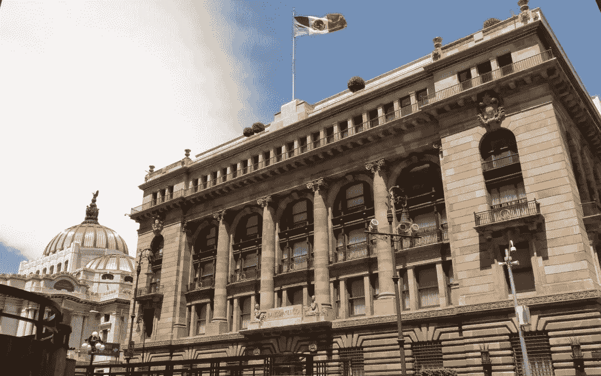

# 墨西哥不打算“立即”改变拍卖

> 原文：<https://medium.datadriveninvestor.com/mexico-not-planning-imminent-change-in-auctions-8315123dbf43?source=collection_archive---------12----------------------->

***这篇文章最早发表于 2010 年的《彭博新闻》。***

弗朗辛·拉夸和延斯·埃里克·古尔德

2 月 17 日(彭博)——墨西哥央行行长[奥古斯丁·卡斯滕斯](https://www.theguardian.com/world/2016/dec/01/mexico-central-bank-governor-agustin-carstens-step-down)表示，政策制定者不会立即调整他们每月拍卖的美元期权数量，以帮助增加外汇储备。

卡斯滕斯在接受彭博电视台采访时说，由中央银行和财政部官员组成的货币委员会可能会在未来几个月内改变拍卖机制，如果市场条件发生变化的话。

“这是一个可以调整的工具，”卡斯滕斯说，他正在巴黎参加 20 国集团财政官员会议。“在这个阶段，我不会说这是迫在眉睫的。''

加拿大皇家银行资本市场新兴市场交易主管弗朗西斯科·迭斯说，卡斯滕斯的评论缓解了决策者可能会改变期权计划以减缓比索涨势的猜测，从而帮助比索今天上涨。财政部长 Ernesto Cordero 月 10 日表示，墨西哥正在考虑增加美元期权拍卖。

 [## 另一场精心策划的全球经济危机正在逼近？如果我们的数据经济可以帮助它，就不会了-数据…

### 我们的 DApp 的开发，称为 DECENTR，目前正与我们的 R&D 同步进行，作为我们即将到来的…

www.datadriveninvestor.com](https://www.datadriveninvestor.com/2019/03/06/another-engineered-global-economic-crisis-looming-not-if-our-data-economy-can-help-it/) 

墨西哥城时间上午 11 点 53 分(纽约时间下午 12 点 53 分)，比索兑美元汇率上涨 0.2%，至 12.0398，盘中一度触及 12.0369 的日内高点。早些时候，一份世界大型企业联合会的报告也提振了比索，该报告显示，尽管创造就业机会滞后，但美国经济正在复苏。

“有人说他们会增加选择的数量，”迭斯在电话采访中说。“所以当他说这不会很快发生时，这强化了他们不太担心人民币升值的观点。''

墨西哥比索今年升值了 2.5%，是彭博追踪的七种拉美货币中表现最好的。

为外流做好准备

墨西哥每月拍卖 6 亿美元的美元期权，这一系统在将美元撤出市场时支撑了外汇储备。卡斯滕斯说，这项政策，加上国际货币基金组织提供的 730 亿美元的灵活信贷额度，旨在保护墨西哥免受快速资本外流的影响。

卡斯滕斯说，他预计不会有资本突然从墨西哥流出。“但我们已经做好了准备，”他说。

比索今天也走强，因为美国的报告显示，墨西哥最大的贸易伙伴的经济正在复苏，尽管劳动力市场难以创造就业机会。

墨西哥的政策制定者没有效仿该地区的同行，试图通过限制资本流入来抑制汇率上涨。去年，投资者将大量资金投入新兴市场，因为美国和欧洲接近零的利率促使他们在发展中国家寻求更高的回报。

拍卖计划被[摩根大通&公司](https://www.jpmorganchase.com/)描述为“市场友好机制”，因为它是提前宣布的。

严重的霜冻

卡斯滕斯说，严重的霜冻损害了墨西哥锡那罗亚州的玉米作物，可能不会对通货膨胀产生大的影响，因为农民有时间补种，而且因为库存是去年收获后剩下的。

卡斯滕斯说:“这可能不会有这么大的影响，因为去年我们有很大的收成，所以我们有很大的库存。”。

[美国农业部的一个部门 2 月 14 日表示，在锡那罗亚州本月遭遇寒流后，世界第四大种植国墨西哥的玉米产量今年可能会下降 100 万至 300 万公吨，降幅高达 12%。](https://ipad.fas.usda.gov/highlights/2017/03/Mexico/index.htm)

墨西哥 1 月份的年通胀率放缓至 3.78%，为四个月来的最低水平，原因是蔬菜成本和地方政府收取的费用下降。

更多故事[这里](http://time.com/1569/danger-zone/)和[这里](http://time.com/57160/king-of-the-imperial-blaster-beat/)

网址[此处](https://www.jenserikgould.com)