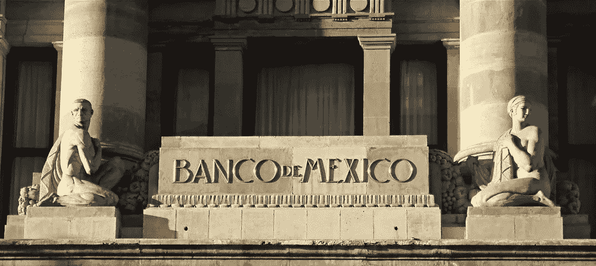

# 墨西哥银行可能从市场购买美元储备

> 原文：<https://medium.datadriveninvestor.com/mexicos-bank-may-buy-dollar-reserves-from-market-92f8c959261e?source=collection_archive---------28----------------------->

***这篇文章最早发表于 2010 年的《彭博新闻》。***

延斯·埃里克·古尔德和何塞·恩里克·阿里奥哈

1 月 28 日(彭博)——墨西哥中央银行行长[奥古斯丁·卡斯滕斯](http://www.agustincarstens.com/)表示，官员们可能会从市场上购买美元，作为增加外汇储备并逐步退出国际货币基金组织 470 亿美元信贷额度计划的一部分。

本月上任的卡斯滕斯在一次采访中表示，由中央银行和财政部管理的货币委员会可能会创建一个购买美元的系统，其中可能包括使用该银行直到大约十年前一直使用的期权机制。他说，该计划不会针对特定的汇率。

 [## 另一场精心策划的全球经济危机正在逼近？如果我们的数据经济可以帮助它，就不会了-数据…

### 我们的 DApp 的开发，称为 DECENTR，目前正与我们的 R&D 同步进行，作为我们即将到来的…

www.datadriveninvestor.com](https://www.datadriveninvestor.com/2019/03/06/another-engineered-global-economic-crisis-looming-not-if-our-data-economy-can-help-it/) 

“我们希望通过一种基于特定规则的机制来实现，这样当市场出现特定条件时，就可以进行购买，”他说。“银行不会有任何自由裁量权，因此不会被解释为我们试图达到比索的特定水平”。

卡斯滕斯购买美元的计划可能会缓和全球最大的外汇交易员对比索今年将升值的押注。本月早些时候，彭博调查的 19 名分析师预测比索将是拉丁美洲表现最好的货币。

墨西哥城摩根大通公司的高级经济学家加布里埃尔·卡西利亚斯说:“中央银行不想对汇率产生扭曲效应。”。“购买美元的后果之一是，它可能会限制比索的升值，这可能会继续帮助墨西哥的出口。''

**比索**

比索去年上涨了 4.4%，落后于巴西雷亚尔 33%的涨幅。纽约时间上午 9 点 34 分，欧元兑美元汇率上涨 0.2%，至 12.9403。

51 岁的卡斯滕斯昨天告诉记者，墨西哥正在寻求积累储备，以取代国际货币基金组织的信贷额度。

美联储昨天也表示，不会续签将于 2 月 1 日到期的 300 亿美元的货币互换协议。

在昨天的采访中，卡斯滕斯表示，该银行可能会在下个月宣布其寻求积累的储备目标金额，届时它还将与国际货币基金组织代表团讨论信用额度的更新。他拒绝透露墨西哥寻求更新的金额。

花旗集团(Citigroup's Inc .)在墨西哥城的 Banamex 部门的经济研究主管塞尔吉奥卢纳(Sergio Luna)说，国有石油公司墨西哥石油公司(Petroleos Mexicanos)今年将获得 50 亿至 60 亿美元的额外收入，这些收入可能会被央行收购，以增加外汇储备。

**储备**

“评级机构给信用额度的价值和给储备金的价值不一样”，卡斯滕斯说，他在办公室里听了 T4·赫伯特·冯·卡拉扬指挥的贝多芬的音乐。“在一个波动性很大的环境中，市场正在复苏，但仍然疲软，我认为增加储备是合适的。''

卡斯滕斯说，除了购买美元，该行还将通过传统手段增加储备，如国营墨西哥石油公司出售美元和政府债务操作。

墨西哥接近创纪录的 912 亿美元外汇储备在拉美七大经济体中占国内生产总值的比例最低，约为 8.3%，而巴西和秘鲁分别为 15%和 24%。

卡斯滕斯是芝加哥小熊棒球迷，自 2006 年以来担任财政部长，领导墨西哥应对全球金融危机。去年，由于美国的经济衰退削弱了需求，墨西哥经济估计暴跌了 7%。美国购买了墨西哥约 80%的出口产品。

**银行通信**

银行行长拥有芝加哥大学的经济学博士学位。从 2003 年到 2006 年，他是国际货币基金组织的副总裁。

在 1994 年至 1999 年担任央行首席经济学家期间，他与人合写了一篇论文，其中他推动市场参与者更广泛地获取央行数据。

现在掌管银行的他说，他希望在沟通方面更加明确，也可能开始公布政策会议的记录。

为了改善与政府的协调，卡斯滕斯在本月的政策会议上运用银行规则欢迎财政部长埃内斯托·科尔德罗(Ernesto Cordero)和他的副手亚历杭德罗·沃纳(Alejandro Werner)。

从未以财政部长身份列席会议的卡斯滕斯表示，官员们获得了长期邀请，可以列席未来所有会议。

央行本月连续第五次会议保持基准利率不变。

**通货膨胀**

卡斯滕斯表示，汽油价格上涨和更高税收的暂时传递影响将在 4 月或 5 月达到顶峰，此后政策制定者将能够更好地衡量价格上涨是否产生了第二轮影响。他说，需求方面的通胀压力可能要到明年才会出现。

卡斯滕斯说:“经济中仍然有很多疲软的因素。”。“很难预见今年全年需求方面会有通胀压力。''

英国央行昨日维持其对 2010 年最后两个季度消费者价格年增长率高达 5.25%的预测不变，超过了 3%的目标。

“这是一个微妙的情况，因为毫无疑问，我们正面临着通货膨胀的增加，”卡斯滕斯说。

卡斯滕斯表示，他拒绝被贴上货币政策鹰派或鸽派的标签，而是更愿意专注于履行他客观分析通胀数据的使命。

“任何央行行长都不应该有一种在所有情况下都普遍存在的抽象偏见，”卡斯滕斯在他的办公室里说，他的办公室装饰着一幅 T2·迭戈·里维拉 1936 年的画。“我想做的是，在必须收紧时收紧，在不必收紧时不收紧。''

[T5*我的网站*T8](https://www.jenserikgould.com)