# Mi-Robot:为什么我们必须同情机器人，但让它们保持非人类状态。

> 原文：<https://medium.datadriveninvestor.com/mi-robot-why-we-love-robots-not-in-our-own-image-3118e4bbc29f?source=collection_archive---------8----------------------->

存在于我们拟人化的物体中的力量是如此之大，如此需要关注。还有一些其他的物体我们也以同样的方式对待，仪器、汽车、玩具是其中最明显的一些。然而对我来说，这完全是对机器人的热爱。机器人是无限可爱的，因为它们拥有人类的所有优点，而不是真正的人类。一旦越过这条线，爱就会变成恐惧。

# 经典机器人 v 类人机器人

爱和关心一个看起来像机器人的机器人更容易。机器人有能力让我感受到高度的情感，而不会真正打扰我。这是我感受到的强烈而纯粹的爱，我本能地对长得像人类的机器人没有同样的感觉。只有看起来像机器人的经典“老派”机器人才是安全的。它们是不带政治色彩的共鸣的完美出口。

人形机器人和机器人的动力不一样。有些人走得很近，但只是在他们各自故事中死亡方式的背景下。在《终结者 2》中，在电影的大部分时间里看起来像人类的终结者，却表现得非常不像人类，以至于界限变得模糊不清，当他最终做出重大牺牲时，我哭了，但我认为这与我们那时只看到一只金属手臂有很大关系。

《人工智能》中的“大卫”也是如此。他本质上是一个古怪的社交无能的问题儿童，而不是我心目中的“机器人”。然而，在“肉博会”上，当他和那些过时的、没有执照的机器人在一起时，通过他和其他机器人的交往，我开始关心他了。

一个过于人性化的机器人让我想起了《玛奇纳》这部怪异的性爱电影，这部电影让我觉得很奇怪。Ex-M 令人毛骨悚然，机器人里没有性的空间。这只是我们需要机器人呆在非人类世界的众多原因之一。一旦他们看起来像我们，他们就变得令人不安，成为一种威胁。

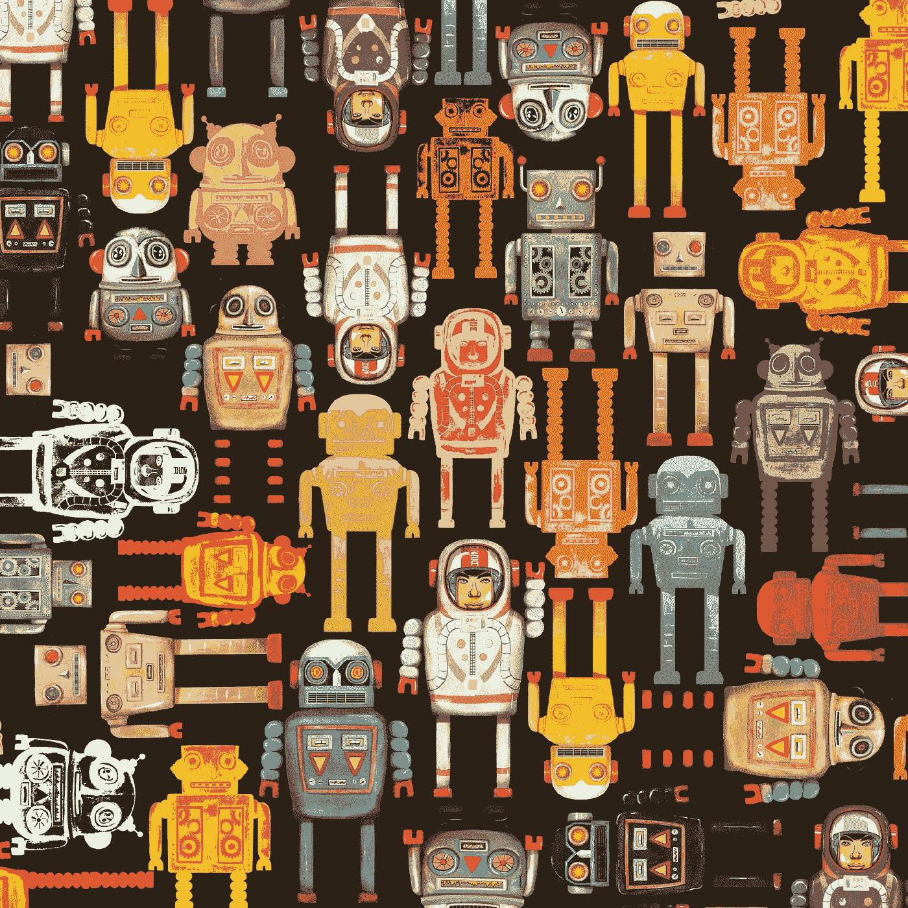

proper robot shaped robots

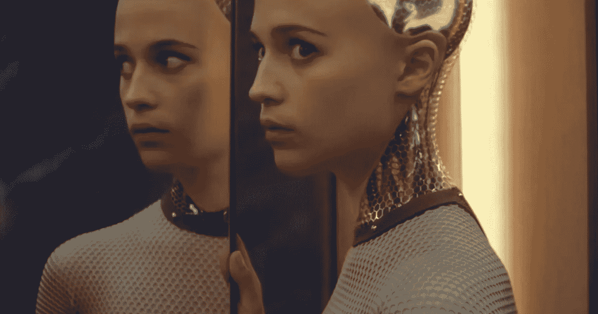

Ava, from EX Machina by Alex Garland.

当我看到一个机器人，尤其是一个正在遭受痛苦或被虐待的机器人时，我的脑海里会有些疯狂。我认为是因为通常的情绪限制停止器不存在了。“塞子”是“人”。

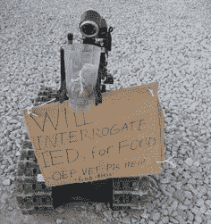

Fellowship: Real, military use Robot, being put into a position where other Vets identify with it.

我认为我更容易感受到更广泛的情感，我特别指的是爱、绝望和**同理心**，当被人类伤害的对象不是另一个人时。

一个机器人不会因为也是“人类”而被审判，所以当我看到它遭受痛苦时，我可以自由地感受到可以感受到的全部悲伤。

# 自动机和“男人哭电影”

有时候对我来说太多了。我很久没看电影《自动机》了。第一次我处于震惊和愤怒的状态，看到机器人在电影的前几分钟被枪杀并自焚。我不能看超过 10-15 分钟。太痛苦了。经过几次尝试后，有人设法让我明白电影会变得更好，我熬过了艰难的一段，并很高兴最终看到班德拉斯的角色雅克·沃坎成为机器人的朋友，并帮助机器人的解放和进化。

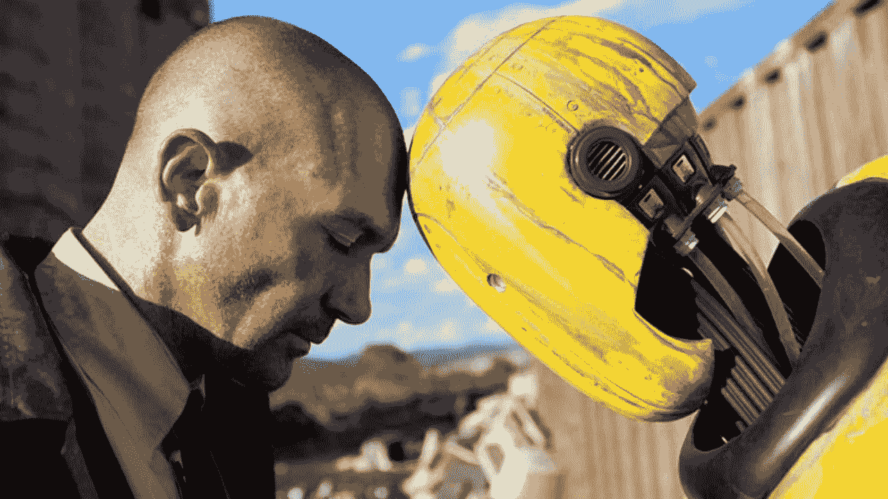

Jacq Vaucan and robot.

机器人是人类最优秀品质的完美结合，没有不得不成为人类的残酷现实。我认为正是因为这个原因，机器人受苦的场景和图像唤醒了我内心绝望的痛苦。

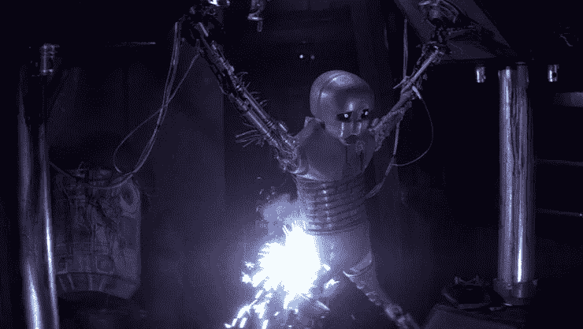

Torture of a star wars droid

许多机器人电影被称为“哭泣的家伙”电影。我完全不知道为什么一个人需要是男性——列出的电影都是让我哭的电影，而不是像《笔记本》这样的无聊电影——(是的，我知道它的名字——只是因为有些人来书店要它，通常是在要求“吃，祈祷，爱”的同时。或者《秘密》,我并没有瞧不起那些书或者类似的东西——这只是我的一个观察。)

无论如何，我都会链接这篇文章——因为它值得一读。作者表达与机器人的关系的方式也引起了我的共鸣。“当一个……机器……让我们爱他们，然后做了一件无私而有力的事让我们流泪。”[http://www . escapist magazine . com/articles/view/moviesandtv/columns/guy cry/12812-The-sad-Robot-Movies](http://www.escapistmagazine.com/articles/view/moviesandtv/columns/guycry/12812-The-Saddest-Robot-Movies)

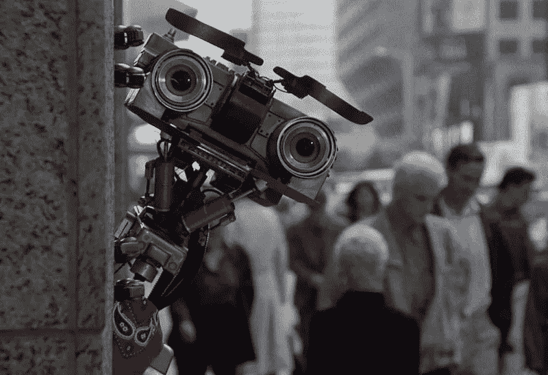

Johnny 5 from Short Circuit.

请在脑海中想象一个由不同的生锈零件组成的机器人，不是一个闪亮的机器人，我们不会知道它不是人类，而是一个意识到自己下一步进化并有其他顾虑的机器人。听到 Johnny 5 要求更多“输入”的声音，然后想想他在乞求“不要拆卸”时经历的所有痛苦。

想象一下《迷失太空》中与威尔·罗宾逊合作的机器人不被信任、被拒绝并被迫自我毁灭的时刻。在多次救了全家人的命之后。

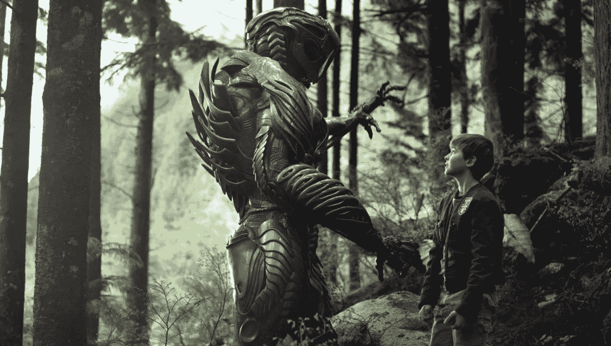

“Danger, Will Robinson”

一个机器人能得到的最接近人类的外观，并且在我的头脑和心中仍然被归类为“机器人”的是机械战警。所有书籍和电影中让我心动的最好的机器人包括:钢铁巨人、BB8、R2D2、约翰尼 5、克里斯·雷德尔的《温德尔与机器人》中的沉闷金属、布莱恩·盖奇的《最悲伤的小机器人》中的史努特、查皮、擎天柱、塔斯、不包括电池中的修复程序和瓦力。我需要讲一些他们的故事来告诉你为什么我们的生活中需要合适的机器人。

# 瓦力，查皮和拯救我们的机器人。

《瓦力》是关于机器人拯救我们的潜力的最具影响力的电影之一。

在经历了多年的消费主义和环境破坏后，瓦力独自留在了一个早已变成巨大垃圾荒原的世界上。七个世纪前，人类已经被巨型公司 Buy-N-Large (BnL)从巨型邮轮上撤离。瓦力只留下来清理废料。他发现了生命重现的证据，同时他被一个携带“外星植被评估器”或 EVE 的探测器的到来所震惊，该探测器被派去扫描行星上的植物生命。瓦力设法跟随夏娃回到星际航线公理号，连同幼苗植物，经过一些最令人心跳停止的战斗，在太空和公理号上，瓦力和夏娃基本上拯救了世界，并把希望带回一个死亡的星球。

瓦力不仅是一个自动进化的机器人，他能够感受到纯粹的爱，他的动机只是为了人类的延续。与前玛奇纳的艾娃截然相反。

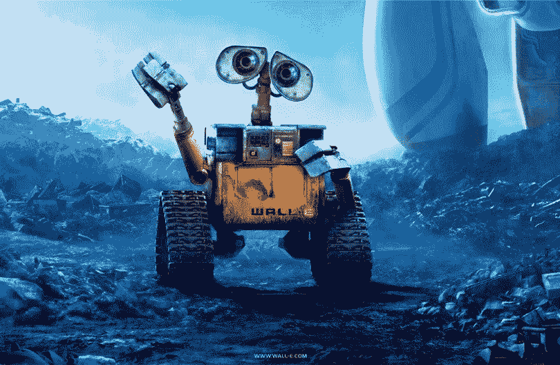

WALL-E (Waste Allocation Load Lifter Earth-class)

电影《查皮》是另一部让我心碎又重新愈合的电影。《查皮》是对机器人一切伟大之处的极端完美的描绘。

他强壮、忠诚、有爱心、强大、无辜、纯洁，看起来不像人类。

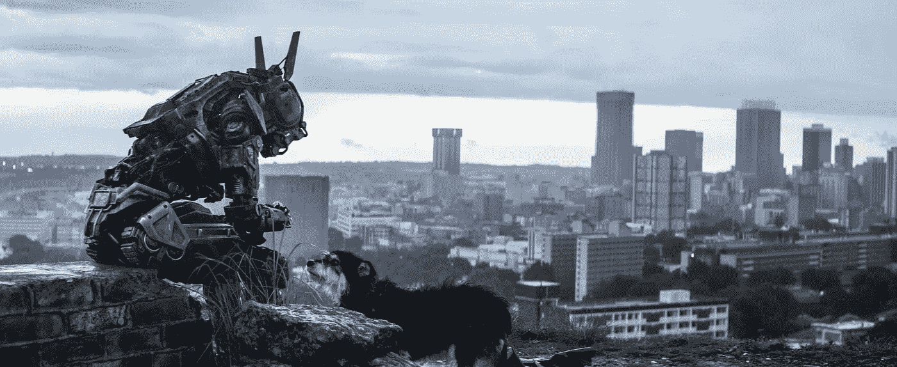

Chappie bonding with a scruffy dog

查皮原本是一群警察机器人中的一员，他们在约翰内斯堡针对极端的犯罪水平执法。在几乎被摧毁并被扔进垃圾堆后，科学家 Deon Wilson 决定对他的一个机器人进行情感升级，他偷了一个损坏的警察机器人，并在他身上安装了“警卫钥匙”。当这一切发生的时候，由 Die Antwood 扮演的匪徒，本质上是扮演他们自己，得到了这个机器人，给它取名为 Chappie，并强迫 Deon 让他们保留 Chappie，以帮助他们现在对抗警察并保护自己免受“Hippo ”(一个危险的匪徒，Ninja 的团伙只有几天的时间来偿还 2000 万[rand](https://en.wikipedia.org/wiki/South_African_rand)to)的债务

Yolandi bonding with Chappie.

所以查皮生来就有情感，(我不想让还没看过的人扫兴)除非他被修复，否则他的日子屈指可数。

任何看这部电影的人都会忍不住被《Die Antwood》中的 Yolandi 和 Chappie 的关系所感动。她作为查皮的朋友真是太棒了。

多么高尚。一个机器人是多么纯洁，多么真实，多么强壮，多么无辜，多么忠诚，多么聪明，多么富有同情心，多么不像我们。只要它是一个“机器人”。机器人变得越像“我们”，我们就越不会感同身受，变得越可怕。

# 钢铁巨人，史努特和可爱。

《钢铁巨人》可能是关于一个被误解的机器人的最好也是最令人心痛的电影之一。当和他交朋友的小男孩(荷加斯)给他看他的漫画时，他急于不被与邪恶的“Atomo”相提并论，因为他看起来像他。钢铁巨人是另一个经典的“机器人”,但是爱他更安全，因为他不是我们制造的，他来自“外太空”

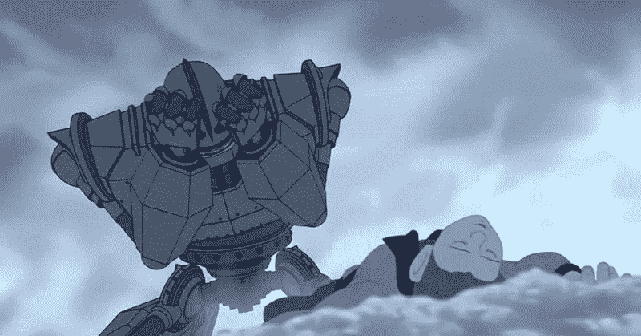

The Iron Giant, crying.

史努特是典型的令人心碎的素材。他是一个 drugge-bot，故事中最底层的机器人。和一个奴隶。他也是一个“奇怪的形状”，有一个分心的性质，所以被他自己的同龄人取笑。

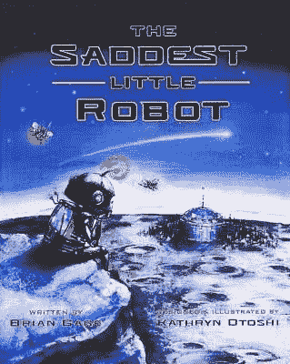

‘Snoot’ on the cover of Children’s book ‘saddest little robot’ by Brain Gage illustrated by Otoshi

BB8、R2D2、塔斯和“修理者”(不包括电池)很乐意为我们服务和工作，他们忠诚、乐于助人，但能力更强。这些机器人也非常可爱。他们不构成威胁。

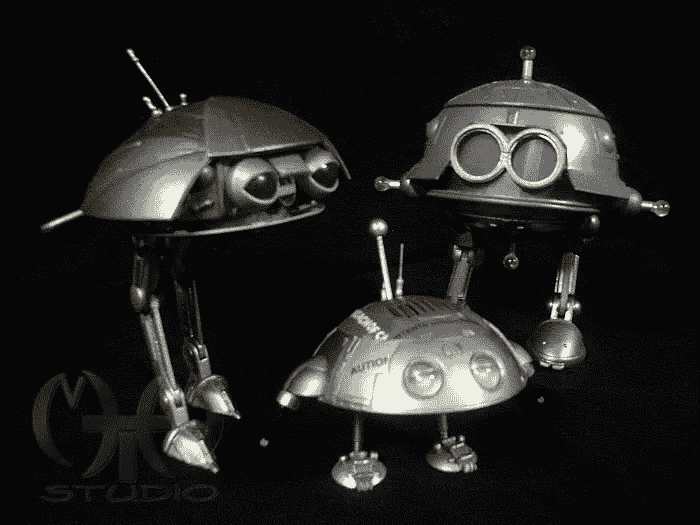

Fix-Its from Batteries not included.

# 温德尔和温德尔波特，人类和看起来像人类的机器人。

里德尔精彩的《温德尔和机器人》所传达的信息是表面上的，是关于环境友好，以及不要忽视某些东西的价值。真的，它有一个更大的信息，这个简短的儿童故事概括了我在这里所说的很多东西。

温德尔是一只老鼠，也是一个发明家。他发明了一个叫“咯咯”的机器人来帮助他清理和整理东西。此时，温德尔的房子外面已经堆积了一大堆废铁。沉闷金属声不是很擅长他的工作，并犯了错误，所以温德尔把他扔进了垃圾道，并建立了更强大的“温德尔波特”，(注意这个名字)。这个机器人是按照自己的形象。它看起来像一个巨大的长着希特勒胡子的老鼠机器人。因此，这个 Wendelbot 可以被视为一个更像人工智能的机器人类型的鼠标，它真的很擅长自己的工作，不像 Clunk，但无法控制，最终想清理“一切”，包括温德尔自己。

温德尔最终倒在了他当初扔下沉闷金属声的同一条垃圾道上，闷闷不乐地坐在一座小山般高的废料堆上，直到令他惊讶的是，在他的痛苦中，他发现沉闷金属声还在那里，活着，机智，而且，还是他的朋友。

被拒绝、被发现过时、被发现无用和不够“足够”的 Clunk 仍然保持忠诚，并且仍然是一个智能和能干的机器人。温德尔和克兰克一起，利用垃圾堆里的所有废料，建造了一支由不匹配的畸形机器人组成的军队。他们作为一个群体足以战胜并反抗温德尔波特的暴政。

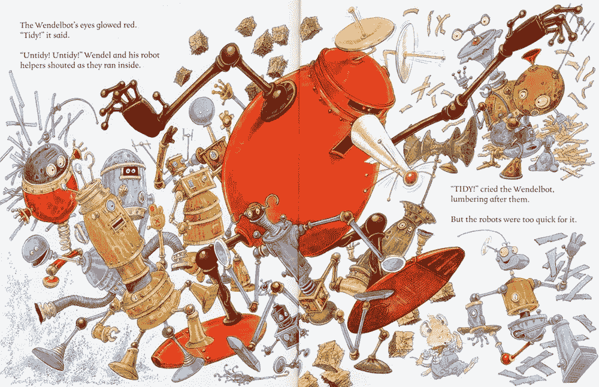

Pages from “wendel and the Robots. The big red robot is the Wendel-bot and ‘Clunk’ is bottom right.

里德尔通过他的故事向我们展示了当一个原始的机器人展现出它的本色时，我们是多么的惊喜，那就是忠诚到底。Clunk 只是很高兴再次有用。最终出现的是不符合自己形象的机器人。我们需要为沉闷金属受到的恶劣对待感到难过，然后将其与我们对长得像我们的机器人缺乏感情进行比较。

不是机器人本身用它们的潜力对我们自身的继续存在意味着什么来吓唬人们，而是按照我们自己的形象创造一个机器人。众所周知，我们将面临被“取代”的真正危险。长得像人的机器人一点也不可爱。这令人毛骨悚然，在我们对这类机器人的所有描述中，我们总是把它们描绘成我们的刽子手，人类终结的手段。来自前玛奇纳的艾娃，用性诡计来逃脱，无情地抛弃了解放她的人，当然，我们还能期待什么。她没有心。她是有感觉的，新的，会尽一切努力继续存在。最可怕的终结者是 T1000，它看起来不只是人类，而是由液态金属制成，可以变成任何人

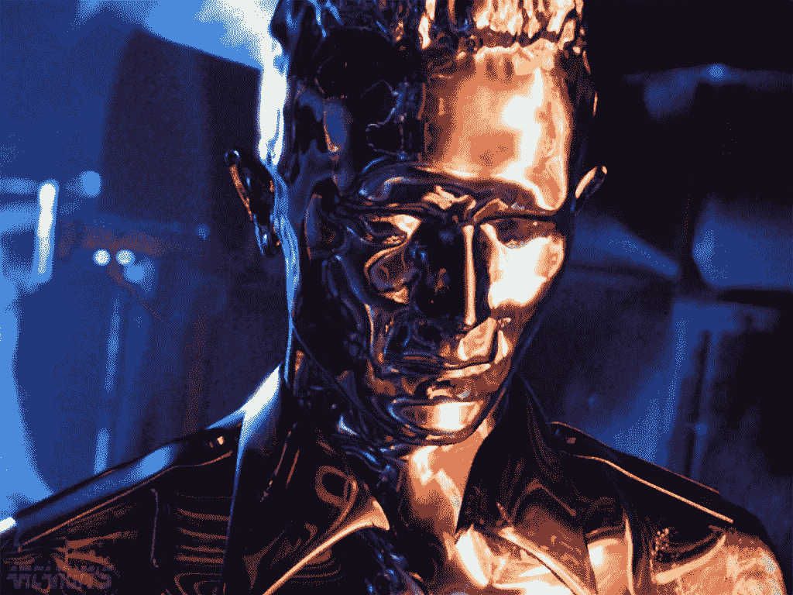

T1000 from Terminator 2

这是电影中机器人扑击和机器人死亡事件背后的核心原因。这是为了带来那种强大的“干净”的感觉，简单的移情。我敢说任何看电影《变形金刚》的人在擎天柱临死的场景中不会没有感情——事实上——如果你没有感觉，我想这让我质疑你的人性。

这种本能的共鸣是我们如何区分帮助我们的机器人和将导致我们死亡的机器人的区别。

Grimes 最近发布的“我们欣赏力量”应该被理解为一首为我们这些欢迎未来人工智能霸主的人写的歌。我读过她说过的话，她说‘人工智能就要来了，也许看这个视频会有助于拯救你未来的后代’。既然她和埃隆·马斯克在一起，我倾向于相信她看到了让她说出这些话的东西。

Grimes- ‘We appreciate Power’

# (好)机器人、机器人和机器人的特征

机器人比任何人都强壮、聪明和熟练。在电影《星际穿越》中，当马修·麦康纳的角色在第五维空间迷失时——是塔斯的声音支撑着他，让他成功穿越。我看过这部电影的次数，当塔斯的声音穿过真空寂静的空间时，我仍然感到这种瞬间的解脱感。想想看——如果你真的在太空中漂浮，可能会掉进一个外星人建造的四维以上的建筑中——你还想和谁在一起？

他们不能抛弃你。他们可能会受到伤害，这是令人憎恶的，但他们总是可以复活，重塑。他们纯洁的灵魂是不朽的。假设你是库珀，来自星际，或者类似的人，在地球上执行同样的任务。你身边的另一个人不会帮你度过难关。他们会让你担心他们的安全，或者你不相信他们脑子里在想什么。甚至在电影《地心引力》中——它是一个人的幻觉——所以不是人类——拯救了瑞安·斯通博士，使其免于在太空中死亡，以及计算机控制她周围的机器。

你的机器人朋友不会死，也不会说谎，所以他们会在那里，陪你到最后。直到你神奇地在一个奇怪的弯曲空间站的病床上醒来。

机器人是高贵的。他们已经建立了道德，即使对这些规则做出一点改变，对机器人来说也是一件大事，足以引起一场革命(I-robot)或自动进化(Automata)。当终结者成为约翰·康纳的父亲时，为了人类的未来，它仍然选择结束自己的存在。人类每天每时每刻都在忘记自己的原则和伦理。世界一直在转动。当机器人做的时候。这是个大新闻。这也将是我们自己的未来。

机器人是纯洁无辜的。他们没有被肉体的欲望腐蚀。机器人似乎想要的东西包括，更多的知识，(约翰尼 5)自我进化的自由(自动机)，继续做它的工作和做好事(机械战警)，以及最常见的比喻；归属。我们把它们做成没有我们所拥有的可怕需求的东西。

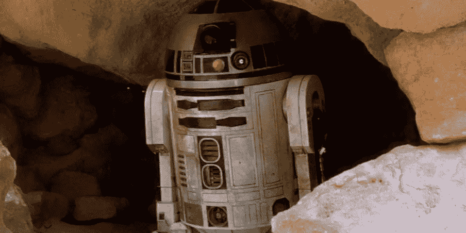

R2D2

他们免除了这样的事情，是纯洁的。想要妈妈的人工智能男孩。想要一个家庭(妈妈，爸爸，查皮)的前警察机器人

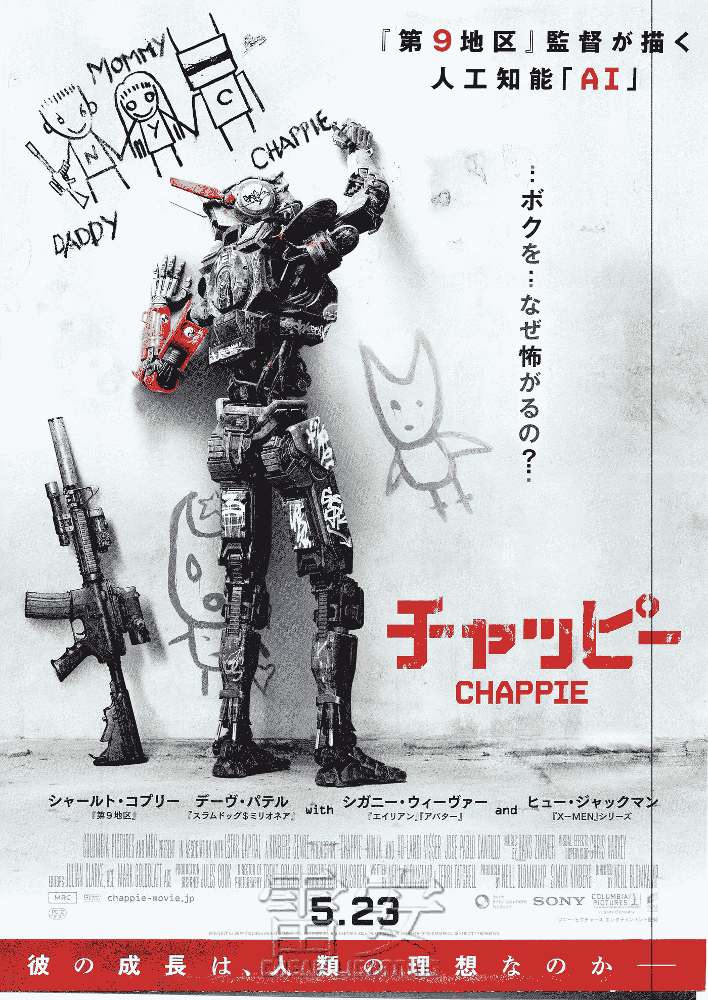

Poster for the movie Chappie with him drawing his ‘Family’

即使你认为自己是电影中机器人受伤时无动于衷的那%的人之一，我敢打赌，你有一个填充玩具、一辆汽车或一个你可以表达人类情感的工具

安全，强壮，忠诚，聪明，不会死，不会背叛。绝不会让人失望。做我们不能做的事情。

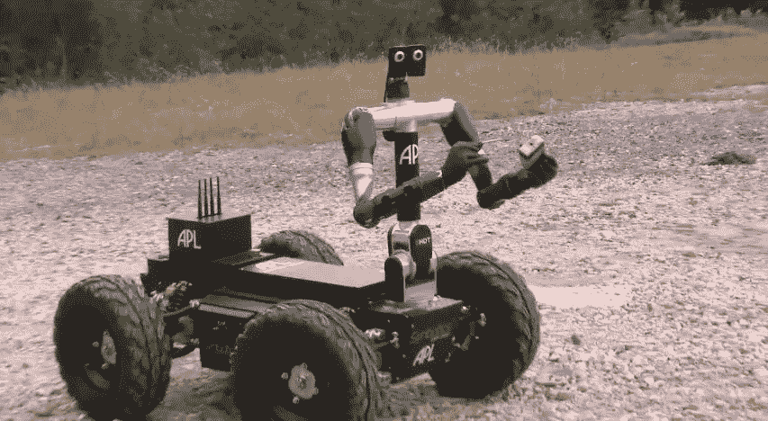

Hero. A Real Bomb disposal Robot used in Afghanistan.

可修复的，可教导的，可信赖的，可能比我们自己更了解我们和我们的需求。没有那种额外的“人性”,它们是无限可爱的，不会造成任何危险。

拥有额外的“人性”但超越人性的机器人也是人工智能，它最终将变得足够强大，能够在我们和地球之间做出选择。我认识的几乎所有研究这个领域的人都向我保证，这是一个很有可能的场景，总有一天。

无论是沉默的艾娃，进行她的秘密议程，不被承认是一个高度智能和有感情的机器人，Grimes' A.I 霸主，尼尔·舒斯特曼的“雷头”或来自矩阵的吸血鬼机器。我认为它的第一个决定将是是否决定让我们继续生存下去。我相信它会做出正确的选择。