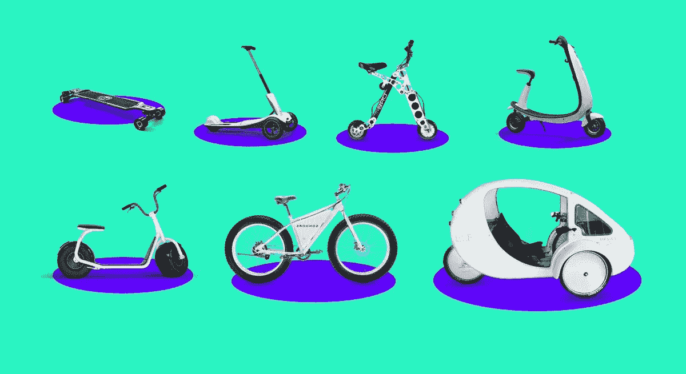
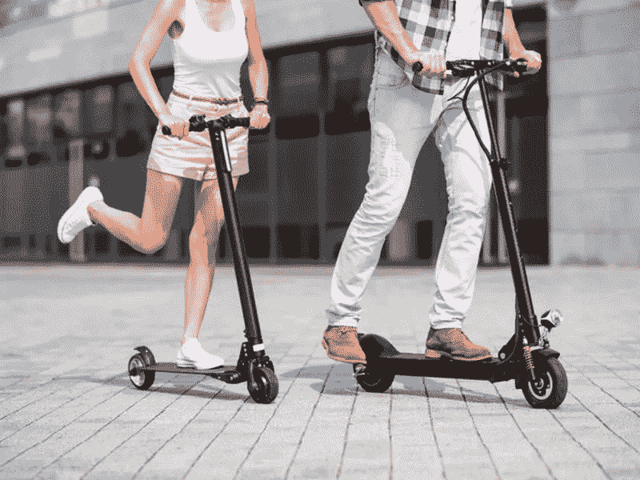
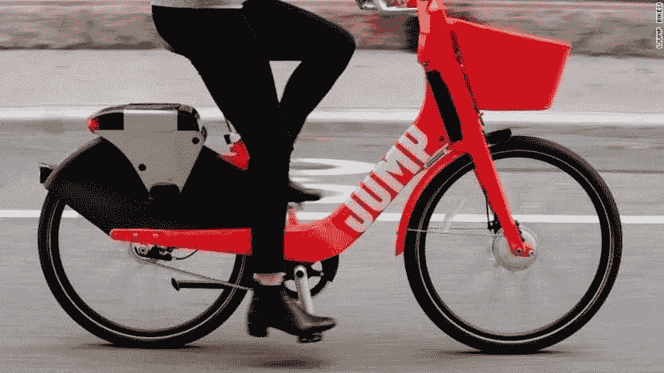
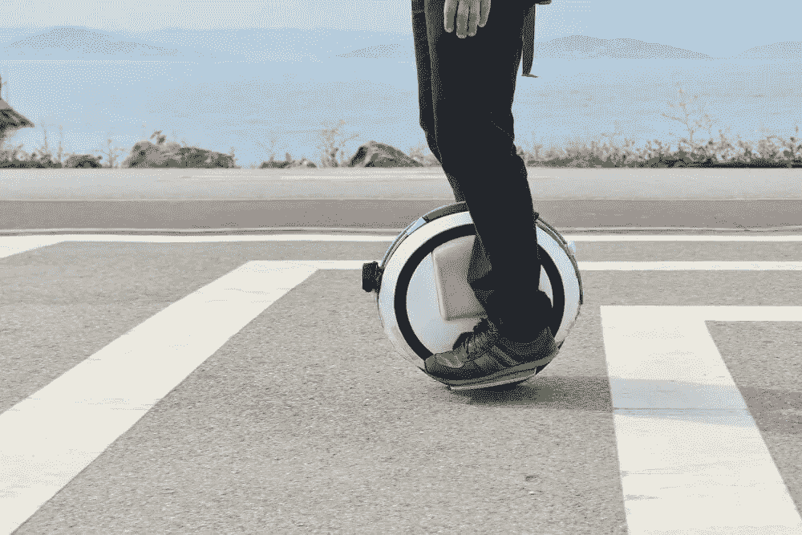
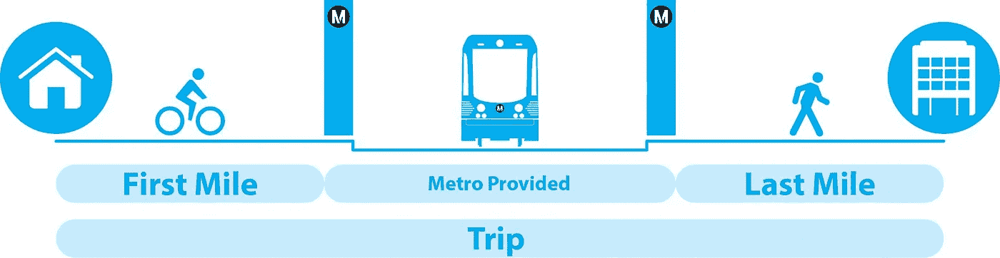
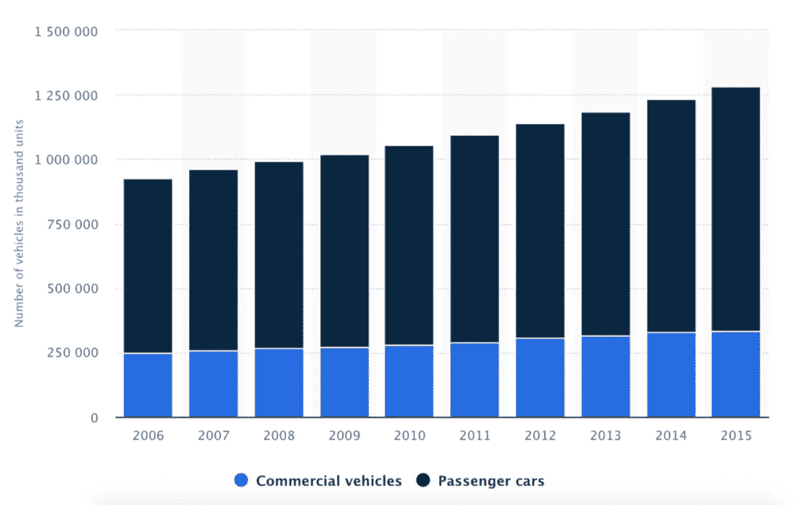

# 微型汽车是汽车的未来

> 原文：<https://medium.datadriveninvestor.com/micromobility-is-the-future-of-vehicles-220c2c0c9b0?source=collection_archive---------0----------------------->

Photo from [Have A Go](https://haveago.city/)

当人们听到“交通工具”这个词时，他们首先想到的可能是我们的汽车、公共汽车，甚至飞机。每种交通工具都有自己的用途，但最受欢迎的交通工具一直是汽车。但是最近，汽车工业有了新的发展，我们称之为微型汽车。

2019 年 2 月，电动滑板车公司 Lime 融资 3.1 亿美元，其竞争对手 Bird 融资 3 亿美元，使两家公司的估值都达到了 2B 美元。这两家公司都在不到两年的时间里达到了 1B 的估值，使它们成为迄今为止发展最快的独角兽。

 [## 准备在 2019 年改变世界的技术-数据驱动的投资者

### 很难想象一项技术会像去年的区块链一样受到如此多的关注，但是……

www.datadriveninvestor.com](https://www.datadriveninvestor.com/2019/01/17/the-technologies-poised-to-change-the-world-in-2019/) 

微移动创业公司非常有价值，这是有充分理由的。它们有可能颠覆整个汽车行业。这些东西可能很小，但却有巨大的冲击力。

# 到底什么是微机动车辆？

有几种不同类型的微型交通工具，但最著名的是电动滑板车、电动自行车、电动独轮车和电动滑板。

大多数人对微型交通工具的介绍是电动滑板车。这些是装有马达的踏板车，可以让你达到 20 公里/小时。最受欢迎的两家电动踏板车初创公司 Bird 和 Lime 允许你按分钟出租电动踏板车。

如果你住在亚洲，尤其是中国或日本，电动自行车非常受欢迎。但是对于世界上的其他人来说，很有可能你从未遇到过。就像电动滑板车一样，电动自行车将电机连接到自行车上，使你可以骑到 40 公里/小时，几乎和奥运会自行车手一样快，而不必付出太多努力。就像电动滑板车一样，初创公司也在进军电动自行车领域。最引人注目的是 Jump 公司(已被优步收购)及其竞争对手 Lyft。

其他的是电动独轮车和电动滑板。没有多少创业公司试图赚钱，可能是因为他们规模小，很难获得资金。这些电动独轮车和电动滑板不能像电动自行车一样快，也比电动滑板车更难平衡，但它们比其他选择更轻便。许多小到可以随身携带，有些甚至小到可以放进你的包里。

这些车辆有各种各样的形状和大小；允许他们适应你的任何需求。

# 我为什么要用它？

如果你是那种喜欢开车上学或上班的人，你并不孤单。也许你住在一个远离公共汽车和火车之类交通工具的社区，或者也许这些交通工具都不会停在你的办公室附近。无论哪种方式，如果你选择通勤而不是开车，对你来说都很困难。但是，仅仅为了让你在 40%的路程中免受痛苦，而驾驶 100%的路程，这难道不像是一种浪费吗？

> 现在你不用担心那 40%了

进入微型机动车辆。这些车辆是为大约 8-15 公里的短距离设计的。虽然他们通常不能把你一路带到你的办公室或大学，但他们可以让你去公共汽车或火车站更方便。

First Mile and Last Mile Problem. Photo from [CBInsights](https://www.cbinsights.com/research/disrupting-cars-car-sharing-scooters-ebikes/)

所以之前困扰你的 40%的旅行？你现在不用担心这个了。你不会在整个旅程中都舒适地坐在你的车里，但是有了你节省的钱，有了躲避和穿梭于车流的能力，你可能值得跳上一辆电动滑板车而不是你的车。

# 汽车工业正处于危险之中

汽车工业可能处于危险之中的想法很难让人相信。今天的世界完全依赖于汽车，没有汽车去大多数地方旅行似乎是完全无法忍受的，尤其是对于许多没有良好公共交通系统的国家。几乎每家快餐店都有免下车服务(甚至像星巴克这样的咖啡店现在也有免下车服务)。现在已经到了这样一个地步，即使是那些收入不足以购买食物的家庭也被迫购买廉价汽车来维持日常生活。

数据也不会说谎。似乎越来越多的人开始购买汽车。

Photo from [Statista](https://www.statista.com/statistics/281134/number-of-vehicles-in-use-worldwide/)

尽管如此，以目前的情况来看，我们无法维持城市中汽车的增长。联合国经济和社会事务部的一份报告称，到 2050 年，全球 68%的人口将居住在城市。这比我们今天拥有的数量增加了 24%。事实证明，在未来几年，城市很难按照汽车保有量的增长速度来改善道路基础设施。

## 汽车目前也是污染的最大来源之一。

> 根据美国环保署的数据，机动车总共造成了美国 75%的一氧化碳污染。环境保护基金会(EDF)估计，在美国产生烟雾的空气污染中，公路车辆造成了三分之一，交通运输造成了 27%的温室气体排放。美国拥有世界上 30%的汽车，却排放了世界上一半的汽车尾气。琳达·c·布林森

电动汽车是解决这个问题的一个可能的办法，但事实将证明，很难恰当地实施电动充电站，尤其是在第三世界国家。对许多国家来说，在未来几十年内，电动汽车只不过是一个白日梦。

## 拥有一辆汽车变得越来越难了

> 在美国，绝大多数想在高峰时间出行的人都使用私人汽车，原因有二。一是大多数美国人居住在低密度地区，公共交通无法有效服务。第二，私人拥有的交通工具比几乎任何形式的公共交通工具都更舒适、更快捷、更私密、出行时间更方便，并且在一次出行中可以更灵活地完成多项任务。—安东尼·唐斯

汽车非常方便，这是无可争议的事实。无论你只是开车去上班，还是驾车穿越乡村，它们都可以带你去任何地方，让你舒适地坐在里面，免受恶劣天气的影响。尽管如此，拥有一辆汽车变得越来越难了。这可能很难马上说出来，但是你会开始注意到使用汽车变得越来越困难。

> 交通越来越差。2015 年，美国人的平均通勤时间增加了 24 秒。

随着城市人口的增长，交通状况只会越来越糟。

> “高峰时段的交通拥堵是现代社会运作方式的结果，也是居民习惯导致他们每天超负荷使用道路和交通系统的结果，”—安东尼·唐斯，美国公共政策和管理经济学家。

高峰时间的出现是因为人们都想在同一时间做同样的事情。随着劳动力的增长，需要在早上 7 点开车上班，下午 6 点开车回家，然后在周五晚上出门的人数也会增加。交通流量最终可能会达到大多数人无法承受的水平。

人口普查数据还显示，美国人的通勤时间越来越长。

From [Washington Post](https://www.washingtonpost.com/news/wonk/wp/2017/02/22/the-american-commute-is-worse-today-than-its-ever-been/?noredirect=on&utm_campaign=buffer&utm_content=buffer3fe24&utm_medium=social&utm_source=twitter.com&utm_term=.1ef2e55dc3a9)

同样，找到停车位很快将变得极其困难，这在今天中国的大城市可以看到。在金子雄的这篇文章中，他说

> THUPDi 与中国城市交通委员会联合发布的一份报告显示，北京拥有 440 万辆私家车，但只有 193 万个停车位。同样，南方城市深圳有 324 万辆汽车争夺 111 万个停车位。
> 
> 中国一些主要城市已经采取措施限制汽车购买，并在过去几年中创建了数万个停车位。然而，在中国已经非常密集的城市中找到额外的空间来这样做是一项挑战和昂贵的工作。
> 
> —金子雄

随着我们城市的扩张，我们将很快面临中国过去几年面临的同样问题。

## 下一代人越来越少依赖私家车

俄亥俄州立大学发表的这篇论文称，千禧一代购买的汽车比上一代少了 30%。该报还称，在没有汽车的受访者中，42%的人回答说这是因为经济原因，但 58%的人说这是因为他们不需要拥有汽车。

> *“许多城镇面临的问题是，为了适应交通，他们让街道被车辆严重占据，以至于这些街道失去了它们的主要目的，即吸引人们、吸引投资、吸引支出的地方。”——*[*本汉密尔顿——贝利*](https://www.pps.org/blog/announcing-placemaking-week-keynote-ben-hamilton-baillie/)

也有人推动各国修建道路，将控制权交还给人民，而不是被汽车控制。英国已经在许多道路上实施了“共享空间”。这些道路没有任何交通标志和人行横道，促使司机更加小心地认识他们的周围环境和行人。许多国家还通过缩短道路来增加人行道空间，从而实施道路饮食。

> 微型汽车将成为转移公众注意力的重要工具

对许多人来说，拥有一辆汽车将很快成为一种负担，而不是一种安慰。随着时间的推移，更多的人将开始为他们的汽车寻找替代品。不管你喜不喜欢，微型交通工具将会成为让公众远离汽车的重要工具。

# 微型移动通勤的未来是什么样子的？

第一种情况主要涉及微型移动通勤。这利用了微型机动车辆和公共交通。为此，你用你的电动滑板车把你带到汽车站。然后，你的电动滑板车可以折叠起来，贴合地放进你的背包或袋子里。然后，一旦你在办公室附近的车站下车，你就跳上你的电动滑板车，一路骑到那里。

另一种可能的情况是，人们可以同时使用电动滑板车和汽车。如果你要去的地方有容易拥堵的路线或糟糕的停车场，这将特别方便。你所能做的就是把你的车开到离你的目的地很近的地方，停在那里，然后在剩下的路上你骑着你的电动滑板车。

对于一些旅行，你甚至可以骑着你的微型机动车辆一路到达目的地。大多数电动滑板车都有一个电池，一次充电可以行驶 15-20 公里，你可以预计未来会更远。

一旦电动滑板车变得更加多产，我们也可能会开始看到电动滑板车充电站。允许你在工作的时候停放你的电动滑板车并给它充电。

# 微移动的陷阱

当然，微移动性有其缺陷。其中最显著的是它的可达性。患有运动障碍的人，例如受伤的、残疾的、甚至只是年老的人，会发现很难使用这些车辆。就像普通的滑板车、自行车、滑板和独轮车一样，这些交通工具需要身体健康的人来驾驶。许多电动滑板车甚至无法承载超过 100 公斤(220 磅)的人；虽然，一旦他们的技术变得更好，这个问题很可能会得到解决。

如果你的国家有糟糕的道路，你可能会发现很难使用这些车辆。最值得注意的是，如果你的国家的道路没有对自行车或踏板车的良好支持，那么使用电动自行车和电动踏板车不会有任何不同。如果你要行驶的道路崎岖不平，也可能会让你的乘坐更加不舒服。虽然使用它们并非不可能，但会很困难。

我们可以看看中国的微观流动性走了多远。电动自行车已经成为许多人日常生活的一部分，并且是应对拥有汽车带来的日益增多的问题的必需品。

这不是微型机动车辆是否会接管这个领域的问题，他们已经赢了。这个行业每天都在变得越来越大，关键在于哪家公司将占据统治地位。

像优步和 Lyft 这样的运输公司最终会击败竞争对手吗？还是会有新的创业公司拔地而起，称霸行业？可能性是无限的。无论哪种方式，微移动性都将继续存在。