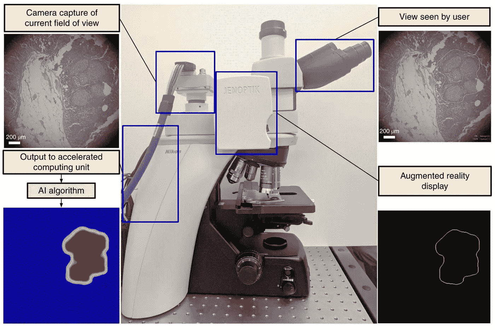
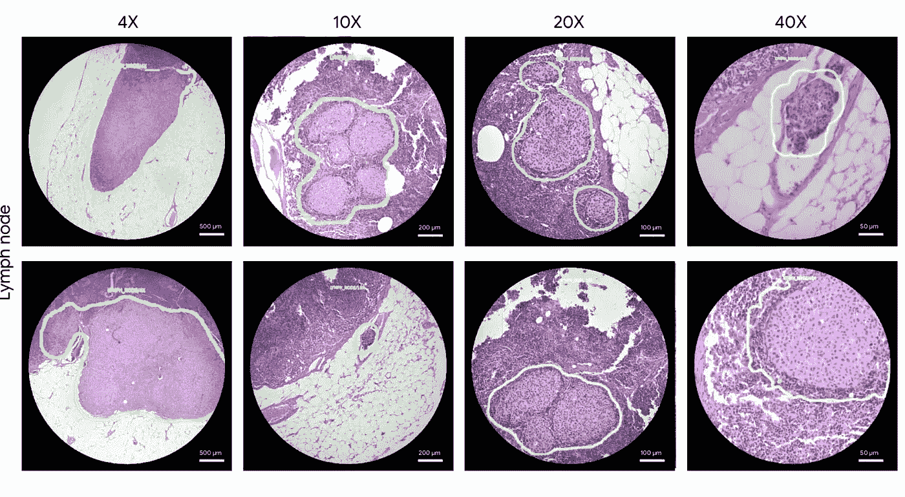

# 显微镜 2.0:用于癌症检测的实时人工智能增强现实显微镜

> 原文：<https://medium.datadriveninvestor.com/microscope-2-0-an-augmented-reality-microscope-with-real-time-ai-for-cancer-detection-c39ed8a325da?source=collection_archive---------4----------------------->

已处理的组织切片的观察和评估对于确定诊断和癌症分期至关重要。因此，该方案有助于决定患者的治疗方案。深度学习和人工智能在医学领域的应用，如皮肤病学、放射学、眼科和病理学，在提供高度准确的诊断方面显示出巨大的潜力。

尽管人工智能承诺提供高质量的医疗保健，但切片数字化的成本和人工智能部署基础设施的缺乏仍然是在临床环境中广泛采用数字病理学的障碍。谷歌最近在《自然》杂志上发表了一篇论文，展示了使用卷积神经网络预测淋巴结中的转移性乳腺癌，精确度堪比病理学家。

 [## 人工智能和虚拟现实的融合-你能期待什么|数据驱动的投资者

### 在技术领域，融合是合乎逻辑的一步。就在几十年前，你可能需要一个专门的…

www.datadriveninvestor.com](https://www.datadriveninvestor.com/2018/08/30/the-convergence-of-ai-rv-what-you-can-expect/) 

在这里，谷歌为人工智能在现实世界诊所的应用提出了一个低成本的解决方案——所谓的增强现实显微镜(ARM)。这种手臂可以在世界各地医院和诊所现有的光学显微镜的基础上进行改造。这种使用负担得起且容易获得的组件可以完全消除对用于分析组织切片的昂贵的全切片成像的需求。

ARM 系统设计有三个主要组件:

1.  一个增强的显微镜-一个明场显微镜(尼康 Eclipse Ni-U)增强了两个定制模块。(A)捕捉当前视野的高分辨率图像的摄像机(FOV)。(b)将数字信息叠加到原始光路中的微型显示器。
2.  一台配有高速图像采集卡(BitFlow CYT)和加速计算单元(NVidia Titan Xp GPU)的计算机。
3.  经过训练的深度学习算法。训练阶段涉及使用大数据集训练算法，而推理阶段涉及使用训练好的深度学习算法处理图像。为了加速推理，他们定制了一个名为-InceptionV3-FCN 的架构，在那里他们将完全卷积网络(FCN)的概念应用于 InceptionV3 的深度学习架构。

Hardware components of ARM: A digital camera retrofitted on a microscope captures the same field of view (FoV) as the user and passes the image to an attached compute unit capable of running real-time inference of a machine learning model. A deep learning algorithm processes each image to produce an inference output (such as a heatmap) with an accelerated computing unit. The inference output is fed back into a custom AR display which is inline with the ocular lens and projects the model output on the same plane as the slide.

ARM 可以提供广泛的视觉反馈，以及文本、箭头、轮廓、热图和动画，并能够运行多种机器学习算法，旨在解决完全不同的问题，如对象检测、量化或分类。为了研究 ARM 作为平台的潜力，作者测试了两个临床任务的算法:检测淋巴结中的转移性乳腺癌和识别前列腺切除术标本中的前列腺癌。

这些模型可以在 4-40 倍的放大倍数下运行，给定模型的结果通过用绿色轮廓勾勒出检测到的肿瘤区域来显示。这些轮廓有助于将病理学家的注意力吸引到感兴趣的区域，而不会模糊潜在的肿瘤细胞外观。

Sample views through the lens of the ARM with green outlines highlighting the predicted tumor region for lymph node metastasis detection at ×4, ×10, ×20 and ×40.

这两种癌症模型最初都是在来自具有不同光学配置的整片扫描仪的图像上进行训练的。乳腺癌的训练数据取自[这里的](https://camelyon16.grand-challenge.org/)，前列腺癌的训练数据取自[这里的](https://www.cancer.gov/about-nci/organization/ccg/research/structural-genomics/tcga)。这些模型在手臂上表现非常好，无需额外的重新训练。当在手臂上运行时，对于视野(FoV)中的癌症检测，淋巴结转移模型的曲线下面积(AUC)为 0.98，前列腺癌模型的 AUC 为 0.96，仅比在 WSI 上获得的性能略有下降。

ARM 可用于具有 AI 和 AR 功能的广泛应用。ARM 的临床应用可能包括高度主观的任务(如染色定量)、破坏性任务(如使用物理尺估计尺寸)、在资源匮乏的环境中进行且需要(但缺乏)熟练人员的任务(如传染病检测(如疟疾或结核病))以及单调乏味的任务(如细胞或有丝分裂计数)。通过利用反向图像搜索工具，ARM 也可以作为一种有用的教学工具，可以帮助学员快速搜索参考资源，并找到他们正在查看的组织学特征。在不久的将来，该臂可以与医院的数字工作流程结合使用，用于细胞学、荧光成像或术中冷冻切片等任务，在这些任务中，扫描仪仍面临重大挑战或需要快速周转。虽然比“传统的全载玻片扫描仪”便宜一两个数量级，但在临床环境中适应昂贵的加速计算单元仍然是一个挑战。然而，ARM 可以帮助加快机器学习的采用，从而在世界各地产生积极影响。

# 参考

Chen，p-h . c .，Gadepalli，k .，MacDonald，r .，Liu，y .，Kadowaki，s .，Nagpal，k .，… Stumpe，M. C. (2019)。一种用于癌症诊断的具有实时人工智能集成的增强现实显微镜。*自然医学*，1–5。[https://doi.org/10.1038/s41591-019-0539-7](https://doi.org/10.1038/s41591-019-0539-7)